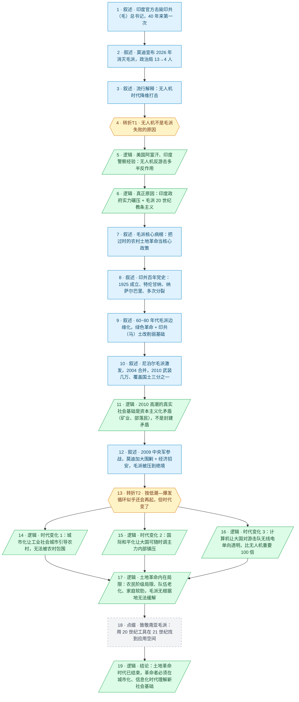

# 马督工方法论内容分析报告：【睡前消息920】印度毛派 英雄落幕

- 分析时间：2026-06-07
- 发现选题数：1
- 实际分析选题：为什么印度毛派走到了绝境，未来不可能复制 20 世纪土地革命？

---

## 1. 发现选题

| 编号 | 发现选题 | 中心问题 | 一句话梗概 | 独立性判断 | 置信度 |
|---:|---|---|---|---|---:|
| 1 | 印度毛派的失败与土地革命模式的终结 | 印度毛派失败的根本原因是什么？这次低潮和以往的低潮有何本质区别？ | 从总书记被击毙这件新闻切入，论证印度毛派的失败既不是无人机降维，也不是又一次循环低潮，而是城市化、国际和平化、计算机三重时代变化导致的 20 世纪土地革命模式彻底终结 | 单一中心问题、单一因果链、明确的最新事件入口、明确的行动建议，可独立成篇 | 高 |

**结论：** 全篇围绕"印度毛派为什么走到绝境"这一个中心问题展开，开篇的无人机讨论、中段的印共百年分裂史、尾段的农民阶级局限和家庭软肋，都是这条主线的不同层次。判定为 1 个选题。

---

## 2. 带转折点的压缩总结与逻辑深度

2025 年 5 月印度官方击毙印共（毛）总书记，莫迪宣布 2026 年消灭毛派。网传是无人机时代降维打击，[T1 但是]从美国阿富汗到印度警察的反恐经验看，无人机反游击多半起反作用，真正的失败原因是印度政府实力碾压加上毛派自身 20 世纪土地革命的教条主义。回顾历史，毛派靠尼泊尔人民战争激发，借 2000 年代矿业开发引发的部落民利益受损，2010 年武装几万、覆盖国土三分之一。按"低潮—爆发"循环看似乎还会再起，[T2 但是]时代已经变了：城市工业化让农村无法包围城市、国际总体和平让大国可随时调主力镇压、计算机让大国对无线电单向透明，20 世纪土地革命的成功条件全部消失，毛派死守过时方案，这次不是循环低潮而是终结，革命者必须在城市化、信息化时代理解新的社会基础。

| 转折点 | 触发位置/内容 | 为什么是不可删除转折 | 作用 |
|---|---|---|---|
| T1 | 否定"无人机时代降维打击"的流行解释，给出"国家机器实力碾压 + 毛派 20 世纪教条主义"的真正原因 | 删掉这一转折就只剩下"毛派被打败"的流水账叙事，无法区分技术决定论和社会结构论，整个第二部分的因果链就立不起来 | 把读者预期从"技术变化导致游击战过时"翻到"制度能力和主体策略才是根本原因"，为后续分析铺路 |
| T2 | 否定"印共历次低潮后总会再爆发"的循环史观，给出"时代变了，20 世纪土地革命模式终结"的判断 | 删掉这一转折，文章就变成普通的失败史叙述，无法解释"这次为什么不一样"，也无法引出三个时代变化和土地革命内在局限的核心论证 | 把读者预期从"历史循环必然带来下一轮高潮"翻到"历史规则已经变了，毛派彻底走到绝境"，撑起全篇最核心的论证 |

- 转折点数量：2
- 逻辑深度判断：标准模型（2 个不可删除转折），传播性价比高

---

## 3. 叙事单元拆解

类型说明：叙述 = 展示事实；逻辑 = 解释因果；点缀 = 增加趣味但可删除；转折 = 打破预期、改变论证方向。

| 编号 | 类型 | 原文位置/线索 | 单句概括 | 主线作用 |
|---:|---|---|---|---|
| 1 | 叙述 | 第 14 段，2025 年 5 月 23 日新闻 | 印度官方宣布在恰蒂斯加尔邦打死印共（毛）总书记凯沙瓦·拉奥及 27 名成员，毛派 40 多年来第一次损失最高领导人 | 给出选题的"最新变化"入口，引出对印度毛派现状的讨论 |
| 2 | 叙述 | 第 16、28 段 | 莫迪宣布 2026 年消灭印共（毛），毛派政治局由 13 人减至 4 人、中央委员只剩 14 人，未来 2~3 年游击区可能完全消失 | 用数据确认毛派确实接近失败，证明这不是单纯的政治宣传 |
| 3 | 叙述 | 第 24 段，静静提问引入 | 网上流行的解释：无人机时代游击战已无机会，毛派被技术降维打击 | 引出第一个待破除的表层假设，为 T1 做铺垫 |
| 4 | 转折 | 第 36、44 段 | T1：无人机不是印度毛派失败的原因 | 打破读者对"技术决定论"的预期，把分析方向从技术拉回制度与策略 |
| 5 | 逻辑 | 第 42、44 段，美国阿富汗、印度警察案例 | 单纯侦察无人机作用不大，武装无人机频繁误伤平民反而扩大反美/反政府支持 | 用反例论证技术不能替代地面巡逻，回应并强化 T1 |
| 6 | 逻辑 | 第 46、50 段 | 真正原因是印度政府实力碾压（建据点 + 收买居民 + 招降）+ 毛派自身没突破 20 世纪土地革命教条主义 | 给出 T1 之后的真正归因，开启对毛派内部策略问题的讨论 |
| 7 | 叙述 | 第 60、62 段 | 毛派核心问题是把"农村土地革命"当核心政策，但 21 世纪印度农村土地矛盾已不是核心矛盾，城市发展水平远超民国时代 | 解释为什么沿用 20 世纪教条会失败，承接到下文百年党史回顾 |
| 8 | 叙述 | 第 74~98 段 | 印共 1925 年成立，多次分裂；1946 年特伦甘纳起义 1951 年被妥协结束；1964 年印共（马）分裂；1969 年纳萨尔巴里起义催生印共（马列）即毛派前身 | 用百年党史回顾印共在土地革命问题上的反复试错，回答"毛派如何形成"的问题 |
| 9 | 叙述 | 第 130~136 段 | 60~80 年代毛派一直边缘化，印度农业绿色革命 + 西孟加拉印共（马）土改削弱了其社会基础 | 说明毛派曾长期低迷，为后文"看似低潮—爆发循环"做铺垫 |
| 10 | 叙述 | 第 138~148 段 | 90 年代末尼泊尔毛派"人民战争"激发印度毛派，2004 年合并为印共（毛），2010 年达到巅峰：几万武装、覆盖印度国土三分之一 | 展示毛派的最近一次高潮，构成"循环史观"的经验基础 |
| 11 | 逻辑 | 第 150、152、158 段 | 2010 年印度毛派胜利的真实社会基础是资本主义化矛盾——矿业林业开发收益被财团拿走、原始部落居民利益受损——而不是封建土地矛盾 | 拆穿"毛派复兴 = 封建土地矛盾复发"的误解，提示读者社会结构已变 |
| 12 | 叙述 | 第 166~170 段 | 2009 年印度中央军参战，莫迪 2014 年上台后投入超 6 万安全部队 + 经济招安，毛派游击区被逐步压缩到绝境 | 完成"为什么这次毛派被打到绝境"的近因叙述，承接到 T2 |
| 13 | 转折 | 第 174、176 段 | T2：按低潮—爆发循环看似乎还会再起，但时代变了，未来印度不会再有"毛派革命" | 否定循环史观，立起全篇核心判断，引出三个时代变化的并列论证 |
| 14 | 逻辑 | 第 178~190 段 | 时代变化 1：现代城市化让工业社会城乡相互依赖，只有城市引导农村，不可能再有农村包围城市 | T2 之后的第一条并列原因，回应"为什么 20 世纪模式失效" |
| 15 | 逻辑 | 第 192~196 段 | 时代变化 2：国际局势总体和平化，大国不再被外部战争牵制，可以随时调主力内部镇压 | T2 之后的第二条并列原因 |
| 16 | 逻辑 | 第 198~206 段 | 时代变化 3：计算机让大国对游击队无线电单向透明，比无人机重要 100 倍 | T2 之后的第三条并列原因，同时回扣 T1（真正的技术决定因素不是无人机而是计算 + 信息论） |
| 17 | 逻辑 | 第 214~232 段 | 土地革命的内在局限：农民阶级局限性、革命队伍老化、家庭软肋；中国共产党靠根据地和外线作战缓解，毛派没有根据地完全没法缓解 | 在三个外部条件之外补一条内部条件，把"绝境"论证收紧 |
| 18 | 点缀 | 第 236、242 段 | 致敬南亚毛派：拿着 20 世纪的落后工具，在 21 世纪硬是找到了应用空间，付出成千上万牺牲建立游击区 | 提供情绪温度，平衡前文的冷分析，但删掉不影响主论证 |
| 19 | 逻辑 | 第 244~258 段 | 结论：毛泽东的胜利源于实践摸索，照搬必然失败；土地革命时代已经结束，未来革命者必须在城市化、信息化时代理解新的社会矛盾，所有人的具体结论都仅供参考 | 给出选题的"行动建议"——既是对印度毛派的告别词，也是对中文读者的方法论提醒 |

---

## 4. 叙事结构模式

因果→并列→因果，切换 2 次：主线是因果归因（从现象到近因到深层结构），在论证"时代变化"这一关键转折后切换为三个并列原因的展开（城市化 / 国际和平 / 计算机），最后回到因果总结（补充土地革命内在局限和方法论建议）。

---

## 5. 一维叙事结构图

节点形状与颜色对应单元类型：叙述 = 蓝色矩形 `[ ]`，逻辑 = 绿色平行四边形 `[/ /]`，点缀 = 灰色矩形 + 虚线边框，转折 = 琥珀色六边形 `{{ }}`。节点编号与 Section 3 单元一一对应。

注：节点 13（T2）之后分裂为三条并列时代变化论证，在节点 17 汇合到土地革命内在局限的因果总结，对应 Section 4 中"因果→并列→因果"的两次模式切换。

---

## 6. 选题为什么成立

### 6.1 选题本质三要素

| 要素 | 文章中的体现 |
|---|---|
| 共同信息场 | 中国互联网用户对"毛派"三个字天然敏感——既因为名字关系长期关注印共（毛），又因九年义务教育里都学过中国共产党的农村包围城市道路；同时 2025 年 5~6 月印度新闻在中文舆论场有一定热度 |
| 最新变化 | 2025 年 5 月 23 日，印度官方在恰蒂斯加尔邦打死印共（毛）总书记凯沙瓦·拉奥及 27 名成员，这是印共（毛派）40 多年来第一次直接损失最高领导人；同时莫迪宣布 2026 年消灭毛派 |
| 行动建议 | 不要把毛泽东的胜利当作可以照搬的天书；未来革命者必须理解城市化、信息化、国际和平化的新社会基础，所有具体结论都仅供参考——既给关注革命史的读者一份方法论提醒，也回应中文舆论对"毛派"符号的浪漫想象 |

### 6.2 八个选题方向匹配

| 方向 | 匹配度 | 证据 | 说明 |
|---|---|---|---|
| 教科书加 | 主匹配 | 全文引用毛泽东两篇核心文献——《中国的红色政权为什么能够存在？》《人的正确思想是从哪里来的？》；多次类比 1928 年的中国、1932 年蒋介石压服军阀进攻江西大别山苏区、井冈山"八月失败"、红军到陕北后从城市招募知识青年 | 把九年义务教育里的中共党史当作共同知识起点，对照印度毛派的百年史，是典型的"用教科书做底色，加新知识"模式 |
| 挖掘历史感 | 主匹配 | 从 1925 年印共成立讲到 2025 年总书记被击毙，整整一百年印度共产主义运动史；同时把印度 21 世纪初的处境与 1928 年中国、印度城市与民国时代做正反对比 | 起点是 2025 年的硬新闻，通过百年时段回溯，把读者带回 20 世纪革命经验现场，再返回当代论证为什么时代已变 |
| 帮群体算账 | 次匹配 | 帮"想用 20 世纪方案解决 21 世纪问题"的革命同情者算账：印度毛派打了 19 年、损失了从革命初期就培养的资深干部，社会基础却没扩大；土地革命之后军队人力反而下降，家属问题靠根据地都解决不了；逐项给出代价 | 这不是一般意义上的"帮少数民族 / 弱势群体算账"，而是给一种意识形态选项算成本，让读者衡量这条路的现实代价 |
| 关注群体内部矛盾 | 次匹配 | 印共内部反复分裂：合法 vs 武装、亲苏 vs 亲中、印共（马）主流派 vs 激进派；毛派内部城市高种姓高层 vs 山区部落民基层；土地革命动员率与个人家庭需求的内部冲突 | 把"印度共产党"拆成多个分支、多层矛盾来看，避免把"毛派"当作铁板一块的浪漫符号 |
| 审查完美故事 | 次匹配 | 同时审查两个完美故事：一是"印度政府靠无人机降维打击毛派"的技术神话，二是"毛派每次低潮后必然爆发"的循环史观，都用反例和结构性原因拆穿 | 反驳并不停留在"驳倒别人"，而是借机建立自己的正面论证（实力碾压 + 三大时代变化） |
| 数据分析与合订本 | 弱匹配 | 印共（毛）政治局 13→4、中央委员剩 14、2010 年覆盖国土三分之一、2009 年中央军参战、2014 年莫迪加大围剿、6 万安全部队、21 世纪初部落民婴儿死亡率是平均水平的十几倍 | 数据是辅助证据，没有像数据分析专题那样以数据为骨架，所以是弱匹配 |
| 关注普通人生活 | 弱 | 仅在分析 2010 年毛派社会基础时讲到原始部落居民的处境（婴儿死亡率、矿业开发受损） | 整体视角是政治军事和理论史，普通人生活只是支撑性段落 |
| 调动观众参与感 | 弱 | 末尾提到自己大学朋友写过《世界屋脊上的红旗》介绍尼泊尔毛派 | 个人记忆带一点参与感，但全篇并未要求观众用自己生活经验直接触碰话题 |

**主匹配方向：** 教科书加、挖掘历史感

**次匹配方向：** 帮群体算账、关注群体内部矛盾、审查完美故事

### 6.3 否定选题校验

| 校验项 | 结果 | 理由 |
|---|---|---|
| 自己是否愿意分享 | 通过 | "印共毛总书记被击毙 + 中国革命经验为何不能照搬"在中文舆论场是高传播力话题，对马督工的革命史定位也是符合自我形象的内容 |
| 是否绕开完美故事 | 通过 | 没有把南亚毛派塑造成完美的革命英雄，也没有把印度政府塑造成完美的胜利者；既肯定毛派的牺牲精神，又指出其教条主义致命缺陷；既肯定印度政府的实力碾压，又强调这不是技术神话 |
| 是否避免纯反驳 | 通过 | 表面上反驳了"无人机决定论"和"循环史观"两种解释，但每次反驳后立即给出正面建构——实力 + 教条主义、三大时代变化 + 内在局限——反驳只占总篇幅的小部分 |
| 转折点数量是否合适 | 通过 | 实际为 2 个不可删除转折，正好命中"三段叙事 + 两次转折"的标准模型；并列展开的三个时代变化只是 T2 之后的并列论证，不构成额外转折 |
| 叙事结构切换次数 | 略超标但可控 | 因果→并列→因果，切换 2 次，超过"半棵树"的最理想切换数 1 次，但因为并列的三条时代变化短小且明确收回主线，没有破坏自传播 |

---

## 7. AI 总评（供参考）

这是一期"教科书加 + 挖掘历史感"组合得非常工整的选题。马督工选了一个对中文观众有强情感钩子的新闻入口——"印共（毛）总书记被打死"——既蹭中文舆论里"毛派"这三个字的天然热度，又借机做一次反浪漫主义的科普：印度毛派失败不是悲情英雄被新技术碾压，而是 20 世纪革命经验的硬性物质条件全部消失。两个不可删除转折分别拆穿两个流行解释（无人机决定论、历史循环论），稳稳落在"三段叙事 + 两次转折"的标准模型上。中段的百年党史回顾很长，但都服务于"为什么这次不一样"这个核心判断，没有偏离主线。结尾把节目立意从"印度毛派"拔到"未来革命者方法论"，是马督工节目里典型的从具体案例升级到普适方法论的收尾手法。整体而言，选题成立、论证严密、传播性价比高。

### 可复用的创作公式

- **"名字相关的国际新闻 + 反技术决定论 + 反循环史观"**：抓住中文舆论里有情感钩子的国际事件（毛派、马克思主义政党、华人社区等），先反驳一个最流行的技术 / 文化决定论解释（这里是无人机），再反驳一个浪漫循环史观（这里是低潮—爆发循环），最后落到结构性社会变化。
- **"百年党史回顾必须服务于今日判断"**：中段历史回顾占近一半篇幅，但每一段历史都对应一个今天的判断（特伦甘纳妥协 = 印共在土地革命问题上一直摇摆；纳萨尔巴里起义 = 毛派如何形成；2010 年高潮 = 真实社会基础其实是资本主义化矛盾）。不为讲故事而讲故事。
- **"用毛泽东原文当锚点而不是当符号"**：引用《中国的红色政权为什么能够存在？》和《人的正确思想是从哪里来的？》两次，都不是用来贴标签，而是用来锚定"实践—反馈—修正"的方法论，反过来批评教条主义。这种用法既保留了革命叙事的厚度，又避开了符号崇拜。

### 可改进处

- **结构切换次数略多**：因果→并列→因果，切换 2 次，比"半棵树"理想模型多切一次。如果要进一步简化，可以把三个时代变化压成一句话总结（"20 世纪革命的物质条件全部消失"），把更多篇幅留给土地革命内在局限。
- **百年党史段落对普通观众门槛偏高**：印共（马）、印共（马列）、印共（毛）等多重分裂名词密集出现，对没有印度政治史背景的观众理解成本不低。可以在历史回顾开头加一句"接下来用 5 分钟讲完 100 年党史，只记三件事就够了"的提示，降低进入门槛。
- **"莫迪政府的真实算力优势"可以多说一句**：第 16 节点（计算机让大国对无线电单向透明）是全篇最反直觉、信息量最大的判断之一，但只用了一段话讲完。如果能再补一两句具体例证（比如印度安全部队 vs 毛派电台的真实对抗案例），论证强度还能再上一个台阶。
