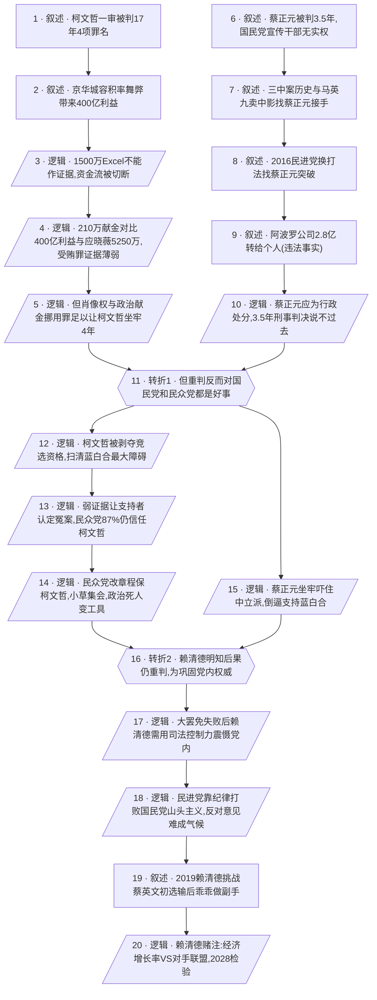

# 马督工方法论内容分析报告：【睡前消息1039】政治死人柯文哲 被赖清德判活了

- 分析时间：2026-05-02
- 发现选题数：1
- 实际分析选题：柯文哲与蔡正元被重判背后的政治逻辑——赖清德的赌注

---

## 1. 发现选题

| 编号 | 发现选题 | 中心问题 | 一句话梗概 | 独立性判断 | 置信度 |
|---:|---|---|---|---|---:|
| 1 | 柯文哲与蔡正元被重判背后的政治逻辑——赖清德的赌注 | 为什么赖清德明知重判会让对手团结，仍执意用薄弱证据重判柯文哲与蔡正元？ | 民进党借两案展示司法控制力、维护以党纪取胜的传统，赌的是经济增长能否抵消对手联盟的代价。 | 单一选题：两案是同一论证链上的并列证据，单独拆出无法构成完整文章。 | 高 |

**结论：** 文章只有 1 个独立选题。柯文哲案与蔡正元案表面是两个独立案件，但叙述目的是合力指向同一个中心问题——赖清德的政治赌博，是同一选题下的并列案例与历史补充，不应拆分。

---

## 2. 带转折点的压缩总结与逻辑深度

2026 年 3 月台北法院相继重判柯文哲 17 年、蔡正元 3.5 年，但关键罪名证据都很勉强：柯文哲 13 年受贿罪靠 210 万新台币政治献金强行定性，对照京华城 400 亿利益与议员应晓薇收受的 5250 万，金额完全不成比例；蔡正元的违规至多够上行政处分，刑事判决也站不住脚。[T1 但是]这种重判反而让国民党和民众党都获益——柯文哲被剥夺竞选资格扫清了蓝白合最大障碍，民众党拿到「受迫害」金字招牌，87% 支持者仍信任柯文哲；蔡正元坐牢推动中立派联合反对民进党。[T2 然而]赖清德明知此结果仍执意重判，因为他在大罢免失败后必须靠重判政敌展示对司法机器的控制力，维护民进党「以党纪取胜国民党山头主义」的制度优势。这是赖清德的赌注：用送给对手的支持率换党内绝对权威，2028 选举将检验高经济增长率与对手联盟谁更管用。

| 转折点 | 触发位置/内容 | 为什么是不可删除转折 | 作用 |
|---|---|---|---|
| T1 | 第三节开头（line 60）：「对民众党和国民党来说，政治上都算好事」 | 把读者预期的「重判=民进党政治胜利」直接反转为「重判=帮对手扫清障碍」，是典型的「解决方案被反转为另一个更可执行方案」。删掉后主线只剩司法争议，整篇文章就退化成案件评论，无法导向后半段的政治赌局分析。 | 把案件层的讨论拉升到政党战略层，启动整篇文章的真正论点。 |
| T2 | 第三节中段（line 70）：赖清德「肯定能够猜到结果，但是他需要保持在民进党内的绝对权威」 | 把「赖清德为什么明知后果还要重判」这个问题的答案，从「打击党外对手」反转为「巩固党内权威」，责任主体被重新定位，问题从个案变成结构（民进党的纪律传统）。删掉后赖清德的动机就成了简单的报复，文章无法回答静静最后一问。 | 把决策层从赖清德个人意志，深化到民进党制度逻辑，并把结尾导向 2028 赌注。 |

- 转折点数量：2
- 逻辑深度判断：2 个转折，标准模型，传播性价比较高

---

## 3. 叙事单元拆解

类型说明：叙述 = 展示事实；逻辑 = 解释因果；点缀 = 增加趣味但可删除；转折 = 打破预期、改变论证方向。

| 编号 | 类型 | 原文位置/线索 | 单句概括 | 主线作用 |
|---:|---|---|---|---|
| 1 | 叙述 | line 14 静静开场 | 2026 年 3 月 26 日台北地方法院判柯文哲 17 年、4 项罪名成立。 | 起点事实，提出全片要解释的核心新闻。 |
| 2 | 叙述 | line 16 京华城回顾 | 京华城容积率被翻倍带来 400 亿利益，柯文哲因此被指控受贿。 | 给受贿罪提供案件背景。 |
| 3 | 逻辑 | line 18-20 调查过程 | 1500 万 Excel 表格只能算线索而非证据，助理逃跑后资金流也查不下去。 | 解释为何核心受贿事实始终无法坐实。 |
| 4 | 逻辑 | line 22-26 政治献金分析 | 210 万政治献金本身合法，对比京华城 400 亿利益与应晓薇收 5250 万，完全不合常理。 | 论证 13 年受贿罪是法官主观判断、证据极其薄弱。 |
| 5 | 逻辑 | line 28 让步段落 | 但肖像权交易与挪用政治献金 1300 万等罪名足以让柯文哲坐牢，4 年并不冤枉。 | 让步逻辑：把柯文哲钉成「身败名裂但 13 年冤」，为后续「民众党仍可炒受迫害」铺垫。 |
| 6 | 叙述 | line 34-40 蔡正元身份 | 蔡正元被判 3.5 年；他是国民党宣传干部出身，海外学历、不缺钱、长期无实权。 | 以另一案启动并列论证，并交代其无动机搞官商勾结。 |
| 7 | 叙述 | line 42-46 三中案历史 | 三中案根源在国民党党产清算，马英九 2005 年因财政窘迫卖中影，蔡正元出资接手。 | 提供 20 多年的历史纵深，解释蔡正元为何被卷入。 |
| 8 | 叙述 | line 48 民进党换打法 | 2016 年民进党重启调查，蔡正元拒绝指控马英九的交易，最终成唯一被定罪者。 | 揭示蔡正元被定罪的政治背景：替罪羊。 |
| 9 | 叙述 | line 50 阿波罗事实 | 蔡正元把阿波罗公司 2.8 亿账款转给个人，违反公司法人独立原则。 | 承认违法事实，避免文章被理解成全盘洗白。 |
| 10 | 逻辑 | line 52 处分定性 | 类比大陆交通法与公司法，蔡正元最多够上行政处分，3.5 年刑事判决说不过去。 | 把蔡正元案与柯文哲案合流到「重判过头」这一共同前提。 |
| 11 | 转折 | line 60 第三节开头 | 转折 1：但这种重判反而对国民党和民众党都是好事。 | 把案件层论证翻向政党战略层，启动全片真正论点。 |
| 12 | 逻辑 | line 60 蓝白合 | 柯文哲被剥夺公权 8 年、不能竞选 2028，反而扫清蓝白合最大个人障碍。 | T1 的第一个直接后果。 |
| 13 | 逻辑 | line 62 民调反弹 | 用 210 万弱证据判 13 年，让支持者认定整个判决是冤案，民众党 87% 仍信任柯文哲。 | T1 的第二个后果：民众党拿到「受迫害」金字招牌。 |
| 14 | 逻辑 | line 64 党纪修改 | 民众党改章程保柯文哲、组织小草集会，柯文哲变成可被反复使用的政治图腾。 | T1 的第三个后果：政治死人变成政治工具。 |
| 15 | 逻辑 | line 66 中立派联合 | 蔡正元只是替马英九办事却被坐牢，吓得所有政治人物都担心被翻旧账，倒逼中立派支持蓝白合。 | T1 在蔡正元案侧的对应后果。 |
| 16 | 转折 | line 70 静静追问后 | 转折 2：赖清德明知效果仍要重判，因为他需要的是民进党内的绝对权威。 | 把决策动机从对外打击翻向对内巩固，导出全片最深一层结构分析。 |
| 17 | 逻辑 | line 70 大罢免失败 | 2024 年大罢免颗粒无收，赖清德必须靠送对手坐牢来展示对司法机器的控制力、震慑党内潜在反对者。 | 给 T2 提供个人动机层面的解释。 |
| 18 | 逻辑 | line 72-74 党纪 vs 山头 | 民进党靠纪律打败国民党山头主义；公开反对意见只敢由退场老人或私下发声，无法影响赖清德。 | 把 T2 提升到制度层：民进党的纪律传统决定赖清德有这种权力。 |
| 19 | 叙述 | line 76 历史佐证 | 2019 年赖清德公开挑战蔡英文初选，输掉后立刻乖乖做副手拉票。 | 用历史细节坐实「民进党认党不认人」的纪律传统。 |
| 20 | 逻辑 | line 78 终点判断 | 这是赖清德的赌注：用送给对手的支持率换党内权威，2028 看高经济增长率与对手联盟谁更管用。 | 把全片导向一个可验证的预测，给读者一个观察坐标。 |

---

## 4. 叙事结构模式

并列→因果，切换 1 次：先用柯文哲案与蔡正元案两条并列支线建立「重判过头」共同前提，再切到因果链分析重判带来的后果与赖清德的真实动机，并在结尾给出 2028 赌注的因果落点。

---

## 5. 一维叙事结构图

节点形状对应单元类型：叙述 = 矩形 `[ ]`，逻辑 = 平行四边形 `[/ /]`，点缀 = 矩形 + 虚线边框，转折 = 六边形 `{{ }}`。节点编号与 Section 3 单元一一对应。

---

## 6. 选题为什么成立

### 6.1 选题本质三要素

| 要素 | 文章中的体现 |
|---|---|
| 共同信息场 | 大陆观众长期关注台湾蓝绿白三方政局；柯文哲案件自 2024 年起在大陆社交媒体广泛讨论；蔡正元因常上《环球时报》等大陆节目，是熟面孔；睡前消息此前 972 期、69 期已为听众积累了完整背景。 |
| 最新变化 | 2026 年 3 月 26 日台北地方法院一审判柯文哲 17 年、4 项罪名成立；3 月 27 日蔡正元因业务侵占被判 3.5 年并已开始服刑。两个看似政治打击的判决在同一周接连发生，刚好赶在年底县市长选举与 2028 选前。 |
| 行动建议 | 从「重判反而帮对手」「赖清德明知仍执意」这一反直觉结构里，理解民进党的制度性优势（党纪 vs 国民党山头主义），并以「高经济增长率 vs 对手联盟」作为 2028 选举的观察坐标。 |

### 6.2 八个选题方向匹配

| 方向 | 匹配度 | 证据 | 说明 |
|---|---|---|---|
| 审查完美故事 | 强 | 第一节用 210 万 vs 400 亿/5250 万的金额对比，揭穿「赖清德正义反贪」的表层叙事；第三节用「重判反而帮对手」反转「民进党政治胜利」的预设。 | 整篇文章的中轴：把表面上漂亮的司法清算审查成赖清德的政治赌博。 |
| 数据分析与合订本 | 强 | 主动调用 972 期（柯文哲案早期分析、郑文灿案）、69 期（90 年代国民党转型）做背景，并用本片对前作进行延展。 | 节目本身具备很强的「合订本」属性，新一期是对历史结论的兑现与更新。 |
| 挖掘历史感 | 中 | 90 年代国民党加入保守党国际、4000 名专职干部、三中案 20 多年沿革、2019 年赖清德挑战蔡英文初选。 | 用历史细节夯实「民进党靠党纪打赢国民党」的结构判断。 |
| 关注群体内部矛盾 | 中 | 民进党党纪 vs 个人意愿、国民党山头主义易分裂、民众党 87% 支持者仍信任柯文哲。 | 把焦点从蓝绿对立内移到各党内部的治理逻辑差异。 |
| 教科书加 | 中 | 用大陆交通法层级（民事/行政/刑事）类比公司法处分，讲清蔡正元行为为何不应升到刑责。 | 借具体案例普及保守党国际、公司法人独立、台湾选举资格规定等知识。 |
| 帮群体算账 | 弱 | 给民众党算「政治死人变金字招牌」的账，给民进党算「赖清德赌注」的账。 | 是副线，不是主驱动。 |
| 关注普通人生活 | 不匹配 | — | 全片聚焦政治精英博弈，与普通人生活无直接关联。 |
| 调动观众参与感 | 弱 | 把 2028 选举设为可验证的赌注节点，邀请观众继续关注。 | 仅在结尾点到。 |

**主匹配方向：** 审查完美故事 + 数据分析与合订本

**次匹配方向：** 挖掘历史感、关注群体内部矛盾、教科书加

### 6.3 否定选题校验

| 校验项 | 结果 | 理由 |
|---|---|---|
| 自己是否愿意分享 | 通过 | 提供反直觉框架（重判帮对手、为内部权威而非外部胜负），关心台湾政局或政党制度比较的读者会主动转发。 |
| 是否绕开完美故事 | 通过 | 既不接受「赖清德正义反贪」的官方叙事，也不接受「柯文哲完全冤案」的反向叙事，反而用 4 年实刑承认柯文哲身败名裂。 |
| 是否避免纯反驳 | 通过 | 在反驳判决证据后，给出更深的政党制度解释和 2028 赌注的预测，提供新增认知而非停在拆台。 |
| 转折点数量是否合适 | 通过 | 2 个转折，符合标准模型；T1 拉升讨论层级、T2 重新定位责任主体，结构紧凑。 |

---

## 7. 总评

文章的选题成立度很高。它把一周内两个台湾司法判决，重新组织成一个关于「赖清德为什么愿意送对手支持率」的政治赌局问题，靠两次精准转折把案件评论拉升到政党制度比较，落点是 2028 选举的可验证预测。两条并列案件支线在 T1 处合流为「重判反而帮对手」，再经过 T2 重新定位为「为党内权威而非党外胜负」，让读者从「这是不是冤案」一路前进到「民进党到底在用什么逻辑取胜」。配合反复调用历史合订本（972 期、69 期、2019 初选），传播效率与认知增量都得到保障。

### 可复用的创作公式

1. **并列双案→共同前提→共同后果**：当一周内出现两件性质相近的事件时，先把它们并列拆成「同一前提」（这里是「重判过头」），再合流分析共同后果，可以低成本制造结构感。
2. **两次转折定位深度**：T1 反转表层效果（重判 → 帮对手），T2 重新定位决策动机（打击对手 → 巩固内部），既保证逻辑深度又不滑向 3 转折以上的复杂度。
3. **赌注式收尾**：把分析落到一个未来可验证的赌注（2028 经济增长率 vs 联盟反对），给观众一个长期跟踪坐标，并为后续续集做钩子。
4. **金额/比例对照拆穿弱证据**：210 万 vs 400 亿 vs 5250 万的三方比例，是审查司法叙事「完美故事」的可复用刀片。

### 可改进处

1. 第二节关于公司法（法人独立）的类比段落（line 50-52）信息密度较高，对完全不熟悉公司法的观众有一定门槛，可以再做一两句更直白的类比，降低理解成本。
2. T1 之后柯文哲一侧的 3 个后果（节点 12/13/14）顺序连贯，但蔡正元侧的后果（节点 15）只用了一段处理，导致两条支线在 T1 之后略显不平衡，可以适度补充蔡正元案对国民党中立派的具体动员细节。
3. 结尾的赌注虽然清晰，但缺一个明确的观察指标（例如哪一项经济数据、哪一次选举节点），如果给出更具体的「2028 之前哪些信号会先兑现」，长期跟踪价值会更高。
