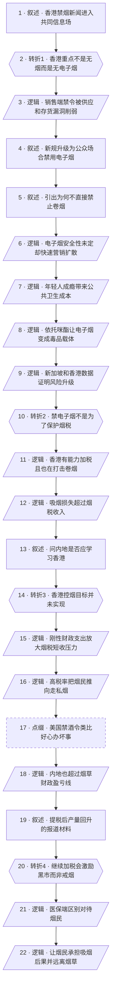

# 马督工方法论内容分析报告：【睡前消息1046】香港禁烟 亏钱又没效

- 分析时间：2026-05-02 11:08:42 CST
- 发现选题数：1
- 实际分析选题：香港禁烟为什么亏钱又没效

---

## 1. 发现选题

| 编号 | 发现选题 | 中心问题 | 一句话梗概 | 独立性判断 | 置信度 |
|---:|---|---|---|---|---:|
| 1 | 香港禁烟为什么亏钱又没效 | 香港为什么同时严打电子烟和提高烟税，而这些手段为什么没有实现控烟目标，内地又该如何吸取教训？ | 文章从香港禁电子烟切入，先解释电子烟的青少年和毒品风险，再用财政账否定“保护烟税”说法，最后通过香港失败数据、走私机制和内地经验，转向医保端约束烟民成本的政策建议。 | 三个小标题都围绕同一个主问题推进，分别承担政策对象、政策动机、政策效果和替代方案的论证功能，不能拆成互不依赖的独立选题。 | 0.91 |

**结论：** 发现 1 个独立选题，可以继续分析。文章标题、三段主持人提问和结尾建议都服务于同一条主线：控烟政策如何从电子烟风险进入财政账，再反转到税收禁令失效，最后落到医保成本分担。

---

## 2. 带转折点的压缩总结与逻辑深度

香港发布新控烟条例，表面上像是加入全球无烟社会潮流，[T1 但是] 文章先纠正说香港主要是在打造“无电子烟社会”，因为电子烟更容易吸引年轻人，还和依托咪酯毒品结合；有人认为禁电子烟是保护传统烟草税，[T2 但是] 如果只是为了税收，香港完全可以给电子烟加税，真正压力是吸烟造成的医疗和经济损失已经超过烟税；那内地是否该学习香港继续加税禁烟，[T3 但是] 2025 年数据说明香港烟民没少多少，税收反而大跌，走私烟扩张；专家仍会建议继续加税，[T4 但是] 香港经验显示高税和禁令会把烟民推向黑市，所以更可执行的方案是在医保端让烟民承担吸烟后果。

| 转折点 | 触发位置/内容 | 为什么是不可删除转折 | 作用 |
|---|---|---|---|
| T1 | “香港不是要打造无烟社会，准确来说，应该是打造无电子烟社会。” | 删除后，开头会误读成传统控烟新闻，无法解释为什么全文先集中讨论电子烟、年轻人和依托咪酯。 | 把共同信息场从“禁烟”校正为“电子烟治理”。 |
| T2 | “只禁电子烟是为了保护税收，看起来很有道理，但是经不起推敲。” | 删除后，文章无法从动机怀疑转入财政账，也无法说明香港为什么宁愿少收税也控烟。 | 把责任主体从“政府保护烟草税”转向“吸烟外部成本超过烟税收入”。 |
| T3 | “香港的做法行不通……不但没有实现目标，还造成了反效果。” | 删除后，前文的政策合理性会直接推出学习香港，后文走私、禁酒令和内地经验都失去论证对象。 | 把政策评价从“有公共理性”反转为“执行效果失败”。 |
| T4 | “但是香港经验证明，如果烟税太高，烟民宁愿买走私烟甚至假烟，也不会选择戒烟。” | 删除后，结尾只能停留在继续加税，无法推出医保端区分烟民的替代方案。 | 把解决方案从税收和禁令转向医疗支付责任。 |

- 转折点数量：4
- 逻辑深度判断：3 个及以上转折：逻辑深，能提供较强新增认知，但传播成本和误差风险上升，需要用标题和结尾建议帮助观众抓住主线。

---

## 3. 叙事单元拆解

类型说明：叙述 = 展示事实；逻辑 = 解释因果；点缀 = 增加趣味但可删除；转折 = 打破预期、改变论证方向。

| 编号 | 类型 | 原文位置/线索 | 单句概括 | 主线作用 |
|---:|---|---|---|---|
| 1 | 叙述 | 开场和静静介绍话题 | 香港新控烟条例禁止公众场合使用另类吸烟产品，并被放进全球限制吸烟的背景中。 | 建立共同信息场，让观众先以“香港禁烟”理解事件。 |
| 2 | 转折 | 督工：“香港不是要打造无烟社会，准确来说，应该是打造无电子烟社会。” | 香港政策的重点不是全面禁传统烟草，而是更集中地打击电子烟和加热烟草。 | 纠正表层判断，把分析对象收窄到电子烟治理。 |
| 3 | 逻辑 | 2021 年禁进口制造销售，深圳供应和存货借口 | 香港此前只禁销售不禁使用，遇到深圳供应、存货无法核实和执法成本过高的问题。 | 解释为什么香港要从销售端禁令升级到公众使用端禁令。 |
| 4 | 叙述 | “去年9月，香港又修订了控烟条例” | 香港新规取消游客豁免，禁止公众场合使用电子烟，但私人场所是否吸电子烟没有被文稿确认。 | 补足政策边界，避免把香港政策误说成彻底封禁。 |
| 5 | 叙述 | 静静提问“电子烟相比传统香烟健康危害要轻一些” | 主持人引出常见疑问：为什么很多地区只打击电子烟，不直接禁止卷烟。 | 把话题从政策条文推进到政策合理性。 |
| 6 | 逻辑 | “安全性对比传统烟草，主流医学界一直有争议” | 电子烟安全性尚未充分验证，但企业已经用安全和水果口味扩大渗透。 | 解释电子烟为什么比传统烟草更需要前置监管。 |
| 7 | 逻辑 | 香港年轻人吸电子烟比例、尼古丁危害 | 电子烟在年轻人中渗透更高，尼古丁成瘾会长期增加医疗负担并影响劳动力。 | 把个人选择问题提升为公共卫生和社会成本问题。 |
| 8 | 逻辑 | 依托咪酯、烟弹、湖南戒毒中心数据 | 依托咪酯和电子烟结合后隐蔽、低价、易传播，改变了传统吸毒人群结构。 | 引入电子烟治理的第二层风险：它不只是烟草替代品，还可能成为毒品载体。 |
| 9 | 逻辑 | 新加坡和香港依托咪酯数据 | 新加坡和香港的查获数据说明，电子烟正在把青少年吸烟和新型毒品问题叠加。 | 证明香港严打电子烟有现实触发因素，不是单纯姿态。 |
| 10 | 转折 | “只禁电子烟是为了保护税收……但是经不起推敲。” | 保护传统烟草税的解释看似合理，但如果目标是税收，给电子烟加税比全面禁令更简单。 | 推翻阴谋式动机解释，转入经济账分析。 |
| 11 | 逻辑 | 内地电子烟专营管理、香港卷烟税和世卫建议 | 香港既能对电子烟加税，也已经连续提高传统烟草税，说明电子烟禁令不是为了放纵卷烟。 | 支撑 T2，让政策动机从税收保护转为控烟治理。 |
| 12 | 逻辑 | 香港大学 82 亿损失和 79 亿烟税 | 香港计算发现吸烟造成的经济损失已经超过烟草税收，所以放任吸烟在财政上会亏钱。 | 说明控烟政策背后的财政理性。 |
| 13 | 叙述 | 静静提问“内地应该学习香港全面禁烟吗？” | 文章把香港案例转化为内地政策问题。 | 把地方案例拉回中国观众最关心的行动判断。 |
| 14 | 转折 | “很可惜，香港的做法行不通。” | 2025 年数据表明香港烟民比例只小幅下降，烟税收入却大幅低于预期。 | 推翻“财政理性政策就值得照搬”的预期。 |
| 15 | 逻辑 | 香港财政开支、医疗教育刚性支出 | 香港财政支出并不低，医疗、教育和老龄化开支刚性增长，几十亿烟税损失变得重要。 | 解释为什么烟税短收会成为真实财政压力。 |
| 16 | 逻辑 | 走私烟、查获数量、拘捕人数、九龙广告 | 高烟税没有让烟民戒烟，而是把需求推向内地价差支撑的走私烟市场。 | 揭示政策反效果的具体机制。 |
| 17 | 点缀 | 美国禁酒令、黑帮、工业酒精和阿卡彭 | 美国禁酒令说明善意禁令可能制造黑市、腐败和更差的健康后果。 | 用历史类比增强记忆点，帮助观众理解“好心办坏事”。 |
| 18 | 逻辑 | 中国烟民数量、世卫报告和烟草税调整 | 内地同样已经超过烟草财政盈亏线，过去加税只能阶段性降低吸烟率。 | 把香港经验外推到内地现实，建立政策迁移必要性。 |
| 19 | 叙述 | 静静读郑榕教授关于产量回升的报道 | 2015 年提税曾降低卷烟产量，但 2017 年以后产量逐步回升，提税效果被消耗。 | 用第三方材料补强“加税效果会衰减”。 |
| 20 | 转折 | “但是香港经验证明，如果烟税太高，烟民宁愿买走私烟甚至假烟。” | 继续加税不是稳定解法，因为高税会增加黑市激励而不是迫使烟民戒烟。 | 把方案从税收端反转到医保端。 |
| 21 | 逻辑 | “完全可以在医保政策层面入手，对烟民区别对待” | 既然吸烟主要损害医保基金，就可以提高烟民报销门槛或限制烟草直接导致疾病的报销。 | 给出政策层面的行动建议。 |
| 22 | 逻辑 | “烟民买得到走私烟，但是找不到走私医院”及结尾提醒 | 医疗服务难以走私，只有让烟民承担吸烟后果，才能形成比加税更有效的约束。 | 收束全文，落到普通观众和政策制定者都能理解的结论。 |

---

## 4. 叙事结构模式

因果→并列→因果，切换 2 次：前半段先按“政策对象 -> 政策原因 -> 财政动机”的因果链推进，中段用香港数据、香港财政、走私烟、美国禁酒令、内地税收经验并列证明高税禁令会失效，最后再回到“烟草损害医保基金 -> 医保端约束烟民”的因果方案。

---

## 5. 一维叙事结构图

节点形状对应单元类型：叙述 = 矩形 `[ ]`，逻辑 = 平行四边形 `[/ /]`，点缀 = 矩形 + 虚线边框，转折 = 六边形 `{{ }}`。节点编号与 Section 3 单元一一对应。

---

## 6. 选题为什么成立

### 6.1 选题本质三要素

| 要素 | 文章中的体现 |
|---|---|
| 共同信息场 | 吸烟、电子烟、烟税、公共场所禁烟、年轻人接触尼古丁，都是普通观众有生活经验或新闻印象的对象；香港和内地烟价差、医保报销也和观众日常利益相关。 |
| 最新变化 | 香港修订控烟条例，公众场合禁用另类吸烟产品；依托咪酯电子烟在香港和东亚被列入毒品治理；2025 年香港烟民比例和烟税收入数据暴露政策反效果。 |
| 行动建议 | 对普通观众是远离卷烟、电子烟和加热式香烟；对政策讨论是不要只照搬香港式高税和禁令，应考虑在医保支付端让长期吸烟者承担外部成本。 |

### 6.2 八个选题方向匹配

| 方向 | 匹配度 | 证据 | 说明 |
|---|---|---|---|
| 帮群体算账 | 高 | 文章反复比较烟草税、医疗损失、香港财政支出、走私收益和医保报销。 | 主线不是道德批判烟民，而是计算谁在承担吸烟成本，以及哪种政策成本更低。 |
| 关注普通人生活 | 高 | 电子烟、烟瘾、医保报销、公立医院、走私烟价格差都直接接近普通观众生活。 | 选题把香港新闻转换成普通人会遇到的健康、钱和医疗支付问题。 |
| 数据分析与合订本 | 中高 | 使用 2021 到 2025 年烟民比例和烟税收入，香港大学损失估算，新加坡、香港依托咪酯数据，中国烟草产量变化。 | 多组跨地区、跨年份数据构成合订本，帮助观众看到税收禁令效果和副作用。 |
| 挖掘历史感 | 中 | 用美国禁酒令和中国历次烟草税调整作比较。 | 历史材料不是主线根基，但用来说明成瘾品禁令容易制造黑市的长期规律。 |
| 调动观众参与感 | 中 | 结尾直接提醒观众远离任何烟草制品，并把医保补贴烟民的问题摆到不吸烟者面前。 | 观众可以用自己对烟价、医保和公共场所吸烟的经验参与讨论。 |

**主匹配方向：** 帮群体算账

**次匹配方向：** 关注普通人生活、数据分析与合订本、挖掘历史感、调动观众参与感

### 6.3 否定选题校验

| 校验项 | 结果 | 理由 |
|---|---|---|
| 自己是否愿意分享 | 通过 | 结论和个人利益相关：不吸烟者为什么在医保上补贴烟民，吸烟者为什么会被高税推向黑市，二者都有讨论动力。 |
| 是否绕开完美故事 | 通过 | 文章没有讲“香港严管就能解决吸烟”的完美故事，而是审查政策成本、财政压力、黑市和执行失败。 |
| 是否避免纯反驳 | 通过 | 虽然反驳了“保护烟税”和“继续加税”两种说法，但最终给出医保端约束的正面方案。 |
| 转折点数量是否合适 | 偏高但可接受 | 4 个不可删除转折让逻辑深度超过标准模型，传播成本偏高；不过标题“亏钱又没效”和结尾“找不到走私医院”能帮助观众记住主结论。 |

---

## 7. 总评

这期选题成立的核心，是把一个看似简单的公共卫生新闻拆成“电子烟治理、烟草财政、政策反效果、医保责任”四层。文章不是单纯呼吁禁烟，也不是替吸烟自由辩护，而是通过算账说明：烟草问题已经超过财政盈亏线，但高税和禁令如果不考虑成瘾需求、价差和黑市通道，就会同时损失税收和治理效果。

### 可复用的创作公式

从一个正在发生的治理新闻切入，先纠正常见误读，再解释政策背后的公共风险；随后反驳最流行的动机猜测，把问题放进财政账；接着用执行数据证明现有方案失效，最后提出一个比口号式禁令更难绕开的成本分担机制。

### 可改进处

文章逻辑层数较多，电子烟毒品风险、香港烟税、香港财政、美国禁酒令、内地医保方案都进入了同一期。对普通观众来说，最容易丢失的是“为什么电子烟风险”和“为什么医保端约束”之间的连接。若压缩传播，可以弱化美国禁酒令段落，把更多篇幅留给香港走私机制和内地医保方案之间的承接。
