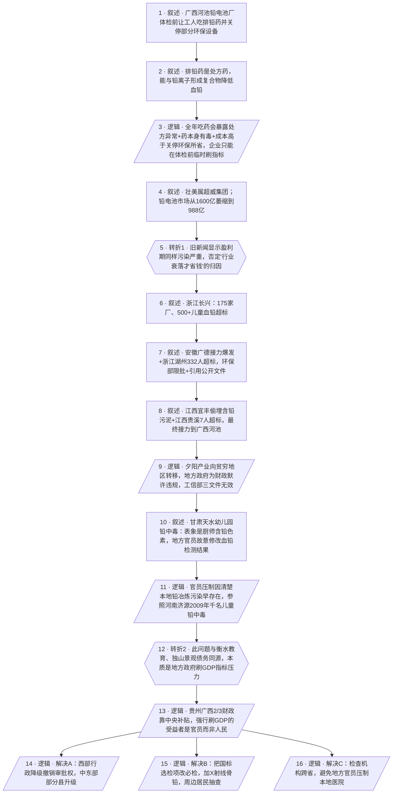

# 马督工方法论内容分析报告：【睡前消息1047】下个月要体检，赶紧吃排铅药

- 分析时间：2026-05-02
- 发现选题数：1
- 实际分析选题：广西河池铅电池厂"体检前吃排铅药"事件背后的产业转移与地方政府考核机制

---

## 1. 发现选题

| 编号 | 发现选题 | 中心问题 | 一句话梗概 | 独立性判断 | 置信度 |
|---:|---|---|---|---|---:|
| 1 | 广西河池铅电池厂"体检前吃排铅药"事件背后的产业转移与地方政府考核机制 | 一桩看似企业违法的铅污染丑闻，根源究竟在哪里、又该如何解决 | 排铅药事件只是表象；铅酸电池产业从浙江到安徽、江西、广西的连续接力污染，本质是地方政府为刷 GDP 指标主动放松监管，与衡水教育、独山景观债务同源 | 单一中心问题、单一因果链、两个不可删除转折、明确的政策建议——可独立成篇 | 高 |

**结论：** 文章只有一个可独立成篇的选题。所有材料（机制说明、行业数据、历史案例、天水类比、解决方案）都为同一条因果主线服务，不构成第二个选题。直接进入 Step 3。

---

## 2. 带转折点的压缩总结与逻辑深度

广西河池一家铅酸电池厂在体检前让工人吃排铅药、关停部分环保设备。表面上看是企业为了省钱钻空子。如果只是利润问题，那么铅电池行业曾经赚钱时应当投入更多保护。[T1 但是]从浙江长兴、安徽广德、浙江湖州、江西宜丰一直到江西贵溪、广西河池，铅电池行业从盈利到衰落都在制造区域性铅污染，每次曝光都向更穷的地区转移；地方政府为财政主动放松监管，甚至像甘肃天水那样直接修改血铅检测结果。[T2 然而]这不仅是企业违法和地方监管失灵，本质上和衡水教育、独山景观债务是同一回事——地方政府刷 GDP 指标的压力太大。解决办法是让靠中央转移支付的西部地区行政降级、撤销审批权，把健康监测改成跨省执行的国标多项目必检。

| 转折点 | 触发位置/内容 | 为什么是不可删除转折 | 作用 |
|---|---|---|---|
| T1 | "但是从旧新闻来看，在铅电池销量上升的赚钱时期，对工人和居民的保护也很差"（在引出 1600 亿→988 亿市场萎缩数据之后） | 推翻"行业衰落才省钱→不投环保"的表层归因。删掉这句，整篇文章就退化为"夕阳产业舍不得花钱"的简讯，无法解释为什么盈利期同样污染严重；也无法支撑"产业转移是结构性现象，不是周期性现象"的判断。 | 把责任主体从"利润下降"重新定位到"产业本身的高污染特性 + 监管的区域差"，为下文产业转移叙事打开空间 |
| T2 | "造文旅景观浪费的资源和工人被铅污染破坏的健康问题完全是同一回事"（在天水官员心态分析之后） | 把铅污染问题从"企业违法 + 地方监管不力"重新定位为"地方政府考核机制"。删掉这句，文章就停在"加强监管"层面，无法连到行政体制改革（行政降级、撤销审批权）这层结构性方案，也无法把铅污染、衡水教育、独山债务并联起来。 | 把问题从个案/行业问题升级为全国地方治理结构问题，给出区别于"严打企业"的另一种解法路径 |

- 转折点数量：2
- 逻辑深度判断：2 个转折 — 标准模型，传播性价比较高

---

## 3. 叙事单元拆解

类型说明：叙述 = 展示事实；逻辑 = 解释因果；点缀 = 增加趣味但可删除；转折 = 打破预期并提供核心媒体价值。

| 编号 | 类型 | 原文位置/线索 | 单句概括 | 主线作用 |
|---:|---|---|---|---|
| 1 | 叙述 | 开头大河报报道+体检流程描述 | 4 月 10 日大河报报道广西河池铅电池厂体检前 2 个月让工人服用二巯丁二酸、关闭部分环保设备 | 起点事实，建立"排铅药"这个具体抓手 |
| 2 | 叙述 | 排铅药机制段（铅离子化学特征 + 二巯丁二酸/依地酸钠钙原理） | 排铅药本是处方药，能与铅离子形成稳定复合物经尿液排出，企业拿来作弊 | 让观众看懂"作弊"机制，铺垫为什么不能长期吃 |
| 3 | 逻辑 | "让员工天天吃排铅药对企业和员工都没有好处"段 | 全年吃药会引发卫健委/医保局调查、人均药费高于关停部分环保所省成本（约 23000 元/天）、且药本身有肝肾毒性，所以企业的合理选择就是临时刷指标 | 第一层因果解释：把"为什么只在体检前吃"算成一道账，证明这是经过算计的制度性作弊 |
| 4 | 叙述 | 行业背景段（超威集团 + 1600 亿→988 亿市场曲线） | 广西壮美属于超威集团（铅电池行业第二），中国铅电池市场从 2015 年 1600 亿萎缩到 2025 年 988 亿，被锂电池替代 | 给出"行业衰落"的表层归因素材，为 T1 转折设置预期 |
| 5 | 转折 | "但是从旧新闻来看，在铅电池销量上升的赚钱时期，对工人和居民的保护也很差" | 推翻"行业衰落才省钱"的归因——盈利期一样污染 | T1：把责任从"利润下降"重新定位到"产业自身高污染 + 监管落差"，为产业转移叙事打开空间 |
| 6 | 叙述 | 浙江长兴县案例段（175 家厂、太湖南岸、500 儿童血铅超标） | 浙江长兴曾产中国 30% 铅电池，2023 年蚕死、鱼畸形、500+儿童血铅超标 | 案例 1：本省内首次集中爆发 |
| 7 | 叙述 | 安徽广德 + 浙江湖州段（17 家迁广德、政府强制关停 + 环保部限批 332 人血铅超标 + 引用环保部公开文件） | 17 家从长兴搬迁广德后再次集群污染；2011 年湖州血铅超标 332 人，环保部对湖州区域限批 | 案例 2-3：揭示"限批一地→搬到隔壁"的转移模式，引用政府文件增加权威性 |
| 8 | 叙述 | 江西宜丰 + 贵溪段（央视焦点访谈 12 岁女孩 360 微克 + 2025 年 12 月粤海新能源 7 人超标 + 落到广西河池） | 浙江企业进一步迁入江西宜丰"环保产业园"被央视曝光偷埋污泥；2025 年 12 月江西贵溪粤海新能源继续爆发；最终接力到广西河池（人均 GDP 不到全国一半） | 案例 4-5：把转移路径接到本期开头的广西，让因果链闭环 |
| 9 | 逻辑 | "上面这些例子说明……地方政府为了财政收入客观或者主观上放松的监管力度"段 + 工信部三文件无效 | 铅酸电池作为发达地区放弃的夕阳产业，到了西部贫穷地区是政府极力争取的纳税大户，得到默许违规特权；2012-2015 工信部环保部三个搬迁规范文件被架空 | 第二层因果解释：从案例并列总结出"产业转移规律 + 地方政府主动放松监管" |
| 10 | 叙述 | 甘肃天水幼儿园铅中毒事件 | 表象是厨师违规使用含铅色素，但当地政府故意修改血铅检测结果压制问题，直到家长去西安检测才暴露 | 引入跨行业类比，准备 T2 转折 |
| 11 | 逻辑 | 天水官员动机分析 + 河南济源 2009 年 1000+儿童中度铅中毒参照 | 天水官员压制检测，是因为本地铅冶炼污染早已存在；他们怕事情真的大到救不了自己——这反过来证明西部官员清楚自己的监管欠账 | 把"修改检测结果"上升为西部地方治理通病，为 T2 提供逻辑支撑 |
| 12 | 转折 | "造文旅景观浪费的资源和工人被铅污染破坏的健康问题完全是同一回事" | 把铅污染问题从"企业违法 + 地方监管失灵"重新定位为"地方政府刷 GDP 指标的考核机制"，与衡水教育、独山景观债务并联 | T2：把个案/行业问题升级为全国地方治理结构问题 |
| 13 | 逻辑 | 财政转移逻辑段（贵州广西 2/3 财政靠国家补贴） | 既然西部财政本就靠中央转移支付，强行要求 GDP 增长的主要受益者是地方官员，而不是本地人民 | 给 T2 配套的财政机制论证，为后续行政降级方案铺路 |
| 14 | 逻辑 | 解决方案 A：行政体制改革段（长兴可升县级市、贵州河池可降级为神农架式管理局、撤销工信发改审批权） | 让靠中央补贴的西部行政降级、撤销审批权；中东部部分县升级——污染企业找不到能刷指标的地方官员 | 结构性解法 1：从源头消除地方违规动力 |
| 15 | 逻辑 | 解决方案 B：体检制度改革段（职业病防治法 + 国家职业卫生标准 + δ-氨基乙酰丙酸/锌原卟啉/X 射线骨铅） | 把国标里的选检项目改为必检，加 X 射线荧光骨铅检测，连同周边居民也定期抽查——不是吃一个月排铅药能掩盖的 | 技术性解法：堵住企业利用现行监测漏洞作弊 |
| 16 | 逻辑 | 解决方案 C：跨省检查机构段（参考天水教训） | 检查机构放外地外省，不让地方官员对本地医院下命令；为人民提供类似"跨省出手"的自我保护工具 | 制度性解法：在监管执行层面切断地方权力对结果的干预 |

---

## 4. 叙事结构模式

因果→并列→因果→并列，切换 3 次：先用机制说明做第一层归因（因果），再用浙江/安徽/江西/广西多个污染案例并列展示产业转移规律，回到结构性归因（产业转移 + 天水类比，因果），最后并列展开三个解决方案。结构略复杂，超出"半棵树"标准；但中间案例并列基本以"主线插叙"的方式带过（time-line 上沿产业转移路径推进，本身有时间因果序），结尾三个方案因为分别处理"行政体制 / 监测技术 / 监测组织"三个独立维度，并列展开是合理的。

---

## 5. 一维叙事结构图

节点形状对应单元类型：叙述 = 矩形 `[ ]`，逻辑 = 平行四边形 `[/ /]`，点缀 = 矩形 + 虚线边框，转折 = 六边形 `{{ }}`。节点编号与 Section 3 单元一一对应。

---

## 6. 选题为什么成立

### 6.1 选题本质三要素

| 要素 | 文章中的体现 |
|---|---|
| 共同信息场 | 普通人对"铅中毒"、"工厂偷排"、"地方唯 GDP 论"的常识；电动车/电池在日常生活中的存在感；2024 年甘肃天水幼儿园铅中毒事件的全国性记忆；公立教育留下的化学/生物常识（铅离子模拟钙锌、抑制酶活性等可被理解） |
| 最新变化 | 2026 年 4 月 10 日大河报报道广西河池蓄电池厂"体检前两个月吃排铅药"——一个非常具体、非常戏剧化的新作弊形式；同时叠加 2025 年 12 月江西贵溪粤海新能源继续爆发铅污染的新案例 |
| 行动建议 | 三套并列方案：①西部行政降级、撤销审批权；②国标选检改必检 + X 射线骨铅检测 + 周边居民抽查；③检查机构跨省执行——既给政策制定者，也给"普通人需要类似跨省出手的自我保护工具"的提示 |

### 6.2 八个选题方向匹配

| 方向 | 匹配度 | 证据 | 说明 |
|---|---|---|---|
| 数据分析与合订本 | 强 | 把 2008 长兴、2011 湖州、2018 江西宜丰、2025 贵溪、2026 广西河池五次相似事件做成产业转移合订本；引用 2015 年 1600 亿→2025 年 988 亿市场数据；纵向对比工信部 2012-2015 三份文件 | 标准的合订本手法——单一事件容易被当成偶发，纵向叠加才看得出"夕阳产业向更穷地区转移"的规律 |
| 关注普通人生活 | 强 | 工人体检、孩子血铅、农田绝收、村民买水喝；对话主持人提出的疑问也都是普通人会问的问题（"为什么不全年吃"、"电池企业那么赚钱为什么省钱"） | 把工厂污染这种系统性议题落到工人和儿童身上 |
| 帮群体算账 | 强 | 全年吃排铅药 200 人 × 5763 元 = 115 万 vs. 关停部分环保每天省约 23000 元的对比；贵州广西 2/3 财政靠中央补贴的财政账 | 用钱数把企业作弊和地方治理决策都算成可比较的成本收益问题 |
| 关注群体内部矛盾 | 中 | 地方官员 vs. 当地居民/工人；东部已退出污染产业的发达地区 vs. 仍在引进的西部贫穷地区；中央 vs. 地方 | 不停留在"东部坏 / 西部苦"或"企业坏 / 工人苦"的标签层，而是穿透到"地方官员考核机制"这个共同根源 |
| 挖掘历史感 | 中 | 把铅电池产业转移做成长时段（2008-2026）的历史脉络；把铅污染与衡水教育、独山景观债务并联，作为"地方政府考核机制"问题的同一时代历史 | 用产业转移做长周期历史叙事 |
| 调动观众参与感 | 中 | 引用环保部公开文件原文、央视焦点访谈实况、极光新闻报道——让观众"亲耳听到"过往媒体报道；多次提及读者熟悉的事件（衡水、独山、天水） | 通过共同新闻记忆唤起观众参与 |
| 教科书加 | 弱-中 | 铅离子模拟钙离子/锌离子、与巯基亲和、抑制血红素合成、X 射线荧光骨铅检测——全部建立在中学化学/生物课本基础之上 | 用义务教育的化学知识理解机制，但没把它做成核心 |
| 审查完美故事 | 弱 | 主要是审查一个不完美的故事，不是反过来戳破完美故事 | 不是该方向的典型例子 |

**主匹配方向：** 数据分析与合订本、关注普通人生活、帮群体算账

**次匹配方向：** 关注群体内部矛盾、挖掘历史感、调动观众参与感

### 6.3 否定选题校验

| 校验项 | 结果 | 理由 |
|---|---|---|
| 自己是否愿意分享 | 通过 | 涉及儿童健康、工人权益、地方治理这种饭桌上自然会聊的话题；"体检前吃排铅药"本身就是一个简短可复述的故事钩子 |
| 是否绕开完美故事 | 通过 | 没有完美反派/英雄、没有戏剧化巧合，揭示的是结构性规律（多省份连续接力的转移路径），通过经验证据成立而非孤例 |
| 是否避免纯反驳 | 通过 | 没有停在批判企业或地方政府层面，提供了三条具体正面建议（行政体制、健康监测项目、检查机构组织方式），还把意见接到现行《职业病防治法》和国家职业卫生标准上 |
| 转折点数量是否合适 | 通过 | 2 个不可删除转折，恰好命中标准模型 |
| 结构切换是否过多 | 部分通过 | 因果→并列→因果→并列共 3 次切换，超出"半棵树"标准；但案例并列段沿产业转移时间线推进、解决方案并列处理 3 个独立维度，是"主线插叙"和"必要并列"的合理使用，复杂度可控 |

---

## 7. 总评

这是一篇很典型的"以一个戏剧化新事件做钩子，最终落到结构性归因和体制改革建议"的马督工风格选题。"体检前吃排铅药"提供了极强的可分享性（任何人听到这五个字都会停下来想看为什么），但全篇真正的工作是在"产业从浙江长兴一路接力到广西河池"这条主线上做合订本式的因果归因，并通过两个不可删除转折把责任从"企业作弊"层层抬升到"地方政府考核机制"。文章既能满足新闻性观众的"猎奇—解释"循环，也能给关心制度问题的观众留下结构性认知（产业转移规律、财政转移与监管放松的关系、行政体制改革的可行方向）。

### 可复用的创作公式

1. **戏剧化新事件做入口**：找一个一句话能复述、五个字能命名（"体检前吃排铅药"）的具体事件做引子，让第一段就形成转发钩子。
2. **机制账 + 财务账 = 第一层因果**：用药理学解释作弊原理（机制账），用单价 × 人头 vs. 关停所省的对比拒绝"企业不懂经济"的解释（财务账），第一层归因就立得住。
3. **合订本式案例链拒绝单点归因**：用 4-5 个跨年份、跨省份的同类事件，按地理迁徙路径排列，逼出"这是规律不是偶然"的判断——这是 T1 转折之所以成立的依据。
4. **跨议题并联升级因果层级**：通过"和衡水/独山是一回事"这种横向类比，把垂直主题升级为水平结构问题——T2 转折由此自然出现，且不会被读成话题漂移。
5. **方案分维度并列**：行政体制 / 技术监测 / 检测组织三套方案各自独立成立、互不冲突，避免单方案被驳倒整篇文章就塌的风险。

### 可改进处

1. **结构切换次数偏多**。三次切换刚好踩在"半棵树"标准之上。如果要简化，最自然的做法是：把案例并列段（单元 6-8）压成 1-2 句"产业沿浙江→安徽→江西→广西的迁徙路径连续爆发，环保部 2011 年限批失效"，让因果主线更清晰；但这样会损失观众"亲眼看到证据"的现场感，是个权衡。
2. **第一层归因（单元 3）和第二层归因（单元 9）之间衔接靠"主持人提问"过渡**，比较依赖播客节目的形式优势。改成纯文字稿时，可以补一句明确的过渡句，例如"把视角从单家企业拉到整个行业之后，问题就不一样了"，让两层归因的递进关系不依赖问句。
3. **解决方案 A（行政降级）的论证密度**与 B、C 不对等。B、C 都建立在现行国标和案例（天水）之上；A 的"贵州广西可降为神农架式管理局"在节目内只有一两句论证，普通观众容易当成口嗨。如果要让 A 同样有说服力，可以再补一组数据（如转移支付占比的具体数字、神农架林区现行职能列表）。
