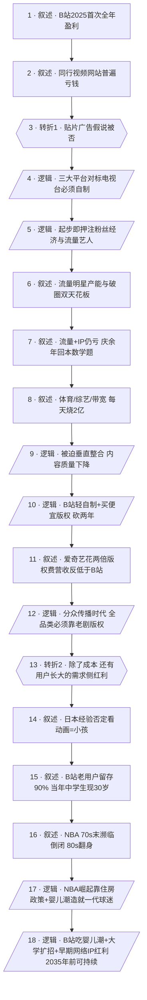

# 马督工方法论内容分析报告：【睡前消息1049】B 站首次实现全年盈利

- 分析时间：2026-05-02
- 发现选题数：2
- 实际分析选题：B 站首次实现全年盈利

---

## 1. 发现选题

| 编号 | 发现选题 | 中心问题 | 一句话梗概 | 独立性判断 | 置信度 |
|---:|---|---|---|---|---:|
| 1 | 湖北恩施学院的考公考编路线 | 一所地处贫弱山区的民办高校把考公做成产业学院，到底是堕落还是良心？ | 恩施地理与财政塌陷 → 考编成本地唯一出路 → 民办校 vs 公立校做法对比 → 把潜规则做成明规则反而比公立大学更负责。 | 中心问题、事实材料、转折结构均独立，可单独成篇。 | 高 |
| 2 | B 站首次实现全年盈利 | 在所有视频平台都亏钱的当口，B 站为什么 2025 年突然全年盈利？ | 否定贴片广告假说 → 三大平台被全年龄+流量+IP+体育拖垮 → B 站本就轻成本路线，砍砍版权就盈利 → 还吃到老用户长大的需求侧红利，类比 1980s NBA 的婴儿潮翻身。 | 中心问题、因果链、转折结构、行动判断均独立，可单独成篇。 | 高 |

**结论：** 两个选题彼此独立。本报告仅分析选题 2，选题 1 的分析见同目录下 `btnews_1049.madugong-analysis.md`。

---

## 2. 带转折点的压缩总结与逻辑深度

B 站 2025 年首次全年盈利（25.5 亿净利润），与几乎所有视频网站都亏钱形成反差。[T1 但是] 流行的"它不上贴片广告所以亏"说法不成立——国内做贴片广告的同行也没赚到钱。真正的差别是：三大平台为对标传统电视台，从粉丝经济起步就砸钱投流量艺人和大 IP，《甜蜜暴击》《庆余年》动辄亿级却拉不来足够会员；再叠加体育版权、综艺、带宽，每天烧 2 亿都不够。B 站本来就走轻自制+买便宜版权路线，连续两年砍版权（110 亿→21 亿）就能盈利。[T2 然而] 仅靠省钱不足以解释——B 站还吃到了用户长大的需求侧红利：15 年老用户留存 90%，当年中学生现在 30 岁开始消费；类比 1980s NBA 吃住房政策与婴儿潮造就的一代球迷红利从濒临倒闭翻身成主流。这套商业模式至少在 2035 年前还说得通。

| 转折点 | 触发位置/内容 | 为什么是不可删除转折 | 作用 |
|---|---|---|---|
| T1 | "但问题在于国内搞贴片广告的公司也没有赚到钱"（line 43） | 否定一个被广泛接受的流行解释（"贴片广告说"），把"为什么 B 站能赚钱"的问法从"它做对了什么妥协"翻转为"它的成本结构本就不一样"。删掉 T1 后整个对比叙事失去入口，读者会停在贴片广告说法。 | 把读者预期从商业模式表象推向行业成本结构。 |
| T2 | "除了成本因素，B 站赚钱，还有一个重要原因，就是他等到了自己的用户长大"（line 59） | 把分析维度从供给侧（成本/支出/版权）切换到需求侧（用户世代/购买力/历史红利）。删掉 T2 文章就是纯粹的"砍成本"故事，缺了 NBA 类比所支撑的人口红利解释，结论会塌缩成"B 站会一直省下去"，失去对未来 10 年商业可持续性的判断。 | 把成本侧故事推进到世代红利结构，引出 NBA 类比与 2035 时间窗。 |

- 转折点数量：2
- 逻辑深度判断：标准模型，传播性价比较高

---

## 3. 叙事单元拆解

类型说明：叙述 = 展示事实；逻辑 = 解释因果；点缀 = 增加趣味但可删除；转折 = 打破预期、改变论证方向。

| 编号 | 类型 | 原文位置/线索 | 单句概括 | 主线作用 |
|---:|---|---|---|---|
| 1 | 叙述 | 开头：B 站 2025 财报 | B 站 2025 年营收 303.5 亿+13%，净利润 25.5 亿，陈睿宣布按美国会计准则首次全年盈利。 | 提供反常事实作为叙事起点。 |
| 2 | 叙述 | "之前几乎所有的视频网站都得亏钱" 段 | 同行视频网站普遍亏钱：腾讯视频不公开、优酷藏在大文娱、爱奇艺 2025 又亏 2 亿+，只有芒果 TV 靠湖南卫视背景稳定盈利但下滑 23%。 | 凸显 B 站盈利的反常，引出"为什么是它"的疑问。 |
| 3 | 转折 | "但问题在于国内搞贴片广告的公司也没有赚到钱" | T1：流行的"B 站亏钱因为不上贴片广告"说法不成立。 | 推翻表层解释，把镜头从"B 站做了什么妥协"转向"行业成本结构"。 |
| 4 | 逻辑 | "刚才提到的三大平台跟B站最大的区别就是主打全年龄" | 三大平台对标传统电视台主打全年龄，必须自制真人剧。 | 给出与 B 站差异的结构性根源。 |
| 5 | 逻辑 | "中国流媒体平台兴起的时候……粉丝经济……投资流量艺人" | 中国流媒体起步赶上粉丝经济，从一开始就押注流量艺人。 | 推进归因：高成本路线的历史选择。 |
| 6 | 叙述 | 杨幂 13 部剧 / 鹿晗《甜蜜暴击》7 亿、收视率 0.3 | 流量明星有产能上限，且很难破圈，难以撑起会员增长。 | 用具体数字证明流量模型的天花板。 |
| 7 | 叙述 | 《庆余年》改编费 6000 万+主演 3000 万+总成本 4 亿 | 升级到"流量+IP"也救不了：要拉 1400 万新增会员才回本。 | 用算账方式证明 IP 模式同样亏。 |
| 8 | 叙述 | 中超 8000 万、NBA 21 亿、综艺、带宽 | 三大平台还要烧体育版权、综艺、带宽，每天基础运营 2 亿，会员+贴片 400 亿都不够。 | 把成本结构铺展到所有支出条目。 |
| 9 | 逻辑 | "为了节省开支，国内的流媒体平台只能走垂直整合路线" | 三大平台被迫走垂直整合，代价是内容创意与质量下降。 | 收束三大平台叙事，揭示其困境的内在结构。 |
| 10 | 逻辑 | "B站一开始就很清楚自己的定位……以花钱买版权为主" + 砍版权数据 | B 站定位清楚——以买便宜版权为主、不抢一线动画 IP，连续两年砍版权（2021-23 年约 110 亿/年→2024 年 21 亿+）。 | 给出 B 站盈利的供给侧解释。 |
| 11 | 叙述 | 爱奇艺去年版权 50 亿 vs B 站 21 亿；爱奇艺营收 273 亿反低于 B 站 | 爱奇艺花两倍版权费，营收却比 B 站还少 30+ 亿。 | 用同行反例证明"烧钱不等于赚钱"。 |
| 12 | 逻辑 | "周杰伦……大众传媒时代" + "热播剧收视率 90%→5%→1%" + 芒果/乐视/B 站买老剧 | 智能手机带来分众传播时代、收视率全面下降；全品类平台必须靠剧集数量留客，芒果/乐视靠老剧版权撑全品类，B 站买《老友记》《我爱我家》是同一逻辑。 | 把成本结构嵌入媒介环境演变，解释为什么"轻路线"才有可持续性。 |
| 13 | 转折 | "除了成本因素，B 站赚钱，还有一个重要原因" | T2：除了成本侧，B 站盈利还有需求侧原因——它等到了自己用户长大有钱消费。 | 把分析从供给侧切换到需求侧。 |
| 14 | 叙述 | 黑猫警长/葫芦娃/熊出没 + 日本漫展中老年人 | 国产低龄向动画造成"看动画=小孩"的刻板印象，被日本经验否定（50-60 岁仍看动漫）。 | 给"用户会长大"的命题铺设跨国对照。 |
| 15 | 叙述 | "B 站 2009 年成立……15 年以上老用户留存率 90%" | B 站老用户留存 90%，当年中学生现在 30 岁、消费爬坡期。 | 把宏观命题落到 B 站自身数字。 |
| 16 | 叙述 | "70 年代末，NBA 的日子混的很惨" → 80 年代转播权 150 万→1.5 亿 | NBA 1970s 末濒临倒闭、球员吸毒，1980s 突然主流化：转播权翻百倍、球队估值翻 10 倍、1987 总决赛市场占有率 32%。 | 引入大型类比案例。 |
| 17 | 逻辑 | 杜鲁门 1949 住房方案 + 拆贫民区 + 战后婴儿潮 | NBA 翻身的深层原因：住房政策让青少年只能打篮球，叠加战后婴儿潮，造就一代成人后变 NBA 忠实观众。 | 用历史社会学解释 NBA 翻身的真正原因。 |
| 18 | 逻辑 | 结尾："B 站现在似乎也走到了类似的位置……至少在 2035 年以前，这道商业模式还说得通" | B 站当前位置类似——吃最后一波婴儿潮+大学扩招红利+前网络/早期网络时代大众 IP 低成本红利，至少 2035 年前商业模式说得通。 | 收束全篇，给出带时间窗的商业判断。 |

---

## 4. 叙事结构模式

因果→并列→因果→并列→因果，切换 4 次：主线是因果归因（盈利现象 → 否定假说 → 成本结构 → 用户世代红利 → 时间窗判断），中间分别用"三大平台烧钱模式"与"NBA 翻身案例"两段并列素材作为对比与类比支撑。素材偏多，但每段并列都收回主线，没到需要拆题的程度。

---

## 5. 一维叙事结构图

节点形状对应单元类型：叙述 = 矩形 `[ ]`，逻辑 = 平行四边形 `[/ /]`，点缀 = 矩形 + 虚线边框，转折 = 六边形 `{{ }}`。节点编号与 Section 3 单元一一对应。

---

## 6. 选题为什么成立

### 6.1 选题本质三要素

| 要素 | 文章中的体现 |
|---|---|
| 共同信息场 | B 站对睡前消息观众而言是几乎全员熟悉的视频平台；视频网站长年亏钱、爱奇艺/腾讯视频/优酷的会员体验、流量明星塌房、《庆余年》IP、NBA 文化、80 年代商业奇迹，都是中文互联网用户的共同知识库。 |
| 最新变化 | 2025 年 3 月初 B 站发布 2025 全年财报，按美国公认会计准则首次实现全年盈利（净利润 25.5 亿，2024 年还在亏 3900 万）。 |
| 行动建议 | 给出三层判断：① 不必担心 B 站节省开支影响体验；② 视频平台亏钱不是因为缺贴片广告而是路线问题；③ B 站的商业模式至少在 2035 年前说得通。 |

### 6.2 八个选题方向匹配

| 方向 | 匹配度 | 证据 | 说明 |
|---|---|---|---|
| 教科书加 | 强 | 用 1949 杜鲁门住房方案、战后婴儿潮、NBA 1980 年代翻身的历史社会学解读 B 站盈利。 | 把高中政治/历史课本里的"美国战后住房政策""婴儿潮"等基本知识点接上当代商业现象。 |
| 数据分析与合订本 | 强 | B 站营收/净利/版权支出多年纵向对比（2021-23 年 110 亿→2024 年 21 亿+）+ 爱奇艺、芒果 TV、腾讯、优酷财报横向对比 + NBA 转播权/球队估值多年对比。 | 典型的多家、多年数据合订本，穿透"亏损平台"的口径修辞。 |
| 审查完美故事 | 强 | 否定流行的"B 站不上贴片广告所以亏钱"说法，用国内贴片广告同行也没赚钱拆穿表层叙事。 | 把流行解释当作"完美故事"，去关注未展示的成本结构维度。 |
| 挖掘历史感 | 中 | NBA 80 年代翻身追溯到 1949 年城市改造和战后婴儿潮；B 站 2009 年中学生用户到 30 岁消费主力的世代叙事。 | 反向挖掘——从今天的商业现象反推数十年前的物质基础。 |
| 调动观众参与感 | 中 | "15 年老用户留存 90%、当年中学生现在 30 岁"——直接把节目受众纳入论据。 | B 站老用户在睡前消息核心受众里占比高，自我代入感强。 |
| 帮群体算账 | 中 | 拆三大平台烧钱账：《甜蜜暴击》7 亿、《庆余年》4 亿要 1400 万新增会员才回本、每天运营 2 亿；拆 B 站省钱账：版权从 110 亿砍到 21 亿。 | 把"视频平台为什么亏"从感性吐槽转为成本收益数学。 |
| 关注普通人生活 | 弱 | 触及"中年女演员没戏拍""会员充一个月就够"，但不是叙事重心。 | 普通用户视角作为论据点缀。 |
| 关注群体内部矛盾 | 弱 | 流量明星 vs 老演员、年轻流量观众 vs 中年家长里短观众，未深入。 | 偶尔触及，未作为主线展开。 |

**主匹配方向：** 教科书加（NBA + 战后住房政策 + 婴儿潮）+ 数据分析与合订本（多家平台多年财报）+ 审查完美故事（拆穿贴片广告假说）。

**次匹配方向：** 挖掘历史感、调动观众参与感、帮群体算账。

### 6.3 否定选题校验

| 校验项 | 结果 | 理由 |
|---|---|---|
| 自己是否愿意分享 | 通过 | "为什么所有视频网站都亏钱、B 站偏偏赚钱"是反直觉前提，自带传播钩子；NBA 类比对二次元/动漫用户有强代入。 |
| 是否绕开完美故事 | 通过 | 主线就是审查完美故事——否定了"B 站靠用户情怀+不上贴片广告就盈利"的浪漫叙事，把功劳分配到结构性成本和人口红利。 |
| 是否避免纯反驳 | 通过 | 否定"贴片广告说"只是入口，主体是给出"轻成本路线+用户世代红利"的正面解释，并附 2035 年时间窗判断，建设性论述远多于反驳成分。 |
| 转折点数量是否合适 | 通过 | 2 个不可删除转折，符合标准模型；T1 与 T2 分布在前后两段，节奏均衡。 |

---

## 7. 总评

这是一篇**典型的"教科书加 + 合订本"商业归因选题**：以反常财报数字（B 站首次盈利）为入口，先用 T1 否定流行解释清场，再以多家平台多年财报作为合订本素材重建供给侧成本结构，再用 T2 把分析维度切到需求侧人口红利，并用 1980s NBA + 1949 住房政策的历史社会学做闭环。供给侧叙事密度高（具体数字密集：鹿晗 1 亿片酬、《庆余年》4 亿、每天 2 亿运营、版权 110 亿→21 亿），易于二次传播；需求侧的 NBA 类比为 B 站的可持续性提供了有时间窗的判断（"至少在 2035 年以前"）——既不是空洞乐观，也避免成为"完美故事"。结构上属于因果主干+两次并列展开（同行平台对比、NBA 类比），切换 4 次略偏多但每段都收回主线，没到需要拆题的程度。

### 可复用的创作公式

> **反常财报 → 否定流行解释 [T1] → 多家同行多年财报合订本 → 锁定真实结构性原因 → 切换分析维度 [T2] → 用一个跨领域历史案例做闭环 → 给出带时间窗的判断**。

具体到本期：以"为什么 X 突然能赚钱"为入口，先排除一个广为流传的解释（往往是最容易被吐槽的产品决策），再用"几大同行的多年财报"建立可信成本结构，最后用一个看似无关的历史案例（NBA、战后住房、婴儿潮）把单一商业现象转译为更普遍的世代红利模型。

### 可改进处

1. **叙事结构偏复杂**：因果主干嵌入两段并列展开（三大平台、NBA），切换 4 次。如果再多一层并列（例如把芒果 TV / 乐视的老剧库存独立成一段案例），就会越过"半棵树"上限。当前处理是"每段并列都用一句话收回主线"，这是把复杂素材压回标准模型的关键技巧，但留给作者的余量不大。
2. **T1 的设置略弱于 T2**：T1 否定的是网络流行解释（贴片广告说），属于"小型预期"；T2 切换的是分析维度（成本→需求），属于"大型预期"。两个转折强度不对称，前半段读者感受到的"翻转感"低于后半段。如果在 T1 和 T2 中间再加一句强反差总结（例如直接挑明"省钱不是创新，只是路线"），可以让前半段的论证更收得住。
3. **2035 年时间窗的依据可以更明确**：结尾给出"2035 年前商业模式说得通"，但没有显式说明这一年的依据（最后一波婴儿潮的消费力到期？大学扩招红利结束？还是早期网络 IP 用户出现下一轮迁移？）。本来时间窗判断是马督工选题的标志性结尾——如果再用一句话锚住"2035"的具体来源，行动建议会从印象级判断升格为可被检验的预测。
