# 马督工方法论内容分析报告：【睡前消息1049】湖北考编学院 上海B站赚钱

- 分析时间：2026-05-01
- 发现选题数：2
- 实际分析选题：湖北恩施学院的考公考编路线

---

## 1. 发现选题

| 编号 | 发现选题 | 中心问题 | 一句话梗概 | 独立性判断 | 置信度 |
|---:|---|---|---|---|---:|
| 1 | 湖北恩施学院的考公考编路线 | 一所民办大学为文科生组建考公考编专业体系，应如何评价？ | 恩施学院产业学院被叫停只是表象，背后是民办高校在地方财政与体制限制下的理性选择，真正应被审视的是公立大学。 | 独立 | 高 |
| 2 | B站首次实现全年盈利 | 为什么 B 站能在 2025 年突然实现全年盈利？ | B 站走低烧钱路线 + 用户长大有了消费力，叠加大众传媒时代 IP 红利，使商业模式至少可持续到 2035 年。 | 独立 | 高 |

**结论：** 文章包含 2 个独立选题。本报告只分析选题 1（用户已指定）。

---

## 2. 带转折点的压缩总结与逻辑深度

3 月，湖北恩施学院联合华图组建考公考编产业学院，几天后被上级叫停。表面看是民办学校瞎折腾，实际上恩施州山区+喀斯特让工业孱弱、财政自给率仅 20%，本地学生只能考公吃国家财政，学院把唯一出路是考公的文科专业打包，本质是潜规则变明规则。[T1 但是]横向看同行，石家庄理工拿地建房、西安工商靠境外旅游收割学生，恩施学院母公司新高教 96% 收入来自学费，靠就业口碑活着，反而算良心民办。[T2 然而]问题不在民办，而在花纳税人钱却宁可挪用预算、扭曲就业率也不愿砍专业的公立大学——上海政法、内蒙古大学也开始找华图，证明这些专业唯一出路就是考公。真正要审视的，是公立大学要不要继续办这些专业。

| 转折点 | 触发位置/内容 | 为什么是不可删除转折 | 作用 |
|---|---|---|---|
| T1 | 与石家庄理工、西安工商横向对比之后，给出"恩施学院反而是良心民办"的判断 | 把表层"产业学院被叫停"的丑闻叙事直接反转：恩施学院从被批对象变成被表扬对象，删掉这一比较段后续"靠就业率吃饭"的因果就丢失立足点 | 重新定位评价对象，把读者从"民办又在搞产业化敛财"的预设中拉出来 |
| T2 | 引入 1034 期、上海政法、内蒙古大学三组公立大学案例后，把责任主体从民办转向公立 | 把矛头从"恩施学院该不该开考公学院"切换到"公立大学要不要继续办这些专业"，删除这一段，文章就只剩对民办的辩护，无法把问题升级为社会层面的解决方案 | 重新定位责任主体并指向行动建议 |

- 转折点数量：2
- 逻辑深度判断：标准模型（2 个转折，传播性价比较高）

---

## 3. 叙事单元拆解

类型说明：叙述 = 展示事实；逻辑 = 解释因果；点缀 = 增加趣味但可删除；转折 = 打破预期并提供核心媒体价值。

| 编号 | 类型 | 原文位置/线索 | 单句概括 | 主线作用 |
|---:|---|---|---|---|
| 1 | 叙述 | 静静开场提问 | 3 月初恩施学院与华图教育成立考公考编产业学院，几天后被上级叫停 | 起点：从最新热点事件切入 |
| 2 | 叙述 | "打开湖北省地形图"段 | 恩施州地处山区+喀斯特地貌，户籍 400 万、常住 330 万，必须考虑就业 | 锁定地理与人口前提 |
| 3 | 点缀 | "民国史充电节目第15期"段 | 川汉铁路烂尾→保路运动→宜万铁路 2010 才通车，最近停运 551 天 | 历史插入，增强地形不利的可感性 |
| 4 | 叙述 | "实体产业弱"段 | 恩施 2025 年第二产业 396 亿、第一产业 311 亿，工业仅农业 1.27 倍，全国是 5.35 倍 | 量化"工业孱弱"事实 |
| 5 | 叙述 | "公共预算收入只有 102 亿"段 | 恩施财政自给率仅 20%（旅游低谷年仅 12%），全靠转移支付 | 量化财政依赖事实 |
| 6 | 逻辑 | "所以恩施人都愿意考公务员"句 | 实体产业弱+人口多 → 居民选择考公脱钩本地经济、吃国家财政 | 第一层因果：从地理→个人选择 |
| 7 | 逻辑 | "在这种背景下"句 | 学院因此把唯一出路是考公的文科专业整合成产业学院，节约资源 | 第一层因果：从个人选择→学校选择 |
| 8 | 叙述 | "现在打开恩施学院的官方网站"段 | 汉语言文学、法学、体育教育三专业明示"考公考编优势/教资通过率 90%" | 物证：考公路线已写进招生话术 |
| 9 | 叙述 | "最早的 2022 年"段 | 2022 年学院已与中公教育共建产业学院；中公正在炒房+推考公贷沦为劣质金融机构 | 时间证据：考公合作并非新事 |
| 10 | 叙述 | 卢新宇案例引述 | 中公教育虽不靠谱，仍帮恩施学生考编成功 | 强化既往合作的成果 |
| 11 | 叙述 | "2022 年的时候，恩施学院只有 389 人"段 | 4 年内考编成功从 389 人增到 621 人；考公班长期存在；产业学院只是潜规则变明规则 | 数据证据：考公培训长期化、规模化 |
| 12 | 逻辑 | "因为恩施学院作为一所民办学校"段 | 民办无背景，必须靠就业率吸引学生 | 把恩施学院的动机抽象为商业逻辑 |
| 13 | 叙述 | 援引 986 期 | 反衬：石家庄理工靠中专升大专、母公司 21 世纪教育集团搞房地产 | 民办同行案例 1 |
| 14 | 叙述 | 援引 996 期 | 反衬：西安工商学院强行挂科推销境外旅游、母公司北方投资曾垄断北京出租车 | 民办同行案例 2 |
| 15 | 转折 | "和这些同行相比"段 | T1：母公司新高教 96% 收入来自学费，恩施学院反而算良心民办 | 重定位评价对象 |
| 16 | 叙述 | "新高教集团就只能在就业方面打出口碑"段 | 恩施护理学/医学检验拿省级一流认证；张雪峰也推荐过 | 印证良心民办还是要靠王牌专业立口碑 |
| 17 | 逻辑 | "但是对于恩施学院来说"段 | 医学专业成本高利润低，文科专业不需硬件投入更容易赚钱 | 解释为什么用文科专业做考公 |
| 18 | 逻辑 | "在全面考编的大背景之下"段 | 在全面考编时代，文科生最优出路就是考公，招生最多的就是法学和汉语言文学 | 把民办商业逻辑收束到"考公"这个出口 |
| 19 | 叙述 | 援引 1034 期 | 反衬：公立大学惰性强、宁可挪用国家投资、扭曲就业率，连数据都不公布 | 公立大学案例（合订本第 1 组） |
| 20 | 转折 | "起码真的在乎自己学生的就业率"段 | T2：恩施学院在乎学生就业，社会层面的考公负面影响不是一家民营企业要承担的 | 责任主体从民办转移到公立 |
| 21 | 叙述 | "去年 10 月份，上海政法学院"段 | 上海政法学院、内蒙古大学也找华图定制公考课程 | 公立大学案例（合订本第 2、3 组） |
| 22 | 逻辑 | 文末"作为花政府资金的公立大学"句 | 终点建议：公立大学应该考虑要不要保留这些专业 | 落到行动建议 |

---

## 4. 叙事结构模式

因果→并列→因果→并列→因果，切换 4 次：主线是一条因果链（地形→财政→学生选择→学校选择→建议），中间用两轮并列对比（三家民办同行、三所公立大学）作为论据支撑两次重定位转折。结构略复杂，但两个并列段都很短、且每个并列后立即收束到转折判断，传播成本可控。

---

## 5. 一维叙事结构图

节点形状对应单元类型：叙述 = 矩形 `[ ]`，逻辑 = 平行四边形 `[/ /]`，点缀 = 矩形 + 虚线边框，转折 = 六边形 `{{ }}`。节点编号与 Section 3 单元一一对应。

```mermaid
flowchart TD
    classDef typeC stroke-dasharray:5 5

    1["1 · 叙述 · 3月恩施学院与华图共建考公学院，几天后被上级叫停"]
    2["2 · 叙述 · 恩施州山区+喀斯特，户籍400万必须考虑就业"]
    3["3 · 点缀 · 川汉铁路保路运动→宜万铁路2010才通车，近年常停运"]:::typeC
    4["4 · 叙述 · 恩施工业仅农业1.27倍，全国为5.35倍"]
    5["5 · 叙述 · 财政自给率仅20%（最差12%），全靠转移支付"]
    6[/"6 · 逻辑 · 产业弱+人口多→居民愿考公脱钩本地、吃国家财政"/]
    7[/"7 · 逻辑 · 学院顺势把唯一出路是考公的文科专业打包"/]
    8["8 · 叙述 · 官网：汉语言文学/法学/体育教育明示考公考编优势"]
    9["9 · 叙述 · 2022年与中公合作；中公因炒房+考公贷沦为劣质金融机构"]
    10["10 · 叙述 · 中公仍帮恩施学生考编成功（卢新宇案例）"]
    11["11 · 叙述 · 4年考编从389→621人；考公班长期存在，潜规则变明规则"]
    12[/"12 · 逻辑 · 民办无背景，必须靠就业率吸引学生"/]
    13["13 · 叙述 · 反衬：石家庄理工母公司搞房地产（986期）"]
    14["14 · 叙述 · 反衬：西安工商母公司垄断北京出租车（996期）"]
    15{{"15 · 转折1 · 新高教96%靠学费，恩施学院反而算良心民办"}}
    16["16 · 叙述 · 恩施护理/医学检验拿省级一流；张雪峰推荐过"]
    17[/"17 · 逻辑 · 医学成本高利润低，文科零硬件投入更易赚钱"/]
    18[/"18 · 逻辑 · 文科生最优出路即考公，招生最多即法学/汉语言文学"/]
    19["19 · 叙述 · 反衬：公立大学挪用投资、扭曲就业率、不公布数据（1034期）"]
    20{{"20 · 转折2 · 责任主体重定位：问题不在民办而在公立大学"}}
    21["21 · 叙述 · 上海政法、内蒙古大学也找华图定制公考课"]
    22[/"22 · 逻辑 · 建议：花政府钱的公立大学应考虑砍专业"/]

    1 --> 2 --> 3 --> 4 --> 5 --> 6 --> 7 --> 8 --> 9 --> 10 --> 11 --> 12
    12 --> 13 --> 14 --> 15
    15 --> 16 --> 17 --> 18 --> 19 --> 20
    20 --> 21 --> 22
```

---

## 6. 选题为什么成立

### 6.1 选题本质三要素

| 要素 | 文章中的体现 |
|---|---|
| 共同信息场 | 全民熟悉的考公热、文科生就业焦虑、民办高校的"敛财"刻板印象 |
| 最新变化 | 3 月初恩施学院与华图共建考公学院、几天后被上级叫停；上海政法学院、内蒙古大学也开始找华图定制公考课程 |
| 行动建议 | 真正要被审视的不是民办大学，而是花政府资金的公立大学要不要继续保留这些除了考公没有任何出路的专业 |

### 6.2 八个选题方向匹配

| 方向 | 匹配度 | 证据 | 说明 |
|---|---|---|---|
| 数据分析与合订本 | 强 | 显式串联 986 期（石家庄理工）、996 期（西安工商）、1034 期（公立大学惰性），加上当期案例和上海政法/内蒙古大学三所公立 | 横向合订本是文章核心论证手段，两次转折都靠合订本案例支撑 |
| 审查完美故事 | 强 | "产业学院被叫停"被普遍读为丑闻，文章反向审查母公司商业模式、财政背景，得出反直觉结论 | 不是审查"完美故事"，而是审查"完美的负面叙事"，用同一逻辑切入：去看没展示出来的成本与体制限制 |
| 帮群体算账 | 中 | 算了恩施财政账（自给率 20%）、新高教营收账（96% 来自学费）、民办利润账（医学成本高 vs 文科零硬件） | 把"民办为什么这么干"的情绪化反应替换成成本-收益结构 |
| 关注群体内部矛盾 | 中 | 揭出民办内部三类母公司的差异（地产/出租车/学费），以及民办 vs 公立的责任结构差异 | 拒绝把"民办大学"视为铁板一块，让 T1 转折成立 |
| 关注普通人生活 | 中 | 切入点是文科生考公焦虑和地方编制饭碗，与大量观众及其子女直接相关 | 提供了把家长关心的"民办高校到底靠不靠谱"问题导出系统性原因的入口 |
| 挖掘历史感 | 弱 | 川汉铁路保路运动→宜万铁路通车那段历史插入 | 仅作为点缀单元，强化"地形不利"的可感性，不构成独立方向 |
| 教科书加 | 弱 | 无明显教科书锚点 | — |
| 调动观众参与感 | 弱 | 未邀请观众投稿/共创，仅靠观众已有"考公焦虑"经验自动接入 | — |

**主匹配方向：** 数据分析与合订本 + 审查完美故事

**次匹配方向：** 帮群体算账、关注群体内部矛盾、关注普通人生活

### 6.3 否定选题校验

| 校验项 | 结果 | 理由 |
|---|---|---|
| 自己是否愿意分享 | 通过 | "民办大学反而是良心、公立大学才是问题"是一个有讨论价值且反直觉的判断，朋友间饭桌上能聊得起来 |
| 是否绕开完美故事 | 通过 | 没有美化任何一方；恩施学院的"良心"被限定在"和同行比"和"在体制约束下"，不是绝对正面叙事 |
| 是否避免纯反驳 | 通过 | 既反驳了"民办又在搞产业化敛财"的预设，又给出正面建设性论述（民办的真实生存逻辑+公立大学应该砍专业的建议） |
| 转折点数量是否合适 | 通过 | 2 个转折，正好命中"三段叙事+两次转折"的标准模型 |
| 结构切换次数 | 警示 | 4 次模式切换偏多，但两个并列段都简短并迅速收束到转折判断，未到必须拆题或简化的程度 |

---

## 7. 总评

这是一个高完成度的"反转型评论"选题。马督工没有正面接受"产业学院被叫停"的丑闻框架，而是用合订本对比把恩施学院放到民办高校的横轴上、再放到公立大学的纵轴上，两轮对比各支撑一次重定位转折——T1 把恩施学院从被批对象变成相对良心，T2 把责任主体从民办转移到公立。整篇文章的传播性价比来自"标准转折模型 + 大量已有观众已经看过的合订本案例"：观众不需要重新建立对石家庄理工、西安工商、公立大学惰性的认识，作者只需引用编号即可，密度因此很高。

可改进处主要不在结构而在重心分配：地理-财政两段（单元 2-5）信息很密但因果链清晰，反而是中段"中公教育跑路"细节（单元 9-10）相对外溢，删掉对主线影响很小，但作者保留了它来服务"长期合作"这一证据维度，是合理但偏冗的取舍。

### 可复用的创作公式

被叫停/出事的负面热点 → 一句话还原表层叙事 → 用地理/财政/产业等结构性前提解释"为什么必然如此" → 横向合订本对比同类（民办同行）→ T1 重定位评价对象 → 解释当事人的真实生意逻辑 → 横向合订本对比另一类（公立大学）→ T2 重定位责任主体 → 落到对真正责任方的行动建议。

### 可改进处

- 中公教育"考公贷成劣质金融机构"那一段（单元 9）属于背景注脚，对主线贡献有限，可以再压缩一两句。
- 4 次模式切换是可以避免的：如果把民办对比和公立对比合并到一个并列段（"无论民办还是公立，没人愿意砍专业"），切换次数能降到 2 次，但代价是失去 T1/T2 两次清晰的重定位节奏，不一定划算——本期的取舍偏向叙事张力而非结构最简。
