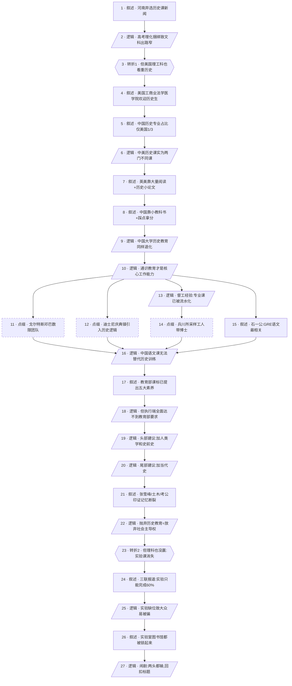

# 马督工方法论内容分析报告：【睡前消息1050】历史老师下岗 物理课也没进步

- 分析时间：2026-05-05
- 发现选题数：1
- 实际分析选题：中国历史教育衰落与应试教育的整体退化

---

## 1. 发现选题

| 编号 | 发现选题 | 中心问题 | 一句话梗概 | 独立性判断 | 置信度 |
|---:|---|---|---|---|---:|
| 1 | 中国历史教育衰落与应试教育的整体退化 | 中国学生为什么不学历史，以及这背后是不是单纯文科被牺牲的问题 | 河南高中弃选历史课的新闻引出中美历史教育的本质差异，作者批评中国历史课退化为踩点拿分的肌肉训练，提出头部加人类学、尾部加当代史的改革方向，最后用物理化学实验也消失这一事实揭穿"牺牲文科换理科"的伪命题 | 中心问题、因果链、转折、行动建议、价值判断都是同一条主线 | 高 |

**结论：** 文章只包含 1 个独立选题。结尾对物理化学实验消失的延伸不是独立选题，而是用来反证"应试教育即使牺牲历史也没换到理科进步"，是同一条因果链上的反向论据，必须保留在主选题之内。

---

## 2. 带转折点的压缩总结与逻辑深度

河南某普通线高中 2000 多学生只有 3 个班选历史，导致 20 多个历史老师明显过剩，直接原因是 2018—2021 年高考政策调整、理化捆绑，文科就业前景差。[T1 但是] 美国名校理工科同样看重历史成绩，普通工商业、法学院、医学院都欢迎历史专业毕业生——根源在于美国历史课要求大量阅读和写作历史小论文，是真正可用的通识教育，而中国历史课只是依赖小篇幅教科书、踩点拿分的肌肉训练，连大学专业都培养不出复杂信息的分析能力。督工建议中国历史课改革：头部增加人类学和史前史、尾部增加当代史，让普通人能用历史定位自身处境、夺回社会主导权。[T2 但是] 应试教育在挤压历史课的同时，理科也并没有受益——按课标要求只能完成 60% 的物理化学实验、实验室和图书馆同样被锁起来，整个教育体系都在退化，"以牺牲文科换理科"成了闹剧。

| 转折点 | 触发位置/内容 | 为什么是不可删除转折 | 作用 |
|---|---|---|---|
| T1 | "但是在美国报考大学，尤其是考名校，哪怕目标是纯粹的理工科专业，历史成绩也很重要" | 直接推翻"理工科生不需要历史"的国民预设，把责任主体从"高考政策" 重新定位到"历史教育的内容设计本身有问题"；删除后从政策归因无法过渡到通识教育批评，主线断裂 | 把现象级新闻升级为教育模式之争 |
| T2 | "最近还有一个趋势值得注意……中学课堂上，物理化学实验正在悄然消失" | 把整篇批评从"文科被牺牲"扩大到"理科也没受益"，揭穿"牺牲文科换理科"这一隐含完美故事；删除后无法兑现标题"物理课也没进步"的反差承诺，主线立不住 | 由文理对立转向应试教育整体批评，给出闹剧式收尾 |

- 转折点数量：2
- 逻辑深度判断：标准模型（三段叙事 + 两次转折），传播性价比较高

---

## 3. 叙事单元拆解

类型说明：叙述 = 展示事实；逻辑 = 解释因果；点缀 = 增加趣味但可删除；转折 = 打破预期、改变论证方向。

| 编号 | 类型 | 原文位置/线索 | 单句概括 | 主线作用 |
|---:|---|---|---|---|
| 1 | 叙述 | 第 1 段后半，南方周末 / 财新报道 | 河南普通线高中 2000+ 学生只有 3 个班选历史，20 多名历史老师过剩 | 起点新闻，进入共同信息场（高考改革） |
| 2 | 逻辑 | 第 2 段，2018—2021 高考政策 | 直接原因是高考理化捆绑、文科就业窄、历史专业出路差 | 第一层归因，建立"政策导致弃选"的表层因果 |
| 3 | 转折 | 第 3 段开头"但是在美国……" | T1：美国名校理工科同样看重历史成绩 | 推翻"理工科不需要历史"的预设，开启第二层因果 |
| 4 | 叙述 | 第 4 段 | 美国普通工商业、法学院、医学院均欢迎历史毕业生 | 用美国劳动力市场坐实通识价值 |
| 5 | 叙述 | 第 4 段末、第 5 段 | 中国历史专业占比 0.4%，仅美国（1.2%）的三分之一 | 数据对比强化中美差距 |
| 6 | 逻辑 | 第 6 段"中美两国的历史教育几乎像两门课程" | 中美历史课在阅读量、考试方式上是两门不同的课 | 第二层解释的核心命题 |
| 7 | 叙述 | 第 7、8 段 | 英美特点：大量阅读教材+原始文献，靠写历史小论文拿分 | 解释美国通识能力的训练机制 |
| 8 | 叙述 | 第 9 段 | 中国特点：依赖小篇幅教科书，考试是踩点拿分的肌肉记忆 | 形成针锋相对的对照 |
| 9 | 逻辑 | 第 10 段 | 中国大学历史教育同样不行，闭卷比例高、毕业生分析能力不突出 | 把退化扩展到大学层级 |
| 10 | 逻辑 | 第 11、12 段 | 通识教育才是核心工作能力，因为它训练复杂信息环境下的总结能力 | 给出整篇文章的核心论点 |
| 11 | 点缀 | 第 12 段，戈尔特斯 | 戈尔特斯把团队压在邓巴数 100—150 人以下 | 通识落地工程界的案例 |
| 12 | 点缀 | 第 12 段末，迪士尼庆典镇 | 迪士尼用 20 世纪郊区化历史经验设计庆典镇社区 | 通识落地房地产的案例 |
| 13 | 逻辑 | 第 13—15 段 | 督工亲身经验：专业课多被流水化，技术人员靠通识从原始材料中提案 | 把论点从"美国"拉回到"中国从业者" |
| 14 | 点缀 | 第 14 段，2002 年兵川所 | 初中毕业的采样工人能带博士做现场勘察 | 用极端例子佐证专业课不能孤立使用 |
| 15 | 叙述 | 第 16 段，西湖大学校长石一公 | 石一公引普林斯顿统计：博士成就只与 GRE 语文推理显著相关 | 借权威背书放大通识价值 |
| 16 | 逻辑 | 第 17 段 | 中国语文课重情绪感染力、缺逻辑推理，无法替代历史课的分析训练 | 关掉"语文课能补"的逃生舱 |
| 17 | 叙述 | 第 18 段，教育部 2017/2025 课程标准 | 教育部历史课程标准强调唯物史观、时空观念、史料实证、历史解释、家国情怀 | 把作者主张升级为官方默认方向 |
| 18 | 逻辑 | 第 18 段末 | 教科书、专业设置、老师素质都达不到教育部要求，退化成"中国特色历史教育" | 把责任从制度文本转向执行环节 |
| 19 | 逻辑 | 第 19、20 段 | 改革建议头部：增加人类学和史前史，从马克思主义底色重塑文明逻辑 | 给出第一项行动建议 |
| 20 | 逻辑 | 第 21、22 段 | 改革建议尾部：增加当代史，让普通人能借历史理解眼前社会变化 | 给出第二项行动建议 |
| 21 | 叙述 | 第 22 段，张雪峰 / 土木 / 考公 | 当代史缺失致大众记忆断裂：90 年代低谷被遗忘，张雪峰靠十几年数据成名 | 用案例佐证当代史教育缺口 |
| 22 | 逻辑 | 第 23—25 段 | 历史学是社会主导权工具：抛弃当代史教育就是放弃主导权、向被统治者靠拢 | 把改革建议升格为政治判断 |
| 23 | 转折 | 第 26 段开头"但是理科也并没有从中受益" | T2：应试教育在挤压历史课的同时，理科也没赢，物理化学实验大规模消失 | 推翻"牺牲文科换理科"的隐含完美故事 |
| 24 | 叙述 | 第 26—27 段，三联周刊 5 月 2 日报道 | 老师按课标要求只能完成 60% 实验，且分散在一两节课 | 用一线证据坐实理科退化 |
| 25 | 逻辑 | 第 28 段 | 实验缺位让理性结论无法"眼见为实"，是普通人被保健品骗的根本原因 | 把理科退化与日常生活骗局连起来 |
| 26 | 叙述 | 第 29 段 | 学校连图书馆和实验室都锁起来，刷题挤掉一切 | 把历史课和理科课的命运并列收口 |
| 27 | 逻辑 | 第 30 段 | 闹剧式结论：抛弃历史课为培养工程师，结果两头都输 | 收束全文，回扣标题 |

---

## 4. 叙事结构模式

因果→并列→因果，切换 2 次：先做政策→通识教育的多层归因（因果），中段用美国劳动力市场、戈尔特斯、迪士尼、督工经验、石一公等多组案例并列补强通识价值，再回到改革建议、当代史警示和"理科也没赢"的因果收尾。结构略复杂，但每次切换都服务于"中美对照→改革方向→反向证伪"的主线，没有溢出到与历史教育无关的话题。

---

## 5. 一维叙事结构图

节点形状对应单元类型：叙述 = 矩形 `[ ]`，逻辑 = 平行四边形 `[/ /]`，点缀 = 矩形 + 虚线边框，转折 = 六边形 `{{ }}`。节点编号与 Section 3 单元一一对应。

---

## 6. 选题为什么成立

### 6.1 选题本质三要素

| 要素 | 文章中的体现 |
|---|---|
| 共同信息场 | 中国家长和学生对高考改革、文理选科、考公考编的共同焦虑；以及九年义务教育里"历史课就是背书"的共同体验 |
| 最新变化 | 2026 年 3—4 月南方周末和财新先后报道河南弃选历史、历史老师下岗；同期三联 5 月 2 日报道中学物理化学实验课消失；教育部 2025 修订版历史课标也已发布 |
| 行动建议 | 中国历史课要向美国学习——头部加人类学和史前史、尾部加当代史、扩大阅读量、考试转向写作分析；同时用历史教育帮普通人夺回社会主导权 |

### 6.2 八个选题方向匹配

| 方向 | 匹配度 | 证据 | 说明 |
|---|---|---|---|
| 教科书加 | 主匹配 | 直接对照中美中学历史教科书、教育部 2017/2025 课标，并把马克思主义人类发展史的"前几页"拎出来重新讨论 | 选题就是站在九年义务教育"历史课"这一共同基础上做加法和反思 |
| 审查完美故事 | 主匹配 | 揭穿"牺牲历史课能换来更好的工程师"这一被默认接受的故事——理科自身也在退化 | 文章后半部分整段是反向证伪 |
| 挖掘历史感 | 次匹配 | 引出 19 世纪马克思人类学、司马迁与儒家士大夫的历史学传统、1903 年清朝学制改革引入历史概念 | 用历史长时段凸显"历史学服务谁"的转向 |
| 关注普通人生活 | 次匹配 | 立足河南普通线高中、土木热、考公考编、张雪峰现象、保健品骗局 | 把宏大教育议题落到具体的家庭决策和被骗经历 |
| 帮群体算账 | 弱匹配 | 给历史老师就业算账（20 多人只能用上 10 人）；给学生算账（拼命复习实验拿 8 分 vs. 不做实验拿 4 分） | 算账场景存在但不是结构主轴 |
| 关注群体内部矛盾 | 不显著 | — | 文章不走文理对立，反而把文理放在"应试教育"同一面 |
| 数据分析与合订本 | 弱匹配 | 横向比较中美历史专业占比、纵向回顾 30—80 年代历史课变迁与 2010 年代各种就业风口 | 数据用作论据而非主轴 |
| 调动观众参与感 | 弱匹配 | 让观众用自己的中学历史课记忆和被保健品/张雪峰建议影响过的经历对照 | 通过共同记忆带入，但没有显式互动设计 |

**主匹配方向：** 教科书加 + 审查完美故事

**次匹配方向：** 挖掘历史感、关注普通人生活

### 6.3 否定选题校验

| 校验项 | 结果 | 理由 |
|---|---|---|
| 自己是否愿意分享 | 通过 | 标题"历史老师下岗 物理课也没进步"自带反差感和金句潜质，朋友圈可直接转 |
| 是否绕开完美故事 | 通过 | 文章核心动作就是审查"牺牲文科换理科"这一完美故事 |
| 是否避免纯反驳 | 通过 | 不仅反驳"中国历史课就该这样"，还系统提供改革方向（头部+尾部+阅读+写作） |
| 转折点数量是否合适 | 通过 | 2 个不可删除转折，符合标准模型 |
| 叙事结构切换是否过多 | 注意 | 因果→并列→因果切换 2 次，刚好踩在"半棵树"的边界，靠美国/中国对比和反向收尾稳住主线，未拆题但有简化空间 |

---

## 7. 总评

这是一期典型的"教科书加+审查完美故事"组合选题。作者把河南某高中的弃选新闻当线索，跳过低性价比的"高考改革该不该回炉"争论，直接拉到中美历史课的内容差异和教育目标差异这一更高维度，从而证明问题不在"考不考历史"，而在"我们考的根本不是真正的历史课"。两个不可删除转折分别处理"理科生为什么也得学历史"和"挤掉历史课换没换来更好的理科"两个普通人最容易卡住的反对意见，使整段论证既贴近共同信息场，又能给出可执行的改革方向，传播性价比落在标准模型上。

### 可复用的创作公式

1. **新闻入口 + 国际对照 + 价值反转**：从一条本土教育新闻切入，用美国/日本同类领域的运作方式做参照，把表层的政策归因升级到更深层的教育模式之争。
2. **课标+权威背书制造正当性**：在改革建议之前先把教育部官方文本和顶级学者（石一公、普林斯顿）摆出来，把作者私人主张升级为"官方默认方向"，降低观众接受成本。
3. **结尾反向证伪锁死标题**：在批评 A（历史课）退化之后，引入对立面 B（物理实验）也退化的案例，让标题中的反差不是修辞，而是论据。

### 可改进处

1. 中段案例（戈尔特斯、迪士尼、兵川所、石一公）四组并列略密，可考虑合并或分作两批，否则容易让观众的"案例疲劳"分散对核心论点（通识教育=工作能力）的注意力。
2. 头部建议中关于"中国人是否源自非洲走出的智人"这一句插叙拉扯到生物人类学，离主线略远，可以处理为脚注或下期单独成题，避免给本期增加第三个隐性转折。
3. 当代史部分举例集中在张雪峰和 90 年代下岗，对更年轻观众的现实感稍弱，可补一两条 2010 年后才发生的案例（例如教培行业熔断、芯片热降温），让"当代史"对 00 后更具体。
