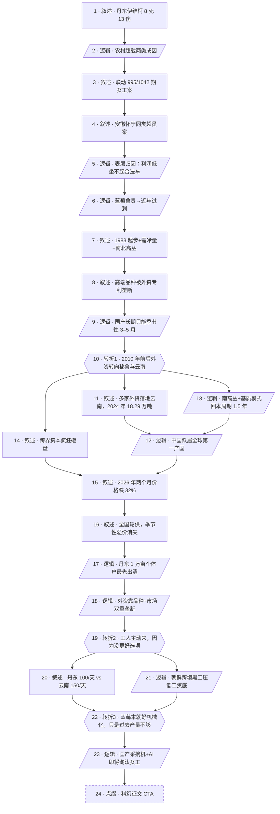

# 马督工方法论内容分析报告：【睡前消息1052】朝鲜黑工+采摘机器 淘汰摘蓝莓的女人

- 分析时间：2026-05-12
- 发现选题数：1
- 实际分析选题：丹东蓝莓采摘女工车祸折射的产业重构与岗位消失

---

## 1. 发现选题

| 编号 | 发现选题 | 中心问题 | 一句话梗概 | 独立性判断 | 置信度 |
|---:|---|---|---|---|---:|
| 1 | 丹东蓝莓采摘女工车祸折射的产业重构与岗位消失 | 摘蓝莓的中老年农村女工为什么被压到坐黑车上班，她们还能干几年？ | 一次伊维柯超载死亡事件，串起 2010 年后云南+外资重构国产蓝莓产业、北方小农户被挤压、朝鲜黑工拉低工资、机械化采摘即将抹掉这批女工岗位的完整链条。 | 中心问题、事实链、转折、行动指向都自洽闭环 | 高 |

**结论：** 全文围绕"丹东车祸—产业塌陷—工人无可奈何—机器接管"的一条因果链推进，包括蓝莓品种史、云南基质模式、资本投机、朝鲜跨境劳工、国产采摘机等所有素材都为这条主线服务，不构成可独立成篇的第二选题。按硬性门槛进入 Step 3。

---

## 2. 带转折点的压缩总结与逻辑深度

丹东 5 月 3 日伊维柯超载致 8 死 13 伤，21 名死伤者全是凌晨赶工的农村蓝莓采摘女工。表面看是利润太薄、雇主舍不得合法车辆——[T1 但]这种利润压缩不是偶然，而是 2010 年后云南配合外资引入南高丛+基质模式，把 2–3 年回本周期压到一年半、把蓝莓从季节性高端水果变成全年常态供应，5 年内全国种植面积翻倍、价格腰斩，技术落后、规模又小的丹东个体户被推到出清边缘。[T2 然而]女工依然愿意凌晨钻进 6 座面包车，是因为东北中小城市没有比 100 元日结更好的零工，更因紧邻朝鲜，越境黑工在丹东服装厂以 2200 元月薪干 13 小时，把所有本地零工待遇都压在地板上。[T3 而]这批靠"低工资+人手摘"撑住的岗位本身也活不久——蓝莓种在平地花盆里，机械化难度极低，过去只是产量不够才没人开发，2023 年首台国产自走式采摘机一台抵 20–30 人，AI 加持下，丹东摘蓝莓女工的职位几年内就会整体消失。

| 转折点 | 触发位置/内容 | 为什么是不可删除转折 | 作用 |
|---|---|---|---|
| T1 | "2010 年前后情况发生变化"——云南+外资+基质模式打破北方季节性溢价 | 删除之后，"利润为什么低"只剩"行业不好"的空话，无法解释"曾经几十块一盒为何变成 17 元成本"，整条产业归因链塌掉 | 把表层归因（雇主抠门）翻成结构归因（全球产业链重构）|
| T2 | "难道丹东的工人没有其他的选择吗？"——东北就业差+朝鲜跨境黑工拉低工资底 | 删除之后，会得出"工人是被剥削的纯受害者"的单面结论，文章无法解释"明明这么惨为什么还抢着干"，也接不上朝鲜黑工这条丹东特有的横向变量 | 把"产业压榨工人"翻成"工人主动接受最差待遇，是因为更差的选项已经存在"|
| T3 | "蓝莓可以种的平地上，甚至可以种的花盆里……机械化采摘的难度相对会较小" | 删除之后，文章只是又一篇"农村女工真惨"，无法落到标题承诺的"淘汰摘蓝莓的女人"；机械化这条线是把全文从产业分析推到未来时态的关键 | 把"工人困在差岗位"翻成"差岗位本身也即将消失"，对应标题的预测性结论 |

- 转折点数量：3
- 逻辑深度判断：3 个及以上——逻辑深，传播成本与误差风险上升，但马督工借助"事故现场→历史→未来"的时间轴，把三个转折串成了观众可跟随的节奏

---

## 3. 叙事单元拆解

类型说明：叙述 = 展示事实；逻辑 = 解释因果；点缀 = 增加趣味但可删除；转折 = 打破预期、改变论证方向。

| 编号 | 类型 | 原文位置/线索 | 单句概括 | 主线作用 |
|---:|---|---|---|---|
| 1 | 叙述 | "5月3日……8死13伤" | 丹东东港 6 座伊维柯实载 21 人发生车祸，伤亡率 100% | 起点事实，提供本期母题 |
| 2 | 逻辑 | "农村出现严重超载……两个原因" | 农村超载车祸两类成因：留守儿童校车 / 中老年劳工通勤 | 调用既有框架，引出"廉价女工"主题 |
| 3 | 叙述 | "我立刻想到了995期……1042期" | 链接 995 期肉类车闷死案、1042 期采茶女工案，并确认本次死伤皆为蓝莓采摘女工 | 用合订本巩固"季节性女工"模式 |
| 4 | 叙述 | "去年5月28日，安徽怀宁的新闻" | 安徽怀宁同年也查出蓝莓工人黑车超员 233% | 把丹东个案升格为全国性现象 |
| 5 | 逻辑 | "蓝莓产业利润不高……工人坐不起合法交通工具" | 表层归因：行业利润压到极致，工人买不起合法运输 | 第一层解释 |
| 6 | 逻辑 | "蓝莓曾经是价值很高的水果……过去几年中国蓝莓产业转入过剩" | 价格曾经很高、最近几年才过剩——为下一步的产业史归因留接口 | 把"利润低"从静态变成动态问题 |
| 7 | 叙述 | "1983年……需冷量概念……北高丛 / 南高丛" | 中国蓝莓种植起点+需冷量+南北高丛两大品种特征 | 教科书加：建立观众对蓝莓产业的基础理解 |
| 8 | 叙述 | "高端品种是有专利的……L25、蓝巨人、兰丰、多克" | 高端品种被外资专利垄断，国产小农户只能种过期品种 | 铺垫"为什么北方掉队" |
| 9 | 逻辑 | "所以在十几年以前……只有 3 到 5 月" | 因专利+需冷量限制，中国蓝莓长期是季节性高端水果 | 把"过去贵"解释清楚，为转折蓄势 |
| 10 | 转折 | "2010年前后情况发生变化" | 转折 1：外资水果公司转向秘鲁与云南 | T1：从"传统北方季节性产业"转向"全球资本重构" |
| 11 | 叙述 | "2013年一颗梅开始在云南种植……多家外资进入" | 多家外资把云南选为中国主基地，云南 2024 年 24.48 万亩、18.29 万吨、全国第一 | 用数据坐实转折 |
| 12 | 逻辑 | "外资出钱出专利，云南有地有果农……颠覆了国产蓝莓市场" | 外资+土地合力使中国 2020 年成全球第一产国、2024 年 78 万吨 | 把转折的产业后果落到全国规模 |
| 13 | 逻辑 | "南高丛蓝莓就不一样了……基质模式……回本周期更短" | 南高丛+基质模式把回本周期从 2–3 年压到 1 年半，可抢高价档期 | 解释云南模式为何能横扫北方 |
| 14 | 叙述 | "陈瑞私募基金……中联达通……诺普信 14.5 亿元" | 跨界资本疯狂涌入，2023–2024 年大笔投入云南蓝莓 | 演示资本逻辑，给"翻倍产能"提供执行者 |
| 15 | 叙述 | "云南产量增长了67%……全国种植面积5年翻一倍……价格暴跌" | 2026 年价格两个月跌 32%，产地价跌至 25 元/斤甚至几块钱 | 把转折的市场后果落到价格曲线 |
| 16 | 叙述 | "云南→辽东/山东/四川/贵州→长三角→西北→新疆" | 全国轮供，蓝莓全年常态供应，季节性溢价消失 | 解释为何北方再也回不到老价位 |
| 17 | 逻辑 | "丹东的种植面积只有1万亩出头……几乎赚不到钱" | 丹东仅 1 万余亩，多为个体户，是这轮出清最先被消灭的一批 | 把全国转折定位到丹东本地 |
| 18 | 逻辑 | "中国主要栽培的蓝莓品种几乎全要靠进口……70% / 不到 10%" | 即便产量第一，外资仍靠品种+市场双重垄断拿走高端利润，小农户必被出清 | 升华转折：产量胜利不等于产业胜利 |
| 19 | 转折 | "难道丹东的工人没有其他的选择吗？" | 转折 2：工人不是被强迫，而是其它选项更差 | T2：从"产业压榨工人"翻成"工人主动接受最差待遇" |
| 20 | 叙述 | "云南 150/天，丹东 100/天" + 小红书摘蓝莓日结分享 | 各产地日结工资对比，丹东 100 元在东北农村已属中上 | 给"工人主动来"配上数据 |
| 21 | 逻辑 | "丹东紧靠朝鲜……朝鲜服装厂 2200 元/月 13 小时" | 朝鲜跨境黑工进一步压低本地零工底线 | T2 的支撑：东北劳动力市场为何无法谈待遇 |
| 22 | 转折 | "蓝莓可以种的平地上……机械化采摘的难度相对会较小" | 转折 3：蓝莓本就好机械化，过去只是产量不够才没人开发 | T3：从"工人困在差岗位"翻成"差岗位本身要消失" |
| 23 | 逻辑 | "2023 年首台国产自走式蓝莓收获机……一台替代 20–30 个人……AI" | 国产机器已成熟+AI 加持，丹东摘蓝莓女工岗位几年内就会消失 | 落到标题预测："淘汰摘蓝莓的女人" |
| 24 | 点缀 | "请关注即将结束的科幻征文活动" | 收尾把"机器替代女工"接到节目的科幻征文 CTA | 增加传播粘性，可删 |

---

## 4. 叙事结构模式

因果→并列→因果，切换 2 次：主线是"事故→利润低→产业重构→工人无可奈何→机器接管"的因果链；中段为了坐实"产业重构"，临时切到并列结构，并排展示外资水果公司、跨界资本、全国轮供产区等多组例证；最后回到因果，推出"机械化淘汰女工"的预测。

---

## 5. 一维叙事结构图

节点形状对应单元类型：叙述 = 矩形 `[ ]`，逻辑 = 平行四边形 `[/ /]`，点缀 = 矩形 + 虚线边框，转折 = 六边形 `{{ }}`。节点编号与 Section 3 单元一一对应。

---

## 6. 选题为什么成立

### 6.1 选题本质三要素

| 要素 | 文章中的体现 |
|---|---|
| 共同信息场 | "蓝莓"对城市观众是日常水果，价格从过去几十元一小盒掉到 25–37 元/斤、超市开始按斤散卖、地头价跌到几块钱，几乎所有买过蓝莓的人都直观感受到了变化；同时"农村中老年女工坐黑车出事故"也是近一年大众媒体反复报道的情绪触点 |
| 最新变化 | ①5 月 3 日丹东东港伊维柯事故 8 死 13 伤；②2026 年蓝莓价格两个月跌 32%、产地价跌至 25 元/斤；③2023 年首台国产自走式蓝莓采摘机问世，一台抵 20–30 人；④2026 年 1 月云南法院刚判决支持 MBO 公司 L25 蓝莓苗木维权——多组"刚刚发生"的新闻汇合到同一选题 |
| 行动建议 | 对观众的认知行动：①重新理解蓝莓便宜背后的全球资本+品种垄断结构；②把"采茶女工—采蓝莓女工—未来被机器替代"接成一组关于中老年女性零工市场的合订本；③节目结尾把这套现实接到科幻征文的写作号召，邀请观众用"采摘机器人+朝鲜劳工"的现实素材写未来 |

### 6.2 八个选题方向匹配

| 方向 | 匹配度 | 证据 | 说明 |
|---|---|---|---|
| 教科书加 | 强 | 单元 7–9、13 系统讲解需冷量、南北高丛、基质 vs 土壤模式、专利垄断 | 给观众补上"超市蓝莓为什么便宜"的一整套产业经济学常识 |
| 关注普通人生活 | 强（主） | 单元 1、3、19–20、22–23 全部围绕摘蓝莓女工的工资、通勤、住宿、岗位前景 | 选题从一起农村女性的死亡事故进入，落点也回到女性劳动者的命运 |
| 帮群体算账 | 强（主） | 单元 13、14、15、20–21 给出 5 万元/亩投入、1.5 吨/亩产、17 元/斤成本、52.5 元/斤批发、150/天云南工资、100/天丹东工资、朝鲜 2200 元/月 13 小时 | 同时给资本方、本地小农户、本地女工、朝鲜跨境黑工四方算账，把"为什么待遇这么差"量化成可对比的数字 |
| 关注群体内部矛盾 | 中 | 单元 14、17、18、21 揭示大资本 vs 北方小农户、中国农村女工 vs 朝鲜跨境黑工两组内部张力 | 没有把"工人 vs 资本"做成单一对立，而是把同一阵营内部的踩踏关系拆开 |
| 挖掘历史感 | 强 | 单元 7–9：1983 起步、兰丰 1952、多克 1986；单元 10–11：2010 转折、2013 一颗梅入云南、2019 秘鲁登顶 | 三层时间纵深（中国引种史 / 全球资本史 / 国产机器史）拉出"为什么是现在"的历史感 |
| 调动观众参与感 | 中 | 单元 23 引用小红书摘蓝莓日结分享；单元 24 收尾的科幻征文 CTA | 把观众日常买水果、刷小红书的体验，以及节目自己的征文社区，接到产业分析上 |
| 数据分析与合订本 | 强（主） | 单元 3 显式合订 995/1042；单元 11–12、15–16 大量产量、面积、价格数据 | 既是数据密集分析，也是节目自有内容的合订本，提升老观众的复利感 |
| 审查完美故事 | 强 | 单元 18 反复点出"中国蓝莓产量世界第一"背后高端品种依赖度 70%、国产占比不到 10% | 用结构性事实拆掉"国产蓝莓崛起"这一套主流好新闻叙事，但不停留在反驳，而是接到工人和机器的现实预测 |

**主匹配方向：** 关注普通人生活 + 帮群体算账 + 数据分析与合订本

**次匹配方向：** 挖掘历史感、教科书加、审查完美故事、关注群体内部矛盾

### 6.3 否定选题校验

| 校验项 | 结果 | 理由 |
|---|---|---|
| 自己是否愿意分享 | 通过 | 普通观众都吃蓝莓、都看到过价格下跌，"我以为蓝莓变便宜是好事，原来背后是这套链条+这群女工"是天然的二次传播话术 |
| 是否绕开完美故事 | 通过 | 选题直接戳破"中国蓝莓产量世界第一"这一套现成的好新闻叙事，但绕开了纯翻案，给出新的结构性归因 |
| 是否避免纯反驳 | 通过 | 不是为反驳谁而写，而是用一次死亡事故串起产业链、历史、未来三个维度，提供新增认知而非批驳对象 |
| 转折点数量是否合适 | 偏临界 | 实际有 3 个不可删除转折，超出"标准两次转折"的传播甜区。马督工通过"事故→历史→未来"的时间轴让节奏可跟随，但对纯路人观众而言，T3 的机器化预测需要较长理解时间，是本期最容易被忽略的一段 |

---

## 7. 总评

这是一期典型的马督工"事故入口—产业归因—未来预测"三段结构，但用了三层而非常见的两层转折：第一层把"利润低"翻成"产业重构"；第二层把"被压榨"翻成"主动接受最差选项"；第三层把"差岗位"翻成"差岗位本身要消失"。三层转折在内容上立得住，因为每一层都对应一组无法被前一层解释掉的事实（云南数据、朝鲜黑工、国产采摘机），但代价是节目时长被拉到必须用品种史、需冷量、基质模式这些教科书段落作支撑，对普通观众有较高门槛。

合订本能力是这期的隐形主轴：995 期肉类车闷死、1042 期采茶女工、本期蓝莓女工，三期连起来定义出一个"中国中老年农村女性零工市场"的稳定母题；将来再有同类事故，这一期可以反过来成为别期的合订单元。

选题真正立得住的关键在第三个转折——"摘蓝莓本就好机械化、只是过去产量不够才没人做"。这把全文从"又一篇农村女工真惨"拽到了"标题承诺的预测性结论"上，让本期从描述变成判断，跟马督工方法论里"行动建议"那一格紧紧扣上。

### 可复用的创作公式

**事故 + 价格曲线 + 品种/技术史 + 跨境劳工变量 + 国产机器突破 = 一篇关于"某种廉价水果背后女工命运"的合订式深度文章**

具体到这一期可拆出的子公式：

- **入口公式：** 一次伤亡事故 → 同类事故合订（同年其他省 + 节目历史期数）→ 把"个案"升格为"模式"。
- **归因公式：** 表层（利润低）→ 中层（全球资本+品种专利+种植模式）→ 底层（区域劳工市场+跨境劳动力压制）。
- **未来公式：** 拿一项"已经存在但还没规模化"的技术（本期是国产采摘机+AI），把当下的劳工现状投影到 3–5 年后，给文章一个时间深度。
- **合订公式：** 故意在文中点名前几期编号（995、1042），让老观众感到"我在跟一个长期叙事"，让新观众产生回看动机。

### 可改进处

- 节目用了大量段落讲品种、专利、基质模式，这些都是 T1 的支撑材料；如果观众的关心阈值停留在"丹东女工"层面，会觉得 1042 期采茶女工那套结构性归因被稀释了，可考虑把品种/专利段落压缩成更紧的几句，把更多时间留给 T2（朝鲜黑工）和 T3（采摘机）。
- T2 的朝鲜黑工材料目前只有一段服装厂引用，没有直接证据证明蓝莓采摘环节也雇用朝鲜女工；用服装厂工资作为"工资底线"的论据有些跳跃，下次类似选题中如能找到同地区蓝莓采摘环节的朝鲜劳工证据，T2 会更扎实。
- T3 的"几年内消失"是预测，但节目没有给出 2025–2026 年蓝莓采摘机的实际渗透率或订单数据，预测的强度可以再升一档：例如"齐齐哈尔已经投了几台、覆盖多少亩"——加上落地数据，预测就从趋势判断变成可验证的时间表。
