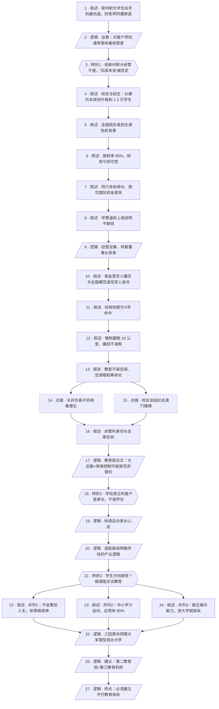

# 马督工方法论内容分析报告：【睡前消息1053】家长愿意出钱 当然要把大学生管死

- 分析时间：2026-05-13
- 发现选题数：1（主选题）+ 4 条尾部简讯（非独立选题）
- 实际分析选题：泉州职大军事化管理背后的家长—学生—应试教育结构

---

## 1. 发现选题

| 编号 | 发现选题 | 中心问题 | 一句话梗概 | 独立性判断 | 置信度 |
|---:|---|---|---|---|---:|
| 1 | 泉州职大严管事件背后的"家长才是真客户"与应试教育失败 | 一所对学生苛刻的民办大学，为什么反而能赚到钱、招到人？ | 用泉州职大"5号命令"切入，揭示家长是真付费客户，再回溯到中小学应试教育让学生丧失独立选择能力。 | 独立成篇，因果链完整、转折明确、行动建议清晰 | 高 |
| 2a | 人形机器人无前途、家政机器人才合理 | 为什么人形机器人是伪命题？ | 用深圳家政阿姨带机器人上门工作为例反推。 | 仅 2 段简讯，无独立因果链，属节目尾部杂烩 | 低 |
| 2b | 台湾省 2026Q1 GDP 同比 13.69% 验证四经济体增长说 | 哪些经济体在贡献全球有效增长？ | 一句数据+一句结论。 | 流水账验证旧观点，无新逻辑 | 低 |
| 2c | 河南平顶山盐穴储气"卡位战" | 谁掌握盐穴，谁就有定价权？ | 引用一段经济观察网特稿。 | 转引为主，无作者独立加工 | 低 |
| 2d | 洛阳 725 所大型转筒帆测试与帆船时代复兴 | 转筒帆能否复兴航运？ | 一段技术新闻+一句预测。 | 短讯简报 | 低 |

**结论：** 文章只有 1 个可独立成篇的主选题（编号 1）。编号 2a–2d 是节目尾部惯例性的"后续新闻"简讯，没有独立因果链与转折，不构成独立选题。本报告只分析编号 1。

---

## 2. 带转折点的压缩总结与逻辑深度

泉州职业技术大学一名女生因走路看手机被劝退、四位老师同时被辞退上了新闻，校规以军事色彩的"5号命令"形式发布，强制 10 公里晨跑、不装空调、痛经也不准请假。常识上，民营企业把客户管成这样，多半说明经营严重出问题、需要靠极端手段降成本。[T1 但是]财务和招生数据显示泉州职大报到率高达 95%、亏损可控、同行多家停办它仍稳得住，经营不仅不差还算活得不错——所以"压缩成本说"被否定，必须换一条解释路径，从董事长吴金莹的军人背景出发理解整套军事化校规。[T2 但是]军人风格只解释了规则形态，解释不了学生为什么忍受：因为学校真正的付费客户从来不是学生，而是家长，家长愿意把孩子塞进高配版戒网瘾学校。[T3 然而]更深的问题在于，为什么学生本人在成年之后还甘心被这样管？根源是中小学单一应试教育让他们脱离社会、不会规划人生、不会运动、不会娱乐。结论是必须在中考高考之外建立"第二教育局"和"第三教育机构"，把强制体育和社会接触补回学生生活。

| 转折点 | 触发位置/内容 | 为什么是不可删除转折 | 作用 |
|---|---|---|---|
| T1 | "但是根据目前情况来看，泉州职业技术大学经营不仅没有问题，还算活得不错。" | 删掉它，"对客户苛刻=经营差=要压成本"就成立，故事到这一步就讲完了——后面追查董事长军人背景、5号命令、家长心态全都没必要。它是把整个调查方向从"差校乱来"扳到"正常经营的学校为什么这么乱管"的必经一脚。 | 把问题从"民办大学经营压力"升级为"一种被市场验证过的奇怪管理模式"。 |
| T2 | "前面提到泉州这个大学的奇怪规定……年轻客户讨厌的规定能够公开发出来，还不影响学校招生。原因很简单……家长才是真客户。" | 把责任主体从"学生交学费接受服务"重新定位为"家长才是付费方"，把吴金莹的军人背景从"个人偏好"升级为"对家长需求的精准匹配"。删掉它，前半部分财务、董事长、奇葩校规的铺垫无法闭合。 | 把问题从"董事长个人风格"升级为"教育市场买方—使用方结构错位"。 |
| T3 | "核心原因是有相当一批大学生的心态上并未成年……至于说学生为什么在成年以后还是不知道自己想要什么样的人生，我认为是基础教育出了问题。" | 在 T2 已经把账算到家长头上之后，再把因果向上游推一级：学生甘心被管的原因被定位到中小学应试教育。删掉它，"建议建立第二/第三教育局"就失去了逻辑落点。 | 把问题从"民办大学+家长"升级为"整个基础教育结构"，为行动建议铺路。 |

- 转折点数量：3
- 逻辑深度判断：3 个转折，超过"三段叙事+两次转折"标准模型，逻辑深、解释链完整，但传播成本和误差风险上升——观众难以一句话向第三方完整转述全链。

---

## 3. 叙事单元拆解

类型说明：叙述 = 展示事实；逻辑 = 解释因果；点缀 = 增加趣味但可删除；转折 = 打破预期、改变论证方向。

| 编号 | 类型 | 原文位置/线索 | 单句概括 | 主线作用 |
|---:|---|---|---|---|
| 1 | 叙述 | 开头静静介绍话题 | 泉州职大女生因走路看手机被劝退，辅导员、班主任、体育老师同被辞退。 | 起点事件，提出"管理为何如此严苛"的悬念。 |
| 2 | 逻辑 | "泉州职业技术大学是一个民营企业……多半有点特殊理由" | 设悬念：企业对客户苛刻通常意味着经营出问题。 | 抛出表层假设，等待数据反驳。 |
| 3 | 转折 | "但是根据目前情况来看，泉州职业技术大学经营不仅没有问题，还算活得不错" | **T1：** 否定"经营差→压成本"假设，必须重找解释路径。 | 把整篇调查方向从"差校乱来"扳到"正常经营的学校为什么这么乱管"。 |
| 4 | 叙述 | 校史 + 专业 + 招生规模 | 泉州职大从 1986 年摩托车技校升格而来，现有 1.3 万学生，年招生从 2000 涨到 3000。 | 用历史和招生规模证实 T1。 |
| 5 | 叙述 | 橡树实验室生源数据 | 全国多所民办高校今年缺额过半，广东白云学院 1477 人放弃入学。 | 对照背景，反衬泉州职大表现。 |
| 6 | 叙述 | 报到率 + 财务数据 | 泉州职大报到率超 95%，2023 年总收入 2.75 亿、学费占 80%，仅亏 1000 多万。 | 证明经营没出大问题。 |
| 7 | 叙述 | 36 氪 2025 新闻 | 同行更惨：多所民办高校停办，西交国际资金链紧张。 | 巩固"泉州职大算活得不错"的判断。 |
| 8 | 叙述 | 涨学费对比 | 兴伟学院年学费近 15 万，泉州职大只温和涨 4800 元。 | 证明学校并不缺钱。 |
| 9 | 逻辑 | "学校经营没有大问题，另外一条信息就值得关注了" | 既然经营不差，那么董事长酒后失言的辟谣声明值得追查。 | 把镜头从财务转向董事长背景。 |
| 10 | 叙述 | 吴金莹生平 | 吴金莹军二代、参加抗美援越、4 次立功、残疾退伍、全国模范退役军人、央视七台专题。 | 解释军事化风格的来源。 |
| 11 | 叙述 | 校规标题"5号命令" | 校规直接用军事命令格式：警示、命令、行进、不听者劝退。 | 把军人背景与现行管理动作连起来。 |
| 12 | 叙述 | 晨跑细节 | 学生强制 10 公里晨跑、马拉松，女生痛经也不准请假。 | 展示军事化管理在身体层面的落地。 |
| 13 | 叙述 | 空调争议 | 教室不装空调，董事长称空调缩短寿命。 | 展示军事化思维向生活管理蔓延。 |
| 14 | 点缀 | 天井理论 | 董事长鼓吹"天井负离子结合改变病毒结构"。 | 增加荒诞质感，可删而不影响主线。 |
| 15 | 点缀 | 澳门赌博条款 | 学校带创业满 100 万的校友去澳门赌博，"输了就是支持澳门建设"。 | 趣味爆点，强化人物形象，可删。 |
| 16 | 叙述 | 非营利身份 | 吴金莹自称非营利办学、全家在校，2010 年起申请非营利身份。 | 引出下一段制度风险讨论。 |
| 17 | 逻辑 | 教育部教育发展研究中心论文 | 非营利民办高校可能通过"大后勤制"和家族管理层把利润关联到举办者口袋。 | 风险提示，为后文埋下"完美故事审查"。 |
| 18 | 转折 | "前面提到泉州这个大学的奇怪规定……家长才是真客户" | **T2：** 学校真正的付费客户不是学生而是家长。 | 把吴金莹的军事化风格从"个人偏好"升级为"对家长需求的精准匹配"。 |
| 19 | 逻辑 | 标语 + 报到率高的解释 | "服从命令听指挥""批评训导作为最大幸福""以校为家"都是迎合家长心态。 | 解释家长为何买单。 |
| 20 | 逻辑 | "高配版本的戒网瘾学校" | 家长把民办大学当托管所，学生也乐意"几年不用考虑怎么生活"。 | 给 T2 提供完整产业图景。 |
| 21 | 转折 | "至于说学生为什么在成年以后还是不知道自己想要什么样的人生……基础教育出了问题" | **T3：** 学生本人接受这一安排的根源是中小学应试教育。 | 把责任再上推一级，进入更深层结构。 |
| 22 | 叙述 | 应试教育问题之一 | 学生无法独立策划人生，张雪峰因此被捧上神坛。 | T3 的并列子项 1。 |
| 23 | 叙述 | 应试教育问题之二 | 中小学不参加体育锻炼，近视率 80%。 | T3 的并列子项 2。 |
| 24 | 叙述 | 应试教育问题之三 | 学生缺乏娱乐能力，上大学后被廉价娱乐占满时间。 | T3 的并列子项 3。 |
| 25 | 逻辑 | "无经验的奇怪规则反而为自己赢得了市场空间" | 应试教育的三个缺陷共同把泉州职大这类学校"喂大"。 | 把 T2、T3 收束为一个市场逻辑。 |
| 26 | 逻辑 | 第二教育局 + 第三教育机构 | 行动建议：体育部门进驻中小学、社会参观与行业交流机构、用 10 年后纳税额评估业绩。 | 给出落点。 |
| 27 | 逻辑 | "拱白菜的张锡峰"与泉州职大军管两极 | 收尾：成绩好坏两端都是应试教育的失败产物，必须建立平行教育体系。 | 终点判断。 |

---

## 4. 叙事结构模式

因果→并列→因果，切换 2 次：主线全程因果推进（事件→假设→数据反假设→董事长归因→家长归因→应试教育归因→建议），中段 T3 之后用应试教育"三个症状"做并列展开，最后回到因果给出建议。整体三段因果嵌套+一次并列插入，配合 3 次转折——结构略复杂，传播门槛偏高。

---

## 5. 一维叙事结构图

节点形状对应单元类型：叙述 = 矩形 `[ ]`，逻辑 = 平行四边形 `[/ /]`，点缀 = 矩形 + 虚线边框，转折 = 六边形 `{{ }}`。节点编号与 Section 3 单元一一对应。

---

## 6. 选题为什么成立

### 6.1 选题本质三要素

| 要素 | 文章中的体现 |
|---|---|
| 共同信息场 | 高考焦虑、家长替子决策、民办大学认知、戒网瘾学校（杨永信式集体记忆）、"张雪峰"作为社会符号、大学生玩手机/沉迷手机的普遍焦虑。 |
| 最新变化 | 2026 年 5 月泉州职大"走路看手机劝退+四师同辞"事件；民办高校生源缺额从七八成跌到只剩不到一半；泉州职大公开发布军事化"5号命令"。 |
| 行动建议 | 建立"第二教育局"让体育部门进驻中小学，用本地学生平均体育成绩当业绩；再建"第三教育机构"组织参观社会与行业交流，业绩用 10 年后毕业生平均纳税额与心理健康评估，并反过来挂钩当事人退休金。 |

### 6.2 八个选题方向匹配

| 方向 | 匹配度 | 证据 | 说明 |
|---|---|---|---|
| 教科书加 | 弱 | "九年义务教育""中小学应试教育"作为共同知识底色 | 仅作为论证背景使用，不是选题本身。 |
| 关注普通人生活 | 强 | 大学生玩手机、家长缴学费、女生痛经晨跑、家长把孩子送军管学校 | 选题入口完全锚在普通家庭日常焦虑上。 |
| 帮群体算账 | 中 | 用 2.75 亿收入、95% 报到率、4800 元涨幅、15 万兴伟学费对比 | 帮观众算清"家长这笔学费到底买了什么服务"。 |
| 关注群体内部矛盾 | 强 ★主匹配 | "学生付钱接受服务的客户……家长才是真客户"；"年轻客户讨厌的规定能公开发出来还不影响招生" | 把家长—学生—学校三方的真实对立结构直接亮出来，是文章最核心的视角。 |
| 挖掘历史感 | 中 | 吴金莹抗美援越—残疾退伍—80 年代办校—"5号命令"的军事化遗存 | 把当代奇葩校规接到一段个人军事史，提供了纵深。 |
| 调动观众参与感 | 强 ★次匹配 | "我就这个问题和我读中学的儿子讨论，得出两个共识"；澳门赌博条款公开征集校友嘉宾 | 主动让出讨论位，邀请家长和大学生用各自经验代入。 |
| 数据分析与合订本 | 中 | 同时调用橡树实验室、36 氪、教育部研究论文、学校公告 | 多源数据交叉，但不是合订本式的纵向年表分析。 |
| 审查完美故事 | 中 ★次匹配 | "不为赚钱，全家在校"叠"非营利身份"过于完美，引论文揭示"大后勤+家族控制"风险 | 用方法论里"完美故事=反面选题"的口径切了一刀，但点到为止，没有展开调查。 |

**主匹配方向：** 关注群体内部矛盾（家长 vs 学生 vs 学校的购买—被购买关系倒置）。

**次匹配方向：** 关注普通人生活；调动观众参与感；审查完美故事。

### 6.3 否定选题校验

| 校验项 | 结果 | 理由 |
|---|---|---|
| 自己是否愿意分享 | 通过 | 任何有大学生子女或自己刚毕业的成年人都会在饭桌上转述"家长才是真客户"这一句，符合"食堂有烤鱼"式的自传播。 |
| 是否绕开完美故事 | 通过 | 主动审查"军事化为学生好"+"全家奉献办学"两个完美叙事，并用教育部论文给出风险提示。 |
| 是否避免纯反驳 | 通过 | 不只批泉州职大，给出"第二教育局+第三教育机构"的正向建设性方案，避免给对方的议题框架当证人。 |
| 转折点数量是否合适 | 临界 | 3 个不可删除转折（"经营不差"→"家长才是真客户"→"应试教育是根源"），超过标准模型 1 次，逻辑链完整但观众难以一句话转述全链；T1 偏调查口径上的反转，T2/T3 才是观众真正会传播的两步，传播性价比依然能撑住。 |
| 结构切换是否过多 | 临界 | 因果→并列→因果切换 2 次，超过方法论建议的"不超过 1 次"，但并列段只承担"应试教育三个症状"的展开，未独立分叉，仍可一句话转述。 |

---

## 7. 总评

这个选题之所以成立，核心是它在大家熟到不能再熟的"民办大学奇葩校规"新闻里，做了三层反转。第一层 T1（"经营不差"）把整个调查方向从"差校乱来→压成本"扳到"正常经营的学校为什么这么乱管"，这是动机性反转——没有它，文章根本没必要继续；常规评论恰恰停在这一步之前。第二层 T2（"家长才是真客户"）是认知性反转，把买方—使用方分离的市场结构亮出来，这才是观众真正会在饭桌上转述的那一句。第三层 T3（"学生甘心是因为应试教育"）是结构性反转，把账算到中小学应试教育头上，给行动建议（第二/第三教育局）找到了落点。

加分项在于：每一层反转都用足够厚的叙述铺垫把观众按在"这不合理"的情绪上，T1 用财务+招生+同行对比，T2 用 5 号命令+军事化细节+非营利身份，T3 用儿子对话+张雪峰现象+近视率 80%。三层之间还有两个干净的过渡逻辑（董事长背景；高配戒网瘾学校），让逻辑链虽长却不跳。

隐患是逻辑深度偏深：3 个转折超出标准模型，结构上又有 2 次模式切换，观众一句话很难把"经营不差→真客户是家长→学生甘心是因为应试教育"完整转述。好在 T1 主要服务调查口径、T2 和 T3 才是大众层面的核心反转，第三方传播时大概率会自动压缩成"民办大学其实卖给家长"+"应试教育让学生没成年"两段，传播性价比仍然能撑住。

### 可复用的创作公式

1. **"看似亏本生意 + 它其实赚钱"作为入口（T1 模板）。** 用"对客户苛刻通常等于经营差"开头设悬，再用财务/招生/同行对比数据直接打掉这个假设，把调查方向从"差校乱来"扳到"正常经营的学校为什么乱管"——一开头就把读者按在"这不合理"的情绪上。
2. **付费者≠使用者结构（T2 模板）。** 在教育、医疗、养老、宠物、儿童娱乐等领域，凡是"由 A 付钱、B 接受服务"的市场，都可以套同一类问题：A 真正在买的是什么？B 为什么也接受？这是真正会被观众转述出去的那一刀。
3. **再向上游推一级（T3 模板）。** 在 T2 把账算给买方之后，不要停在"骂家长"或"骂消费者"层面，而是再把买方的需求归因到一个更上游的结构问题（这里是中小学应试教育），把建议落点放在系统层面而非个体身上。
4. **"完美故事"暗探。** 在主线之外插一段对"完美故事"（"全家奉献办学，不为赚钱"）的克制审查，引权威研究指出风险但点到为止——既给后续选题预留扩展空间，又不打乱当期主线。
5. **建设性方案"业绩反向挂钩"。** 在提建议时把考核指标从"考试分数"换成"10 年后的纳税额与心理健康"，并反过来影响当事教师退休金——这种"长周期+反向激励"句式可直接复用到其他公共服务选题。

### 可改进处

1. **转折点偏多。** 3 个不可删除转折超出标准模型，最容易合并的是 T1 与 T2：把"经营不差"的反转直接合进"家长是真客户"一段（"既然学校能稳着挣钱，那肯定有人在心甘情愿付钱，而那个人不是学生"），可以把调查口径反转折叠成认知反转的一部分，逻辑深度立刻降到 2，传播门槛明显下降。
2. **结构切换略多。** 主线在因果↔并列之间切换 2 次，可以考虑把应试教育三个症状用"主线插叙"方式带过（先把建议端出来，再回头补三个症状），把结构压缩成"因果→因果+插叙"，更贴近半棵树标准。
3. **完美故事审查未走完。** 引用教育部论文提示"大后勤+家族控制"风险后，并未对泉州职大做任何对位的事实查证，这一段更接近免责声明而非调查；如果后续做合订本，可以把这一线索独立成选题。
4. **行动建议落地颗粒度过细但缺约束。** "退休金挂钩 10 年后毕业生纳税额"是漂亮的反向激励句式，但跨届教师责任归属、抽样口径、隐私边界都没有处理；现场说听起来过瘾，写成提案需要再降一档颗粒度。
5. **尾部 4 条简讯与主线无关。** 人形机器人、台湾 GDP、盐穴储气、转筒帆是节目惯例，但和"家长是真客户"主选题在认知场上无任何呼应；从单选题分析角度看属于纯尾料，可考虑在标题或开头先做切割提示。
