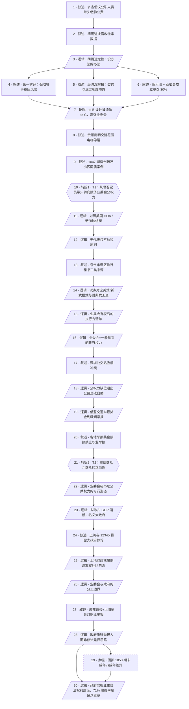

# 马督工方法论内容分析报告：【睡前消息1054】鼓励"群众斗群众"，才能收足物业费

- 分析时间：2026-05-16
- 发现选题数：1
- 实际分析选题：以物业费为切入口，主张赋予业委会"类政府公权力"并重新评估"群众斗群众"

---

## 1. 发现选题

| 编号 | 发现选题 | 中心问题 | 一句话梗概 | 独立性判断 | 置信度 |
|---:|---|---|---|---|---:|
| 1 | 业委会公权力化与"群众斗群众"正名 | 物业费收缴率持续走低，政府该号召党员带头先交，还是把社区自治升级为基层公权力？ | 物业费危机的真正解药不是号召公职人员带头缴费，而是建立有授权、领工资、可强制执行的业委会；这与吸烟、职业打假等案例共同指向同一结论——政府应承认"群众斗群众"式自治的正当性。 | 独立成立：有明确中心问题、独立因果链、两次显式转折、明确制度建议 | 高 |

**结论：** 全文 1 个独立选题。吸烟冲突、成都茶楼职业打假等次级案例均服务于同一中心论点（"群众斗群众"重估），不构成独立选题；末尾对 1053 期未成年/成年差异的补充属于点缀性回扣，不另立选题。

---

## 2. 带转折点的压缩总结与逻辑深度

多地政府号召党员干部带头交物业费，胡锡进定性为"没办法的办法"，多家媒体也批评强行收费只是掩盖矛盾。[T1 但是]真正的解决方案不是号召个体先交钱，而是赋予业主委员会类似政府的公权力——参照美国 HOA 和新加坡组屋经验，让业委会有授权、设领工资的专职秘书（如泉州丰泽区试点），才能更换物业、限制服务、起诉欠费业主。深圳吸烟冲突、成都茶楼遭职业打假人批量举报，本质是同类问题：政府不主动化解又压制公民自助。[T2 因此]必须重估几十年来被否定的"群众斗群众"，承认群众自治本就是基层公权力的正当形态；土地财政枯竭已倒逼地方政府放权，集体诉讼、惩罚性赔偿等领域早晚也要让群众自己解决矛盾。

| 转折点 | 触发位置/内容 | 为什么是不可删除转折 | 作用 |
|---|---|---|---|
| T1 | 在媒体批评和 1047 期柳州/贵阳拆迁小区案例之后，由"号召党员带头"转向"应赋予业委会类政府公权力" | 删除后文章只剩"胡锡进+媒体批评+案例"，停留在批评层面而无替代方案；它把问题从"谁先交钱"重定位为"谁有合法授权强制收费" | 重定位责任主体（个体党员→自治机构），把局部道德号召升级为制度设计 |
| T2 | 在深圳吸烟、成都茶楼等案例铺陈后，将"群众斗群众"从历史负面词重估为基层公权力的正当形态 | 删除后文章只剩"业委会改革"这一具体方案，无法解释吸烟/职业打假为何同构，也无法把社区自治外推到其他政社关系领域 | 把案例级方案上升为政社关系原则；为后续土地财政归因和"集体诉讼、惩罚性赔偿"的横向延伸提供逻辑支点 |

- 转折点数量：2
- 逻辑深度判断：标准模型（2 个不可删除转折），传播性价比较高

---

## 3. 叙事单元拆解

类型说明：叙述 = 展示事实；逻辑 = 解释因果；点缀 = 增加趣味但可删除；转折 = 打破预期、改变论证方向。

| 编号 | 类型 | 原文位置/线索 | 单句概括 | 主线作用 |
|---:|---|---|---|---|
| 1 | 叙述 | 第 1 段 江西、云南倡议书 | 多省政府同时号召公职人员/党员干部带头缴纳物业费 | 起点事实，确立讨论对象 |
| 2 | 叙述 | 第 2-3 段 胡锡进 5/11 评论 | 大型物业收缴率仅 71%，中小物业普遍低于 65% | 给出热度与量化背景 |
| 3 | 逻辑 | 第 3 段 胡锡进定性 | 拒交是"激进对抗"，号召带头是"没办法的办法" | 确立待挑战的主流叙事 |
| 4 | 叙述 | 第 4 段 第一财经 | 强行收费等于压制矛盾，使纠纷变成定时炸弹 | 并列媒体观点，削弱"没办法的办法"叙事 |
| 5 | 叙述 | 第 5 段 经济观察报 | 物业费是契约，与身份无关；深层是开发商遗留+业委会成立障碍 | 并列媒体观点，引入"业委会"概念 |
| 6 | 叙述 | 第 6 段 任大刚 + 30% 数据 | 全国成立业委会的小区仅 30%，自治严重缺失 | 并列媒体观点，量化制度短板 |
| 7 | 逻辑 | 第 6 段后半 | 物业设计是 to B、实际却 to C，必须靠强业委会 | 把媒体观点收束为方案预告 |
| 8 | 叙述 | 第 7 段 贵阳南明交建花园 | 拆迁安置小区 531 户入住、仅 25 户交费，电梯停运 | 极端案例佐证 |
| 9 | 叙述 | 第 7 段末 引用 1047 期 | 柳州拆迁小区同质问题，方案应"加强社区自治" | 跨期互文，预告解法方向 |
| 10 | 转折 | 第 8 段 开篇 "我的观点是…" | **T1**：解药不是党员带头，而是给社区"类政府公权力" | 不可删除转折，重定位责任主体 |
| 11 | 逻辑 | 第 8 段 | 对比美国 HOA、新加坡组屋都有强制力，中国社区缺公权力 | 引入对照系，建立"业委会=类政府"框架 |
| 12 | 逻辑 | 第 8 段末 | "无代表权不纳税"——业委会必须遵循政府授权逻辑 | 给制度设计立原则 |
| 13 | 叙述 | 第 9-10 段 泉州丰泽区文件 | 业委会执行秘书三类来源：社会招聘/内部聘请/社区选派 | 提供本土现行试点证据 |
| 14 | 逻辑 | 第 11 段 | 前两类近似美国模式、第三类近似新加坡模式，雅典发工资制类比 | 把试点纳入制度史框架 |
| 15 | 逻辑 | 第 12 段 | 有授权+专职人员后可换物业、限制服务、起诉欠费、处理噪音 | 给方案设想具体执行力清单 |
| 16 | 逻辑 | 第 12 段末 | 业委会=一般意义上的政府权力；党员只能以业主身份参与制定规则 | 把"党员带头"问题收口到制度参与 |
| 17 | 叙述 | 第 13-14 段 深圳公交站案 | 4 月底深圳女性用饮料浇灭男性香烟，激烈冲突 | 引入第二组案例 |
| 18 | 逻辑 | 第 14 段 | 公权力不主动处理基层矛盾，公民只能用违法方式自助 | 把案例与物业话题同构化 |
| 19 | 逻辑 | 第 15 段 | 立法/执法都缺位；交通举报奖金机制可借鉴到吸烟举报 | 提出可操作的中间方案 |
| 20 | 叙述 | 第 15 段末 | 深圳/大连/合肥举报奖金限额，明确不允许职业举报 | 揭示政府"避免群众斗群众"的现行边界 |
| 21 | 转折 | 第 16-17 段 | **T2**：重估"群众斗群众"——政府限制公民自助但又不能及时化解，这才是怨气根源 | 不可删除转折，把方案上升为政社关系原则 |
| 22 | 逻辑 | 第 17 段后半 | 业委会秘书可能成为未来重要岗位，是公共权力的可行形态 | 把 T2 与具体岗位回扣 |
| 23 | 逻辑 | 第 18 段 | 中国政府财政占 GDP 偏低，凭空背大政府名声却没做大政府的事 | 结构性归因 |
| 24 | 叙述 | 第 18 段末 | 上访制度、12345 热线案例：大政府名义+回避大政府责任 | 例证政社关系的悖论 |
| 25 | 逻辑 | 第 19 段 | 形势比人强：土地财政枯竭迫使地方政府放权社区自治 | 给制度变迁提供动力学解释 |
| 26 | 逻辑 | 第 20 段 | 业委会与政府分工：业委会管内部+追欠费，政府提供法律服务+廉租房托底 | 给完整制度方案补齐边界 |
| 27 | 叙述 | 第 21 段 成都茶楼+上海拍黄灯 | 400 余家茶楼被职业打假人批量举报，1200 家小饭店曾被举报 | 第三组案例，延伸到市场监管 |
| 28 | 逻辑 | 第 21 段末 | 政府本能是质疑举报人身份，而非修法或加强执法，仍是旧思路 | 把案例并入 T2 原则下 |
| 29 | 点缀 | 第 22-23 段 1053 期补充 | 未成年与成年权利不同，所以中小学和大学反向管理并不矛盾 | 点缀回扣，可删而不伤主线 |
| 30 | 逻辑 | 第 24 段 | 政府卖地时忽视业主自治权利建设，71% 缴费率已是群众贡献 | 收束全文，把责任归回制度设计而非个体业主 |

---

## 4. 叙事结构模式

因果→并列→因果→并列→因果，切换 3 次以上：主线是清晰的因果链（问题→T1 制度方案→案例同构→T2 原则上升→结构归因→收束），但在媒体观点（4-6）和平行社会案例（17-20、27-28）两处明显切到并列素材；素材丰富、结构略复杂，靠两次显式转折把并列段重新收束回因果主线。

---

## 5. 一维叙事结构图

节点形状对应单元类型：叙述 = 矩形 `[ ]`，逻辑 = 平行四边形 `[/ /]`，点缀 = 矩形 + 虚线边框，转折 = 六边形 `{{ }}`。节点编号与 Section 3 单元一一对应。

---

## 6. 选题为什么成立

### 6.1 选题本质三要素

| 要素 | 文章中的体现 |
|---|---|
| 共同信息场 | 物业费纠纷是中国几乎所有城市居民的切身经验；胡锡进 5/11 发声进一步把多省倡议推到舆论焦点；深圳吸烟冲突、成都茶楼批量被打假都是同期高传播社会新闻。 |
| 最新变化 | (1) 江西、云南等多省同时下发倡议，显示存在上级统一动员；(2) 胡锡进给出"没办法的办法"定性；(3) 泉州丰泽区刚发布业委会执行秘书制度试行文件；(4) 4 月底深圳吸烟冲突；(5) 4 月底成都 400 余家茶楼遭批量举报；(6) 2026/4/15 起施行的新版投诉举报办法限制非消费者举报。 |
| 行动建议 | 建立有授权、领工资、可强制执行的业委会（参考美式/新式两条路）；政府提供便捷法律服务和廉租房托底；以"无代表权不纳税"为原则推进社区自治；在集体诉讼、惩罚性赔偿等领域同步放权"群众斗群众"。 |

### 6.2 八个选题方向匹配

| 方向 | 匹配度 | 证据 | 说明 |
|---|---|---|---|
| 审查完美故事 | 强匹配（主） | 直接质疑胡锡进"号召党员先交是没办法的办法"这一权威/常识叙事 | 把"党员带头"的暖色道德故事打开，揭示其回避真正制度问题 |
| 教科书加 | 强匹配（主） | 引入美国 HOA、新加坡组屋、雅典民主发工资制、"无代表权不纳税"等政治制度史框架 | 把基层物业问题接入广义政治学，提供超出生活常识的知识增量 |
| 关注群体内部矛盾 | 较强匹配（次） | 业主 vs 业主（交费/拒交）、业主 vs 物业、邻里噪音、吸烟者 vs 路人、消费者 vs 商家 | 文章主线就是政府如何安排这些内部矛盾的解决机制 |
| 帮群体算账 | 中等匹配（次） | 把缴费率 71%、业委会 30%、举报奖金 1 万/1000/2000 等数字串成一笔"业主权利账"；指出 71% 已是民众贡献 | 帮业主重新评估自己在制度中的真实位置 |
| 关注普通人生活 | 中等匹配（次） | 物业费、电梯停运、噪音、公交站二手烟、街边茶馆、小饭店都是日常生活 | 选题入口贴近大多数城市居民日常 |
| 数据分析与合订本 | 弱匹配 | 把 1017 期业委会秘书、1047 期柳州案例、1053 期未成年问题与本期串联 | 形成节目内部的"合订本"互文，但不是主驱动 |
| 挖掘历史感 | 弱匹配 | 提及"几十年前群众斗群众"的负面历史背景 | 仅作为修辞背景，未深入历史叙事 |
| 调动观众参与感 | 弱匹配 | 行动建议落到"以普通业主身份参与业委会规则制定" | 有但不强调 |

**主匹配方向：** 审查完美故事 + 教科书加

**次匹配方向：** 关注群体内部矛盾、帮群体算账、关注普通人生活

### 6.3 否定选题校验

| 校验项 | 结果 | 理由 |
|---|---|---|
| 自己是否愿意分享 | 通过 | 选题给所有付物业费的城市居民提供"为什么要建强业委会"的新框架，有现实诉求承接面 |
| 是否绕开完美故事 | 通过 | 没有树立完美英雄或纯黑反派；胡锡进、媒体、地方政府、业主、职业打假人都被放在制度结构中评价 |
| 是否避免纯反驳 | 通过 | 反驳"号召党员带头"之外，给出泉州丰泽区秘书制度+美式/新式+政府托底的完整正面方案 |
| 转折点数量是否合适 | 通过 | 2 个不可删除转折正好命中标准模型；T1 解决"做什么"，T2 解决"凭什么这样做" |
| 结构切换是否过多 | 边缘通过 | 因果↔并列切换 3 次以上，靠 T1/T2 两次显式收束才把素材重新拉回主线；继续增加并列案例会有结构疲劳风险 |

---

## 7. 总评

本期是一篇典型的"双层反转 + 制度史框架"作品。

第一层（T1）瞄准当下热门叙事——多省政府动员公职人员带头缴费、胡锡进背书的"没办法的办法"——把它从"道德号召要不要听话"的问题，重定位为"业委会有没有合法授权"的制度问题，并立即给出可执行细则（泉州丰泽区秘书制度三类方案 + 美式/新式参照 + 雅典发工资制类比 + 起诉、限制服务等强制力清单）。这一层让文章已经具备完整传播价值。

第二层（T2）借助深圳吸烟、成都茶楼等同构案例，把"业委会要变强"上升为更普遍的政社关系原则——重估"群众斗群众"。这一层把物业话题接入了集体诉讼、惩罚性赔偿、市场监管举报、上访制度等多个相邻议题，让全文获得了远超物业话题本身的射程。

风险点在 Section 4 描述的结构切换。媒体观点群（4-6）和平行社会案例群（17-20、27-28）使主线从因果切到并列又切回因果，节奏要靠 T1/T2 两次明确转折把控；案例如再多 1-2 组，会有素材过载风险。1053 期未成年/成年补充虽是干净的点缀回扣，但它出现在 T2 后段，对边际读者可能造成主题模糊感。整体仍判定为传播性价比高、知识增量足、制度方案可操作的优质选题。

### 可复用的创作公式

1. **"权威定性 + 多家媒体批评" 作铺垫，给 T1 留好反转空间**：用胡锡进定性+第一财经/经济观察报/冰川思想库三家观点建立"已经有人在批评但都没说到点上"的张力，T1 出场时显得自然且必要。
2. **极端案例 + 跨期互文，把"普遍存在"做实**：贵阳拆迁小区+1047 期柳州案例的同质对照，让方案具备"不是孤例所以必须制度化"的逻辑底色；可复制到任何"中央倡议 vs 地方现实"题材。
3. **"对照系 + 本土试点 + 制度史类比" 三件套**：美式 HOA / 新式组屋（对照系）+ 泉州丰泽区秘书制度（本土试点）+ 雅典民主发工资制（制度史类比）；任一缺位则方案要么显得舶来要么显得空想。
4. **用"无代表权不纳税"等一句口号锁住原则**：把抽象政治学概念用本土场景重新锚定，便于观众转述。
5. **T2 用"重估禁忌词"完成升华**："群众斗群众"原本是负面历史词，重估后立即获得辐射多议题的解释力。任何被主流话语污名化的旧概念都可作类似处理。

### 可改进处

1. **结构切换次数偏多**：建议在 T2 之后只保留一组延伸案例（成都茶楼 *或* 上访/12345 二选一），把全文切换次数压回 2 次以内，传播友好度更高。
2. **末尾 1053 期补充对边际观众有干扰**：可改为节目片尾的"上期回扣"环节单独处理，避免与 T2 后的结构归因混在一起；或在引出时显式说"换一个话题再说一句"。
3. **业委会秘书的制度风险未触及**：可加一句"专职秘书可能演变为新的小利益集团"的对冲性提示，让方案显得更可执行而非乌托邦。
4. **可强化"普通业主接下来怎么做"的钩子**：现在的行动建议偏制度层；增加一两句"作为业主，下一次小区物业纠纷时可以做什么"会让选题完成度更高。
