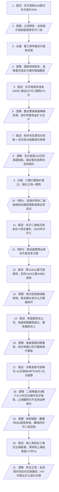

# 马督工方法论内容分析报告：【睡前消息1055】高铁涨价可以，拿京沪二线来换

- 分析时间：2026-05-21
- 发现选题数：1
- 实际分析选题：京沪高铁涨价是否合理——以及为什么"合理涨价"被铁路建设体制毁掉

---

## 1. 发现选题

| 编号 | 发现选题 | 中心问题 | 一句话梗概 | 独立性判断 | 置信度 |
|---:|---|---|---|---|---:|
| 1 | 京沪高铁涨价 vs 京沪二线建设 | 京沪高铁涨价20%是否合理？涨价的钱能不能换来等价的供给扩张？ | 督工以消费者+国企股东双重身份支持涨价，但揭示京沪二线已被地方政府绕弯降速搞废，涨价实质沦为对无效建设的补贴 | 中心问题、因果链、转折点、行动建议齐全，可独立成篇 | 高 |

**结论：** 全文只有 1 个独立选题。"高铁涨价合理性"与"京沪二线体制问题"看似可拆，实则共享同一条因果链——涨价的钱去哪儿了，决定了涨价本身的合法性，二者必须放在一起讨论才有意义。

---

## 2. 带转折点的压缩总结与逻辑深度

京沪高铁5月26日部分车次涨价20%。督工以消费者+国企股东双重身份分析：京沪高铁年运营成本200多亿但客运收入只有157亿，靠路网过路费才赚钱；整点直达票紧缺，是稀缺资源，涨价积累资金扩大生产，合理。[T1 但是]如果涨价的同时京沪二线建设拖拖拉拉，就是滥用垄断地位刷政绩，必须坚决反对。京沪二线临沂段本应"十四五"通车，现在2025年才开工，进度严重落后。[T2 然而]就算修出来也不是当年的弓弦直线方案——为讨好地方政府，绕U型弯、43个站、全长1424公里比现京沪还长，还要降速到250公里跑六七小时，根本不能替代现有京沪高铁。中国铁路建设体制错配：翻秦岭的350时速西十、太绥等亏损高铁不缺钱，明显赚钱的京沪二线却没钱降速运行。所以这次涨价只是给无效建设增加补贴，体制不变则涨价必然永久化；只有京沪二线开出4小时以内车次，督工才认这次涨价合理。

| 转折点 | 触发位置/内容 | 为什么是不可删除转折 | 作用 |
|---|---|---|---|
| T1 | "但反过来说，如果在京沪高铁涨价的同时，京沪二线的建设拖拖拉拉……必须坚决反对。" | 把"市场化涨价合理"的论证翻转为"有条件的反对"。如果删掉，前段"支持涨价"的论证与后段"二线进度问题"之间没有逻辑桥梁，整篇文章会断成两块互不相干的素材 | 责任主体重新定位：从"消费者要不要为方便买单"翻转到"垄断企业能不能用涨价刷政绩"，把选题从消费话题升级为体制话题 |
| T2 | "更重要的是，现在这条京沪二线就算修出来，恐怕也不是当年预期的那条铁路。" | 把"二线只是进度慢"的表层判断翻转为"二线方案已经被改坏"。如果删掉，读者会以为"再等几年就好"，选题就降级为新闻信息通报。T2才让矛盾从"时间问题"升格为"体制问题" | 问题从个案变成结构：从"一条线延期"翻转到"整个铁路建设体制让赚钱线路被亏损线路绑架"，触发结尾"涨价沦为无效补贴"的最终立场翻转 |

- 转折点数量：2
- 逻辑深度判断：标准模型（三段叙事 + 两次转折），传播性价比最高

---

## 3. 叙事单元拆解

类型说明：叙述 = 展示事实；逻辑 = 解释因果；点缀 = 增加趣味但可删除；转折 = 打破预期、改变论证方向。

| 编号 | 类型 | 原文位置/线索 | 单句概括 | 主线作用 |
|---:|---|---|---|---|
| 1 | 叙述 | 开头静静的提问 | 京沪高铁5月26日起部分车次票价上浮20%，二等车票可能超过800元 | 起点事实，进入共同信息场 |
| 2 | 逻辑 | "我支持京沪高铁涨价，但前提是……" | 立场预告：支持涨价，但前提是把钱拿去修京沪二线 | 全文论点的预先压缩，T1的伏笔 |
| 3 | 点缀 | "我平时生活工作在上海苏州……" | 督工自述常年跑京沪高铁全程，给观点提供消费者身份背书 | 增加现场感与可信度 |
| 4 | 逻辑 | "我并不认为高铁是生活必需品……" | 国家已提供绿皮车作为基础交通，高铁是花钱买方便的增值服务 | 为"涨价合理"提供经济学定性 |
| 5 | 叙述 | "京沪高铁也不完全是躺着赚钱……" | 京沪高铁投资2209亿、年折旧40亿、年运营成本200多亿；客运收入157亿、路网过路费270亿 | 用财务数据证明涨价有成本依据 |
| 6 | 逻辑 | "稀缺资源涨价，积累资金扩大生产" | 整点直达票紧缺、客运成本倒挂，涨价是稀缺资源定价 + 积累资金扩大生产 | 把"涨价合理"从直觉论证为经济逻辑 |
| 7 | 叙述 | "深化票价机制改革……标杆车优质优价" | 只有标杆整点直达车次涨价，其他车次甚至下降；2017、2021、2024 历次涨价都集中在热点线路 | 用历史规律证明这次涨价不是普涨 |
| 8 | 逻辑 | "京沪高铁利润132亿，全国民航才65亿" | 京沪高铁单线利润超过全国民航总和，作为国企最终股东的消费者也该支持涨价 | 用股东视角加固"支持涨价"立场 |
| 9 | 点缀 | "2020年1月第71期节目……口罩涨价" | 援引疫情期间支持口罩市场化定价的旧观点作类比 | 借旧观点强化立场一致性 |
| 10 | 转折 | "但反过来说，如果在京沪高铁涨价的同时，京沪二线的建设拖拖拉拉，那就是铁路总公司在滥用垄断地位……必须坚决反对" | **T1**：若涨价不换来供给扩张，就是垄断滥用，必须反对 | 把市场化论证翻转为条件性反对，打开后半段批评 |
| 11 | 叙述 | "记者从9月14日下午召开的临沂市……新闻发布会上获悉" | 京沪二线临沂段按规划本应"十四五"末通车，现在2025年才开工 | 用官方公告证明二线严重落后 |
| 12 | 转折 | "更重要的是，现在这条京沪二线就算修出来，恐怕也不是当年预期的那条铁路" | **T2**：就算二线修出来也不是当年方案 | 从"进度慢"翻转到"方案被改坏"，进入体制层 |
| 13 | 叙述 | "原本走的是弓背……现在近似于走的是弓弦"／"京沪二线有43个站" | 原设计1100公里弓弦直线 → 实际43站、山东境内U型弯、全长1424公里比现京沪还长 | 用方案对比量化"被改坏"的程度 |
| 14 | 逻辑 | "铁路总公司想让地方政府去投资……必须服从地方规划" | 地方政府出钱→线路必须服从地方规划，潍坊段中线被改为绕诸城/五莲/莒县 | 解释"为什么方案会被改坏"的第一层机制 |
| 15 | 叙述 | "2013年铁道部改成了铁路总公司，2014年江苏省成立了省级铁路集团"／既有城际并入 | 体制演变：铁道部→总公司→省级铁路集团；京津城际、沪苏通、徐盐等既有城际铁路被并入京沪二线 | 提供"地方主导"的制度史依据 |
| 16 | 逻辑 | "国家铁路总公司遇到的问题在省级层面上重新出现了一次" | 省级铁路公司同样不算账，优先满足省内政绩规划 | 把矛盾从"中央"放大到"中央+省级"两级 |
| 17 | 叙述 | 济莱高铁每天4趟、刚降价到31元起；山东铁投4年累计亏损30+亿、光大跳票、总经理换人 | 并列案例补强"省级铁路体制失灵" | 用真实数据让"省级层面失灵"可触可证 |
| 18 | 逻辑 | "京沪二线受到地方政府主导……跑六七个小时，完全不能对现有的京沪高铁进行有效替代……所以我不支持这种涨价" | 京沪二线降速到250、跑6-7小时，不能替代京沪高铁；T1设定的"前提"不成立，立场翻转为"不支持这种涨价" | T2触发的最终立场结论 |
| 19 | 逻辑 | "西十高铁……黔吉高铁……太绥高铁……济莱也是350时速" | 体制错配：翻秦岭、翻吕梁山的350时速亏损高铁不缺钱，明显能赚钱的京沪二线却没钱降速运行 | 用对比加重对体制的批判 |
| 20 | 叙述 | "深圳到上海最快的一趟车是G700走江西南昌，全程是7小时14分钟" | 珠三角到长三角无沿海直通高铁，比京沪最慢车次还慢 | 提供更广的同类失败案例，把选题外推到全国 |
| 21 | 逻辑 | "支持铁路涨价解决建设资金问题，但是不支持拿我的钱做无效建设。如果京沪二线能够开出4小时以内的车次，我就认为现在的涨价有道理" | 终点立场：支持市场化涨价 vs 反对补贴无效建设；以"4小时直达"作为可量化验收标准 | 给观众一条可记忆、可复述的行动判据 |

---

## 4. 叙事结构模式

因果，主线无切换。中段（单元 15-17、19-20）用体制演变、济莱高铁、山东铁投、西十/太绥/济莱、深圳到上海等并列案例补强"体制错配"这一因果环节，但都明确收束到主线因果链上（涨价 → 二线 → 体制 → 涨价合法性），属于主线插叙式的并列补强，不构成模式切换。

---

## 5. 一维叙事结构图

节点形状对应单元类型：叙述 = 矩形 `[ ]`，逻辑 = 平行四边形 `[/ /]`，点缀 = 矩形 + 虚线边框，转折 = 六边形 `{{ }}`。节点编号与 Section 3 单元一一对应。

---

## 6. 选题为什么成立

### 6.1 选题本质三要素

| 要素 | 文章中的体现 |
|---|---|
| 共同信息场 | 京沪高铁是中国最知名的高铁线路，几乎所有目标观众都坐过或听说过；绿皮车与高铁的对照、12306 购票体验、整点直达票紧缺，都是大众日常经验 |
| 最新变化 | 京沪高铁公司宣布5月26日起京沪高速线和蚌埠高速线所有动车组票价上浮20%，部分二等票超过800元 |
| 行动建议 | 作为消费者和国企股东，支持涨价以扩大供给；同时反对铁路体制把涨价资金浪费在被地方政府改坏的京沪二线上；以"京沪二线开出4小时以内车次"作为是否承认涨价合理的验收标准 |

### 6.2 八个选题方向匹配

| 方向 | 匹配度 | 证据 | 说明 |
|---|---|---|---|
| 帮群体算账 | 强 | 京沪高铁2209亿建设投资、200多亿年运营成本、157亿客运、270亿路网、132亿利润；二线1100公里直线 vs 1424公里实际、降速到250、跑6-7小时 | 把"涨价是好是坏"这个情绪化反应转化为对消费者和股东双重身份的成本收益计算 |
| 审查完美故事 | 强 | 铁路公告的"深化票价机制改革……发挥市场化票价机制调控作用"是表面完美故事；督工挖出被掩盖的成本端——钱去哪儿了，能否换来供给扩张 | 表面"市场化"叙事下，隐藏的是"用垄断性高价补贴无效建设"，正是教科书式的"审查完美故事" |
| 调动观众参与感 | 中 | 督工自述常跑京沪高铁全程、买1462次绿皮车带退休家人、用12306实际票价对比 | 让常坐高铁、看过涨价新闻的观众都能用自己经验参与讨论 |
| 关注群体内部矛盾 | 中 | 铁路总公司 vs 地方政府 vs 省级铁路公司 vs 消费者；中央高铁项目 vs 城际铁路 vs 市域高铁的利益分歧 | 揭示"铁路系统"内部并非铁板一块，地方主导让能赚钱的线路被绑架 |
| 数据分析与合订本 | 中 | 把2017、2021、2024、2026这四轮涨价合订对比，发现"热点线路优先涨"的规律；把山东铁投2020-2023四年亏损数据纵向拼接 | 用合订本视角穿透"市场化票价"的修辞 |
| 教科书加 | 弱 | 提到"民国甚至清朝时期的京沪和津浦铁路"留下的折线 | 历史背景只作辅助，未独立成段 |
| 挖掘历史感 | 弱 | 2013铁道部改总公司、2014江苏成立省级铁路集团的体制演变 | 用作体制根源的注脚，不是主线 |
| 关注普通人生活 | 弱 | 退休老人买1462次绿皮车、买不到整点直达 | 是引子，不是核心 |

**主匹配方向：** 帮群体算账 + 审查完美故事（双主线，互相支撑）

**次匹配方向：** 调动观众参与感、关注群体内部矛盾、数据分析与合订本

### 6.3 否定选题校验

| 校验项 | 结果 | 理由 |
|---|---|---|
| 自己是否愿意分享 | 通过 | 高铁涨价是大众饭桌话题，督工的"条件性支持"立场比单纯支持/反对都更有讨论价值，普通人有强烈分享动机 |
| 是否绕开完美故事 | 通过 | 没有把京沪高铁说成"完美高铁"或"必须否定的高铁"，而是用涨价合理 + 二线烂尾 + 体制错配三层结构展示真实复杂度 |
| 是否避免纯反驳 | 通过 | 非纯反驳。开篇就明确支持涨价，再给出"4小时直达"的正面建设性指标，并把批评指向具体的体制错配方向 |
| 转折点数量是否合适 | 通过 | 2 个不可删除转折，正好符合马督工"三段叙事+两次转折"的标准模型，传播性价比最高 |

---

## 7. 总评

这是一期教科书级的"双身份算账 + 审查完美故事"组合。督工开篇就以消费者+国企股东两重身份切入，让立场不再是"作为评论员我支持/反对"，而是"作为利益相关人我支持，但有前提"——这一身份设定让 T1 的条件性反对有了合法性。

T1 的"如果不修二线就反对"看似只是表态，实际上是把整篇文章的论证空间从"消费品定价"扩展到"国企供给能力"。T2 则把"二线进度落后"这个观众能预想到的表层问题，翻转为"方案已经被改坏"的体制问题——这是真正的不可删除转折，让选题从新闻评论升级为体制批评。

结尾"4小时直达才认涨价合理"是马督工方法论中极具特色的一笔：给一个可量化、可记忆、可在未来核验的判据，比单纯立场表达多一层"可被验证的承诺"。

### 可复用的创作公式

**「双身份切入 → 表层市场化论证 → T1条件性反对 → 进度数据证明条件不达标 → T2揭示方案被改坏 → 体制根源剖析 → 终点给出可量化验收标准」**

具体到执行：
1. 找一个既能用消费者经验代入、又能用纳税人/股东视角算账的公共议题（高铁、电价、油价、医保等）
2. 第一层论证"涨价/政策"在市场逻辑下合理，避免被读为"无脑反对派"
3. 用 T1 设定"但如果钱花得不对……"的条件性反对，把选题升格为公共治理议题
4. 用官方数据/公告证明条件不达标
5. 用 T2 翻转读者预期：不是进度问题，是体制问题
6. 用 2-3 个并列案例补强体制错配
7. 终点给一个可量化验收标准（如"4小时直达"），让观众有抓手在未来核验

### 可改进处

- 中段并列素材较密集（济莱高铁、山东铁投光大跳票、西十/西康/黔吉/太绥/济莱350规划、深圳到上海绕南昌）。从单元 17 到单元 20 信息密度高，普通观众如果不熟悉中国铁路图，可能在"济莱"和"太绥"这些非主流线路名上失焦。可以考虑：保留1-2个最有冲击力的（济莱高铁日均4趟降价 + 西十翻秦岭350），把其他并入一句话带过。
- T1 在第 2 段就已经预告"我支持京沪高铁涨价，但前提是……"，到单元 10 才正式触发。预告与触发之间隔了 8 个单元，部分观众可能在中段忘记 T1 的伏笔。可以在单元 10 触发 T1 时，明显回扣开头的"但前提是"短句，让伏笔与转折的呼应更显眼。
- 终点的"4小时直达"验收标准只在最后一句出现，没有在文中段落多次铺垫"4小时"这个数字（虽然单元 16 提到了现在 G17 是 4.5 小时、整点票紧缺）。如果中段就埋伏"现在 4 小时直达票紧缺"的数字钩子，结尾"4小时直达"的承诺会更有重量。
