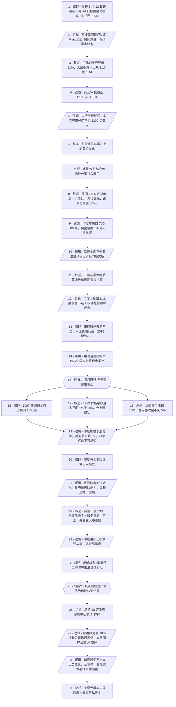

## 马督工方法论内容分析报告：【睡前消息1056】3万吨黄金 挡不住AI危机

- 分析时间：2026-05-22
- 发现选题数：1
- 实际分析选题：印度民间巨量黄金为何救不了莫迪的卢比保卫战

---

## 1. 发现选题

| 编号 | 发现选题 | 中心问题 | 一句话梗概 | 独立性判断 | 置信度 |
|---:|---|---|---|---|---:|
| 1 | 印度民间巨量黄金为何救不了莫迪的卢比保卫战 | 莫迪提高黄金进口关税背后是什么逻辑，民间近 4 万亿美元黄金为什么帮不了政府抵抗汇率危机 | 卢比汇率逼近 1 比 100 心理门槛，莫迪只能从黄金入手节流，但民间黄金动员历史上最多收 5%，而真正压垮印度的将是 AI 对服务业的长期摧毁 | 独立成篇，因果链完整 | 高 |

**结论：** 文章只有一个独立选题。表面是关税新闻，关税、黄金文化、动员历史、AI 危机四段全部围绕"印度的黄金储备能不能托住卢比"这一中心问题展开，没有可以拆出来单独成篇的次主线。

---

## 2. 带转折点的压缩总结与逻辑深度

莫迪呼吁印度人一年不买黄金、不出国旅行，并把黄金关税从 6% 升到 15%，直接原因是卢比对美元贬值逼近 1 比 100 心理门槛，印度央行已动用上千亿美元干预，扣除外债和远期空头后实际可用弹药不足 2300 亿美元。[T1 但是]虽然印度民间囤积了 2.5 万到 5 万吨黄金、价值近 4 万亿美元，远超各国政府储备总和，1997 年韩国、1933 年罗斯福、民国法币与金元券的历史都证明，政府用爱国动员或行政强制最多只能拿到 5% 左右民间黄金，印度族群矛盾比韩国更深，这份"国家级"储备国家根本用不上。[T2 然而]卢比贬值不只是伊朗战争、外资撤离的短期冲击，更深层是支撑印度国际收支的服务业出口正被 AI 摧毁——承德 10 万坐席客服中心被 AI 碾过后再无人提，印度凭英语加廉价人力吃世界外包的优势也会随之归零，若莫迪变不出本土英伟达、台积电，国际投机资本必押卢比崩盘，提高黄金关税最终只会逼印度人去买走私黄金。

| 转折点 | 触发位置/内容 | 为什么是不可删除转折 | 作用 |
|---|---|---|---|
| T1 | "印度民间黄金超过世界各国政府黄金储备之和……但是这份能力目前看来只是印度民间的，莫迪和印度政府都用不上" | 把"印度民间黄金多 → 国家有底牌"的表层预期推翻，把责任主体从民间储备重新定位到政府动员能力，由此引出韩国/罗斯福/民国三段历史并列论证 | 否定"印度有救命钱"的常识联想，让读者接受"民间储备和国家储备不是一回事"的新认知 |
| T2 | "前面说的问题，比如说伊朗战争、外资撤离，印度都是近期的压力。从远期来看，印度最大的问题是产业优势可能会快速归零" | 把问题从"短期金融冲击"重新定位为"长期产业根基坍塌"，把视角从印度本国问题拉到 AI 对全球服务业的结构性冲击，由此把承德客服中心嫁接到印度命运上 | 把卢比危机由"撑过这阵子"升级为"赌长期衰退"，给观众提供承德 → 印度的本土代入 |

- 转折点数量：2
- 逻辑深度判断：标准模型（三段叙事 + 两次转折），传播性价比高

---

## 3. 叙事单元拆解

类型说明：叙述 = 展示事实；逻辑 = 解释因果；点缀 = 增加趣味但可删除；转折 = 打破预期、改变论证方向。

| 编号 | 类型 | 原文位置/线索 | 单句概括 | 主线作用 |
|---:|---|---|---|---|
| 1 | 叙述 | 第 10 段 5 月 12 日莫迪讲话、5 月 14 日提税 | 莫迪呼吁不买黄金、不出国，并把黄金关税从 6% 升到 15% | 起点新闻 |
| 2 | 逻辑 | 第 12 段"直接原因是印度的外汇储备缩水" | 真正原因是卢比汇率保卫战，民间黄金不能折成国家储备 | 第一层归因，预埋核心命题 |
| 3 | 叙述 | 第 14-16 段 1:10→1:14、卢比对美元贬值 11% | 卢比是亚洲表现最差的货币 | 用熟悉的人民币汇率给中国观众建立基准 |
| 4 | 叙述 | 第 18 段 美元/卢比破 1:95，逼近 1:100 | 1 比 100 是不可越过的心理门槛 | 设置具体压力点 |
| 5 | 逻辑 | 第 20-24 段 央行干预、远期空头、7000 亿储备实际可用 2300 亿、中立资金只帮赢家 | 印度政府能砸的弹药正在快速耗尽，必须找金融市场之外的办法 | 解释为什么必须从黄金入手节流 |
| 6 | 叙述 | 第 28 段 印度女性满身金饰、富裕男性首饰、婚礼陪嫁 | 黄金深度嵌入印度家庭与社会结构 | 解释黄金消费的文化根基 |
| 7 | 点缀 | 第 28 段 "印度社会传统上相当歧视女性……" | 用嫁妆/女性私产传统补一笔社会底色 | 增加现场感，删除不影响主线 |
| 8 | 叙述 | 第 30 段 民间 2.5-5 万吨、价值 3.8-4.5 万亿美元、占家庭财富 50%+ | 印度民间是全球最大私人黄金池 | 给后面"国家用不上"埋数据伏笔 |
| 9 | 叙述 | 第 30-32 段 印度本土产量不到 1 吨、年进口 700-800 吨、4 月黄金消耗 56 亿美元 | 黄金是印度第二大外汇消耗项 | 把民间消费换算成宏观外汇压力 |
| 10 | 逻辑 | 第 34 段 石油不能砍、黄金压缩对经济无影响、主要得罪选民 | 在外汇账上挑黄金动刀是政治可承受的最优解 | 解释为何挑黄金而非石油 |
| 11 | 叙述 | 第 34-36 段 5 月 4 日五邦选举大胜、印人党巩固执政 | 莫迪刚拿下选举，有政治资本做短期争议决策 | 解释为什么是现在动手 |
| 12 | 逻辑 | 第 40 段 现代金融信誉不足 + 农业社会理财观念 | 印度人爱囤金的深层原因有两条 | 转入"印度人为什么爱黄金"子因果 |
| 13 | 叙述 | 第 46-48 段 2014 年 61% 无银行账户、2025 年仍 16% 无活跃账户、2016 换钞、5.25% 基准利率 | 印度银行系统覆盖不全、卢比长期贬值，黄金天然更可信 | 用数据支撑"金融信誉不足"这一支 |
| 14 | 点缀 | 第 50-54 段 晚清/民国银本位、新台币 3 元换 1 银元、中国农村家里藏现金 | 用中国近代史和读者亲历经验类比印度 | 增强参与感，删除不影响主线 |
| 15 | 转折 | 第 56-58 段 "国家能不能从民间收缴黄金……但是这份能力目前看来只是印度民间的，莫迪和印度政府都用不上" | T1：把"民间黄金多 → 国家有底牌"的预期推翻 | 引出三段历史并列论证 |
| 16 | 叙述 | 第 58 段 1997 韩国 300 万人捐 200 多吨、占民间 10% 多 | 民主转型 + 高爱国热情下也只能动员 10% | 历史并列证据 1 |
| 17 | 叙述 | 第 60-62 段 1933 罗斯福收 95 吨，占民间 1/5 到 1/4 | 给出价合理的情况下也只到 1/4，是空前绝后的成功 | 历史并列证据 2，封住上限 |
| 18 | 叙述 | 第 62 段 民国法币只收银 10%、金元券收金不到 5%、解放后 1952 年储备 156 吨 | 强制 + 通胀环境下效率最低 | 历史并列证据 3，覆盖下限 |
| 19 | 逻辑 | 第 64 段 印度族群矛盾大于韩国，莫迪条件不如罗斯福，最多收 5%，政治代价不可承受 | 把三段历史折算到印度，给出 5% 的天花板和政治成本判断 | 闭合 T1 后的并列论证 |
| 20 | 叙述 | 第 64 段 印度"黄金变现计划"无人接受 | 缓和的市场化方案也已经被证伪 | 排除替代方案 |
| 21 | 逻辑 | 第 64 段 "提高黄金进口关税，减少逆差是唯一可选的方案" | 民间储备无法转化为政府抗风险能力，关税是唯一出路 | 回到主线，给"为什么必须靠关税"的最终答案 |
| 22 | 叙述 | 第 66-70 段 3300 亿商品赤字、服务贸易顺差 2130 亿、侨汇 1250 亿、莫迪积攒几千亿外汇是政绩 | 拆解印度国际收支结构 | 把视野推到危机的远期背景 |
| 23 | 逻辑 | 第 72-74 段 印度讲不出投资好故事，"下一个中国"神话破灭，印巴空战吃亏后卢比开启新一轮贬值；外资只买股债容易撤 | 投资信心一旦松动，外资就会快速套现 | 解释外汇压力的中期来源 |
| 24 | 叙述 | 第 76-78 段 美伊战争封锁霍尔木兹，3 月进口 596 亿 → 4 月 720 亿；海湾打仗影响印度侨汇（占 40% 来源） | 油价 + 侨汇两个冲击同时砸向印度 | 短期冲击波，给做空印度敲发令枪 |
| 25 | 转折 | 第 80-82 段 "从远期来看，印度最大的问题是产业优势可能会快速归零" | T2：把问题由"短期金融冲击"重新定位为"长期产业根基塌方" | 把卢比危机由"撑过去"升级为"赌长期衰退" |
| 26 | 点缀 | 第 82-88 段 承德 3 万坐席客服中心、10 万坐席规划、2024 年后媒体不再宣传、57% 企业用 AI 客服 | 用故乡承德的故事给中国观众落地感 | 增加参与感，可删除但极有传播价值 |
| 27 | 逻辑 | 第 90 段 印度服务贸易去年还涨 10%，只是沟通成本和使用习惯的问题，AI 公司甚至在用印度廉价人力做训练 | 印度服务业的韧性是假象，本质同样会被 AI 吃掉 | 收紧 T2 论证，把"印度还在涨"的反例消化掉 |
| 28 | 逻辑 | 第 92 段 中国大学砍口译专业；印度若不能变出英伟达、台积电，国际投机资本必押卢比崩盘 | 长期产业前景决定了金融市场押谁赢 | 主线结论：危机不是偶然 |
| 29 | 叙述 | 第 94 段 印度海岸线长，黄金体积小易藏；提升黄金关税最后效果可能是逼印度人买走私黄金 | 莫迪的关税方案大概率只挤出走私市场 | 终点收束，呼应 T1 |

---

## 4. 叙事结构模式

因果→并列→因果，切换 2 次：主线是"关税原因 → 民间为何囤金 → 危机如何收场"的三段因果，中间嵌入韩国/美国/民国三段历史并列论证"政府动员民间黄金效率天花板"，并列结束后回到因果做远期 AI 判断；嵌入并列没有破坏主线方向，结构清晰。

---

## 5. 一维叙事结构图

节点形状对应单元类型：叙述 = 矩形 `[ ]`，逻辑 = 平行四边形 `[/ /]`，点缀 = 矩形 + 虚线边框，转折 = 六边形 `{{ }}`。节点编号与 Section 3 单元一一对应。

---

## 6. 选题为什么成立

### 6.1 选题本质三要素

| 要素 | 文章中的体现 |
|---|---|
| 共同信息场 | 中国观众长期把"印度民间巨量黄金"当作常识；同时熟悉中国晚清民国货币史；近期 AI 替代服务业、伊朗战争已经是高频热词 |
| 最新变化 | 5 月 12 日莫迪讲话+5 月 14 日关税从 6% 升到 15%；美元/卢比 5 月 12 日破 1:95、之后再破 1:96；2026 年 4 月印度进口额由 596 亿跳到 720 亿；5 月 4 日印人党在五邦选举大胜 |
| 行动建议 | 给中国观众两个认知更新：①民间储备 ≠ 国家储备，不要再用"印度有几万吨黄金"高估印度抗风险能力；②AI 不只是中国客服产业的问题，将成为印度等"远程服务出口国"的国运拐点，要重新评估"印度替代论" |

### 6.2 八个选题方向匹配

| 方向 | 匹配度 | 证据 | 说明 |
|---|---|---|---|
| 教科书加 | 强 | 用印度案例讲透外汇危机机制（中立资金、远期空头、心理门槛）、动员民间黄金的历史规律 | 在中学政治/经济常识基础上做加法，不重复也不脱离 |
| 挖掘历史感 | 强 | 1997 韩国捐金、1933 罗斯福、民国法币/金元券、晚清银本位、新台币 3 元 = 1 银元 | 用历史经验给"政府能征收多少民间黄金"画上限 |
| 帮群体算账 | 强 | 7000 亿储备扣完外债和远期空头实际可用不足 2300 亿；民间 4 万亿黄金按 5% 上限折出 2000 亿；4 月贸易赤字拆成石油 186 亿+黄金 56 亿+其他 40 多亿 | 把"印度有钱没钱"变成可量化的成本收益 |
| 审查完美故事 | 强 | 拆穿"印度民间黄金可托底"、"印度是下一个中国"、"印度服务业出口去年还涨 10%"三个表面看很美的故事 | 反复盯成本（谁出钱、能动多少、谁来接） |
| 数据分析与合订本 | 中 | 央行 320 亿+430 亿+1000 亿远期空头、3300 亿赤字+2130 亿服贸+1250 亿侨汇、3 月 596 亿 vs 4 月 720 亿 | 用纵向数据拼出趋势，但不是严格合订本 |
| 调动观众参与感 | 中 | 用承德 10 万坐席客服中心作锚点，把抽象 AI 危机引到观众身边；用人民币/卢比汇率作参照 | 借故乡话题让中国观众"自动算账" |
| 关注普通人生活 | 弱 | 涉及印度妇女首饰、家庭婚礼、中国农村藏现金 | 主要服务于宏观叙事，没有深入到印度个体生活 |
| 关注群体内部矛盾 | 弱 | 涉及印度政府 vs 民众避险动机的对立，印度族群矛盾被点名 | 一笔带过，不是论证重心 |

**主匹配方向：** 教科书加 + 挖掘历史感 + 帮群体算账 + 审查完美故事

**次匹配方向：** 数据分析与合订本、调动观众参与感

### 6.3 否定选题校验

| 校验项 | 结果 | 理由 |
|---|---|---|
| 自己是否愿意分享 | 通过 | "3 万吨黄金挡不住 AI 危机"标题与"民间储备 ≠ 国家储备"的认知颠覆都是社交平台天然的分享话术 |
| 是否绕开完美故事 | 通过 | 文章本身就是在拆三个完美故事（印度黄金救国、印度是下一个中国、印度服务业出口仍在涨），没有自己造一个完美故事 |
| 是否避免纯反驳 | 通过 | 不止反驳"印度有底牌"，同时建设性给出两条新认知（动员黄金 5% 上限、AI 将摧毁服务业出口） |
| 转折点数量是否合适 | 通过 | 2 个不可删除转折点，正好命中标准模型，传播性价比最高 |
| 叙事结构切换是否过多 | 通过 | 因果→并列→因果，切换 2 次，主线没有被打乱 |

---

## 7. 总评

这是一期"标准模型"作品：起点是一条关税新闻，第一层归因把"限金"翻译成"汇率保卫战"，第二层用印度民间巨量黄金这一全民常识做钩子，再用 T1 把"民间黄金 = 国家底牌"的预期一掌打掉，引出韩国/罗斯福/民国三段历史并列做"5% 上限"的实证封顶；之后用 T2 把短期金融冲击重新定位为"AI 摧毁印度产业根基"的长期衰退，并精准嫁接到承德客服中心这个本土锚点，让中国观众用故乡案例理解印度。两次转折一次"否定常识"、一次"提升时间尺度"，分别对应"教科书加+挖掘历史感"与"审查完美故事"两组方向。

### 可复用的创作公式

> 表层新闻 → 翻译成系统性归因 → 抛出读者熟悉的"反向证据"（民间储备/服务业增长/选举民意） → 用 T1 把这条反向证据废掉（历史并列论证 5% 上限） → 用 T2 把时间尺度从月扩到年（AI / 技术拐点） → 把长期判断嫁接到读者本土锚点（承德） → 回到起点新闻给出讽刺式收束（"逼人去买走私黄金"）。

公式的核心是"先建立读者的乐观预期，再用历史和长期视角两次砸碎"，每次砸碎都配一组数据/案例并列做实证，避免读者觉得是空口判断。

### 可改进处

- **次主线略多**：第 22-24 段（服贸/侨汇/伊朗）信息密度很大，承担了 T2 的铺垫职能，但和 T1 的"民间黄金"主线之间略有断层，读者从"民间黄金救不了"切到"伊朗战争+海湾侨汇"需要一次思维跳转。可考虑在 T1 结束、第 21 段"关税是唯一选项"之后加一句"但关税也救不了多久"作桥梁，让两次转折之间衔接更顺。
- **点缀略长**：承德客服中心案例对中国观众极有共鸣，但占用篇幅较大且念了新闻稿原文，节奏上比同期作品更慢。如果做短视频切片，可以把承德案例单独剪出做引流，主篇里压缩为一句"已经被 AI 抹掉的承德客服中心"。
- **AI 远期判断的证据较薄**：T2 的核心论据是"承德 → 印度"的类比加"中国大学砍口译专业"，缺少印度本国服务业出口的细分数据（比如 BPO、IT 外包子项已经出现的下行信号）。如果能补一组 2025-2026 印度服务业出口结构变化的数据，T2 会从"类比推断"升级为"实证推断"，传播力会再上一档。
