# 马督工方法论内容分析报告：【睡前消息1057】CNN创始人特纳去世 直播产业的祖师走了

- 分析时间：2026-05-24
- 发现选题数：1
- 实际分析选题：以特纳一生串起电视直播新闻产业的兴衰

---

## 1. 发现选题

| 编号 | 发现选题 | 中心问题 | 一句话梗概 | 独立性判断 | 置信度 |
|---:|---|---|---|---|---:|
| 1 | 以特纳一生串起电视直播新闻产业的兴衰 | 特纳凭什么造就 CNN，这套"直播新闻"格局又为何走向衰落？ | 借特纳逝世，梳理他如何抓住卫星与摄影技术把新闻变成现场直播、缔造 CNN，又如何被互联网去中心化技术反噬。 | 全文是一条围绕"传播技术决定媒体格局"的单一因果主线，生平、广告业、体育转播都是同一因果链上的铺垫，不能独立成篇。 | 高 |

**结论：** 文章只包含 1 个可独立成篇的选题。前半段的广告业、电视台、体育转播等内容都是同一条"懂传播技术"因果链上的早期阶段，属于背景与铺垫，不构成第二个独立选题。直接进入逐项分析。

---

## 2. 带转折点的压缩总结与逻辑深度

CNN 创始人特纳去世，督公借此梳理直播新闻产业的兴衰。特纳出身广告世家，24 岁接手父亲留下的烂摊子，靠广告牌、低成本电视台和体育转播迅速致富。[T1 但]这些只证明他懂广告，真正奠定历史地位的是创办 CNN：他抓住卫星与便携摄影技术，把新闻变成 24 小时现场直播，凭里根遇刺、海湾战争、911 等事件击败纸媒和三大电视台，成为全球舆论的定义者。[T2 但]技术革新不会停顿，911 同时是互联网新闻的起点，人人能上传、手机能拍摄编辑，去中心化让专业机构失去转播垄断，直播祖师爷 CNN 跌落为众多新闻源之一。特纳一生印证了时势造英雄。

| 转折点 | 触发位置/内容 | 为什么是不可删除转折 | 作用 |
|---|---|---|---|
| T1 | "到此为止，特纳还说不上懂传播，只能说是懂广告，真正决定特纳历史地位的是接下来的媒体经营。" | 把前半段建立的"精明商人"评价整体重定位：核心能力从"懂广告/懂经营"切换为开篇点题的"懂传播技术"，论证方向由商业致富转向改写新闻格局。删掉它，全篇"最懂传播技术"的题眼就失去分层支点。 | 收束生平铺垫，开启 CNN 主线，兑现开篇 thesis |
| T2 | "但是技术革新从来不会停顿。911 事件同时也是互联网新闻爆发的起点。" | 推翻"CNN 登顶后将持续称霸"的表层预期：同一股技术力量（卫星→直播让 CNN 崛起）反过来（互联网→人人直播）把它拉下神坛。删掉它，"从兴起到衰落""时势造英雄""找风口"的全部结论无从落地。 | 完成兴衰反转，导向行动建议 |

- 转折点数量：2
- 逻辑深度判断：2 个转折 —— 标准模型，传播性价比较高

---

## 3. 叙事单元拆解

类型说明：叙述 = 展示事实；逻辑 = 解释因果；点缀 = 增加趣味但可删除；转折 = 打破预期、改变论证方向。

| 编号 | 类型 | 原文位置/线索 | 单句概括 | 主线作用 |
|---:|---|---|---|---|
| 1 | 叙述 | "5月6日，CNN发布公告称，创始人泰德特纳去世" | CNN 创始人特纳去世，全美媒体哀悼，连常骂 CNN 的特朗普也发文纪念。 | 起点，从共同信息场/新闻钩子进入 |
| 2 | 逻辑 | "特纳不一定懂新闻，但肯定是全世界最懂传播技术的人之一" | 督公定调：特纳的真正天赋是传播技术，而非新闻内容本身。 | 全篇题眼/thesis |
| 3 | 点缀 | "典型的花花公子…读了古典文学专业…被学校开除了" | 生平趣闻：南方广告世家、叛逆、瞒父读布朗古典文学、带女友进宿舍被开除。 | 增加人物色彩，删除不伤主线 |
| 4 | 叙述 | "1963年，特纳父亲…在家开枪自杀" | 24 岁时父亲借债收购失败、贱卖公司后开枪自杀，特纳被迫接手烂摊子。 | 人物转折起点，铺垫商业才能 |
| 5 | 逻辑 | "广告牌那几个木板不值钱，远处转过来的视线才值钱" | 特纳以"值钱的是视线不是木板"的疯狂威胁逼对手原价卖回公司。 | 首次展现懂传播、懂人心 |
| 6 | 叙述 | "买下来，改名叫WTCG" | 60 年代末电视用户激增、三大台垄断 95%，特纳低价买下亚特兰大破产台。 | 进入电视业 |
| 7 | 逻辑 | "广告牌多可以帮助电视台做宣传…买精品的老电影反复播" | 低成本运营：广告牌导流＋中小商户广告＋反复播老电影，不烧钱做原创。 | 解释电视台为何能维持 |
| 8 | 叙述 | "日本企业推出了廉价彩电…屏幕数量成倍增长" | 70 年代彩电普及、黑白机进卧室，家庭屏幕倍增催生差异化内容需求。 | 技术/市场变化，制造机遇 |
| 9 | 逻辑 | "拿到了勇士队的独家转播权…打了个翻身仗" | 特纳利用无加盟约束＋换台麻烦锁定勇士队忠实球迷，拿独家转播权翻身。 | 再次证明懂用户黏性 |
| 10 | 叙述 | "1976年…资产增加到1亿美元…不到40岁变成了富豪" | 1976 卫星传输许可＋版权方案，被转播反提升收视，特纳不到 40 岁成富豪。 | 第一阶段终点：商业成功 |
| 11 | 转折 | "到此为止，特纳还说不上懂传播，只能说是懂广告" | 把核心能力从"懂广告"重定位为"懂传播技术"，转入媒体经营主线。 | **转折1**：兑现题眼，开启 CNN 段 |
| 12 | 叙述 | "在特纳创办CNN之前…电视那完全就是娱乐工具" | CNN 之前的鄙视链：报纸严肃高级监督政府，电视只是娱乐工具、新闻没人看。 | 铺垫行业空白 |
| 13 | 逻辑 | "三大电视台只搞娱乐，特纳决定我只做新闻…伙伴全都反对" | 三大台视新闻为费力不讨好的负担，特纳反其道砸 2000 万只做新闻。 | 解释切入点的反直觉性 |
| 14 | 逻辑 | "新闻可以变成直播，对传统的纸质媒体实现较为打击" | 核心机制：卫星＋摄影技术使新闻能变成现场直播，直接打击纸媒。 | 回答"怎么成顶级媒体"，第二层解释 |
| 15 | 叙述 | "1974年…发射的第一颗电视直播卫星" | 直播技术演进：早期卫星只能传电报传真，1974 年才实现远程清晰直播。 | 技术前提 |
| 16 | 逻辑 | "看新闻变成了看真人秀…代入感很强" | CNN 打法：24 小时滚动、纯新闻、记者一线直播＋专家解读。 | 解释直播模式的吸引力 |
| 17 | 叙述 | "1982年，索尼…BVP300…日立随后跟进" | 技术配套到位：卫星天线缩到 2 米可塞货车，便携摄影机电池供电，采编追着新闻跑。 | 支撑直播打法落地 |
| 18 | 逻辑 | "只有美国既有足够的金钱，又有足够的技术，可以支撑CNN" | 全球记者站＋突发插播＋卫星车模式切换迅速；唯 80 年代美国有钱有技术能支撑 CNN。 | 解释 CNN 的时势独占性 |
| 19 | 叙述 | "1981年…里根…海湾战争…2001年…9月11日" | 一系列大事件验证权威：里根遇刺、墨西哥地震、海湾战争独家、911 登顶。 | 并列案例堆叠，证明 CNN 称霸 |
| 20 | 点缀 | "炸弹爆炸声像波涛一样…成千上万只萤火虫在飞舞" | 海湾战争记者现场口播原文，还原直播的临场感。 | 现场感点缀，删除不伤主线 |
| 21 | 转折 | "但是技术革新从来不会停顿。911事件同时也是互联网新闻爆发的起点" | CNN 登顶之时，去中心化的互联网/社交媒体同时兴起。 | **转折2**：兴衰反转 |
| 22 | 叙述 | "时代华纳和互联网巨头AOL合并…损失…引咎辞职" | 特纳过早押注互联网吃大亏：2000 年时代华纳并 AOL，次年泡沫亏 1000 亿，引咎辞职。 | 个人结局，呼应技术反噬 |
| 23 | 逻辑 | "每个人都会上传信息…专业媒体机构不能再垄断转播设备" | 去中心化反噬：人人能拍能传，专业机构失去转播垄断，CNN 降为"新闻源之一"。 | 解释衰落机制 |
| 24 | 逻辑 | "验证了时势造英雄这条规律…找到自己的风口" | 结论：特纳经历电视新闻兴衰全程，验证时势造英雄，愿观众找到自己的风口。 | 终点：升华到行动建议 |

---

## 4. 叙事结构模式

因果→并列→因果，切换 2 次：主线是"传播技术决定媒体格局"的因果史（生平铺垫→CNN 崛起→衰落），中段（里根遇刺、墨西哥地震、海湾战争、911 等单元 19）用一组并列案例堆叠证明 CNN 的现场权威，随后回到因果完成兴衰反转。两次切换属于人物兴衰史的自然代价，结构略复杂但仍在可控范围。

---

## 5. 一维叙事结构图

节点形状对应单元类型：叙述 = 矩形，逻辑 = 平行四边形，点缀 = 矩形 + 虚线边框，转折 = 六边形。节点编号与 Section 3 单元一一对应。

```mermaid
flowchart TD
    classDef typeC stroke-dasharray:5 5

    1["1 · 叙述 · 特纳去世，全美哀悼"]
    2[/"2 · 逻辑 · 题眼：最懂传播技术"/]
    3["3 · 点缀 · 叛逆富二代生平趣闻"]:::typeC
    4["4 · 叙述 · 父亲自杀，24岁接烂摊子"]
    5[/"5 · 逻辑 · 威胁抢回公司，懂人心"/]
    6["6 · 叙述 · 低价买下破产台改名WTCG"]
    7[/"7 · 逻辑 · 广告牌导流＋老电影低成本运营"/]
    8["8 · 叙述 · 彩电普及，家庭屏幕倍增"]
    9[/"9 · 逻辑 · 抢体育转播锁定忠实球迷"/]
    10["10 · 叙述 · 卫星＋版权红利，40岁成富豪"]
    11{{"11 · 转折1 · 懂广告 不等于 懂传播"}}
    12["12 · 叙述 · CNN之前新闻鄙视链"]
    13[/"13 · 逻辑 · 反其道砸2000万只做新闻"/]
    14[/"14 · 逻辑 · 核心机制：新闻变直播"/]
    15["15 · 叙述 · 1974首颗电视直播卫星"]
    16[/"16 · 逻辑 · 24小时滚动，看新闻如真人秀"/]
    17["17 · 叙述 · 便携摄影机，采编追新闻跑"]
    18[/"18 · 逻辑 · 唯80年代美国有钱有技术"/]
    19["19 · 叙述 · 里根遇刺到911的验证案例"]
    20["20 · 点缀 · 海湾战争记者现场口播"]:::typeC
    21{{"21 · 转折2 · 911同时是互联网起点"}}
    22["22 · 叙述 · 押注AOL巨亏，引咎辞职"]
    23[/"23 · 逻辑 · 去中心化反噬，垄断退潮"/]
    24[/"24 · 逻辑 · 时势造英雄，找自己的风口"/]

    1 --> 2 --> 3 --> 4 --> 5 --> 6 --> 7 --> 8 --> 9 --> 10 --> 11
    11 --> 12 --> 13 --> 14 --> 15 --> 16 --> 17 --> 18 --> 19 --> 20 --> 21
    21 --> 22 --> 23 --> 24
```

---

## 6. 选题为什么成立

### 6.1 选题本质三要素

| 要素 | 文章中的体现 |
|---|---|
| 共同信息场 | CNN 是全球观众熟知的媒体品牌；"突发新闻插播""记者现场连线""24 小时滚动直播"是几乎所有人都有的新闻消费经验；海湾战争、911、柏林墙是跨代集体记忆。 |
| 最新变化 | 2026 年 5 月 6 日 CNN 创始人特纳去世，全美媒体哀悼——明确的新闻钩子。 |
| 行动建议 | "他用自己的人生验证了时势造英雄……希望各位观众也能找到自己的风口"——把人物史升华为对普通人把握技术/时代机遇的启示。 |

### 6.2 八个选题方向匹配

| 方向 | 匹配度 | 证据 | 说明 |
|---|---|---|---|
| 挖掘历史感 | 高（主） | 用特纳一生串起卫星直播技术→CNN→互联网去中心化的完整产业史 | 正反双向：从硬技术脉络延伸到当代人"看新闻"的日常记忆，再追溯背后的技术与经济条件 |
| 教科书加 | 中（次主） | 海湾战争、911、柏林墙、卫星通信是中学课本＋集体记忆 | 不重复课本，补足课本不讲的 CNN 技术经营细节，门槛低又有新意 |
| 审查完美故事 | 中（次） | 被开除、父亲自杀、押注 AOL 巨亏 1000 亿引咎辞职 | 不把被纪念者写成完人，主动暴露失败与成本侧面，避免完美英雄叙事 |
| 调动观众参与感 | 中（次） | 督公自述 2001 年大学宿舍轮流上网看 911、最早讨论高温烧垮钢结构 | 把宏大事件拉回个人经验，邀请同代观众代入 |
| 关注普通人生活 | 低 | 主角是富豪企业家，落点才回到"普通人找风口" | 非核心方向 |
| 帮群体算账 / 群体内部矛盾 / 数据合订本 | 低 | 无显著的成本收益测算、群体对抗或纵向数据对比 | 不匹配 |

**主匹配方向：** 挖掘历史感

**次匹配方向：** 教科书加、审查完美故事、调动观众参与感

### 6.3 否定选题校验

| 校验项 | 结果 | 理由 |
|---|---|---|
| 自己是否愿意分享 | 通过 | 媒体同行纪念前辈，且故事戏剧性强（疯狂威胁抢公司、海湾战争独家），私人场合也愿意讲 |
| 是否绕开完美故事 | 通过 | 主动审查特纳的失败侧面（被开除、父亲自杀、AOL 巨亏辞职），没有编造完美英雄 |
| 是否避免纯反驳 | 通过 | 是建设性的历史梳理，不针对、不反驳任何对象，提供大量正面信息 |
| 转折点数量是否合适 | 通过 | 2 个转折，符合"三段叙事＋两次转折"标准模型，传播性价比高 |
| 结构切换是否过多 | 基本通过 | 因果→并列→因果切换 2 次，略复杂，是人物兴衰史的自然结构，未失控 |

---

## 7. 总评

这是一期典型的"以人物逝世为钩子的技术史/历史感"选题，完成度高。优势在于：共同信息场极广（CNN、911、海湾战争人人有记忆），用一个戏剧性人物把抽象的"传播技术决定媒体格局"具象化；两次转折（懂广告→懂传播→被新技术反噬）形成标准模型，节奏清晰；结尾升华到"找风口"，给普通观众留下可迁移的行动启示。整体既有历史厚度，又有自传播所需的情绪与悬念。

代价在于信息密度偏大：前半段生平/商业细节较多，加上 2 次结构切换，普通观众一句话转述时会聚焦"CNN 兴衰"这条强主线，而 T1（懂广告 vs 懂传播）相对偏软——它是递进式重定位，更多服务于开篇题眼的兑现，而非硬性的预期反转。真正撑起结论的是 T2 的兴衰反转。

### 可复用的创作公式

知名人物/机构逝世或周年（新闻钩子）→ 用其一生串起某项技术或产业的兴衰 → 抓住"技术决定格局"的单一因果主线 → 设置两次反转（被低估→凭技术登顶→被更新的技术反噬）→ 升华到"时势造英雄，普通人如何把握自己的风口"。关键是让前半段的人物色彩为主线服务，并用一处明确的题眼（如"最懂传播技术"）统领全篇。

### 可改进处

1. 前半段广告业/电视台/体育转播细节可适度精简，让"传播技术"主线更早显形，减轻 T1 偏软带来的注意力分散。
2. 中段并列案例（里根、墨西哥、海湾、911）堆叠较密，可只保留 2 个最具代表性的案例（如海湾战争＋911），把节省的篇幅用于强化 T2 的去中心化机制论证，使兴衰对称更有力。
3. 行动建议"找风口"略显鸡汤，可结合去中心化结论给出更具体的认知（如"个人创作者如今也能拥有当年只有 CNN 才有的'转播设备'"），让结尾的迁移更落地。
