# 马督工方法论内容分析报告：【睡前消息1058】无产阶级争AI红利 韩国人不支持

- 分析时间：2026-05-26
- 发现选题数：1
- 实际分析选题：无产阶级争AI红利，韩国人为何不支持三星工会

---

## 1. 发现选题

| 编号 | 发现选题 | 中心问题 | 一句话梗概 | 独立性判断 | 置信度 |
|---:|---|---|---|---|---:|
| 1 | 无产阶级争AI红利，韩国人为何不支持三星工会 | AI红利突然出现，三星工会要求分享利润，为什么连左翼政府和普通韩国人都不支持这场无产阶级斗争？ | 三星工会借AI红利暴涨要分利润、威胁罢工，结果左翼总统和近七成民众都站到工会的对立面，暴露出AI时代劳动价值论的失灵 | 有独立中心问题、独立因果链、双重反转结论、明确行动建议（中国要严肃准备），可单独成篇 | 高 |

**结论：** 全文只有 1 个可独立成篇的选题。后半段“马克思主义劳动价值论 / 撒切尔煤矿 / 中国预警”不是另一个选题，而是同一选题的理论深化与行动建议层，完全依赖三星案例作论据，不能独立成篇。三星电子罢工与三星生物罢工也不是两个选题，后者是支撑“工会斗争底气”的平行案例。

---

## 2. 带转折点的压缩总结与逻辑深度

2026年5月，三星电子工会借AI红利暴涨，要求拿15%营业利润当奖金，威胁发动全面罢工，三星生物等子公司同步罢工形成共同压力。表面看，这是无产阶级向财阀争夺AI红利的正义斗争。[T1 但是]曾靠“黄色信封法”力挺工会的左翼李在明政府，这次却反过来施压——三星罢工威胁让股市一天跌6%，总统公开斥责工会“税前瓜分利润连投资者都做不到”，工会只多拿0.5%便妥协。[T2 然而]更意外的是民意：69.3%的韩国人反对罢工，仅18.5%支持，工会的道德优势竟不如形象不佳的财阀。因为普通人既是挤不进三星的同阶级竞争者，又是产业链合作者和三星股东——AI时代股民人数已超过工人，马克思的劳动价值论难以照搬。马督工借此提醒：中国正追赶韩国，对这场分配争论不是观众，而是即将上场的演员。

| 转折点 | 触发位置/内容 | 为什么是不可删除转折 | 作用 |
|---|---|---|---|
| T1 但是 | 第12—15段：“为什么会暂时放弃罢工？因为曾经支持三星电子工会的左翼执政集团，现在也对工会施加了压力”，李在明派劳动部长施压并亲自电视斥责工会 | 默认预期是“左翼政府支持劳工”，而且本期前文刚铺垫文在寅、李在明一路力挺工会、通过黄色信封法；这里责任主体被反转——本应撑腰的人反而压人。删掉它，整条主线（为何工会突然妥协）就塌了 | 把“资本压制劳工”的简单叙事，翻转为“连左翼盟友都不站工会” |
| T2 然而 | 第16、46—50段：5月初民调“69.3%的受访者反对三星电子罢工……只有18.5%支持”，“三星工会的道德优势可能还不如财阀资本家” | 默认预期是“群众同情无产阶级斗争”，这里把问题从“工会 vs 财阀”的个案，升级为“多数普通人结构性地站在工会对立面”的系统矛盾。删掉它，全片标题“韩国人不支持”和后半段理论深化都失去落点 | 从政府层反转再下沉到民众层反转，并引出股民>工人的结构性归因 |

- 转折点数量：2
- 逻辑深度判断：2 个转折 = 标准模型，传播性价比较高

---

## 3. 叙事单元拆解

类型说明：叙述 = 展示事实；逻辑 = 解释因果；点缀 = 增加趣味但可删除；转折 = 打破预期、改变论证方向。

| 编号 | 类型 | 原文位置/线索 | 单句概括 | 主线作用 |
|---:|---|---|---|---|
| 1 | 叙述 | 第10段 | 5月20日三星劳资冲突极限妥协，劳动部长出面，管理层承诺拿半导体部门10.5%营业利润作绩效 | 起点热点，抛出“极限妥协”悬念 |
| 2 | 叙述 | 第12段 | 中国人看发达国家工会罢工很正常，但对韩国人是新鲜事——三星创始人李秉喆“有工会的公司迟早倒闭”，靠军政府特权坚持无工会经营 | 入口钩子＋反直觉历史背景 |
| 3 | 逻辑 | 第14段 | 三星长期靠政商关系（灰色力量打压、2012铲除工会文件、左右派总统都优待）维持无工会，形成“三星共和国” | 解释三星无工会的体制根源 |
| 4 | 逻辑 | 第16—18段 | 2017文在寅清算朴槿惠右翼翻出三星旧案，李在镕行贿缓刑的代价是承诺允许建工会，2019起三星电子等开始组建工会 | 解释工会从无到有的政治契机 |
| 5 | 叙述 | 第20段 | 2024年四子公司组建跨企业工会1.3万人，博弈力上升；但待遇优厚使冲突本不激烈，直到2026年AI拉高工资预期 | 工会壮大＋导火索登场 |
| 6 | 叙述 | 第22段 | 2026年AI红利数据：三星电子利润+756%、海力士+406%，海力士废除10倍上限改10%营业利润，人均奖金或超300万人民币 | 提供攀比基准的硬数据 |
| 7 | 逻辑 | 第22—24段 | 邻厂海力士奖金暴涨→三星员工心态不平衡→工会通过罢工决议（三星原OPI奖金上限仅年薪50%） | 导火索机制：攀比触发罢工 |
| 8 | 叙述 | 第24段 | 工会要15%利润被拒、管理层给10%、工会要常态化；73%会员以93%支持率授权罢工，僵持到5月20日，政府加0.5%换妥协 | 谈判过程与临时协议 |
| 9 | 叙述 | 第26—32段 | 平行案例：三星生物2026首次全面罢工（2800人、利润31亿美元），管理层把药品线说成“安全保护设施”申请禁令，法院只保最后3道环节、上游可罢工 | 平行罢工案例，构成共同压力 |
| 10 | 逻辑 | 第24、32段 | 三星电子工会的底气＝自身贡献三星最大利润＋看到三星生物等同业斗争形成共同压力，才敢威胁全面罢工 | 归因：罢工底气来源 |
| 11 | 转折 | 第34段 | 但只多拿0.5%就放弃罢工——因为曾支持工会的左翼执政集团现在反过来对工会施压 | **T1**：左翼盟友反转 |
| 12 | 逻辑 | 第34—38段 | 左翼本一向挺工会：文在寅靠右翼把柄改革、尹锡悦政变送礼使李在明上台，李在明通过“黄色信封法”被誉为劳工20年最大胜利 | 反衬T1：本应最挺工会 |
| 13 | 逻辑 | 第40—44段 | 但李在明要对经济负责：罢工威胁让股市一天跌6%，他派金荣勋施压并电视演讲斥工会“税前瓜分利润连投资者都做不到”，工会顺势让步 | T1的落地与结果 |
| 14 | 转折 | 第46段 | 民意更意外：69.3%反对罢工、仅18.5%支持，站出来斗争的工会道德优势竟不如形象不佳的财阀 | **T2**：民众层反转 |
| 15 | 逻辑 | 第48—50段 | 民众反对三因：同阶级竞争者（挤不进三星）、产业链合作者（占GDP13%）、三星股东（不愿停产，妥协后股价涨7%） | T2的结构性归因 |
| 16 | 叙述 | 第50—60段 | 资方民间反制：5月21日组建“股东运动本部”拟起诉工会，主张“净利润属于股东不属于劳动者”，援引商法与总统讲话，为500万股民而战 | 民间反工会力量的具体行动 |
| 17 | 逻辑 | 第62—68段 | 政府层威胁升级：政策室长金铉范抛“国民红利”致股市再跌5%，政府撇清为私人言论，但其地位与履历表明代表李在明部分立场→分配争论必将爆发且复杂化 | 把分配争论从工会扩展到全民 |
| 18 | 逻辑 | 第70段 | 升华：美中韩台四经济体瓜分AI红利，韩国争论的本质是马克思政治经济学命题——红利归劳动者还是投资者 | 点明理论本质 |
| 19 | 逻辑 | 第72段 | 但比马克思时代复杂：股民（广义资本家）数量已超工人、劳动分工使多数人无资格被大企业雇佣→多数韩国人从利益和感情上都不站工会 | 深层机制：为何民意倒向资本 |
| 20 | 叙述 | 第72段 | 历史类比：1980年代撒切尔关低效煤矿，矿工会抗议被镇压，因为民众不愿加税补贴低效煤矿，民调多数反对矿工，最终工会分裂认输 | 历史合订本佐证“民意不撑低效劳工” |
| 21 | 逻辑 | 第72—78段 | AI时代终极追问：AI只雇少数高效者并可能永久淘汰普通劳动者，劳动价值论存疑；工会即便占领企业仍面临开除与分配难题，工会专职者本身也是雇员——矛盾无法回避 | 把问题推到AI时代的极限处境 |
| 22 | 逻辑 | 第78段 | 行动建议：韩国生态位与中国相似只是AI占比更大而更早爆发；中国正追赶，对三星冲突中国人不是观众而是“即将上场的演员” | 终点：落到中国，给出价值判断 |

---

## 4. 叙事结构模式

因果→并列→因果，切换约 2 次，结构略复杂。主线是一条长因果链（无工会传统→政治契机解禁→工会壮大→AI红利点火→罢工→政府反对→民众反对→理论困境→对中国的预警）；中途用“三星电子 / 三星生物平行案例”和“民众反对三因素”两处并列为主线补强，结尾又收回因果做理论升华。这种“长因果主线内嵌并列”的切换略超马督工“半棵树”的理想，是逻辑深度选题的常见代价，但因果主干始终清晰，没有失控。

---

## 5. 一维叙事结构图

节点形状对应单元类型：叙述 = 矩形 `[ ]`，逻辑 = 平行四边形 `[/ /]`，点缀 = 矩形 + 虚线边框，转折 = 六边形 `{{ }}`。节点编号与 Section 3 单元一一对应。

```mermaid
flowchart TD
    classDef typeA fill:#e0f2fe,stroke:#0284c7,color:#0c4a6e
    classDef typeB fill:#dcfce7,stroke:#16a34a,color:#14532d
    classDef typeC fill:#f3f4f6,stroke:#9ca3af,color:#374151,stroke-dasharray:5 5
    classDef typeD fill:#fef3c7,stroke:#d97706,color:#78350f

    1["1 · 叙述 · 5月20日三星劳资冲突极限妥协，让出半导体10.5%利润"]:::typeA
    2["2 · 叙述 · 中国人看罢工正常，但三星向来'无工会经营'是历史特例"]:::typeA
    3[/"3 · 逻辑 · 三星长期靠政商关系压制工会（'三星共和国'）"/]:::typeB
    4[/"4 · 逻辑 · 文在寅清算右翼，李在镕缓刑换来2019工会解禁"/]:::typeB
    5["5 · 叙述 · 2024跨企业工会1.3万人，待遇优厚冲突本不激烈"]:::typeA
    6["6 · 叙述 · 2026 AI红利暴涨：海力士废上限改10%利润，人均奖金或超300万"]:::typeA
    7[/"7 · 逻辑 · 邻厂奖金暴涨→三星员工攀比→工会通过罢工决议"/]:::typeB
    8["8 · 叙述 · 工会要15%被拒，僵持到罢工前夜，政府加0.5%换妥协"]:::typeA
    9["9 · 叙述 · 平行案例：三星生物全面罢工，法院只保最后3道环节"]:::typeA
    10[/"10 · 逻辑 · 三星电子工会底气＝最大利润＋同业共同压力"/]:::typeB
    11{{"11 · 转折1 · 但只多拿0.5%就放弃罢工——左翼执政集团反过来施压"}}:::typeD
    12[/"12 · 逻辑 · 左翼本一向挺工会（黄色信封法，劳工20年最大胜利）"/]:::typeB
    13[/"13 · 逻辑 · 但李在明要保经济：股市跌6%，总统公开斥工会越底线"/]:::typeB
    14{{"14 · 转折2 · 民意更意外：69.3%反对，工会道德优势竟不如财阀"}}:::typeD
    15[/"15 · 逻辑 · 反对三因：同阶级竞争者／产业链合作者／三星股东"/]:::typeB
    16["16 · 叙述 · 资方民间反制：组建股东运动本部，'净利润属于股东'"]:::typeA
    17[/"17 · 逻辑 · 政策室长抛'国民红利'致股市再跌→分配争论必将爆发"/]:::typeB
    18[/"18 · 逻辑 · 升华：四经济体瓜分AI红利，本质是马克思的红利归属命题"/]:::typeB
    19[/"19 · 逻辑 · 但股民已多于工人，多数人利益与感情都不站工会"/]:::typeB
    20["20 · 叙述 · 历史类比：撒切尔关煤矿，民意不愿补贴低效劳工"]:::typeA
    21[/"21 · 逻辑 · AI永久淘汰普通劳动者，劳动价值论与工会逻辑双双存疑"/]:::typeB
    22[/"22 · 逻辑 · 行动建议：中国不是观众而是'即将上场的演员'"/]:::typeB

    1 --> 2 --> 3 --> 4 --> 5 --> 6 --> 7 --> 8 --> 9 --> 10 --> 11 --> 12 --> 13 --> 14 --> 15 --> 16 --> 17 --> 18 --> 19 --> 20 --> 21 --> 22
```

---

## 6. 选题为什么成立

### 6.1 选题本质三要素

| 要素 | 文章中的体现 |
|---|---|
| 共同信息场 | 观众义务教育政治课里的“马克思主义劳动价值论 / 资本 vs 劳动”、对“工会罢工天然正义”的直觉、对“韩国财阀 / 三星共和国”的既有印象，加上本节目反复铺垫的“美中韩台四经济体瓜分AI红利”大背景 |
| 最新变化 | 2026年5月三星电子借AI红利要15%利润、威胁718天罢工，三星生物同步罢工，最终在劳动部长出面下只多拿0.5%便妥协；左翼李在明政府公开施压、69.3%民众反对、总统政策室长抛出“国民红利” |
| 行动建议 | 中国正追赶韩国人均水平、AI红利同样涌入，迟早爆发同样的分配矛盾；中国人“不是纯粹的观众，而是即将上场的演员”，不能抱娱乐心态，要严肃对待（并为后续台湾、中国大陆、美国选题铺路） |

### 6.2 八个选题方向匹配

| 方向 | 匹配度 | 证据 | 说明 |
|---|---|---|---|
| 关注群体内部矛盾 | 高（主） | 无产阶级内部：三星员工 vs 挤不进三星的普通人、vs 三星股东、vs 外包工人、非芯片部门工会反对芯片部门单方加薪 | 核心洞察就是“无产阶级不是铁板一块”，多数普通人结构性地站在工会对立面 |
| 帮群体算账 | 高（次） | 把“工会斗争是否正义”的情绪，换算成利益结构账：15% vs 10.5%、占GDP13%、股民人数 vs 工人人数、税前瓜分利润的合法性 | 剥离“无产阶级正义”情绪，定位真实的成本收益与利益相关方 |
| 教科书加 | 中 | 直接调用义务教育的马克思政治经济学设定，再叠加“股民多于工人、AI永久淘汰劳动者”的当代复杂度 | 在课本认知基础上做“加法”，不重复也不脱离课本 |
| 挖掘历史感 | 中 | 三星无工会史（李秉喆—军政府—文在寅解禁）、撒切尔1980年代关煤矿、马克思时代以来100多年的变化 | 用长时段历史脉络把当下罢工嵌入“正在发生的历史转折” |
| 数据分析与合订本 | 中 | 利润+756%/+406%、奖金1.36亿韩元、民调69.3%/18.5%、股市跌6%/5%涨7%，并合订节目第78期、659期工会选题 | 用纵向数据与往期内容做合订本，穿透单一事件 |
| 关注普通人生活 | 低 | 落点是“普通韩国人为何反对”“中国人即将上场” | 有共情触点，但主体是宏观结构而非普通人生活流水账 |
| 调动观众参与感 | 低 | 结尾把韩国问题引到“轮到中国怎么办” | 有参与召唤，但不是主要手法 |
| 审查完美故事 | 低—中 | 审查“工会斗争＝正义”这个看似完美的叙事，揭示其复杂代价 | 反向选题色彩存在，但不是从“完美故事找成本”的标准套路进入 |

**主匹配方向：** 关注群体内部矛盾

**次匹配方向：** 帮群体算账（强）、教科书加、挖掘历史感、数据分析与合订本

### 6.3 否定选题校验

| 校验项 | 结果 | 理由 |
|---|---|---|
| 自己是否愿意分享 | 通过 | “无产阶级争红利，无产阶级自己却不支持”是极强的反直觉谈资，又挂靠AI这个全民热点，私下也很想讲 |
| 是否绕开完美故事 | 通过 | 本期恰恰在审查“工会斗争＝正义”这个看似完美的故事，主动揭示其代价和复杂性，不是在复述完美叙事 |
| 是否避免纯反驳 | 通过 | 虽部分反驳“工会斗争天然正义”，但给出大量建设性论述：结构性归因、AI时代劳动价值论困境、两个终极追问、对中国的预警，不是把议程交给对方的纯反驳 |
| 转折点数量是否合适 | 通过 | 2 个不可删除转折，正好命中“三段叙事＋两次转折”标准模型，传播性价比高 |

---

## 7. 总评

这是一期典型的“高传播性价比＋高逻辑密度”兼得的选题。它从一条几乎所有中国观众都默认的常识（工会罢工是无产阶级争取权益的正义斗争）切入，用两次干净的反转把这条常识连根拔起：先是“连最该撑腰的左翼总统都反对”（T1），再是“连普通民众都七成反对，工会道德优势还不如财阀”（T2）。两次反转分别命中“责任主体重新定位”和“个案升级为结构”这两类最有力的转折信号，恰好落在标准模型的 2 个转折上，普通观众能一句话转述：“无产阶级争AI红利，结果韩国人自己不答应。”

更难得的是，作者没有停在“反常识”的爽点上，而是给出了结构性解释——AI时代股民人数超过工人、劳动分工让多数人没资格被高效企业雇佣，于是多数人从利益和感情上都背离工会。这一层把节目从“韩国八卦”抬升为“马克思劳动价值论在AI时代是否还成立”的严肃命题，并用撒切尔煤矿的历史合订本佐证，最后落到“中国不是观众而是即将上场的演员”的行动建议。三要素（共同信息场—最新变化—行动建议）齐备，主匹配“关注群体内部矛盾”、次匹配“帮群体算账”都很扎实。

### 可复用的创作公式

“调用一条全民默认的正义常识 → 用‘连最该支持的人都反对’做第一次反转（责任主体重定位）→ 用‘连普通群众都反对’做第二次反转并给出结构性归因（个案升级为结构）→ 升华为一个教科书级理论命题 → 落到‘这事很快轮到我们’的行动建议”。即：**常识入口 ＋ 双重反转（政府层＋民众层）＋ 结构归因 ＋ 理论升华 ＋ 本地化预警**。

### 可改进处

1. **结构切换略多。** 长因果主线中嵌入了“三星电子/三星生物平行案例”和“民众反对三因素”两处并列，又在结尾切回因果做理论升华，切换约 2 次，略超“半棵树”理想。三星生物案例信息量大（法院“安全设备”裁定等），可考虑用“主线插叙带过、细节留作往期/未来选题”的方式进一步收束，避免中段节奏被并列案例拖慢。
2. **后半理论段落密度偏高。** 马克思命题、撒切尔案例、两个终极追问连续抛出，逻辑深度逼近“3 个及以上”的临界——虽然严格说只有 2 个不可删除转折，但理论追问对普通观众的理解成本不低。可在结尾“两个关键问题”处再补一句最朴素的生活化类比，降低传播误差。
3. **人名/数据核验。** 文稿中“金荣勋（劳动部长）/金铉范（政策室长）”“李在镕 vs 李在明”等韩国人名易混，发布前建议二次核对，避免高信息密度下的事实硬伤稀释反转的说服力。
