# 马督工方法论内容分析报告：【睡前消息1059】赖清德撒钱，“台积宝宝”丰收

- 分析时间：2026-05-29
- 发现选题数：1
- 实际分析选题：台湾（仿照韩国）的生育补贴能否提高生育率

---

## 1. 发现选题

| 编号 | 发现选题 | 中心问题 | 一句话梗概 | 独立性判断 | 置信度 |
|---:|---|---|---|---|---:|
| 1 | 台湾仿韩的生育补贴能否提高生育率 | 朝野抢着撒钱催生，这种补贴到底能不能提高生育率，不能的话该怎么办 | 台湾用韩国式撒钱催生看似顺理成章，但真正推高生育率的是收入落差而非高收入，且育儿是服务业、普遍发钱只会涨价沦为“单身税”，唯一解是社会化抚养 | 独立：有自己的中心问题、完整因果链、两处不可删除转折和明确行动建议，可单独成篇 | 高 |

**结论：** 全文只有 1 个可独立成篇的选题。台湾人口史、公务员退休金危机、朝野预算博弈、AI/台积电的 K 型增长与财政底气，都是这一条因果链上的背景或阶段；作者在结尾（line 80）明确把“发达社会分配 AI 红利”定位为**接续上一期韩国的系列框架**，而本期主线是“解释生育补贴为什么基本无效”。因此按硬性门槛进入 Step 3，不停下询问用户。

---

## 2. 带转折点的压缩总结与逻辑深度

赖清德借就职两周年演讲宣布 0–18 岁每月 5000 台币生育补贴，朝野抢着发钱，又有 AI 红利与台积电 K 型增长撑起财政，撒钱催生看似顺理成章；“台积宝宝”出生率高达全台 6.5 倍，更像在坐实“高收入就能多生”。[T1 但是]深究台积电男女员工的差别才发现，真正推高生育率的不是高收入，而是相对的收入落差——男员工能让妻子全职持家，女员工却做不到。[T2 然而]保姆、教育、陪伴本质都是随本国工资上涨的服务业，普遍发钱反而抬高其价格，等于只向单身者收了一笔“单身税”，根本降不了育儿成本。所以停发一家一户的补贴、把钱集中起来多建幼儿园和学校、推进社会化抚养，才是人口问题逻辑上唯一的解。

| 转折点 | 触发位置/内容 | 为什么是不可删除转折 | 作用 |
|---|---|---|---|
| T1 但是 | “这个逻辑听起来似乎很圆满，但是有一个关键错误，就是没有具体分析台积电员工生孩子的方式”→“关键因素不是高收入，而是相对的收入落差” | 推翻“高收入→多生→发钱有效”的表层因果，把驱动变量从“高收入”重新定位为“相对收入落差”；删去则全文失去核心机制，主线塌掉 | 把“台积宝宝”这个个案上升为结构性规律，奠定“发钱未必有效”的分析基础（个案变结构 + 表层判断被推翻） |
| T2 然而 | “政府向普通家庭发钱……普通人的劳动时间也更贵了……家庭补贴并不能明显降低育儿成本”“全面发生育补贴唯一的效果只是单身税” | 推翻“发钱能缓解育儿压力”的直觉方案——因育儿成本是随工资上涨的服务业成本，普遍补贴反而推高价格；删去则失去“为何无效”的反常识结论，主线塌掉 | 把问题从“发多少钱”反转为“发钱本身无效”，顺势导向社会化抚养的解决方案（方案被反转 + 批判对象转向解决方案） |

- 转折点数量：2
- 逻辑深度判断：2 个转折，标准模型，传播性价比较高

> 取舍说明：line 72–78 的“幼儿园理论平衡 vs 父母拼命挤公立、宁可不要补贴”确有“表层判断被推翻”的转折信号，但删掉它主线仍由 T1+T2 成立，且它要依赖 T2 才有解释力——它是对 T2 的“审查完美故事 / 用脚投票”式实证补强，而非独立的主线转折，故不计入逻辑深度，归为叙述/逻辑单元（26、27）。

---

## 3. 叙事单元拆解

类型说明：叙述 = 展示事实；逻辑 = 解释因果；点缀 = 增加趣味但可删除；转折 = 打破预期、改变论证方向。

| 编号 | 类型 | 原文位置/线索 | 单句概括 | 主线作用 |
|---:|---|---|---|---|
| 1 | 叙述 | 开篇·静静提问 | 赖清德就职两周年演讲宣布新生儿 0–18 岁每月领 5000 台币补贴 | 起点：从全民共同焦虑的热点入口进入 |
| 2 | 逻辑 | “和大陆这边类似” | 台湾人口危机=城市化+计划生育的双重效果 | 第一层归因框架，定调“同源” |
| 3 | 叙述 | 1949 移民/1969 粮食 | 国民党带 150 万移民+婴儿潮使人口破 750 万，1969 粮食自给率降到 80% 转进口 | 提供历史背景事实 |
| 4 | 逻辑 | “一开始……但是 70 年代” | 70 年代中美建交、蒋介石死、放弃反攻，必须立足台湾解决民生，于是与大陆同期搞计划生育 | 解释台湾为何从“不愁人口”转向控制人口 |
| 5 | 逻辑 | “两个恰恰好”后 | 工业化使生育率从 4–6 降到 1.8，且“发达社会生育率降下去难回升”的铁律使台湾随产业升级持续下滑，2003 跌破 1.24、2006 被韩国超过 | 给出贯穿全篇的铁律，预埋“鼓励也难奏效” |
| 6 | 点缀 | 龙年/虎年属相 | 大陆偏好龙年、台湾闽南语系忌虎年，2008 虎年出生骤降到 17 万、生育率 1.05 全球倒数第一，台湾才真正有危机感 | 趣味与现场感，顺带交代 2008 低点，删除不伤主线 |
| 7 | 逻辑 | 公务员退休金 | 退休金确定给付制靠资金池，但人口下滑使政府出不起钱、旧池 2045 年或破产，新人只能靠个人账户 | 制度性危机感，解释刺激政策为何来得急 |
| 8 | 叙述 | 2009 就业保险法/2012 马英九 | 2009 育婴留职停薪 60%→80%、2012 育儿津贴 2500，十几年朝野与地方持续加码 | 罗列既有刺激政策事实 |
| 9 | 叙述 | 台北累加案例 | 产前奖励 8 万+出生 4 万+育婴停薪 38.4 万+非公立幼儿园 36 万，第一胎合计≥86.4 万新台币 | 用数据案例展示补贴已相当慷慨 |
| 10 | 叙述 | “赖清德今年新政策” | 新政再加码：0–18 岁成长补贴、母亲奖励补足 10 万、育婴停薪 6→9 个月共 18 个月、12 岁前可提前下班，年多花 2000 亿 | 交代“最新变化”的具体内容 |
| 11 | 逻辑 | “花钱换生育率已是共识” | 各党虽嫌乱花钱，但生育率从 2008 年 1.05 跌到去年 0.69，赖清德不敢不花 | 解释撒钱的第一重动因：共识与压力 |
| 12 | 逻辑 | “蓝白阵营控制立法机构” | 须用花钱塑造共识否则预算被卡：2024 被砍 2076 亿、2025 又被拖，靠沿用旧预算才能执政 | 撒钱的第二重动因：政治博弈（并列段起点） |
| 13 | 叙述 | 学费/房租/军公教 | 私立大学学费补助、房租补贴 50→75 万户、军公教涨薪 3%、生育补贴跟国民党抢着发 | 并列罗列“慷慨发福利”的多组案例 |
| 14 | 叙述 | “睡前消息1002” | 全球 AI 订单太多，2024 GDP 增速 8.63%、连续两年高增长，今年一季度 13%+ | 财政底气的事实基础 |
| 15 | 逻辑 | “K 型增长” | 红利集中在芯片半导体、十几万员工拿走几乎全部增量并推高物价，形成明显 K 型增长 | 把高增长解释成结构性割裂 |
| 16 | 逻辑 | 对比韩国/睡前消息1020 | 台湾出口 3/4 涉半导体、K 型比韩国更极端；人均 GDP 高韩 2000 美元但应届生薪资仅韩国一半，须从芯片业抽钱分给其他群体 | 引出“收入落差”话题、为再分配辩护 |
| 17 | 叙述 | “证券交易税” | 2025 靠证券交易税多收近 3000 亿创纪录，再发 2000 多亿补贴毫无压力 | 收束“台湾有钱发”（并列段结束） |
| 18 | 叙述 | “从韩国例子来看” | 韩国撒钱更狠，生育率仍只从 0.72 回到 0.8，台湾现 0.69——发钱效果有限 | 先抛出答案预览，并铺设反例参照系 |
| 19 | 叙述 | “台积宝宝” | 台积电员工占人口 0.27% 却生 1.7% 婴儿、出生率达全台 6.5 倍，扣除因素仍 2–3 倍，赚钱→多生→收税转移→也多生，逻辑看似圆满 | 树立“发钱有效”的样板，待审查 |
| 20 | 转折 | “但是有一个关键错误” | 转折1：没分析“怎么生”——80% 台积宝宝是男员工的，女员工生育率只略高于平均；关键不是高收入，而是相对收入落差 | T1：推翻表层归因，重新定位驱动变量 |
| 21 | 逻辑 | “古代社会普通农民” | 收入落差催高生育是农业社会旧规律：官商地主靠落差雇大量家仆/保姆多生，仆人自家孩子只能放养担险 | 用历史感深化“落差”机制 |
| 22 | 逻辑 | “现代社会不一样” | 现代穷人也有工资，富人雇佣成本与工薪辞职机会成本双升，加普世价值，各阶层都感到育儿压力上升而少生 | 解释现代社会为何普遍少生 |
| 23 | 逻辑 | “有几个家庭……奶粉” | 发钱给父母确有一点效果，但真正少生是因雇不起保姆、付不出教育与陪伴，而非买不起奶粉 | 把育儿成本从“商品”重定义为“服务”，铺垫 T2 |
| 24 | 转折 | “都发钱就基本等于都不发钱”“单身税” | 转折2：保姆/教育/陪伴皆服务业、售价随工资走，普遍发钱反抬高价格，补贴降不了育儿成本，唯一效果是单身税 | T2：反转“发钱缓解压力”的直觉，给出反常识结论 |
| 25 | 逻辑 | “像是在冰上开车” | 多数人不生时单身税效果显著，但过半家庭仍愿生时，靠补贴补到 1.0 以上越用力越打滑 | 界定补贴失效的适用边界 |
| 26 | 叙述 | 幼儿园中签率 | 理论上 5000 补贴在公私立间取平衡，实际上父母拼命挤公立、宁可不要补贴，台积电更在新竹自建专用幼儿园 | 用脚投票，实证补强 T2 |
| 27 | 逻辑 | “反过来说” | 连高收入的台积电员工都要直接对接幼儿园服务、而非拿补贴，证明育儿成本集中在服务业，普遍补贴无法提高生育率 | 收束实证，把结论钉死 |
| 28 | 逻辑 | “这一期节目关注台湾社会” | 本期定位：接续韩国话题、分析 AI 红利分配；判断仿韩撒钱或缓解社会割裂，但对生育率本身无明显正面作用 | 作者自陈定位与总判断 |
| 29 | 逻辑 | “停发补贴，多建幼儿园” | 终点行动建议：停发一家一户补贴、把钱集中多建幼儿园学校、延长在校时间禁补习内卷，社会化/准社会化抚养是唯一解 | 终点：给出建设性解决方案 |
| 30 | 逻辑 | “日本、韩国、台湾” | 收尾：日韩台领先大陆十几到二十几年，其政策值得观察；须缩小收入差距，但别指望家庭补贴提高生育率 | 升华到对大陆的镜鉴 |

---

## 4. 叙事结构模式

因果→并列→因果，切换 2 次，结构略复杂：先以因果链铺陈人口史与制度危机、推出“各方都要发钱”（单元 1–11）；中段切入一段并列，罗列赖清德撒钱的政治动因与台湾的财政底气等多组理由和案例（单元 12–17）；再回到因果，由“台积宝宝”层层归因到服务业机制、推出社会化抚养（单元 18–30）。切换次数超过方法论建议的“不超过 1 次”，复杂度偏上，但靠“台积宝宝”这一锚点案例和“接续上一期韩国”的系列框架把复杂度收住。

---

## 5. 一维叙事结构图

节点形状与颜色对应单元类型：叙述 = 蓝色矩形 `[ ]`，逻辑 = 绿色平行四边形 `[/ /]`，点缀 = 灰色矩形 + 虚线边框，转折 = 琥珀色六边形 `{{ }}`。节点编号与 Section 3 单元一一对应。

```mermaid
flowchart TD
    classDef typeA fill:#e0f2fe,stroke:#0284c7,color:#0c4a6e
    classDef typeB fill:#dcfce7,stroke:#16a34a,color:#14532d
    classDef typeC fill:#f3f4f6,stroke:#9ca3af,color:#374151,stroke-dasharray:5 5
    classDef typeD fill:#fef3c7,stroke:#d97706,color:#78350f

    1["1 · 叙述 · 起点：赖清德演讲宣布0-18岁每月5000台币生育补贴"]:::typeA
    2[/"2 · 逻辑 · 台湾人口危机=城市化+计划生育双重效果"/]:::typeB
    3["3 · 叙述 · 1949带150万移民+婴儿潮，人口破750万、粮食转进口"]:::typeA
    4[/"4 · 逻辑 · 70年代放弃反攻、立足台湾，转而搞计划生育"/]:::typeB
    5[/"5 · 逻辑 · 工业化使生育率持续下滑，发达社会'降下难回升'铁律"/]:::typeB
    6["6 · 点缀 · 属相忌虎年：2008出生骤降、1.05全球倒数第一"]:::typeC
    7[/"7 · 逻辑 · 公务员退休金资金池将破产，制度危机催生快速刺激"/]:::typeB
    8["8 · 叙述 · 2009/2012起朝野与地方持续加码育儿补贴"]:::typeA
    9["9 · 叙述 · 台北各项补贴累加，第一胎合计≥86.4万新台币"]:::typeA
    10["10 · 叙述 · 赖清德新政再加码，每年多花2000亿"]:::typeA
    11[/"11 · 逻辑 · '花钱换生育率'已是共识，0.69垫底，不敢不花"/]:::typeB
    12[/"12 · 逻辑 · 蓝白卡预算，须用花钱塑造共识否则预算被砍"/]:::typeB
    13["13 · 叙述 · 学费/房租/军公教/生育补贴，跟国民党抢着发钱"]:::typeA
    14["14 · 叙述 · AI订单撑起GDP增速8.63%、连续两年高增长"]:::typeA
    15[/"15 · 逻辑 · 红利集中于芯片半导体，形成明显K型增长"/]:::typeB
    16[/"16 · 逻辑 · 对比韩国K型更极端，须从芯片业抽钱分给其他群体"/]:::typeB
    17["17 · 叙述 · 证券交易税多收近3000亿，再发2000多亿补贴无压力"]:::typeA
    18["18 · 叙述 · 韩国撒钱更狠，生育率也只从0.72回到0.8，效果有限"]:::typeA
    19["19 · 叙述 · '台积宝宝'出生率达全台6.5倍，似乎证明发钱合理"]:::typeA
    20{{"20 · 转折1 · 关键错误：真正推高生育的不是高收入而是相对收入落差"}}:::typeD
    21[/"21 · 逻辑 · 收入落差催高生育是农业社会的旧规律"/]:::typeB
    22[/"22 · 逻辑 · 现代社会穷人有工资，各阶层育儿压力上升而少生"/]:::typeB
    23[/"23 · 逻辑 · 少生真正因雇不起保姆、付不起教育与陪伴，而非奶粉"/]:::typeB
    24{{"24 · 转折2 · 育儿成本是随工资上涨的服务业，普遍发钱沦为'单身税'"}}:::typeD
    25[/"25 · 逻辑 · 过半家庭仍愿生时，靠补贴补到1.0像冰上开车打滑"/]:::typeB
    26["26 · 叙述 · 父母拼命挤公立幼儿园、宁可不要补贴而用脚投票"]:::typeA
    27[/"27 · 逻辑 · 连台积电员工都直接对接服务，证明成本集中在服务业"/]:::typeB
    28[/"28 · 逻辑 · 定位：仿韩撒钱或缓解社会割裂，但对生育率无明显作用"/]:::typeB
    29[/"29 · 逻辑 · 解法：停发补贴、集中多建幼儿园学校，社会化抚养是唯一解"/]:::typeB
    30[/"30 · 逻辑 · 收尾：须缩小收入差距，但别指望家庭补贴提高生育率"/]:::typeB

    1 --> 2 --> 3 --> 4 --> 5 --> 6 --> 7 --> 8 --> 9 --> 10 --> 11 --> 12 --> 13 --> 14 --> 15 --> 16 --> 17 --> 18 --> 19 --> 20 --> 21 --> 22 --> 23 --> 24 --> 25 --> 26 --> 27 --> 28 --> 29 --> 30
```

---

## 6. 选题为什么成立

### 6.1 选题本质三要素

| 要素 | 文章中的体现 |
|---|---|
| 共同信息场 | “生孩子越来越贵、要不要生”是两岸普通人切身的共同经验；低生育率（台湾 0.69≈上海户籍）是全民共同焦虑；台湾/韩国作为“领先大陆十几二十年”的参照系，本身就是观众熟悉的共同背景 |
| 最新变化 | 赖清德 5 月 20 日就职两周年演讲宣布 0–18 岁每月 5000 台币的新生育补贴、每年多花 2000 亿，且与国民党“抢着发钱” |
| 行动建议 | 停发一家一户的补贴、把钱集中起来多建幼儿园和学校、推进社会化/准社会化抚养、延长在校时间并遏制补习内卷；缩小收入差距，但不要指望家庭补贴提高生育率 |

### 6.2 八个选题方向匹配

| 方向 | 匹配度 | 证据 | 说明 |
|---|---|---|---|
| 帮群体算账 | 高（主） | 把“撒钱催生”这件看似温情的好事算成冷账：86.4 万补贴、单身税、服务业涨价对冲 | 全篇主轴就是把情绪化的“发钱=好政策”转化为成本收益分析，算出“普遍补贴降不了育儿成本” |
| 审查完美故事 | 高 | “台积电赚钱→员工多生→收税转移→也多生”这个圆满故事被审查出关键错误；幼儿园“用脚投票”戳破理论平衡 | 典型的反面选题：盯住完美样板没展示的侧面（怎么生、谁出钱） |
| 数据分析与合订本 | 高 | 6.5 倍→2–3 倍、0.72→0.8、0.69、8.63%、出口 3/4 涉半导体、86.4 万等纵横对比，并调用 1002/1020 期合订 | 用统计与往期内容穿透“发钱有效”的表面修辞 |
| 关注群体内部矛盾 | 中 | 台积电男/女员工生育率差异、单身人口 vs 生育人口（单身税）、芯片业 vs 其他群体的 K 型割裂 | 拒绝把“高收入群体”当铁板一块，从内部落差找机制 |
| 挖掘历史感 | 中 | “收入落差→高生育”追溯到农业社会的家仆/放养传统规律 | 反向挖掘：从当代现象回溯其经济结构根源 |
| 关注普通人生活 | 中 | 育儿成本、陪伴时间、抢公立幼儿园等贴近普通家庭的细节 | 把宏观政策落到普通人的养育体验 |
| 教科书加 | 低 | 服务业价格随本国工资走、不能进口压低等基础经济学常识的延伸 | 借常识做台阶，但不是主入口 |
| 调动观众参与感 | 低 | “都发钱等于都不发钱”等可引发观众用自身经验讨论 | 有潜力但文中未主动设钩子 |

**主匹配方向：** 帮群体算账

**次匹配方向：** 审查完美故事、数据分析与合订本（关注群体内部矛盾、挖掘历史感为辅助维度）

### 6.3 否定选题校验

| 校验项 | 结果 | 理由 |
|---|---|---|
| 自己是否愿意分享 | 通过 | 结论强烈反常识（发钱无效=单身税、社会化抚养是唯一解）且与每个人切身相关，私下场合也愿意复述 |
| 是否绕开完美故事 | 通过 | 不仅没编完美故事，反而主动审查“台积宝宝”这个完美样板，挖出关键错误 |
| 是否避免纯反驳 | 通过 | 虽否定“撒钱催生”，但给出了正面建设性方案（集中资金、社会化抚养、缩小落差），不是纯反驳 |
| 转折点数量是否合适 | 基本通过，略有张力 | 2 个转折=标准模型，传播性价比高；但叠加“因果→并列→因果”2 次结构切换，复杂度偏上，靠单一锚点案例与系列框架压住 |

---

## 7. 总评

这是一期“高站位 + 强反常识”的政策算账选题。它从一条全民共同焦虑（生育率、催生发钱）切入，借台湾这个“领先大陆十几二十年的参照系”，把一个看似温情的撒钱政策算成一笔冷账。两次不可删除转折层层递进——先把驱动变量从“高收入”重新定位为“相对收入落差”（T1），再用“服务业价格随本国工资上涨”的经济学反常识证明普遍补贴自我抵消、沦为单身税（T2）——最终落到“社会化抚养是唯一解”的强判断。逻辑深度达到标准模型（2 转），传播性价比高；唯一的张力在于素材极密、结构两次切换，全靠“台积宝宝”这一锚点案例和“接续韩国”的系列框架把复杂度收住。

### 可复用的创作公式

热点撒钱政策 → 找一个“领先我们十几年”的参照社会（韩国/台湾/日本）→ 摆出“看似最该有效”的样板案例（台积宝宝）→ [T1] 审查样板、把表层归因（高收入）替换为结构性变量（收入落差）→ [T2] 用一条反常识机制（服务业价格随工资走）证明该政策工具自我抵消 → 给出集中化/社会化的正面解法。一句话：**参照系 + 样板案例审查 + 反常识机制 + 建设性解法**。

### 可改进处

1. 结构两次切换（因果→并列→因果）略复杂，中段“政治动因 + 财政底气”的并列段可再压缩，或按方法论“纵向劈开”单独做成关联选题（如“台湾 K 型增长与 AI 红利分配”），让本期主线更干净。
2. 80%（台积宝宝来自男员工）、40%（配偶全职）、4%（丈夫愿辞职）等关键数字在原文是“估算/估计”，若能补来源会更稳，否则反常识结论的证据强度会被质疑。
3. “停发补贴”的主张较激进，可补一句过渡路径（如先封顶现金、增量转投公立园所），降低普通观众的第一反应抵触。
