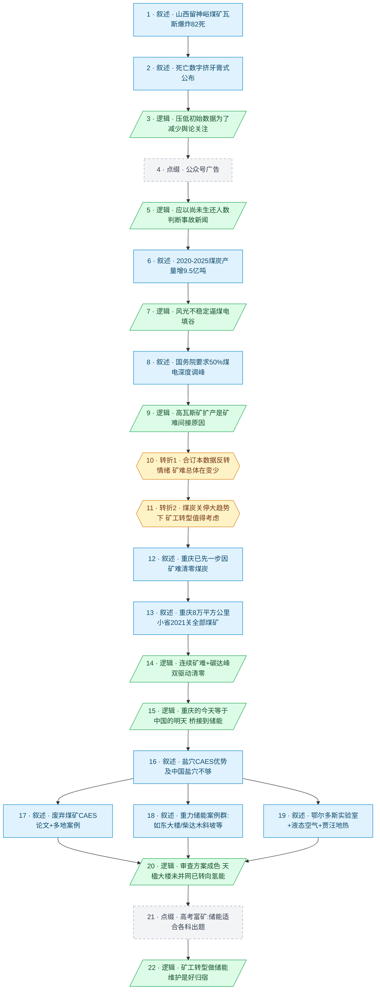

# 马督工方法论内容分析报告：【睡前消息1060】地下储能项目 高考出题人的“富矿”

- 分析时间：2026-05-31
- 发现选题数：1
- 实际分析选题：从山西矿难切入，论证废弃煤矿改储能电站是中国能源转型与矿工就业的可行归宿

---

## 1. 发现选题

| 编号 | 发现选题 | 中心问题 | 一句话梗概 | 独立性判断 | 置信度 |
|---:|---|---|---|---|---:|
| 1 | 矿难→煤矿转型→废弃矿井改储能电站 | 在碳达峰大背景下煤矿迟早要关，那些已经挖好的矿井和几代矿工应该如何转型？ | 山西矿难是切口，真问题是新能源不稳定逼煤电调峰、煤炭短期还要扩产；但碳达峰下煤矿迟早关闭，重庆已先一步清零，废弃矿井可改造为盐穴/重力/液态空气/地热等多形态储能电站，虽然项目大多还在补贴+政绩驱动的验证期，但仍是矿工转型的好归宿。 | 独立选题，有单一中心问题、完整因果链、两次明确转折和具体行动建议。 | 高 |

**结论：** 文章只有 1 个可独立成篇的选题。公众号"睡前消息编辑部"插入段是节目固定结构，不构成独立选题；"新闻道德原则"是个人原则的小附带，不构成独立选题。

---

## 2. 带转折点的压缩总结与逻辑深度

山西留神峪煤矿瓦斯爆炸82死128伤。中国煤炭产量5年净增9.5亿吨，是因为风光不稳定、国务院要求一半煤电深度调峰，逼着山西高瓦斯矿扩产，是这次事故的间接原因。[T1 但是]从全国看，百万吨煤炭死亡率早从20世纪末的5-6人降到2018年起的不到0.1人，这次事故难改总体下降趋势。[T2 但是]在煤炭关停的大趋势下，煤矿工人转型的问题值得考虑。重庆2021年已先一步因连续矿难清零煤炭，是"今天的重庆等于明天的中国"先行案例；答案是把废弃矿井改造为储能电站——盐穴CAES、重力储能、液态空气、地热百花齐放，虽然中国天楹如东大楼至今未并网已转向氢能、整场百花齐放靠的是国家补贴加地方政绩冒险，但让矿工转型做储能设备维护，仍是几代人挖的矿井不被浪费的好归宿。

| 转折点 | 触发位置/内容 | 为什么是不可删除转折 | 作用 |
|---|---|---|---|
| T1 | 第 18 行："从全国来看，我认为矿难问题不算严重。20世纪后期，中国开采100万吨原煤平均死五六个人，到了21世纪下降到不到一个人……现在这次事故也许会稍微提高今年的死亡率，但是很难改变总体的死亡率下降趋势。" | 接在"扩产压力 → 这次事故的间接原因"因果链之后，突然抛出合订本数据反转情绪化反应。删除后文章无从证明"管理体制不是要害"，T2 的反问也就失去前提。 | 反转情绪：从"82 死、扩产真危险、矿难恶化"翻到"长期看矿难一直在变少，这次事故难改下降趋势"。 |
| T2 | 第 18 行："所以就事论事，我并不想说管理体制问题，而是反过来考虑一件事。短期的矿难和长期的新能源发展很有可能会导致一批煤矿关闭。这些工人和矿井有什么转型就业机会。" | 顺着 T1 的合订本结论，把论证方向从"事故归因"掉头到"前瞻性转型方案"。删除后下文重庆案例和所有储能技术都失去问题入口，整篇叙事塌掉。 | 在煤炭关停的大趋势下，把问题方向从"事故归因"翻到"煤矿工人转型值得考虑"。 |

- 转折点数量：2
- 逻辑深度判断：标准模型（三段叙事 + 两次转折），传播性价比较高。

---

## 3. 叙事单元拆解

类型说明：叙述 = 展示事实；逻辑 = 解释因果；点缀 = 增加趣味但可删除；转折 = 打破预期、改变论证方向。

| 编号 | 类型 | 原文位置/线索 | 单句概括 | 主线作用 |
|---:|---|---|---|---|
| 1 | 叙述 | 第 8 行（静静） | 山西长治留神峪煤矿5月22日瓦斯爆炸，82死128伤。 | 起点：调动共同信息场（重大矿难新闻）。 |
| 2 | 叙述 | 第 9 行 | 死亡数字从8人逐步爬到82人，仍有2人失踪未计入；这是事故新闻常态。 | 引出"挤牙膏"公布模式。 |
| 3 | 逻辑 | 第 10 行 | 企业/地方政府压低初始数据是为了减少关注度、降低舆论压力。 | 解释挤牙膏模式的动机。 |
| 4 | 点缀 | 第 11 行 | 公众号"睡前消息编辑部"广告。 | 节目固定植入，可删除。 |
| 5 | 逻辑 | 第 12 行前半 | 应当以"尚未生还人数"判断事故新闻是否上榜，建议灾管部门按此通报。 | 个人原则插语，过渡到主线。 |
| 6 | 叙述 | 第 12 行后半 | 2020→2025 中国煤炭产量从39亿吨升到48.5亿吨，5年净增9.5亿吨，占世界54.6%。 | 核心数据：碳达峰目标下煤炭反而扩产。 |
| 7 | 逻辑 | 第 13–14 行 | 煤炭扩产根源：用电总量上升+风光发电不稳定，需要传统煤电填谷；风光占装机48%但只发电20%。 | 揭示扩产的结构性原因。 |
| 8 | 叙述 | 第 15–16 行 | 国务院碳中和白皮书要求50%以上煤电机组具备深度调峰能力；极限态要调动一半煤电填谷；2025年还进口5亿吨煤。 | 用官方文件锁定调峰逻辑。 |
| 9 | 逻辑 | 第 17 行 | 山西高瓦斯煤矿（留神峪）有扩产压力，是这次事故的间接原因。 | 把宏观结构压力落到具体事故上。 |
| 10 | 转折 | 第 18 行（前段） | **【T1】** 但全国看矿难问题不严重——百万吨煤炭死亡率早从20世纪末的5-6人降到2018年起的不到0.1人，这次事故难改总体下降趋势。 | **反转情绪**：从"82死+扩产真危险"翻到"长期看矿难一直在变少"。 |
| 11 | 转折 | 第 18 行（后段） | **【T2】** 但是在煤炭关停的大趋势下，煤矿工人转型的问题值得考虑。 | **反转问题方向**：从"事故归因"翻到"前瞻性转型方案"。 |
| 12 | 叙述 | 第 19 行 | 重庆是首个因矿难消灭煤矿的省级单位。 | 抛出关键案例，证明"矿真的会关"。 |
| 13 | 叙述 | 第 20–21 行 | 重庆其实是8万平方公里小省、抗战重化工基地、2008年煤炭产量4000多万吨；2021年全部关闭煤矿。 | 用规模数据让读者意识到这不是小事。 |
| 14 | 逻辑 | 第 22 行 | 重庆退出煤炭直接原因：2016/2020/2020 三次重大矿难+碳达峰承诺；地质破碎、高瓦斯。 | 解释清零决策的双驱动力。 |
| 15 | 逻辑 | 第 23 行 | 重庆的今天 = 中国的明天；填平低谷可以不靠煤电，而是直接用储能电站。 | 桥接：把"煤矿关闭"问题转成"用储能替代煤电调峰"。 |
| 16 | 叙述 | 第 24–26 行 | 盐穴CAES储能：100大气压、安全、塑性自愈；但中国盐穴偏少，需要替代品。 | 给出原有最佳方案及其局限，为下文铺路。 |
| 17 | 叙述 | 第 27–30 行 | 论文给出废弃煤矿/含水层/人工挖掘三种替代；甘肃酒泉敦煌660MW、河南信阳300MW、大同云岗、山东曹庄等案例落地。 | 展开"废弃煤矿改CAES"主方案。 |
| 18 | 叙述 | 第 31–36 行 | 重力储能案例群：江苏如东天楹大楼122×110×148m+25吨重力块（85%效率）、张家口赤城地下竖井、淮南潘一矿、辽源滑雪场斜坡轨道、山西霍州、青海德令哈柴达木斜坡。 | 展示矿井高差/斜坡可做重力储能。 |
| 19 | 叙述 | 第 37–41 行 | 鄂尔多斯地下空间储能重点实验室同时搞固液气三种方式；格尔木-194℃液态空气储能；江苏徐州贾汪区废弃煤矿做地热电站。 | 把"百花齐放"推到最大。 |
| 20 | 逻辑 | 第 42 行 | 审查方案成色：这些项目大多还在验证；中国天楹如东大楼未并网、已转向氢能和垃圾焚烧；百花齐放靠的是国家补贴+地方政府冒险出政绩。 | 给"储能转型"方案加上风险提示，但不反转结论。 |
| 21 | 点缀 | 第 43 行 | 老做题家视角：储能方案太适合高考出题——力学、热学、电化学、地理都能套。 | 题图回扣，强化"高考富矿"标题。 |
| 22 | 逻辑 | 第 44–45 行 | 矿工后代视角：新能源替代煤矿是社会进步；让矿工转型做储能设备维护，是几代人挖的矿井不被浪费的好归宿。 | 收束：给出最终行动建议与情感落点。 |

---

## 4. 叙事结构模式

因果→并列→因果，切换 2 次：先用因果链铺出"扩产压力→事故间接原因"，再在第 18 行一段里叠两次转折（T1 合订本数据反转情绪 + T2 反问转型问题），把论证轨道掉头到"煤矿工人转型"；中段并列罗列盐穴/废弃煤矿CAES/重力储能/液态空气/地热等储能方案，最后回到因果（审查方案成色→矿工转型归宿）。两次切换服务于"先讲透问题、再展开方案、再审查方案"的论证节奏，复杂度可控。

---

## 5. 一维叙事结构图

节点形状与颜色对应单元类型：叙述 = 蓝色矩形 `[ ]`，逻辑 = 绿色平行四边形 `[/ /]`，点缀 = 灰色矩形 + 虚线边框，转折 = 琥珀色六边形 `{{ }}`。节点编号与 Section 3 单元一一对应。

---

## 6. 选题为什么成立

### 6.1 选题本质三要素

| 要素 | 文章中的体现 |
|---|---|
| 共同信息场 | （1）矿难是中国基础新闻常识，矿工子女家庭普遍；（2）碳达峰/碳中和是国民级政策共识；（3）距离高考还有一周，做题家身份是九年义务教育底色；（4）重庆三峡移民/直辖市历史是国民地理常识。 |
| 最新变化 | 5月22日山西留神峪82死矿难；4月2日内蒙古地下空间储能重点实验室在鄂尔多斯启动；本周5月25日中国天楹2025业绩公告承认如东大楼未并网、重点转向氢能；2025年中国煤炭产量首次到48.5亿吨。 |
| 行动建议 | 把废弃煤矿改造成储能电站（盐穴CAES/重力储能/液态空气/地热）；让矿工转型做储能设备维护；备考考生可关注储能新闻预先做心理准备。 |

### 6.2 八个选题方向匹配

| 方向 | 匹配度 | 证据 | 说明 |
|---|---|---|---|
| 数据分析与合订本 | ★★★（主） | T1 把"百万吨煤炭死亡率从20世纪末5-6人→2018年起<0.1人"的历史曲线压在"这次82死"的情绪上做反转；煤炭产量5年净增9.5亿吨、风光装机48%/发电20%、50%煤电要深度调峰等多组对照数据穿透"碳达峰=煤炭下降"的惯性印象。 | T1 的核心机制就是合订本——用历年统计反转单次事件引发的情绪化判断，是文章最锋利的认知增量。 |
| 教科书加 | ★★★（主） | 标题直接打出"高考出题人的'富矿'"；末尾整段把固/液重力储能对应牛顿力学，CAES对应等温/等压/绝热变化，液态空气+地热对应化学和地理；并精准卡在"距高考一周"的时间窗口。 | 不重复课本内容，但把课本知识点投射到当代储能工程，激活老做题家共鸣，构成全篇的题图回扣。 |
| 审查完美故事 | ★★（次） | 第 42 段揭出"百花齐放"背后是国家补贴+地方政绩冒险；中国天楹如东大楼未并网、已转向氢能/垃圾焚烧；其他重力项目"基本不提了"。 | 不是结构性转折，但作为方案的成色审查，提高了文章可信度。 |
| 关注普通人生活 | ★★（次） | 从矿工死伤切入；末段以矿工后代视角作结，回忆"楼下老矿工说死个人最大福利是儿子接班"、外科医生父亲、童年下井体验。 | 把议题从国家政策追到几代矿工家庭的命运，落到具体人身上。 |
| 挖掘历史感 | ★★（次） | 重庆 1949 后兵工基地→2008 产煤4000多万吨→2021 关闭全部煤矿；旧版人民币5元背面是辽宁阜新露天煤矿，未来可改抽蓄；北京最后一个煤矿2020年才关。 | 从历史脉络反推现代能源转型，把"煤矿正在退出"放进长时段对照。 |
| 帮群体算账 | ★（弱） | 给矿工算"风险工资 vs 设备维护转型"的账；隐含给地方政府算"补贴+政绩冒险"的账。 | 算账逻辑存在但非主线。 |
| 调动观众参与感 | ★（弱） | 临近高考调动备考群体；提醒矿工/煤炭城市观众联想自身。 | 触发但未展开互动。 |
| 关注群体内部矛盾 | — | 文章不强调矿工内部矛盾或地区内部冲突。 | 不匹配。 |

**主匹配方向：** 数据分析与合订本 + 教科书加（双核）

**次匹配方向：** 审查完美故事 / 关注普通人生活 / 挖掘历史感

### 6.3 否定选题校验

| 校验项 | 结果 | 理由 |
|---|---|---|
| 自己是否愿意分享 | 通过 | 矿难+能源转型+高考是三重高传播力的共同信息场，三类观众（关心矿难、关心能源、关心高考）都会主动分享。 |
| 是否绕开完美故事 | 通过 | 第 42 段主动审查了储能项目的完美面，揭出技术验证状态、补贴政绩驱动和中国天楹撤场案例，没有把储能讲成救世方案。 |
| 是否避免纯反驳 | 通过 | 文章不是反驳矿难追责或反驳储能宣传；而是建设性给出"废弃矿井→储能电站→矿工转型维护"的正向路径，反驳只作为审查的工具。 |
| 转折点数量是否合适 | 通过 | 2 个转折，正好符合标准模型；T1 用合订本数据反转情绪、T2 把问题从追责转向转型路径，两次转折叠在第 18 行一段里，结构紧凑。 |

---

## 7. AI 总评（供参考）

这是一期典型的"标准模型 + 双主匹配"选题：从山西 82 死矿难+碳达峰下煤炭反而扩产的因果铺垫切入，把读者情绪推到"扩产真危险、应该批管理体制"的预期上，然后在第 18 行一段里连出两记转折——T1 用"百万吨煤炭死亡率早降到 0.1 以下"的合订本数据把情绪反转回来，T2 顺势把问题方向从"事故归因"翻到"煤炭关停大趋势下，煤矿工人转型值得考虑"。T2 之后用重庆 2021 清零的真实案例作"今天的重庆=明天的中国"的桥接证据，让"矿迟早会关"这一前提不再悬空；接着把"半棵树"展开为盐穴/废弃煤矿 CAES/重力/液态空气/地热多种储能方案；最后用天楹大楼未并网作风险提示、用矿工后代视角收束到"几代人挖的矿井不被浪费"。题图"高考出题人的富矿"是节目趣味落点，也让储能这一稍冷门的话题搭上了备考季的注意力顺风车。整体逻辑深度刚好两次转折，复杂度可控，传播性价比高。

### 可复用的创作公式

**重大事故新闻 + 用结构性因果链铺出"看似越来越糟"的预期 → T1 用合订本数据反转情绪 → T2 顺势把问题方向从"归因/追责"翻到"前瞻性转型" → 真实先行者案例（"今天的 A 就是明天的 B"）→ 并列展示多种方案 → 审查方案成色 → 群体转型归宿 + 题图回扣。** 三个关键设计值得复用：
1. **两次转折叠在同一段里**：T1 反情绪 + T2 反问题方向都安排在第 18 行那一段，节奏紧凑，读者一句话就能转述"虽然 82 死惨，但其实死亡率早降了；既然如此，真问题是矿工怎么转型"。
2. **用合订本数据做情绪解药**：先用百万吨死亡率历史曲线把"批管理体制"这条最容易走的批评路线封死，逼自己提出更结构性的问题。
3. **T2 把"煤矿迟早要关"作为前提硬抛出来**：不论证、不讨论 IF，直接当成既定大趋势作为反问的基底（"在煤炭关停的大趋势下……"），让后续的转型讨论获得清晰入口。

### 可改进处

- 第 5 段（新闻道德原则）与第 6 段（煤炭产量数据）之间过渡略硬，"回头说煤矿矿难问题"靠一句字面回拉完成；如果能用一句"为什么我今天不想多谈伤亡数字"作为桥接，会更顺滑。
- 中段并列的储能案例（CAES / 重力 / 液态空气 / 地热）共有 4 大类、20+ 个地名/项目，对非工程背景观众的认知负担偏重；可以挑 2–3 个具有代表性的项目深讲（例如如东天楹大楼 + 鄂尔多斯实验室 + 贾汪地热），其余只一笔带过。
- 第 42 段的方案审查只点了一个"中国天楹"作为反例，证据密度略低；如能补 1–2 个其他百花齐放但已经暗淡的项目（哪怕只列名字），审查段的杀伤力会更稳。
