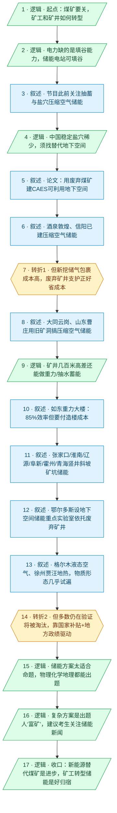

# 【睡前消息1060】地下储能项目 高考出题人的“富矿”

- 分析时间：2026-05-31
- 发现选题数：2
- 实际分析选题：废弃煤矿／矿井转型为地下储能设施（含“高考出题”收尾段，按标题指定的主线分析）

---

## 1. 发现选题

| 编号 | 发现选题 | 中心问题 | 一句话梗概 | 独立性判断 | 置信度 |
|---:|---|---|---|---|---:|
| 1 | 事故伤亡数字被逐步上调（新闻伦理／舆论管理）| 重大事故的死亡人数为什么总是分批往上加？| 分批小幅上调不是单纯的技术确认，而是“温水煮青蛙”式的舆论管理策略，应改以“尚未生还人数”为披露口径 | 独立。有自己的中心问题、事实（8→90→82+2 失踪）、反直觉结论和价值指向，单拎出来能成一篇短评。本报告**不分析** | 高 |
| 2 | 废弃煤矿／矿井转型为地下储能设施（**本报告分析对象**）| 矿井储能经济账不划算，为什么还大量立项？| 技术可行、单看运行经济账亏，但废弃矿井是地方政府／产业的历史包袱，借储能项目把“治理支出”盘活成“投资项目”；这一产业还被搬进高考题做价值观传递 | 独立。完整因果链 + 两次转折 + 行动建议（把账算明白、警惕烂尾），即标题指定的主线 | 高 |

**结论：** 本期含 2 个可独立成篇的选题。编号 1（开头事故伤亡数字引子，line 8–12）相对独立，但本报告依标题「地下储能项目 高考出题人的“富矿”」指定，**只分析编号 2**（矿井储能主线），编号 1 不展开。开头引子在 Step 3 拆解中不计入主线叙事单元。高考出题段（line 45–46）不单列为第 3 个选题——它没有独立的因果链，仅以“压缩空气储能”为锚点，作为主线储能选题的价值观收尾与标题副标题来源，故并入编号 2 一起分析。重庆退煤、马前卒读懂民国充电视频（line 19–26）是与主线弱相关的过渡／广告段，不构成可独立成篇的分析选题。

---

## 2. 带转折点的压缩总结与逻辑深度

国内多个废弃矿井立项改造为地下储能设施。背景是电力系统急需储能，而最成熟的抽水蓄能受地形和水源限制、好地方不多，废弃矿井的地下空间看似正好用来做矿井抽蓄、压缩空气储能、重力储能。这件事看起来一举多得。[T1 但是]没有盐穴那种良好地质条件的废弃矿井并不能直接用，要在洞穴周围做紧密包裹、加固密封，成本很高，而且大量项目还在验证、彼此之间会有残酷淘汰（如天楹的如东重力大楼至今未并网）。既然不一定划算，为什么各地还抢着上马？因为废弃矿井是地方政府塌陷治理、矿工安置、产业转型的沉重历史包袱。[T2 但是]依靠大比例国家补贴和地方政府出政绩的冒险心态，每条技术路线都能拿到风险投资、开工试运行——动力其实是把“历史包袱”和“补贴政绩”盘活成“投资项目”，而非单纯算储能赚不赚钱。结论：用新能源替代煤矿、让矿井和矿工转型储能是全社会的进步，但要清醒看待“百花齐放”背后的淘汰风险，把账算明白、别为储能而储能；而这一产业被搬进高考题，说明国家既看重它，也借它向下一代传递价值观与爱国主义教育。

| 转折点 | 触发位置/内容 | 为什么是不可删除转折 | 作用 |
|---|---|---|---|
| T1 但是 | line 33「地下储存上百个大气压的气体如果没有盐穴那种良好的地质条件，就要在洞穴周围做紧密的包裹，避免漏气，成本很高」；line 45「这些项目大多数现在还在验证……肯定会有残酷的淘汰过程」（天楹如东大楼未并网） | 推翻“废弃矿井地下空间正好拿来储能、一举多得”的表层美好预期，引入“成本高 + 大面积验证淘汰”的现实约束；删掉它，后文“为何还抢着上马”这一核心追问就失去前提，整条主线塌掉 | 把“看似完美的转型机会”拉回成本与风险，制造审查空间（表层判断被推翻） |
| T2 但是 | line 45「依靠大比例的国家补贴，也利用地方政府出政绩的冒险心态，每一条技术路线都能拿到风险投资都要开工试一下运行数据」 | 把“为什么不划算还上马”的动机，从“储能本身赚钱”重新定位到“国家补贴 + 地方政绩 + 盘活废弃矿井包袱”；这是全篇的认知增量所在，删掉就只剩“矿井储能技术可行”的科普，主旨消失 | 责任主体与真实动机被重新定位，问题从个案变结构（责任主体被重新定位） |

- 转折点数量：2
- 逻辑深度判断：2 个转折，标准模型，传播性价比较高

> 取舍说明：本期主体（line 27–44）是“废弃矿井可做哪几种储能”的大段并列案例罗列（盐穴替代→压缩空气→重力／竖井／斜坡→热能／冷能），叙述密度极高但并不构成主线转折，归为叙述单元；真正“删掉主线就塌”的不可删除转折只有 T1（成本／淘汰反转“完美机会”）与 T2（动机反转为补贴政绩），故逻辑深度计为 2，不为凑标准模型而增删合并。

---

## 3. 叙事单元拆解

类型说明：叙述 = 展示事实；逻辑 = 解释因果；点缀 = 增加趣味但可删除；转折 = 打破预期、改变论证方向。

仅对编号 2（矿井储能主线 + 高考收尾）拆解。开头事故引子（line 8–12）、重庆退煤与读懂民国充电视频（line 19–26）不计入主线。

| 编号 | 类型 | 原文位置/线索 | 单句概括 | 主线作用 |
|---:|---|---|---|---|
| 1 | 逻辑 | line 18「短期的矿难和长期的新能源发展很有可能会导致一批煤矿关闭。这些工人和矿井有什么转型就业机会」 | 由矿难和新能源趋势引出“煤矿要关、矿工和矿井怎么转型”的核心问题 | 起点：把话题从事故引子拐进“矿井转型”主线 |
| 2 | 逻辑 | line 23「填平低谷的发电机……也可以是储能电站的发电机」 | 电力系统缺的是填平新能源低谷的能力，而填谷可以靠储能电站 | 解释储能这个真实刚需，给矿井找用途 |
| 3 | 叙述 | line 27「睡前消息节目一直在关注……盐穴储能项目，也就是压缩空气储能CAES电站」 | 节目此前关注抽水蓄能与盐穴压缩空气储能（CAES） | 交代系列背景，引出“为何要找盐穴替代品” |
| 4 | 逻辑 | line 28–29「中国盐穴并不多……做不到全面推广盐穴储能，就需要找替代品」 | 盐穴储能安全又防漏，但中国稳定盐穴稀少，须找替代地下空间 | 制造缺口：盐穴不够用，呼唤替代方案 |
| 5 | 叙述 | line 30–31 论文引文 | 引论文：我国盐穴条件差、煤矿数量多、大量矿井停产，用废弃煤矿建 CAES 可利用地下空间还能防巷道失稳 | 给出“矿井补位”的权威背书，把预期推高 |
| 6 | 叙述 | line 32–33 甘肃酒泉敦煌、河南信阳 | 酒泉敦煌建 660 兆瓦、信阳建 300 兆瓦压缩空气储能，新挖地下空间储高压空气填低谷 | 摆出压缩空气储能已落地的事实案例 |
| 7 | 转折 | line 33「没有盐穴那种良好的地质条件，就要在洞穴周围做紧密的包裹，避免漏气，成本很高。这个时候废弃矿井原来的支护和衬砌，就有可能发挥作用」 | 但普通地下空间储气包裹成本很高——废弃矿井原有支护衬砌恰好能省下挖洞和包裹成本 | T1：推翻“随便挖个洞就能储能”的预期，把废弃矿井定位成“省成本”的转型机会 |
| 8 | 叙述 | line 33「大同云岗煤矿、山东曹庄煤矿都在利用原有的矿洞搞地下压缩空气储能」 | 大同云岗、山东曹庄已用旧矿洞做压缩空气储能 | 用案例坐实“矿井转型机会”这一面 |
| 9 | 逻辑 | line 33「矿井深入地下几百米……还意外的提供了另外一种储能选项就是高差」 | 矿井几百米深差除了储气，还提供“高差”，可做重力／抽水蓄能 | 从“储气”扩展到“重力”，打开并列案例闸门 |
| 10 | 叙述 | line 35–37 如东重力大楼 | 如东建 122×110×148 米重力储能大楼，12672 块 25 吨重力块上下，效率 85% 超抽蓄但要付造楼成本 | 重力储能案例之一：平地造楼路线 |
| 11 | 叙述 | line 37–39 张家口竖井、淮南潘一矿、辽源斜坡、阜新矿坑、霍州滑梯、青海德令哈 | 多地用竖井／斜坡／矿坑做重力或抽水蓄能：张家口、淮南、辽源、阜新、霍州、青海 | 并列堆叠“矿井／矿坑可储能”的密集案例 |
| 12 | 叙述 | line 40–41 鄂尔多斯科技局文件 | 鄂尔多斯设地下空间储能重点实验室，依托废弃矿井攻关重力／压缩空气／抽水蓄能三方向 | 用政府文件证明这是被官方推动的产业方向 |
| 13 | 叙述 | line 42–44 格尔木液态空气储能、徐州贾汪地热 | 格尔木做液态空气（冷能）储能、徐州贾汪把废矿变地热供暖，物质形态几乎试遍 | 把储能形态拓到冷／热，铺满“百花齐放”图景 |
| 14 | 转折 | line 45「这些项目大多数现在还在验证……肯定会有残酷的淘汰过程」「依靠大比例的国家补贴，也利用地方政府出政绩的冒险心态，每一条技术路线都能拿到风险投资都要开工试一下」 | 但多数项目仍在验证、会被残酷淘汰（如东大楼未并网）；真正推动“百花齐放”的是国家补贴 + 地方政绩冒险心态 | T2：把“矿井储能很美好”反转为“补贴政绩驱动的试错”，重新定位真实动机 |
| 15 | 逻辑 | line 45–46「作为一个经历过高考……第一反应是太适合用来出题了」 | 储能方案太适合命题：牛顿力学、等温／等压／绝热、化学电化学、地理都能出题 | 命题技术层面的解释，把储能接到高考热点 |
| 16 | 逻辑 | line 46「还有几种材质组合的复杂储能方案，明显是降低了出题人的脑力劳动……考生可以看看储能的相关新闻」 | 复杂储能方案是出题人的“富矿”，建议考生提前关注储能新闻 | 调动参与感，呼应标题“富矿”，给考生行动建议 |
| 17 | 逻辑 | line 47–48「如果能够用新能源去替代煤矿……我认为是全社会的进步」「如果能让他们转型到储能产业，做设备维护，算是一个不错的归宿」 | 价值判断收口：用新能源替代煤矿减少地下挖煤是社会进步，让矿工转型储能维护是好归宿 | 终点：把储能账与矿工命运两条线并拢，给出价值判断与行动方向 |

---

## 4. 叙事结构模式

因果→并列→因果，切换 2 次，结构略复杂：先以因果链交代“煤矿要关→电力缺填谷能力→储能补位→盐穴不够要找替代品→废弃矿井省成本”（单元 1–9）；中段切入一大段并列，把压缩空气、重力、竖井、斜坡、矿坑、液态空气、地热等各地案例平行堆叠（单元 10–13）；再回到因果，由“项目会被淘汰、靠补贴政绩驱动”收束（T2），转入高考出题与矿工转型的价值判断（单元 14–17）。切换次数（2 次）超过方法论建议的“不超过 1 次”，复杂度偏上，但靠“废弃矿井转型储能”这一统一锚点和密集的同类案例把并列段收住。

---

## 5. 一维叙事结构图

节点形状与颜色对应单元类型：叙述 = 蓝色矩形 `[ ]`，逻辑 = 绿色平行四边形 `[/ /]`，点缀 = 灰色矩形 + 虚线边框，转折 = 琥珀色六边形 `{{ }}`。节点编号与 Section 3 单元一一对应。

---

## 6. 选题为什么成立

### 6.1 选题本质三要素

| 要素 | 文章中的体现 |
|---|---|
| 共同信息场 | 煤矿矿难、新能源／风光发电、地方政府债务与产业转型，都是观众一搜就懂、近年反复出现的公共背景；高考更是全民共同记忆；中学物理（势能、等温／等压／绝热变化）是九年义务教育留下的共同知识底色 |
| 最新变化 | 国内多个废弃矿井改造地下储能项目近期陆续立项（鄂尔多斯 4 月 2 日设重点实验室、如东大楼 5 月 25 日仍未并网），且压缩空气储能正好被写进当年高考理综题，距高考还有一周——是“为什么现在讲”的抓手 |
| 行动建议 | 用新能源替代煤矿、让矿井和矿工转型储能维护是社会进步；但要清醒看待“百花齐放”背后的残酷淘汰，把账算明白、别为储能而储能；考生可提前关注储能新闻准备应考 |

### 6.2 八个选题方向匹配

| 方向 | 匹配度 | 证据 | 说明 |
|---|---|---|---|
| 教科书加 | 高（主） | 用中学物理的势能、等温／等压／绝热变化、抽水蓄能等课本概念，把一连串前沿储能项目讲清楚，并直接指向高考命题 | 以九年义务教育的物理常识为台阶，叠加现实前沿案例，既不重复课本又不脱离课本认知基础，是典型“教科书加” |
| 审查完美故事 | 高（次） | T1 戳破“废弃矿井正好拿来储能、一举多得”的完美机会（包裹成本高）；T2 揭出“百花齐放”背后是补贴政绩冒险、多数项目将被淘汰、天楹如东大楼未并网 | 盯住完美转型故事没展示的侧面：成本由谁出、谁在为政绩买单、淘汰风险有多大 |
| 调动观众参与感 | 中 | “你听说过用废弃的煤矿来储存能量吗？”式提问，以及“距高考还有一周，考生可以看看储能新闻”的行动钩子 | 把遥远的能源工程引回观众身边（高考、童年矿区记忆），邀请观众用自身经验参与 |
| 帮群体算账 | 中 | 把“矿井储能很美好”算成成本账（包裹成本、造楼成本、补贴与淘汰风险），衡量转型的好处与代价 | 有算账动作，但落点更偏向科普与价值判断，未做到逐项折算，故列为辅助维度 |
| 挖掘历史感 | 中 | 上百年开采留下的废弃矿井、旧版 5 元纸币背面的阜新露天煤矿、矿工后代的童年记忆 | 正向挖掘：从硬新闻（储能工程）连接长时段开采史，再落到当代矿区生活记忆 |
| 关注普通人生活 | 中 | 矿工死伤、接班、赔偿不如一头猪、矿区小镇外科医生等贴近基层的细节 | 把宏观能源转型落到矿工个人命运，但集中在结尾，非全篇主入口 |
| 数据分析与合订本 | 低 | 引用 1053、1002 等往期，纵向延续储能系列 | 有系列合订意味，但本期未做历年数据对比，匹配度低 |
| 关注群体内部矛盾 | 低 | 未着力刻画群体内部对抗 | 基本不匹配 |

**主匹配方向：** 教科书加

**次匹配方向：** 审查完美故事（调动观众参与感、挖掘历史感、帮群体算账为辅助维度）

### 6.3 否定选题校验

| 校验项 | 结果 | 理由 |
|---|---|---|
| 自己是否愿意分享 | 通过 | “废煤矿变储能电站＋这就是今年高考题”兼具科普谈资和反常识（百花齐放其实是补贴政绩试错），私下场合也愿意复述 |
| 是否绕开完美故事 | 通过 | 不仅没编完美故事，反而主动审查“废弃矿井正好转型储能”这个完美样板，挖出成本与淘汰风险 |
| 是否避免纯反驳 | 通过 | 没有停在“矿井储能不划算”的否定，而是给出“新能源替代煤矿是进步、让矿工转型储能、把账算明白别留烂尾”的建设性判断 |
| 转折点数量是否合适 | 基本通过，略有张力 | 2 个转折=标准模型，传播性价比高；但中段并列案例极密、叠加“因果→并列→因果”2 次结构切换，复杂度偏上，靠统一锚点压住 |

---

## 7. 总评

这是一期“强科普 + 审查完美故事”的产业转型选题，主入口是“教科书加”。它从全民熟悉的矿难新闻和中学物理常识切入，把一连串前沿储能项目（压缩空气、重力、竖井、斜坡、矿坑、液态空气、地热）讲成普通观众能听懂、还能跟高考挂钩的话题。两次不可删除转折提供了认知增量——先用“没有盐穴条件就要高成本包裹、废弃矿井支护正好省成本”戳破“随便挖洞就能储能”的预期（T1），再用“多数项目仍在验证将被残酷淘汰、靠国家补贴和地方政绩冒险驱动”把真实动机从“储能赚钱”重新定位（T2）——最终落到“新能源替代煤矿是社会进步、让矿工转型储能是好归宿”的价值判断。逻辑深度达到标准模型（2 转），传播性价比高；唯一张力在于中段案例密度极高、结构两次切换，全靠“废弃矿井转型储能”这一锚点和同类案例的排比把复杂度收住。

### 可复用的创作公式

矿难／能源硬新闻 → 提出“煤矿要关，矿井和矿工怎么转型”的问题 → 用中学物理常识科普储能原理 → 摆出“废弃矿井正好补位”的完美机会 → [T1] 审查机会、揭出隐藏成本（包裹／造楼成本、地质条件） → [T2] 把“百花齐放”的真实动机重新定位为补贴 + 政绩 + 淘汰试错 → 落到价值判断（替代煤矿是进步、矿工有好归宿）并接到高考热点调动参与感。一句话：**硬新闻 + 教科书科普 + 完美机会审查 + 动机重定位 + 价值收口**。

### 可改进处

1. 开头事故伤亡数字引子（编号 1）与主线只有“煤矿”这一弱联系，作为独立短评更合适，留在片头会稀释“矿井储能”主线的注意力；中间的重庆退煤、读懂民国充电视频两段也拉长了进入主线的路径。
2. 中段并列案例（单元 10–13）密度过高，按方法论可“主线插叙带过并列要素”或精简到 2–3 个代表案例，让 T1、T2 两次转折更突出。
3. 高考收尾段是漂亮的参与感与价值观钩子，但与“多数项目将被残酷淘汰”的清醒判断略有调性落差，可明确点出“被写进高考”不等于“经济账已算赢”，避免读者把价值观背书误读成产业已成功。
