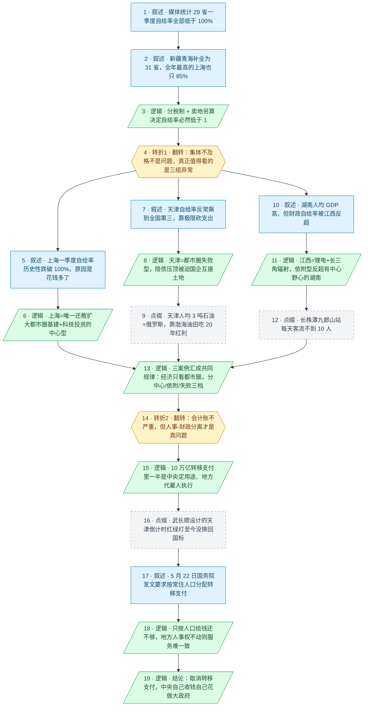

# 马督工方法论内容分析报告：【睡前消息1061】31省吃中央补贴 谁是优等生？

- 分析时间：2026-06-02
- 发现选题数：1
- 实际分析选题：31省一季度财政自给率全部低于 100%，背后是分税制下的人事-财政分离，出路是中央把基本服务收回直管

---

## 1. 发现选题

| 编号 | 发现选题 | 中心问题 | 一句话梗概 | 独立性判断 | 置信度 |
|---:|---|---|---|---|---:|
| 1 | 31 省吃中央补贴 谁是优等生？ | 一季度所有省级单位财政自给率都低于 100%，到底是异常还是制度结果，又该怎么修？ | 一季度 29 省财政自给率全部不及格不是新问题，而是分税制写好的常态；上海/天津/湖南江西三组异常背后是都市圈成败；真正要修的是"中央出钱、地方花钱"造成的服务不均，出路是中央自己收钱自己花。 | 独立成立：单一中心问题、单一因果链、单一行动建议（中央直管基本服务），从一季度财政数据一路推到中央与地方的财权事权重划，可单独成篇。 | high |

**结论：** 整篇头条围绕"财政自给率—中央转移支付—中央与地方权责划分"一条因果链推进，只有 1 个独立选题。用户已明确指定该选题，直接进入 Step 3。

---

## 2. 带转折点的压缩总结与逻辑深度

媒体盘点 2026 一季度 29 省财政自给率全部低于 100%，看似集体不及格。[T1 但是]这本来就是分税制的设计结果，地方收支必然不平衡；真正值得看的是上海、天津、湖南/江西三组异常，背后是都市圈中心、依附型、失败型的分化，结论是中国经济越来越只看大都市圈。[T2 然而]如果跳出会计账，10 万亿转移支付里一半是中央定用途、地方雇人干活，人事权和财政权分离让基本公共服务永远不均；与其继续转移支付，不如让中央自己收钱自己花，把义务教育等基本服务收为直属机构，做名副其实的大政府。

| 转折点 | 触发位置/内容 | 为什么是不可删除转折 | 作用 |
|---|---|---|---|
| T1 | 第 15–17 段：把"29 省都不及格"翻转为"这是中央设计好的常态，不奇怪"，并把视线引向上海/天津/湖南江西三组真正异常 | 表层判断被推翻：从"集体不及格=问题"反转为"集体不及格=制度结果"，重新框定问题，决定了后半段讨论的是都市圈而不是省级勤俭程度 | 把媒体设定的吐槽议题接住又拆掉，腾出空间引入都市圈分析 |
| T2 | 第 39–52 段：从"都市圈决定财政"的结构性归因，反转为"既然转移支付已常态化，制度本身才是问题"，并给出"中央直接收钱直接花、做大政府"的反向方案 | 问题方向反转：从批判地方 / 批判都市圈失败，转向建设性方案——重划财权事权、中央接管基本服务，提出与"加大转移支付"完全相反的解药 | 把节目从数据复盘抬升为制度建议，给出马督工独有的行动指向 |

- 转折点数量：2
- 逻辑深度判断：2 个转折，标准模型，传播性价比较高

---

## 3. 叙事单元拆解

类型说明：叙述 = 展示事实；逻辑 = 解释因果；点缀 = 增加趣味但可删除；转折 = 打破预期、改变论证方向。

| 编号 | 类型 | 原文位置/线索 | 单句概括 | 主线作用 |
|---:|---|---|---|---|
| 1 | 叙述 | 第 10 段（静静起话题） | 媒体统计 29 省一季度财政自给率全部低于 100% | 起点：共同信息场 + 媒体表层结论 |
| 2 | 叙述 | 第 11–12 段（新疆青海补全 + 全年自给率上海 85%） | 剩余两省也不可能翻盘，且 2025 全年最高的上海也只有 85% | 把"29 省"补成"31 省"，并把一季度异常拉回全年常态 |
| 3 | 逻辑 | 第 13–14 段（分税制 + 卖地另算） | 分税制让中央拿走大头，地方主税种少，加上卖地收入不计入，自给率必然低于 1 | 第一层解释：制度性原因 |
| 4 | 转折 | 第 15 段（"没有必要奇怪…如果一定要找异常"） | 翻转媒体口径：集体低于 100% 是常态，真正值得看的是三组异常 | T1：把表层吐槽推翻，引入异常案例分析 |
| 5 | 叙述 | 第 16–18 段（上海 10 年只有 2020 和今年破例 + 今年支出涨 20%） | 上海一季度自给率历史性跌破 100%，原因是花钱多了不是收钱少了 | 案例 A 事实层 |
| 6 | 逻辑 | 第 19–21 段（城市更新 + 地铁 + 科技投资 17%） | 上海是唯一还敢大规模都市圈基建和扩大科技投资的省级单位 | 案例 A 归因：上海=都市圈中心成功型 |
| 7 | 叙述 | 第 22 段（天津自给率从 66% 跳到 89%、支出从 840 砍到 718） | 天津一季度自给率反常飙到全国第三，靠砍支出实现 | 案例 B 事实层 |
| 8 | 逻辑 | 第 23 段（隐债口径变化 + 静海/东丽城投困境 + 卖地左手倒右手） | 天津在巨额隐债压力下被迫极限压缩开支、靠国企互接土地撑场面 | 案例 B 归因：天津=都市圈失败型，债务压顶 |
| 9 | 点缀 | 第 26–29 段（天津 4091 万吨石油、人均 3 吨、≈俄罗斯人均；大港+渤海油田税收归属） | 天津靠渤海油田总部设在天津吃了 20 多年人均俄罗斯级别的石油红利 | 点缀：补强"连吃石油红利都救不了天津"的反差感，删掉不影响主线 |
| 10 | 叙述 | 第 30–31 段（湖南人均 GDP 高于江西，但江西自给率 41.46% 反超湖南 36.80%） | 湖南人均 GDP 更高，财政自给率却低于江西 | 案例 C 事实层 |
| 11 | 逻辑 | 第 32 段（锂矿+长三角辐射 vs 珠三角辐射弱、长株潭一体化） | 江西靠拢长三角且锂电产业拉税，质量反超有"中心野心"的湖南 | 案例 C 归因：江西=都市圈依附成功型 |
| 12 | 点缀 | 第 34–35 段（长株潭九郎山站每天客流不到 10 人） | 长株潭城际铁路九郎山站停运，城际客流近乎为零 | 点缀：以一个废弃站点视觉化"都市圈梦碎"，删掉不影响主线 |
| 13 | 逻辑 | 第 33、36–38 段（都市圈三档分类 + 信达落子株洲债务清欠示范区） | 三组异常共同规律：都市圈中心>依附型>失败型，失败者只能等中央化债 | 把三个案例收拢成一条结构性规律：经济只看都市圈 |
| 14 | 转折 | 第 40 段（"从会计角度不严重…但是从管理学角度…"） | 把视角从会计账翻到管理学：常态化转移支付意味着人事权与财政权割裂 | T2：从都市圈结构归因翻转到制度本身问题，方向反转 |
| 15 | 逻辑 | 第 41–45 段（10 万亿转移支付三段结构：专项 1 万亿+共同事权 4 万亿+一般 5–6 万亿） | 10 万亿里超过一半是中央定用途、地方代为雇人执行 | 第二层解释：人事-财政分离的具体账目结构 |
| 16 | 点缀 | 第 46 段（武长顺设计的天津倒计时红绿灯，判死缓十年还没换回国标） | 各地公共服务标准差异极大，连红绿灯都不统一 | 点缀：以红绿灯的生活细节具象化"服务不均"，删掉不影响主线 |
| 17 | 叙述 | 第 47–48 段（5 月 22 日国务院《关于推行常住地提供基本公共服务的实施意见》） | 国务院新文件要求按常住人口分配共同事权转移支付 | 最新政策变化：中央已经动手要改 |
| 18 | 逻辑 | 第 49 段（怀疑北京天津会放弃高考特权 + 地方稳定逻辑） | 仅按常住人口给钱仍不够，地方拿钱必按自己稳定逻辑花，服务一致难落地 | 解释新文件为何不够：人事权不动则财政权改革无效 |
| 19 | 逻辑 | 第 50–52 段（义务教育转为教育部编制 + 中美中央地方收入比对照 + 国民待遇） | 出路是中央自己收钱自己花，把基本服务转为中央直属机构，做名副其实的大政府 | 终点：给出与"加大转移支付"完全相反的行动建议 |

---

## 4. 叙事结构模式

因果→并列→因果，切换 2 次，结构略复杂：先用分税制做归因（因果），再用上海/天津/湖南江西三案例并列补强"都市圈分化"规律（并列），最后跳回制度层做"人事-财政分离 → 中央直管"的因果推导（因果）。三段衔接清晰但素材偏密，传播成本略高于标准模型。

---

## 5. 一维叙事结构图

节点形状与颜色对应单元类型：叙述 = 蓝色矩形 `[ ]`，逻辑 = 绿色平行四边形 `[/ /]`，点缀 = 灰色矩形 + 虚线边框，转折 = 琥珀色六边形 `{{ }}`。节点编号与 Section 3 单元一一对应。

---

## 6. 选题为什么成立

### 6.1 选题本质三要素

| 要素 | 文章中的体现 |
|---|---|
| 共同信息场 | 普通人每年都会感受到的"中央向地方转移支付"、"分税制"、"地方债"、"都市圈"四个常识背景，加上 5 月底媒体集体盘点各省一季度财政数据这件刚发生的新闻热点 |
| 最新变化 | 2026 年一季度 29 省财政自给率全部低于 100%（连过去 10 年只在 2020 年掉过链子的上海也跌破）；天津自给率反常冲到 89%；5 月 22 日国务院刚发了《关于推行常住地提供基本公共服务的实施意见》要求按常住人口算转移支付 |
| 行动建议 | 取消大部分转移支付，把义务教育等基本公共服务收回中央直属编制，让中央"自己收钱自己花"做名副其实的大政府；个人观众层面则获得了一把"看穿地方政府叫穷"的尺子 |

### 6.2 八个选题方向匹配

| 方向 | 匹配度 | 证据 | 说明 |
|---|---|---|---|
| 数据分析与合订本 | 高 | 把 2026 Q1 自给率叠加 2025 全年自给率、2017–2025 上海历年一季度自给率、中美 2025 中央/地方收入对比、10 万亿转移支付三段构成、天津 4091 万吨石油+1364 万人口算人均 | 整篇是典型的"合订本"：把当期数据与历年数据、跨国数据、构成数据交叉比对，把媒体单期表格无法看出的"上海异常+天津伪好转+江西反超湖南"逼出来 |
| 帮群体算账 | 高 | 上海花钱 2408→2897 亿（+20%）、天津 718 vs 上海 2897（4 倍）、天津 200 亿石油税+100 亿炼化、中央 9.4 万亿 vs 地方 12.2 万亿 vs 转移支付 10.4 万亿 | 把"自给率不及格"这种情绪化吐槽换算成具体几位数花钱、谁出钱、谁花钱，帮观众判断"加大转移支付"和"中央直管"哪条路成本更低 |
| 关注群体内部矛盾 | 中高 | 上海/天津/湖南/江西、长三角/珠三角、长株潭未能整合、北京天津的高考特权、地方与中央在人事权上的分歧 | 不把"地方政府"当铁板一块，而是按都市圈中心/依附/失败三档拆开，并指出中央与地方在人事-财政上的真实割裂 |
| 关注普通人生活 | 中 | 把财政自给率落到红绿灯标准、高考特权、义务教育编制、青少年活动中心等观众每天能碰到的服务上 | 用具体公共服务把抽象的转移支付翻译成"你家孩子上学能不能拿到一样的钱" |
| 调动观众参与感 | 中 | 各省一季度数据本就是观众所在地的钱袋子；红绿灯倒计时、九郎山高铁站这些细节让本地观众可以自己印证 | 给观众一个"用本地生活经验对号入座"的入口 |
| 挖掘历史感 | 中低 | 分税制改革溯源、上海历史长导致民生支出节奏不同、2006 年起渤海油田 20 多年红利、长株潭一体化暂停 | 历史脉络只是辅助归因，不是选题主驱动 |
| 教科书加 | 低 | 仅在解释分税制、转移支付时复用了高中政治课的基础概念 | 主要作为门槛对齐，不构成主匹配 |
| 审查完美故事 | 低 | 顺手戳破"天津 89% 自给率"和"5·22 文件按人口分配就能服务均等"两个完美叙事 | 是过桥手段，不是主轴 |

**主匹配方向：** 数据分析与合订本 + 帮群体算账（两条腿走路：先用合订本逼出异常，再用算账把方案换算成花费）

**次匹配方向：** 关注群体内部矛盾、关注普通人生活、调动观众参与感

### 6.3 否定选题校验

| 校验项 | 结果 | 理由 |
|---|---|---|
| 自己是否愿意分享 | 通过 | 一季度财政数据是每年都会被反复讨论的"日历题"，又叠加 5·22 国务院新文件这一刚出炉的政策变化，饭桌上"我们省到底吃了多少中央补贴"是普通人愿意聊的题目 |
| 是否绕开完美故事 | 通过 | 没有去追"哪个省是优等生"的完美叙事，反而把"天津 89% 自给率"和"5·22 文件按人口分配就能服务均等"两个看似圆满的故事拆开，符合"审查完美故事"反向校验 |
| 是否避免纯反驳 | 通过 | 虽然 T1 反驳了媒体"29 省都不及格"的口径，但马上给出了正面建设：拆三组异常、提出都市圈分档规律，并在 T2 后给出"中央直管基本服务"的完整方案，不是只破不立 |
| 转折点数量是否合适 | 通过 | 2 个转折正好是标准模型，T1 把表层口径翻成制度常态，T2 把结构归因翻成制度建议，传播性价比较高；结构上有"因果→并列→因果"两次切换，略高于半棵树最优结构，会增加少量传播成本但仍可控 |

---

## 7. 总评

这是一篇标准的"合订本+算账"型马督工作品，选题落点非常稳：一季度财政数据每年都会被媒体盘点（共同信息场已建好），2026 年又叠加"上海首次破例跌破 100%"和"5·22 国务院新文件"两个刚发生的新变化，让一个老题目获得了当期的新闻钩子。督工没有顺着媒体"评比优等生"的诱饵走，而是用 T1 一刀把"集体不及格=问题"翻成"集体不及格=制度结果"，腾出真正想讲的舞台——三组异常背后的都市圈分化。三案例并列处理得很扎实，每个都按"事实层 → 归因层"分两步走，并各自带一个点缀（天津石油红利、九郎山空站）做记忆锚点。最后用 T2 跳回制度层，把节目从"看数据"抬升到"动财权"，并给出与主流"加大转移支付"完全相反的解药——中央直管基本服务、做大政府。两次转折都属于"删掉就塌"的硬转折，逻辑深度判断为 2，落在标准模型上。

结构上唯一可议之处是"因果→并列→因果"切换 2 次，并列阶段塞了三个案例，对节目时长和观众记忆都有压力；天津那一段又叠加了"债务+石油红利"两条副线，是全篇信息密度最高的部分，存在观众跟不上的风险。

### 可复用的创作公式

> 当媒体集体吐槽某个"集体不及格"数据时 → 先翻转为"这是制度设计的常态"挡掉表层议题 → 再用合订本（历年+跨国+构成）逼出 2–3 组真正的结构异常 → 把异常拢成一句话规律（这里是"经济只看都市圈"）→ 跳回制度层，把规律继续拆出"人事/财政分离"的根因 → 用近期一份政策文件作为"中央已经动手"的证据 → 给出与主流方案相反的解药（这里是"取消转移支付、中央直管"），完成从数据到行动的闭环。

### 可改进处

- 并列阶段三组案例都很饱满，但天津段同时塞了隐债 + 渤海油田两条副线，普通观众在 30 分钟节目中容易丢线索，可以把石油红利切到 0.5 倍长度或独立成片。
- T2 之后引入"5·22 国务院新文件"是非常好的新变化钩子，但放在第二层解释后半段，密度过高；若调到 T2 之前作为"中央已经开始动制度"的引子，再用文件不彻底之处自然推出"中央直管"的反向方案，传播链条会更顺。
- "中央直管基本服务"这一行动建议刚抛出就收尾，缺少一个观众可立即代入的小例子（例如"如果义务教育转为教育部编制，你家孩子的教辅经费会发生什么变化"），让结论从制度判断落回普通人参与感，会进一步降低记忆门槛。
