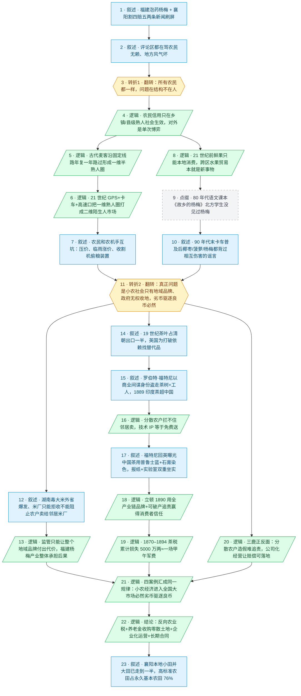

# 马督工方法论内容分析报告：【睡前消息1062】福建泡药杨梅 湖北"割四赔五" 都是一回事

- 分析时间：2026-06-05
- 发现选题数：1
- 实际分析选题：福建泡药杨梅事件 + 湖北襄阳"割四赔五"事件背后是同一件事——小农经济进入全国大市场必然劣币驱逐良币，出路是反向农业税、把零散土地集中给可追责可破产的企业经营

---

## 1. 发现选题

| 编号 | 发现选题 | 中心问题 | 一句话梗概 | 独立性判断 | 置信度 |
|---:|---|---|---|---|---:|
| 1 | 福建泡药杨梅 + 湖北割四赔五 都是一回事 | 为什么两个看似无关的农村新闻（一个是水果造假、一个是收割机欺诈）其实是同一个机制造成的？该怎么修？ | 两件事都不是地方风气问题，而是小农经济只能在熟人社会自我约束；当 21 世纪的交通和通讯把农产品塞进全国大市场，无论是消费者还是农机手都成了陌生人，劣币驱逐良币必然发生；唯一出路是用反向农业税收购零散土地、把农业交给可追责可破产的企业。 | 独立成立：单一中心问题（小农 vs 大市场的信用结构）、单一因果链（熟人社会被打破→陌生人市场→劣币驱逐良币）、单一行动建议（反向农业税+土地集中+企业化运营）。两个新闻案例和茶叶贸易、三鹿奶粉两个历史案例均围绕同一论点展开，从原文拆出可单独成篇。 | high |

**结论：** 标题虽然把两件新闻并列，但全篇用同一条因果链把"杨梅+收割机+茶叶+三鹿"四个案例串成同一个论点——这是马督工典型的"合并头条"打法，只有 1 个独立选题。用户已明确指定该选题，直接进入 Step 3。

---

## 2. 带转折点的压缩总结与逻辑深度

5 月下旬福建泡药杨梅、襄阳割四赔五两条新闻刷屏，评论区都在骂农民无赖、地方风气坏。[T1 但是]历来各地农民都一样，问题是熟人社会的信用体系撑不起现代陌生人之间的单次交易。两组平行案例证明：古代麦客定期路线才有熟人信用，现代收割机二维市场超出熟人圈；鲜果过去只能本地卖给熟人，卡车普及后送进千里外陌生人嘴里。[T2 然而]正常市场里品牌替质量担保，可是小农社会只有地域品牌，政府又无法阻止农户生产，劣币驱逐良币不可逆。福特尼（Fortune）的两个案例都印证这一点：一是盗走清朝茶种和工艺，分散农户根本守不住知识产权；二是把清朝茶叶染色丑闻带回英国，整个地域品牌一同塌方。立顿用全产业链品牌取代中国茶户、三鹿奶粉里只有公司能追责，是同一规律的延续。唯一出路是反向农业税收购零散土地、把农业交给可追责可破产的企业，襄阳本地"小田并大田"已经走到一半，证明可行。

| 转折点 | 触发位置/内容 | 为什么是不可删除转折 | 作用 |
|---|---|---|---|
| T1 | 第 10 段："评论区都在骂农民无赖…但是从我的见闻来看，从历史记录看，所有地方的农民都一样，自古以来就是这个样子" | 责任主体被重新定位：从"福建/襄阳农民道德败坏"翻转为"所有地方农民都一样，问题在结构不在人"；同时把问题从个案变成结构，决定了后半段讲的是熟人社会与大市场的张力，而不是地方治理 | 把评论区的道德议题接住又拆掉，腾出空间引入熟人社会-陌生人社会的结构归因 |
| T2 | 第 20 段："在一个正常的市场，产品如果长期有质量问题，企业和品牌要付出代价。但是在一个小农户为主的社会，只有地域品牌，没有企业品牌" | 问题从"熟人社会被技术打破"再翻一层，落到"没有企业品牌+地方政府无法收缴土地"的小农结构本身——表层判断（找回熟人社会就好）被推翻，问题方向也从批判反转为建设：必须用企业化运营才能让市场约束有效 | 把节目从结构归因抬升为制度建议，给出与"加强监管"相反的反向方案——让农民退出市场 |

- 转折点数量：2
- 逻辑深度判断：2 个转折，标准模型，传播性价比较高

---

## 3. 叙事单元拆解

类型说明：叙述 = 展示事实；逻辑 = 解释因果；点缀 = 增加趣味但可删除；转折 = 打破预期、改变论证方向。

| 编号 | 类型 | 原文位置/线索 | 单句概括 | 主线作用 |
|---:|---|---|---|---|
| 1 | 叙述 | 第 9 段（静静起话题） | 福建杨梅暗访曝光防腐剂+甜味剂浸泡，价格从 20 块跌到几毛，襄阳麦收同期出现"割四赔五"农户压面积赔偿，农机手集体绕路 | 起点：共同信息场——两条 5 月底刷屏的农业新闻 |
| 2 | 叙述 | 第 10 段前半 | 两个新闻评论区都在骂农民无赖、骂地方风气 | 引入待拆的表层口径：道德批判 |
| 3 | 转折 | 第 10 段后半（"但是…所有地方的农民都一样，自古以来就是这个样子"） | 翻转：不是福建/襄阳坏，而是所有农民都一样，问题在结构 | T1：把道德议题翻成结构议题 |
| 4 | 逻辑 | 第 10–11 段（口音报价 + 一次性交易） | 农民的信用只在熟人社会（乡镇/县）生效，对外地人默认单次博弈，能赖就赖 | 第一层解释：熟人社会的信用边界 |
| 5 | 逻辑 | 第 12–13 段（古代麦客沿固定线路、年复一年路过两次） | 古代麦客被道路稀少压缩到一维线性路线，年复一年路过同一片产区形成长期信用评价 | 收割机线——历史对照：一维线性的半熟人社会如何自我约束 |
| 6 | 逻辑 | 第 14–15 段（GPS+卡车+高速口+网上联系） | 21 世纪交通通讯把麦客和农民的熟人圈从一维升级到二维，相互不信任成为必然 | 收割机线——现代断裂：技术升级把一维半熟人圈打散成二维陌生人市场 |
| 7 | 叙述 | 第 16 段（坐地起价、盗窃装置） | 农民和农机手互坑——压价道德绑架、临雨涨价、收割机加装偷粮装置 | 把"割四赔五"放回更大的相互伤害样本 |
| 8 | 逻辑 | 第 17 段（水果消费在本地、杨贵妃荔枝是奢侈） | 21 世纪前鲜果只能本地消费，水果跨区贸易是新事物 | 水果线——历史对照：与麦客同构，鲜果过去只能本地消费，买卖双方天然是熟人 |
| 9 | 点缀 | 第 18 段（王鲁彦《故乡的杨梅》+北方老师讲不出倒牙） | 80 年代语文课本里北方学生没见过杨梅，老师都讲不清"倒牙" | 点缀：用一代人共同的课本记忆具象化"杨梅长期不流通"，删掉不影响主线 |
| 10 | 叙述 | 第 19 段（椰枣传肝炎、菠萝传蛇毒、杨梅花青素染色谣言） | 90 年代末卡车普及后特色水果进入全国市场，立刻出现一连串相互伤害的恐慌传闻 | 水果线——现代断裂：卡车普及后水果进入陌生人市场，恐慌与造假接踵而至 |
| 11 | 转折 | 第 20 段（"在一个正常的市场…但是在一个小农户为主的社会，只有地域品牌，没有企业品牌"） | 翻转：找回熟人社会救不了——真正问题是小农社会只有地域品牌、政府又无权收缴土地，劣币驱逐良币必然 | T2：把结构归因继续推到制度根源，转向建设性方案 |
| 12 | 叙述 | 第 20–21 段（湖南毒大米外省爆发 + 米厂质管部部长读稿） | 湖南毒大米每两三年上一次新闻、爆发地全在外省；大米厂只能拒收不能阻止农户卖给邻居米厂 | 制度论点的真实样本：监管能力撞到小农结构上 |
| 13 | 逻辑 | 第 22 段（消费者 3 年忘性 + 福建杨梅未来冒名外省出售） | 监管只能让整个地域品牌付出代价，福建杨梅产业整体承担后果，未来农民会冒充浙江/广东杨梅清货 | 推回到本期杨梅事件的后续走向 |
| 14 | 叙述 | 第 23–25 段（19 世纪中国茶叶占出口一半、英国寻替代品） | 19 世纪中国茶叶占清朝出口一半，英国为打破依赖找替代品 | 引入历史大案：茶叶贸易 |
| 15 | 叙述 | 第 26–28 段（罗伯特·福特尼 1840 年代入华、550 英镑年薪≈400 万人民币、1889 年印度茶超越中国） | 福特尼以商业间谍身份带走茶树+10 个工人，印度茶 1889 年首超中国，中国出口腰斩、年损 2000 万两 | 案例事实层：小农 IP 守不住 |
| 16 | 逻辑 | 第 28 段后半 | 分散农户没有保护知识产权的意识——自己不卖也拦不住邻居卖，技术等于免费送 | 把茶叶 IP 流失归因为小农结构，与杨梅、收割机同构 |
| 17 | 叙述 | 第 29 段（福特尼亲眼看到普鲁士蓝+石膏染色 + 报纸+实验室送样） | 福特尼回英国后曝光中国茶染色丑闻，把丑闻写进报纸+送实验室坐实 | 19 世纪版"杨梅泡药" |
| 18 | 逻辑 | 第 30–32 段（立顿 1890 成立 + "从茶园直接到茶壶" + 公司化能被破产追责） | 立顿用全产业链品牌+企业化经营让消费者相信安全，关键不是真的更干净，而是公司可以破产、不能折价卖给邻居 | 给出"企业品牌 vs 地域品牌"的对照范本 |
| 19 | 逻辑 | 第 33 段（1870–1894 清朝累计损失 5000 万两≈甲午军费） | 1870–1894 茶税损失累计相当于一场甲午战争军费 | 算账+历史感：用代价规模衬出制度问题不是小事 |
| 20 | 逻辑 | 第 34 段（三鹿农户加三聚氰胺无人追责 vs 三鹿公司管理层背全责） | 三鹿事件正反两面证明：分散农户造假难追责，公司化经营反而让责任和赔偿可落地 | 当代版立顿对照，把论点落到中国本土 |
| 21 | 逻辑 | 第 35 段（"小农经济只能在熟人社会自我约束…必然劣币驱逐良币") | 把杨梅+收割机+茶叶+三鹿收拢成同一规律：小农经济进入全国大市场必然质量堕落 | 总论收口：四案例汇成单一规律 |
| 22 | 逻辑 | 第 36 段前半（回引 857 期"反向农业税"+ 普遍养老金收购零散土地+企业化运营+长期合同） | 唯一出路：反向农业税搞新一轮土改，用养老金收购零散土地，把农业交给可追责可破产的企业 | 终点：给出与"加强监管"相反的反向行动建议 |
| 23 | 叙述 | 第 37 段（襄阳王道林流转 3050 亩、230 块小田并 65 块大田、襄洲区高标准农田占永久基本农田 76.36%） | 就在出事的襄阳，土地集中其实已经走到一半 | 现实佐证：方案在出事地本身已有可行样本 |

---

## 4. 叙事结构模式

因果（双线并行）→并列→因果，切换 2 次，结构略复杂：先用"熟人社会信用边界"提出归因，再分收割机线（麦客→GPS 打破一维路线→互坑）和水果线（本地消费→卡车跨区→造假恐慌）两条平行线分别证明同一条因果——技术打破熟人圈则单次博弈必然劣币驱逐良币（因果）；中间用毒大米、茶叶贸易、三鹿奶粉等案例并列补强这条规律的普遍性（并列），最后跳回制度层做"地域品牌 vs 企业品牌 → 反向农业税+土地集中"的因果推导（因果）。两次切换都被同一条主线拉住，过渡自然，但案例密度偏高。

---

## 5. 一维叙事结构图

节点形状与颜色对应单元类型：叙述 = 蓝色矩形 `[ ]`，逻辑 = 绿色平行四边形 `[/ /]`，点缀 = 灰色矩形 + 虚线边框，转折 = 琥珀色六边形 `{{ }}`。节点编号与 Section 3 单元一一对应。

---

## 6. 选题为什么成立

### 6.1 选题本质三要素

| 要素 | 文章中的体现 |
|---|---|
| 共同信息场 | 普通观众每年都会接触到的几个常识背景：农村熟人社会与城市陌生人社会的差异、超市水果便宜了但不放心、麦收/秋收等农时节点；叠加 5 月下旬两条同时刷屏的农业新闻——福建杨梅泡药、襄阳"割四赔五"，是绝大多数关注社会新闻的人当周已经刷到过的事件 |
| 最新变化 | 5 月下旬两条新闻同时爆发：福建杨梅产区收购价从 20 块崩到几毛、杨梅烂在树上；襄阳因"割四赔五"农机手集体绕路，本地麦收几乎失败。两件事媒体都已经把锅扣在"农民无赖"的道德框架里 |
| 行动建议 | 制度层：搞反向农业税、用普遍养老金收购零散土地、把农业交给可追责可破产的企业经营，签长期合同；个人层：观众获得一把"分得清是地方风气问题还是结构问题"的尺子，下次再看到类似新闻不会被评论区带着只骂农民 |

### 6.2 八个选题方向匹配

| 方向 | 匹配度 | 证据 | 说明 |
|---|---|---|---|
| 关注群体内部矛盾 | 高 | 农民 vs 外地农机手、农民 vs 城市消费者、本地农户 vs 邻县米厂、福特尼/立顿 vs 中国小农 | 直接拆出"农民"这个看似一块铁板的群体，按熟人圈/陌生人圈、地域品牌/企业品牌、分散户/集中户多个维度切开，反复回到结构性矛盾 |
| 挖掘历史感 | 高 | 古代麦客一维线性路线 → 21 世纪 GPS 二维市场；19 世纪福特尼盗茶 + 立顿建立 + 1870–1894 累计税损 5000 万两；2008 三鹿；80 年代《故乡的杨梅》课文 | 反向追溯：从"杨梅泡药/收割机欺诈"两条今天的新闻一路回到古代麦客、19 世纪茶贸易、2008 三鹿，把"现在正在发生的事"放到一条几百年的脉络里看 |
| 帮群体算账 | 高 | 杨梅 20 块→几毛、福特尼年薪 550 英镑≈4 公斤黄金≈400 万元、印度茶 1870 年代起步、1889 印度茶超中国、年损 2000 万两、累计 5000 万两≈甲午军费、襄阳 3050 亩并成 65 块大田、161.12 万亩高标准农田=76.36% | 把"小农必然失败"这种判断换算成具体年数、亩数、银两、占比，让"加强监管"和"反向农业税"两条路的成本可以被掂量 |
| 关注普通人生活 | 中高 | 高速口找收割机、超市买杨梅、椰枣/菠萝/杨梅谣言、80 年代课本、村里 230 块巴掌田并成 65 块大田 | 把"小农 vs 大市场"这种抽象矛盾翻译成观众每年自己会碰到的菜场、超市、麦收画面 |
| 调动观众参与感 | 中高 | 老家车站本地/外地口音报价的差别、80 年代北方学生没见过杨梅、椰枣"传肝炎"传闻 | 让观众用自己生活/童年记忆直接对号入座，弹幕和评论区天然会贡献"我也遇到过"的例子 |
| 教科书加 | 中 | 王鲁彦《故乡的杨梅》语文课文、初中政治课"分散小农经济" | 用全国统一的中小学教材作为认知基准，再向上加杨梅市场化+劣币驱逐良币这层课本没讲的解释 |
| 审查完美故事 | 中低 | 顺手戳破"立顿一定更干净"（"19 世纪的消费者没有办法去印度检查"）、戳破"加强监管就够了"（监管能力撞到小农结构上） | 是过桥手段，不构成主轴 |
| 数据分析与合订本 | 低 | 仅在 1889 印度茶超中国、年损 2000 万两、累计 5000 万两、161.12 万亩 76.36% 这几处用了零星数据 | 数据是论据点缀，没有做横向/纵向数据合订本，不是主匹配 |

**主匹配方向：** 关注群体内部矛盾 + 挖掘历史感 + 帮群体算账（三条腿走路：先用群体内部矛盾把"骂农民"接住，再用历史感把今天的新闻拉长成几百年规律，最后用算账把方案换算成代价）

**次匹配方向：** 关注普通人生活、调动观众参与感、教科书加

### 6.3 否定选题校验

| 校验项 | 结果 | 理由 |
|---|---|---|
| 自己是否愿意分享 | 通过 | 杨梅+割四赔五两个梗当周就在朋友圈、微博、抖音被反复转，谁都能用一句话讲清，叠加"督工告诉你这不是地方风气问题"的反常识结论，私人饭桌也愿意复述 |
| 是否绕开完美故事 | 通过 | 没有写"哪个地方农民更好"的优等生叙事，反而把立顿"从茶园直接到茶壶"这个看似完美的品牌故事拆成"消费者也没办法去印度检查、但公司可以破产追责"，符合反向校验 |
| 是否避免纯反驳 | 通过 | T1 反驳了评论区"农民无赖"的口径，但立刻给出"熟人社会信用边界+技术打破熟人圈"的正面归因；T2 反驳了"加强监管"的暗示，但马上给出"反向农业税+土地集中+企业化运营"的完整方案，并用襄阳本地小田并大田佐证可行，破立平衡 |
| 转折点数量是否合适 | 通过 | 2 个转折正好落在标准模型上，T1 把道德议题翻成结构议题，T2 把结构归因继续翻成制度建议；结构上"因果→并列→因果"切换 2 次，略高于半棵树最优结构，但案例之间共享同一条规律（小农 vs 大市场），传播成本可控 |

---

## 7. AI 总评（供参考）

这是一篇典型的"合并头条"标准品：标题把两条看似无关的新闻——福建泡药杨梅、襄阳割四赔五——直接并列，副标题"都是一回事"先把疑问立起来，再用整集证明它们确实是一回事。从选题方法论看，督工抓的是评论区已经形成的"骂农民"共同情绪，T1 用一句"自古以来所有地方农民都一样"接住这股情绪并把责任主体从"福建/襄阳"翻到"小农结构"，这是整集最锋利的一刀。第二刀 T2 出现在"地域品牌 vs 企业品牌"，把表层上看像"找回熟人社会就好"的方向再翻一次，引出"反向农业税+土地集中+企业化运营"的反向解药。两次转折都是"删掉主线就塌"的硬转折，逻辑深度落在标准模型 2 次转折上。

中间的并列段是这集的承重墙：杨梅市场（毒大米副案例）+ 19 世纪茶叶贸易（福特尼盗茶+染色丑闻+立顿崛起+5000 万两税损）+ 2008 三鹿，四组案例分别覆盖"水果造假/技术 IP/品牌信任/企业可破产追责"四个侧面，但都被同一条规律——小农经济只能在熟人社会自我约束——拉回主线，并列没有散架。最后用襄阳本地"小田并大田 3050 亩、高标准农田占 76.36%"做收尾，把"反向农业税"这个听起来激进的方案落回当事县已经实施一半的事实，破立完成。

结构上的代价是"因果→并列→因果"切换 2 次、案例密度高，茶叶段独自占了大约六分之一的内容、加上福特尼商业间谍+染色丑闻+立顿崛起三个动作，是全篇信息密度最高的部分；普通观众可能在福特尼这一段短暂失焦，需要后面三鹿那一句"中国本土对照"把节奏拽回来。整体看，本期把"两条新闻=一件事"的合并打法做得很扎实，是马督工经典的"合并头条+反向方案"模板。

### 可复用的创作公式

> 当同一时间出现两条看起来不相关、评论区情绪却同构（都在骂同一种人）的新闻时 → T1 先把骂声接住并把责任主体从地方/个人翻到结构（"自古以来都一样"是常用模板）→ 用一个长时段历史案例（古代麦客/19 世纪茶贸易）把当代现象拉成几百年的规律 → 再并列 2–3 组同结构案例验证规律稳健 → T2 在"找回旧结构就能修"这个直觉处再翻一次，落到制度层 → 给出与主流方向相反的反向方案（这里是"让小农退出市场"对冲"加强监管"）→ 用方案在事发地本身已经实施一半的事实收尾，破立平衡，闭环完成。

### 可改进处

- 茶叶段塞了福特尼盗茶+染色丑闻+立顿崛起+5000 万两税损四个动作，信息密度过高，部分观众容易在福特尼那一段失焦；可以把"福特尼曝光中国茶染色"这一节作为"19 世纪版杨梅泡药"的直接桥段提前到 T2 之前，再把"立顿+5000 万两税损"压成一段，节奏会更稳。
- T2 后引入"湖南毒大米"和"19 世纪茶叶"两块大料，但两者之间缺少一个明确的小过渡（毒大米讲的是当代中国、茶叶讲的是 19 世纪英国），普通观众容易感觉跳跃；如能在切到茶叶前补一句"中国从来不是第一次因为小农结构丢市场"的引子，并列会更顺。
- "反向农业税"作为终极行动建议只引用了 857 期旧节目，没有给观众一段独立的"如果你家村也走这条路会发生什么"的代入；可以参考立顿那一段"从茶园直接到茶壶"的传播口号，给反向农业税也提炼一句普通人能复述的口号，会进一步降低传播成本。
