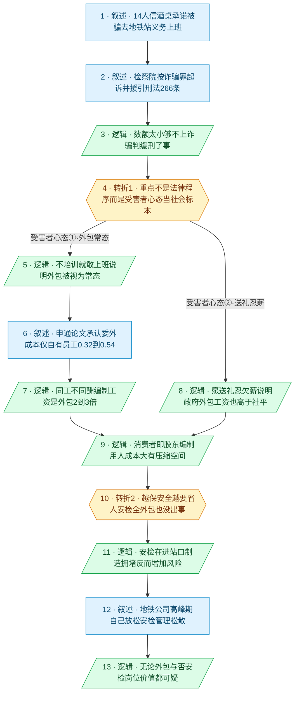

# 马督工方法论内容分析报告：【睡前消息1063】上海地铁"招工诈骗"案

- 分析时间：2026-06-07 20:20 CST
- 发现选题数：2（本报告按用户指定只分析第二个选题）
- 实际分析选题：上海地铁外包岗位"招工诈骗"案

---

## 1. 发现选题

| 编号 | 发现选题 | 中心问题 | 一句话梗概 | 独立性判断 | 置信度 |
|---:|---|---|---|---|---:|
| 1 | 大学是否应该封闭办学（头条） | 大学该不该封校，封校的真实动机是什么 | 大学封校不是因为病毒或治安，而是大学景观投资远超周边城区、形成落差，应消除落差而非封门，名校游客则用收费+限流的"天眼模式"处理 | 有独立中心问题、独立因果链、独立转折与独立行动建议，可单独成篇 | 高 |
| 2 | 上海地铁外包岗位"招工诈骗"案 | 14 人被骗去地铁站"上班"这桩荒诞案件，真正暴露了什么 | 案件本身够不上诈骗罪、判缓刑了事，真正的信息链是"受害者心态"：地铁岗位大量外包被视为常态、编制工资是外包的 2 到 3 倍、用人成本大有压缩空间，连安检岗位的存在价值都可疑 | 有独立案件、独立因果链与独立行动建议，可单独成篇 | 高 |

**结论：** 全文含 2 个可独立成篇的选题。用户已指定只分析第二个选题（"上海地铁外包岗位招工诈骗案"，对应文稿后半部分，原文第 22 到 33 段），故本报告只分析选题 2，忽略选题 1（选题 1 另见同目录 `btnews_1063.madugong-analysis.md`）。

---

## 2. 带转折点的压缩总结与逻辑深度

上海地铁"招工诈骗"案：钱某在酒桌上吹嘘有地铁关系、能给月薪 6800 的外包岗，14 人信以为真，去地铁 5 号线"上班"好几个月、还对着摄像头列队打卡，直到长期讨不到工资才报警，检察院按诈骗罪起诉。`[T1 但是]` 案件数额太小、连诈骗罪都很勉强，最后判缓刑退东西了事；真正有价值的信息不在法律程序，而在"受害者心态"，它能当理解当代中国的社会标本：地铁岗位大量外包早被当成常态，申通地铁自家论文也承认委外员工成本只有自有员工的 0.32 到 0.54，编制工资虚高，从"消费者即股东"的角度看用人成本大有压缩空间。`[T2 但是]` 别以为压薪减员会牺牲安全，恰恰相反，安检几乎全外包也没出事，还在进站口制造拥堵、增加风险，地铁公司自己在高峰期都会主动放松，所以无论外包与否，安检岗位的存在价值都很可疑。

| 转折点 | 触发位置/内容 | 为什么是不可删除转折 | 作用 |
|---|---|---|---|
| T1 | 触发句"这件事的主要信息链并不是法律程序，而是法律之外的受害者心态"，前接"连认定数额较大都很勉强…只能判半年刑期，还给了缓刑…把东西退回去就算了" | 检察院按诈骗罪起诉、援引刑法 266 条，搭起"这是诈骗案"的预期；督工却指出案件法律上几乎不成立、无足轻重，把选题从"法律案件"重新定位为"社会标本"，问题从个案转向结构。删掉它，后面整段外包用工分析就失去落脚点 | 把一桩荒诞个案转为观察国企外包用工的窗口，开启"编制工资虚高"的因果链 |
| T2 | "降低工资还要考虑安全问题，那就更需要节约用人成本…安检几乎百分之百外包也没出事…最危险的目标从来不是地铁，而是拥挤的人群" | 常识默认"压薪减员会牺牲安全、安检保平安"，督工反转为"越考虑安全越要省人、安检几乎全外包也没出事、反而在进站口制造拥堵增加风险"，表层判断被推翻，把"工资可压缩"推进到"岗位本身可能不必要"。删掉它，全段就停在普通的"国企工资偏高"，丢掉最尖锐的落点 | 给全段一个更激进的落点：连安检岗位的存在价值都可疑 |

- 转折点数量：2
- 逻辑深度判断：2 个转折，正好落在"三段叙事＋两次转折"的标准模型，逻辑深度足够，又能让观众一句话转述，传播性价比高

---

## 3. 叙事单元拆解

类型说明：叙述 = 展示事实；逻辑 = 解释因果；点缀 = 增加趣味但可删除；转折 = 打破预期、改变论证方向。

| 编号 | 类型 | 原文位置/线索 | 单句概括 | 主线作用 |
|---:|---|---|---|---|
| 1 | 叙述 | 静静介绍案件："上海市奉贤区的钱某在酒桌上吹嘘…14 个人相信了…还要在上下班时间到监控摄像头下方打卡…才报警" | 钱某酒桌吹嘘地铁关系能给 6800 外包岗，14 人信了去地铁 5 号线"上班"几个月、对摄像头打卡，讨薪不成才报警 | 起点：进入共同信息场（司法上网的荒诞案件） |
| 2 | 叙述 | "检察院是以诈骗罪起诉了这个钱某…第 266 条诈骗公私财物数额较大的，处三年以下有期徒刑…" | 检察院按诈骗罪起诉，督工援引刑法 266 条诈骗罪条款 | 叙述：搭起"这是诈骗案"的法律框架与预期 |
| 3 | 逻辑 | "连认定数额较大都很勉强…21 条香烟，6 瓶白酒，3500 元现金以及价值 1000 元的消费卡…只能判半年刑期，还给了缓刑…把东西退回去就算了" | 案件数额太小、主观意图难认定，法律上够不上诈骗，判缓刑退东西了事 | 逻辑：抽掉法律角度的分量，为重新定位做铺垫 |
| 4 | 转折 | "这件事的主要信息链并不是法律程序，而是法律之外的受害者心态，可以给外国人或者是几十年之后的中国人当案例" | 真正的信息链不是法律程序，而是"受害者心态"，把案件当理解当代中国的社会标本（T1） | 转折1：把选题从"法律诈骗案"重新定位为"社会标本"（个案→结构） |
| 5 | 逻辑 | "普通人相信酒桌上一个人的承诺，不经过专门的培训，直接就能去地铁站上班…地铁站的工作外包给没有资质的企业做很正常" | 不培训就敢去上班，说明在大众认知里"地铁站工作外包给无资质企业、日常就由这些人做"很正常 | 受害者心态①：外包早被视为常态 |
| 6 | 叙述 | 静静读申通地铁论文《城市轨道交通车站委外人工成本的分析和思考》："人工成本占比…基本在 50% 以上…委外员工成本单价和自有员工成本单价的比值在 0.32 到 0.54 之间…同工不同酬可能会引起工作矛盾" | 申通地铁自家论文承认人工占 50% 以上、安检安保保洁已基本委外、委外成本仅自有员工的 0.32 到 0.54 | 叙述：用官方一手数据印证普通人的直觉（合订本式佐证） |
| 7 | 逻辑 | "所谓成本降低，有滞后性，就是说有编制的老员工没那么容易辞退…所谓同工不同酬，就是说有编制的人要拿 2 到 3 倍的工资，所以人人都要考编制" | 把论文术语翻译过来：编制老员工难辞退、编制工资是外包的 2 到 3 倍，所以人人考编制 | 逻辑：坐实"编制工资虚高" |
| 8 | 逻辑 | "有 14 个人愿意给朋友送礼，得到外包工作，就算拿不到工资，也愿意工作几个月…就算是外包公司，只要能做政府的项目，开出的工资也高于社会平均水平" | 愿送礼换岗、忍受欠薪，说明只要能做政府项目，外包工资也高于社会平均 | 受害者心态②：政府项目外包工资仍高于社平 |
| 9 | 逻辑 | "我们普通人不仅是地铁的消费者，同时也是国有地铁公司的股东和投资者…工资还有很大的压缩空间…只要普通人应聘的时候不想送礼，也不接受拖欠工资，每个月必须拿到钱才干活，应该就可以了" | 普通人既是消费者也是国企股东，50% 成本是人工，编制岗位工资大有压缩空间，标准是"应聘不送礼、不接受欠薪、按月拿钱才干活" | 第一层结论：编制用人成本可压缩 |
| 10 | 转折 | "降低工资还要考虑安全问题，那就更需要节约用人成本…其他岗位，现在外包也没出事，尤其是安检业务几乎百分之百外包也没出事，说明有编制的员工待遇就是偏高，甚至某些岗位可能根本就不必要，比如说安检" | 越考虑安全越要省人，安检几乎全外包也没出事，编制待遇偏高、某些岗位（如安检）根本不必要（T2） | 转折2：推翻"压薪减员＝牺牲安全"，把"工资可压缩"推进到"岗位本身可能不必要" |
| 11 | 逻辑 | "最危险的目标从来不是地铁，而是拥挤的人群。现在的安检程序往往是在进站口附近制造了拥堵，产生了额外的风险，未必就会提升安全水平" | 最危险的是拥挤人群，安检在进站口制造拥堵、产生额外风险，未必提升安全 | 逻辑：论证安检的负价值 |
| 12 | 叙述 | "各地遇到重大活动或者是节假日的高峰期…安检就会主动放松标准…只关心你不能翻越围栏…前面提到 14 个在地铁站上班几个月的人对着摄像头列队敬礼，没人管…隔着地铁围栏完成交易" | 地铁公司高峰期自己主动放松安检，只防翻围栏，14 人敬礼没人管、隔围栏交易假公章盛行，管理松散 | 叙述：用地铁公司自身行为与现象佐证安检形同虚设 |
| 13 | 逻辑 | "如果这些问题不能杜绝，无论是不是外包，安检岗位的存在价值都很可疑" | 这些漏洞杜绝不了，那么无论外包与否，安检岗位的存在价值都可疑 | 终点：全段收束，落在"安检岗位价值可疑" |

---

## 4. 叙事结构模式

因果为主，主线模式不切换。整体是一条先因后果的链：荒诞案件作为标本，推出地铁岗位大量外包被视为常态，再推出编制工资虚高、用人成本可压缩，最后推到安检岗位价值可疑。T1（节点 4）之后，中段用两条并列的"受害者心态"观察（不培训就敢上班、愿送礼忍欠薪）加上申通论文，共同支撑"编制工资虚高"这一结论，属于同一因果环节内的并列取证，没有升级为主线层面的"并列↔因果"切换。

---

## 5. 一维叙事结构图

节点形状与颜色对应单元类型：叙述 = 蓝色矩形 `[ ]`，逻辑 = 绿色平行四边形 `[/ /]`，点缀 = 灰色矩形 + 虚线边框，转折 = 琥珀色六边形 `{{ }}`。节点编号与 Section 3 单元一一对应。T1（节点 4）之后，"受害者心态①·外包常态"（5→6→7）与"受害者心态②·送礼忍薪"（节点 8）两条并列观察汇入"编制工资可压缩"（节点 9），再进入 T2（节点 10）与安检价值的收束。本期话题没有出现纯点缀单元，但按规范仍声明全部四个 classDef。

---

## 6. 选题为什么成立

### 6.1 选题本质三要素

| 要素 | 文章中的体现 |
|---|---|
| 共同信息场 | 几乎人人每天坐地铁、天天经过安检口和站务人员；"国企外包用工""编制 vs 合同工同工不同酬""地铁安检到底有没有用"是大众日常吐槽的共同经验。案件本身来自 5 月份司法信息上网公开的判例 |
| 最新变化 | 2024 年司法上网的"地铁招工诈骗"荒诞案件，叠加 2026 年申通地铁集团自己发表的《城市轨道交通车站委外人工成本的分析和思考》论文，首次用官方一手数据坐实"委外员工成本只有自有员工的 0.32 到 0.54、人工占 50% 以上" |
| 行动建议 | 从消费者即股东的利益出发压缩编制岗位工资（标准＝应聘者不送礼、不接受欠薪、按月拿钱才干活）；关键技术岗给市场水平收入，冗余岗位（尤其几乎全外包也没出事的安检）该砍则砍 |

### 6.2 八个选题方向匹配

| 方向 | 匹配度 | 证据 | 说明 |
|---|---|---|---|
| 帮群体算账 | 高（主） | "人工成本占 50% 以上""委外成本是自有员工的 0.32 到 0.54""编制工资是外包 2 到 3 倍""消费者即股东，工资还有很大压缩空间" | 把"地铁该不该养这么多编制岗"换算成一笔人人能算的成本账，是该方向的标准用法 |
| 审查完美故事 | 高（主） | 审查"安检＝保障安全"这一被默认完美的叙事，追问没展示的成本与反效果（进站口制造拥堵、地铁公司自己放松、隔围栏交易假公章） | 关注被忽略的成本与反作用侧面，构成典型的反面选题 |
| 关注群体内部矛盾 | 中（次） | "同工不同酬""有编制的人拿 2 到 3 倍工资，所以人人考编制""消费者/股东 vs 员工"的利益对立 | 穿透到编制工与外包工的真实经济矛盾，不停留在文化标签 |
| 数据分析与合订本 | 中（次） | 把"荒诞个案"与申通论文 0.32 到 0.54 成本比、50% 人工占比做加法组合出新闻 | 用官方文件数据消解"国企用工天经地义"的惯性表达 |
| 关注普通人生活 | 中（次） | 从一桩普通人被骗去"义务上班"的荒诞案件切入，深挖背后外包用工的结构性矛盾 | 把平淡个案当线索挖到系统性原因 |
| 教科书加 | 低 | 援引刑法第 266 条诈骗罪 | 仅作背景，未构成主线 |
| 调动观众参与感 | 低 | 安检体验、地铁通勤人人有 | 间接存在，非作者主动设计的参与机制 |
| 挖掘历史感 | 低 | 基本无历史时段维度 | 不构成该方向 |

**主匹配方向：** 帮群体算账 + 审查完美故事

**次匹配方向：** 关注群体内部矛盾、数据分析与合订本、关注普通人生活

### 6.3 否定选题校验

| 校验项 | 结果 | 理由 |
|---|---|---|
| 自己是否愿意分享 | 通过 | "地铁安检到底有没有用""国企编制工资是不是太高"是饭桌上人人愿意吐槽的高共鸣话题 |
| 是否绕开完美故事 | 通过 | 不讲"严密安检保平安"的完美叙事，反而审查它的成本与反效果，立场是建设性的（给出压薪标准＋砍冗余岗的方案） |
| 是否避免纯反驳 | 中等通过 | 主体不是纯反驳，给出了正面方案（压缩工资的可操作标准、关键岗给市场价）；但"安检无用论"一段较激进、替代方案缺位，论据偏经验与个案，传播上有被"那恐袭怎么办"一句反问占据议题主动权的风险 |
| 转折点数量是否合适 | 合适 | 2 个转折正好是"三段叙事＋两次转折"的标准模型：T1 把法律案件重新定位为社会标本，T2 把"压薪牺牲安全"反转为"安检反而是负价值"，逻辑深度够又能一句话转述 |

---

## 7. AI 总评（供参考）

这是一期"从荒诞个案翻出结构账"的标准马督工选题。起手是一个自带传播力的案件：14 个人被一句酒桌牛皮骗去地铁站义务上班好几个月，还对着监控摄像头列队敬礼打卡。但督工不在法律层面纠缠（案件够不上诈骗、判缓刑退东西了事），而是用 T1 一把将它重新定位为"理解当代中国的社会标本"，这是全段的枢纽，把一桩茶余饭后的奇闻变成观察国企外包用工的窗口。接着用受害者自己的行为反推社会常态（不培训就敢上班、愿送礼忍欠薪），再搬出申通地铁集团自家论文（委外成本是自有员工的 0.32 到 0.54）做官方背书，把"编制工资虚高"从印象坐实为数据，并从"消费者即股东"的身份算出压缩空间。T2 再加一层：你以为压薪减员牺牲安全，其实安检几乎全外包也没出事、反而制造拥堵，连地铁公司自己在高峰期都主动放松，于是把"工资可压缩"推进到"岗位可能根本不必要"。两次转折一层比一层激进，稳稳落在标准的两转折模型上，逻辑深度够又便于转述。

风险集中在安检一段：论据偏经验观察（拥堵几何、地铁公司自己放松、隔围栏交易），结论却下得很重（安检岗位价值可疑），容易被"那恐怖袭击怎么办"一句反问占据议题主动权；并且全段建立在"普通人＝国企股东、应按股东利益压低人工成本"这一前提上，对被压缩工资的外包与编制员工本身的处境着墨较少，立场偏资方视角。

### 可复用的创作公式

荒诞个案（自带传播）→ 不纠缠表层（法律/道德），一把重新定位为"社会标本" → 用当事人自己的行为反推社会常态 → 搬出对方或官方的一手数据做背书坐实 → 从"消费者即股东"的身份算成本账 → 再加一层反直觉转折把结论推到极致。核心套路是"把一桩茶余饭后的奇闻，当成观察某个利益结构的标本，再把结构换算成一笔人人能算的账"。

### 可改进处

1. 申通论文的 0.32 到 0.54 成本比、50% 人工占比宜标注论文出处、年份与口径，避免被质疑断章取义，削弱合订本的说服力。
2. "安检岗位价值可疑"结论偏激进且替代方案缺位，宜补一句"大型活动或关键场景仍需何种安保"，否则容易被"那安全谁负责"反问，把建设性选题拖回抬杠层面。
3. 全段默认"普通人＝股东、应压低人工成本"，可补一句对被压薪的外包与编制员工处境的平衡，避免立场单一被攻击。
