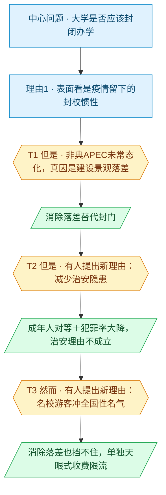

# 马督工方法论内容分析报告：【睡前消息1063】大学关门办学，纯属钱多了烧的

- 分析时间：2026-06-07 19:01 CST
- 发现选题数：2（本报告按用户指定只分析头条选题）
- 实际分析选题：大学是否应该封闭办学

---

## 1. 发现选题

| 编号 | 发现选题 | 中心问题 | 一句话梗概 | 独立性判断 | 置信度 |
|---:|---|---|---|---|---:|
| 1 | 大学是否应该封闭办学（头条） | 大学该不该封校，封校的真实动机是什么 | 大学封校不是因为病毒或治安，而是大学景观投资远超周边城区、形成落差，应消除落差而非封门，名校游客则用收费+限流的"天眼模式"处理 | 有独立中心问题、独立因果链、独立转折与独立行动建议，可单独成篇 | 高 |
| 2 | 上海地铁外包岗位诈骗案 | 14 人被骗去地铁站"上班"暴露了什么 | 案件本身够不上诈骗罪，真正信息是受害者心态：地铁岗位大量外包、有编制者工资虚高、安检岗位价值可疑 | 有独立案件、独立因果链与独立结论，可单独成篇 | 高 |

**结论：** 全文含 2 个可独立成篇的选题。用户已指定只分析头条选题（frontmatter `title` 指向的"大学是否应该封闭办学"，对应文稿前半部分），故本报告只分析选题 1，忽略选题 2。

---

## 2. 带转折点的压缩总结与逻辑深度

大学开放与否争论激烈，表面看是疫情留下的封校惯性。`[T1 但是]` 非典、APEC 都封过校却没常态化，真正动因是这二十年大学景观投资远超周边城区，居民才想进来蹭，消除落差比封门更对。`[T2 但是]` 有人提出封校是为了减少安全隐患、保护学生，马督工的评价是：大学生是成年人，要享受额外保护就得接受未成年人管束，何况杀人案已从 2000 年的 2.84 万降到 2025 年的 0.6 万，治安理由不成立。`[T3 然而]` 有人指出某些名校自带全国性名气、游客冲名气和迷信而来，消除落差也挡不住，马督工的评价是：封门并不是答案，照贵州天眼的经验设游客总量、抬票价、限路线，把香火钱拿来补贴教育。

| 转折点 | 触发位置/内容 | 为什么是不可删除转折 | 作用 |
|---|---|---|---|
| T1 | "三年的新冠疫情确实是…转折点，但是核心原因并不是…通过封校发现了新的管理模式"，并以非典、APEC 封校未常态化为证 | 把"病毒导致封校"这一表层归因直接推翻，论证方向从"防疫惯性"转向"建设落差"，删掉它整条因果链塌掉 | 重新定位封校的真实动机，引出深层解释（景观投资落差） |
| T2 | "很多人要求大学封闭办学，还有一个理由是减少安全隐患…大学可以参照中小学的经验吗" | 反方提出第二条封校理由（治安），论证从作者主动立论转入驳论；删掉它则成年人对等原则与犯罪率数据失去回应对象 | 用成年人/未成年人对等原则＋2000→2025 杀人案数据，把治安理由顶回 |
| T3 | "你前面所有的讨论都有一个基本假设…但还有一种可能性，就是某些大学已经形成了全国性的名气" | 静静点破"消除落差就够了"这一基本假设的盲区（名校游客冲名气而来、落差消不掉），论证再次反转；删掉它天眼方案失去由头 | 承认名校是例外，但用"天眼模式"收费限流替代封门，给名校游客一个单独解法 |

- 转折点数量：3
- 逻辑深度判断：3 个转折＝四段叙事，比马督工常推荐的"三段叙事＋两次转折"标准模型多出一折。封校的三条理由（疫情惯性、治安、名校游客）被逐条拆开处理，逻辑密度偏高、略微超出"一句话转述"的轻量区间；但三个意见界限清晰、各自配一个正面方案，观众仍能顺着"不是病毒→治安不成立→名校用天眼"这条线转述，传播性价比依然成立

---

## 3. 叙事单元拆解

类型说明：叙述 = 展示事实；逻辑 = 解释因果；点缀 = 增加趣味但可删除；转折 = 打破预期、改变论证方向。

| 编号 | 类型 | 原文位置/线索 | 单句概括 | 主线作用 |
|---:|---|---|---|---|
| 1 | 叙述 | 开场静静提问，"关于大学是否开放的问题，争论越来越激烈" | 大学该不该开放正成为激烈争论的共同话题 | 起点：进入共同信息场 |
| 2 | 转折 | "三年的新冠疫情确实是…转折点，但是核心原因并不是…"，非典、APEC 也封校却未常态化 | 但是非典、APEC 都封过校却没常态化，疫情不是封校常态化的决定性原因（T1） | 转折1：推翻"病毒导致封校"的表层归因 |
| 3 | 逻辑 | "21世纪初的大学和现在对比，最重要的区别就是基础设施全面升级" | 真正变量是大学基础设施全面升级、超越城市街区水平 | 第一层深层解释的总纲 |
| 4 | 点缀 | "我1998年上大学…蹭一张床或者就是打地铺"，筒子楼青蛙、踩穿楼板 | 用作者当年逛校园、住筒子楼的回忆铺陈旧时校园朴素 | 点缀：现场感与对照，删除不伤主线 |
| 5 | 叙述 | "上海交大闵行校区进门就有一个人工湖…领先中国20年" | 当年只有交大闵行校区像美国大学、领先二十年 | 叙述：为"建设落差"提供基准参照点 |
| 6 | 逻辑 | "大多数中国大学的校园环境并不明显超出所在城市街区的平均水平…大学基本上不控制外人出入" | 当年校园不优于街区，所以无需控制外人出入 | 逻辑：建立"无落差→不封门"的因果 |
| 7 | 叙述 | "接下来十年…2015年以后…完全可以和美国的大学比一比环境了" | 此后大学建设投资暴涨，普通本科也达到当年交大水平 | 叙述：呈现落差形成的过程 |
| 8 | 逻辑 | "大学的建设用地成本比较低…普通街区的改造力度明显就不如大学…必然会把大学当做休闲场地" | 大学景观投资远超周边街区，居民自然想进来蹭 | 逻辑：坐实"建设落差→外人涌入→封校动机" |
| 9 | 逻辑 | "最合理的做法是把钱直接花给具体的人…食堂的价格水平和外面…完全一样" | 解法是把钱直接花给人、取消价格落差，外人自然不来 | 第一层结论：消除落差替代封门 |
| 10 | 转折 | "很多人要求大学封闭办学，还有一个理由是减少安全隐患…大学可以参照中小学的经验吗" | 但是有人以减少安全隐患为由要求封校、要大学参照中小学，论证转入回应治安理由（T2） | 转折2：从主动立论转入回应反方的治安理由 |
| 11 | 逻辑 | "如果大学生要求得到额外的保护…你不能只在要求自由的时候想起自己是个成年人" | 要享受未成年人保护就得接受未成年人管束，权利义务对等 | 治安评价：用对等原则锁死"额外保护"诉求 |
| 12 | 叙述 | "2000年…杀人案件数量是2.84万…2025年…下降到0.6万" | 杀人案从 2000 年 2.84 万降到 2025 年 0.6 万，治安大幅改善 | 治安评价：用数据证伪"治安恶化需封校" |
| 13 | 逻辑 | "还自认为是弱势群体…要求额外的保护，这是典型的巨婴心态" | 成年人以弱势之名要额外保护是巨婴心态 | 治安评价收束：给治安理由一个价值判断 |
| 14 | 转折 | "你前面所有的讨论都有一个基本假设…但还有一种可能性，就是某些大学已经形成了全国性的名气" | 然而有人指出名校自带全国性名气、消除落差也挡不住游客，论证转入名校游客的单独解法（T3） | 转折3：点破"消除落差就够了"的盲区，转入名校游客的单独处理 |
| 15 | 叙述 | "中国已经有了成功案例，就是贵州的天眼景区"，140 元票价、100 多万游客、严格限流 | 天眼用高票价+严格限流让百万游客不影响科研 | 名校评价：提供可类比的成功样本 |
| 16 | 逻辑 | "如果某个大学的名气大到需要控制外地游客数量了，那就设定一个游客总量…赚他们一笔香火钱，拿来补贴教育经费" | 名校照天眼经验收费限流，把香火钱补贴教育 | 终点：名校评价的可执行解法，全期收束 |

---

## 4. 叙事结构模式

因果→因果，模式不切换：主线是"先因后果"的因果链，封校每提出一条理由就对应一次转折：疫情/防疫惯性由 T1 翻到建设落差、消除落差替代封门，治安隐患由 T2 用成年人对等＋犯罪率数据顶回，名校游客由 T3 用天眼式收费限流单独处理。三条理由＝三次转折，把链条拉成四段串联，各自独立、界限清晰，没有交叉缠绕。这比"三段叙事＋两次转折"的标准模型多出一折，逻辑密度偏高，但三条理由各管一段，观众仍能顺线转述。

---

## 5. 逻辑结构图

节点颜色对应单元类型：叙述 = 蓝色矩形，逻辑 = 绿色平行四边形，转折 = 琥珀色六边形。这张图按封校的三条理由组织，每提出一条理由就对应一次转折：第一条理由（疫情/防疫惯性）先摆出来，T1 的"但是"接在它后面、把真因翻到建设落差；之后每出现一条新理由（治安、名校游客），都由"但是/然而"先引出、再接马督工的评价。三条理由＝三次转折。

---

## 6. 选题为什么成立

### 6.1 选题本质三要素

| 要素 | 文章中的体现 |
|---|---|
| 共同信息场 | 几乎人人有的"大学校园"经验，加上疫情后普遍存在的"大学进不去了"的切身体感——开篇即点明"关于大学是否开放的问题，争论越来越激烈" |
| 最新变化 | 把"封校"重新归因：不是病毒，而是这二十年大学景观投资暴涨、超越周边城区形成落差；并叠加 2000→2025 杀人案 2.84 万降到 0.6 万的合订本数据 |
| 行动建议 | 普通大学消除落差（钱直接花给人、食堂随行就市）替代封门；名校照"天眼模式"设游客总量、抬票价、限路线，把香火钱补贴教育 |

### 6.2 八个选题方向匹配

| 方向 | 匹配度 | 证据 | 说明 |
|---|---|---|---|
| 关注普通人生活 | 高（主） | 从"大学进不进得去"这一全民切身体感切入，深挖封校背后的建设落差结构性原因 | 把平淡争论当线索，挖到系统性原因，正是该方向的标准用法 |
| 帮群体算账 | 高（主） | "把钱直接花给具体的人""食堂随行就市还能平摊成本""天眼 140 元×100 万人=一个亿付管理成本" | 全程做成本收益分析，把封校情绪转成"该不该制造落差、谁出钱"的账 |
| 数据分析与合订本 | 中（次） | 2000 年 2.84 万 vs 2025 年 0.6 万杀人案的纵向对比 | 用历年数据消解"治安恶化"的惯性表达，发现真实趋势 |
| 挖掘历史感 | 中（次） | 从作者 1998—2002 年逛校园、住筒子楼的记忆，反向追溯大学建设的物质条件变化 | 反向挖历史：从日常文化现象追溯背后经济技术条件 |
| 审查完美故事 | 中（次） | 审查"大学环境好就该封闭保护"这一被默认完美的叙事，追问没展示的成本（谁出钱、谁失去公共空间） | 关注被忽略的成本侧面 |
| 关注群体内部矛盾 | 低 | 大学生 vs 周边居民对校园资源的争夺 | 有触及但非主线，未展开经济结构分析 |
| 教科书加 | 低 | 引用刑法、社会治安常识 | 仅作背景，未构成主线 |
| 调动观众参与感 | 低 | 校园记忆易唤起观众自身经验 | 间接存在，非作者主动设计的参与机制 |

**主匹配方向：** 关注普通人生活 + 帮群体算账

**次匹配方向：** 数据分析与合订本、挖掘历史感、审查完美故事

### 6.3 否定选题校验

| 校验项 | 结果 | 理由 |
|---|---|---|
| 自己是否愿意分享 | 通过 | "大学该不该开放"是私人场合也会聊的高共鸣话题，作者本人有亲历记忆，愿意主动讲 |
| 是否绕开完美故事 | 通过 | 不讲"某大学开放后皆大欢喜"的完美个案，而是审查"封闭保护"叙事的成本侧面，立场是建设性的 |
| 是否避免纯反驳 | 通过 | 虽以反驳"封校派"入场，但每驳一条都给出正面方案（消除落差、天眼模式），信息量远超单纯否定，不是把议题主动权交给对方 |
| 转折点数量是否合适 | 合适（偏密） | 3 个转折＝四段叙事，比"三段叙事＋两次转折"的标准模型多出一折：封校的三条理由（疫情惯性、治安、名校游客）被逐条拆开处理。逻辑密度偏高、略超"一句话转述"的轻量区间，但三个意见界限清晰、各配一个正面方案，主线不分叉，观众仍能顺线转述，逻辑深度与传播性的平衡可以接受 |

---

## 7. AI 总评（供参考）

这是一期"归因纠偏 + 算账给方案"的典型马督工选题，结构干净。最强的是 T1：把全民默认的"疫情导致封校"一句话顶翻，换成"建设投资落差"这个反直觉但站得住的解释，把情绪话题拉到结构分析的层面，这是整期的价值锚点。之后他没有停在落差归因，而是接连处理反方的另外两条封校理由：T2 治安用"成年人/未成年人"对等原则，加上 2000 到 2025 年杀人案 2.84 万降到 0.6 万的合订本数据，干净顶回；T3 名校游客则承认消除落差挡不住冲名气而来的游客，单独给出"天眼模式"收费限流方案。三条理由各配一个正面方案兜底，逻辑密度比标准的两转折模型更高：四段叙事、三次转折，略微超出"一句话转述"的轻量区间，但三个意见界限清晰、互不缠绕，观众仍能顺着"不是病毒→治安不成立→名校用天眼"这条线转述。

### 可复用的创作公式

共同体感（大学进不去）→ 一句话顶翻表层归因（不是病毒，是建设落差）→ 逐条回应反方的封校理由（治安用合订本数据顶回、名校用天眼式收费限流兜底）。核心套路是"把一个被情绪和惯性解释占据的公共议题，重新归因到可量化的成本落差上，再把每一条反方理由都转成一笔人人能算的账"。

### 可改进处

1. 2.84 万 / 0.6 万杀人案数据宜补一句口径来源（全国公安/统计年鉴），否则容易被质疑选择性取数，削弱合订本的说服力。
2. "巨婴心态"是情绪化标签，与全段冷静算账的语体略有出入，可换成更中性的"权利义务不对等"表述，避免把建设性论证拉回骂战层面。
