# 马督工方法论内容分析报告：【睡前消息1064】西北赛区西安赢 西部赛区成都赢

- 分析时间：2026-06-09
- 发现选题数：1
- 实际分析选题：西安曲江模式崩溃与西部中心城市之争

---

## 1. 发现选题

| 编号 | 发现选题 | 中心问题 | 一句话梗概 | 独立性判断 | 置信度 |
|---:|---|---|---|---|---:|
| 1 | 西安曲江模式崩溃与西部中心城市之争 | 西安的房地产神话为什么崩塌，成都又是如何在西部中心竞争中胜出的？ | 以碑林区拆迁项目叫停为入口，追溯曲江模式的兴衰，揭示西安土地财政在房地产下行期和成都竞争下全面溃败的经济地理逻辑 | 唯一选题，全文各段（曲江新区历史、西咸新区失败、人口流向、就业对比、青海案例）均为同一因果链上的不同阶段和证据支撑 | 高 |

**结论：** 文章包含 1 个独立选题，直接进入分析。

---

## 2. 带转折点的压缩总结与逻辑深度

西安市碑林区三学街拆迁项目在居民全部签约后被叫停，政府动用纪委施压让97%住户签终止协议，[T1 但]真正原因是财政——项目继续需94.99亿元、叫停仅损失5.85亿元。[T2 然而]曲江新区操盘的内城置换项目按常理应盈利，亏损并不只是具体项目或西安市的问题，而是西部经济地理中心变迁的结果。曲江模式由段先念发明——用贷款制造文旅概念推高地价、借陕北富裕人群购房资金支撑，在房价上涨年代成为西安印钞机并外扩全国。[T3 但是]疫情后无新买家涌入，曲江模式瞬间垮塌，曲江文投债务逼近1800亿、政企分离。[T4 然而]更深层原因是西安未成西部中心、连西北中心地位也遭成都竞争——铁路打通地理障碍后，成都以更多就业和医疗资源分流了西北人口，连青海省老干部康养基地也选在了成都。

| 转折点 | 触发位置/内容 | 为什么是不可删除转折 | 作用 |
|---|---|---|---|
| T1 | 政府动用纪委施压居民→真正原因是财政问题（94.99亿 vs 5.85亿） | 删掉后"政府为何公开承认违法"失去解释，个案表面矛盾与深层财政困境的连接断裂 | 将问题从"政府滥权"重新定位为"财政绝望"，改变责任主体定位 |
| T2 | 三学街项目按常理最赚钱→不仅不赚还亏巨款→不是局部问题，是西部经济地理中心变迁 | 删掉后文章始终停留在个案分析，无法上升到区域结构性层面 | 将问题从个案扩展为区域系统性问题，打破"好地块必赚钱"的预期 |
| T3 | 曲江模式成熟运作十几年→疫情后一瞬间垮掉，债务1800亿 | 删掉后曲江只停留在成功叙事，无法解释为何连最核心资产都撑不住 | 将"曲江神话"反转为"脆弱泡沫"，打开后续成都竞争的论证空间 |
| T4 | 核心区为什么也维持不住→西安未成西部中心，连西北中心地位都遇成都竞争 | 删掉后文章只解释到"曲江自己过度扩张"，漏掉了外部竞争这一决定性因素 | 将责任主体从"内部失策"重新定位为"外部格局重塑"，是全文最终结论的支点 |

- 转折点数量：4
- 逻辑深度判断：3 个及以上——逻辑深，传播成本和误差风险上升，但每一层转折都有充分的数据和案例支撑，读者可抓住"成都抢了西安的西部中心"这一句来转述

---

## 3. 叙事单元拆解

类型说明：叙述 = 展示事实；逻辑 = 解释因果；点缀 = 增加趣味但可删除；转折 = 打破预期、改变论证方向。

| 编号 | 类型 | 原文位置/线索 | 单句概括 | 主线作用 |
|---:|---|---|---|---|
| 1 | 叙述 | L10-11: 人民日报报道 | 碑林区三学街拆迁项目叫停，政府动用纪委施压让97%住户签署终止协议 | 引入具体事件，建立"政府滥权"的初始认知 |
| 2 | 逻辑 | L12: "纪委办案开路...有罪推定" | 分析"纪委办案开路"的逻辑：预设目标+有罪推定，可得任何需要的结果 | 点明政府行为的不合法性，为T1翻转铺垫 |
| 3 | 转折1 | L13: "理由只能是更恐怖的财政问题" | 官员公开承认违法→真正原因是财政问题：继续需94.99亿，叫停仅损失5.85亿 | 打破"政府滥权"预期，将问题重新定位为财政绝望 |
| 4 | 叙述 | L13-14: 人民日报原文，两区互相甩锅 | 曲江新区称花钱缺监管，碑林区称项目规划太大超出承受能力 | 展示财政困境下两区的推诿姿态，为后续追溯曲江模式铺垫 |
| 5 | 点缀 | L15-16: 碑林区是西安最老区...相当于北京前门 | 碑林区历史地理背景：1955年成立、碑林景区、相当于北京前门 | 增强读者对地块价值的认知，衬托"这么好地块也亏"的反差 |
| 6 | 叙述 | L17: 曲江新区政企合一...无限融资能力 | 曲江新区介绍：2003年成立、政企合一、最强土地开发商、文旅资源和无限融资能力 | 交代开发方的实力背景，建立"最强开发商"的初始印象 |
| 7 | 叙述 | L18: 曲江新区房价爬到西北顶峰...西安印钞机 | 曲江模式在房价上涨年代的成功：成为西北房价顶峰、西安的印钞机 | 展示曲江模式的辉煌成就，为后续崩溃制造反差 |
| 8 | 转折2 | L19: 按常理最赚钱→不仅不赚还亏→西部经济地理中心变迁 | 曲江最强开发商操盘内城黄金地块→不仅不赚还亏巨款→不光是具体项目或西安市的问题，而是西部经济地理中心变迁的结果 | 将问题从个案提升到区域结构性层面，打破"好项目必赚钱"的预期 |
| 9 | 叙述 | L20-21: 段先念生平 | 段先念：恢复高考第一代大学生→下海→回体制→曲江旅游度假区主任→曲江新区行政领导 | 引入曲江模式创始人，交代其从学术到体制内再到房地产的路径 |
| 10 | 逻辑 | L21-22: 概念不是被发现的，而是被发明的 | 曲江模式核心逻辑：概念被发明而非发现，用贷款制造概念再用概念还贷款 | 揭示曲江模式是人为制造的概念游戏，不是靠文物古迹的价值发现 |
| 11 | 叙述 | L22-23: 大雁塔喷泉、大慈恩寺扩建、唐僧顶骨舍利 | 曲江概念制造案例：投资5亿建亚洲最大喷泉广场、扩建大慈恩寺超唐朝规模、引入唐僧顶骨舍利 | 展示"概念制造"的具体操作手法 |
| 12 | 叙述 | L23-24: 陕北富人群全款多套购曲江房，地价30万→600万，段先念升迁 | 陕北富豪全款多套购曲江新房，曲江地价从30万涨到600万；段先念升副市长→华侨城董事长 | 展示曲江模式的资金来源（陕北油气财富）和段先念凭借此模式的全国性成功 |
| 13 | 叙述 | L25-26: 曲江模式全国扩张，11省26市55项目 | 曲江模式外扩全国（11省26市55个文旅城镇项目），靠门票收不回投资、必须卖周边土地 | 展示曲江模式从西安复制到全国的规模，同时揭示其本质依赖卖地 |
| 14 | 转折3 | L26-27: 模式一瞬间垮掉，收入降30%，债务1800亿 | 段先念的成熟开发模式→一瞬间垮掉：疫情+无新陕北富豪→公共预算收入降30%、曲江文投债务逼近1800亿 | 将曲江从"成功可复制"反转为"脆弱泡沫"，打破"高速增长会延续"的预期 |
| 15 | 叙述 | L26-28: 曲江新区被拆分，债务分家 | 曲江新区被拆分：行政权归各区、只保留文旅集团身份，债务"谁的孩子谁抱"切断政府隐性担保 | 展示曲江模式崩塌的制度性后果 |
| 16 | 逻辑 | L28: "在这个背景之下...放弃了拆迁项目" | 曲江和碑林区因为模式崩塌和债务危机而相互扯皮，最终放弃疫情前已确定的拆迁项目 | 串联回开篇事件，完成"模式崩溃→具体项目失败"的因果闭环 |
| 17 | 叙述 | L29: 段先念在华侨城同样失败 | 段先念在华侨城：2021年860亿市值顶峰→退休后累计亏400亿→市值降至150亿 | 旁证曲江模式换到央企同样不可持续 |
| 18 | 叙述 | L30-31: 西咸新区拆迁命案 | 西咸新区为文旅项目强拆致人死亡：拆迁队持防爆盾入室→住户自卫刺死一人→住户取保候审说明责任在拆迁方 | 展示西安另一个新区的资金困境已经严重到引发暴力冲突 |
| 19 | 逻辑 | L31: 2023年强拆已少用，搞这么难看说明政府平台早就缺钱 | 2023年强拆手段已很少使用，西咸新区还搞到这一步说明政府平台早就缺资金 | 将暴力个案归结为系统性资金匮乏 |
| 20 | 叙述 | L32-34: 西咸新区从期望到失败 | 西安-咸阳仅22公里未同城化（全国罕见）、498米烂尾"西北第一高楼"、智轨开通不到3年停运、6家子公司逾期28.63亿、2095亿有息债务 | 展示西咸新区从同城化希望到全面溃败的过程和数据 |
| 21 | 逻辑 | L35: 西咸做不起来→西安把所有项目压给曲江→过度扩张 | 连众望所归的西咸新区都做不起来，西安市政府只能不断把项目交给曲江，直到曲江吃不下为止 | 解释曲江为何会介入并最终退出碑林区项目 |
| 22 | 转折4 | L36-37: 核心区为什么也维持不住→西安没成西部中心，连西北中心地位都遇成都竞争 | 曲江连自己核心区都撑不住→不只因为无房产税，而是西安不仅没成西部中心、连西北中心地位也遇到成都正面竞争 | 将崩溃原因从"内部过度扩张"扩展为"外部竞争失利"，是全文最关键的论证方向转变 |
| 23 | 逻辑 | L37-38: 房地产依赖人口流入+无房产税 | 曲江靠陕北人口流入起步、西咸靠放松限购提房价→房地产的前提是持续人口流入 | 揭示土地财政的核心前提，为后续人口数据做理论铺垫 |
| 24 | 叙述 | L38-41: 西安人口数据与外来人口结构 | 2010-2020年陕西增220万、西安增450万（从全省吸人）；西北五省流入41万（甘肃占30万）；河南籍教育移民37万 | 展示西安过去依赖的人口流入模式——靠西北垄断地位吸人 |
| 25 | 点缀 | L39: "我过去住在西安老城，在莲湖公园观察过这些老人的自发娱乐活动" | 督工个人在西安居住期间对退休体制内人群的实地观察 | 增加第一人称现场感，让"购买力强的退休人群"更具体可感 |
| 26 | 叙述 | L41: 兰渝铁路+西成高铁→西安成都从互不干预变正面竞争 | 2017年后兰渝铁路贯通（西北可快速入西南）+西成高铁贯通（西安3.5小时到成都）→西安和成都从"隔秦岭互不干预"变成正面竞争 | 揭示支撑T4的地理机制——交通变化打破了西安的地理垄断 |
| 27 | 叙述 | L42-44: 就业对比 | 西电4%毕业生去成都vs成电去西安"可忽略"；西安65家A股公司（33家国企）vs成都123家（29家国企） | 用两所电子科大的就业数据和上市公司结构展示成都的就业优势 |
| 28 | 逻辑 | L44: 成都更多非国企→更多就业机会→吸引更多年轻人 | 成都123家上市公司中国企仅29家，提供更多年轻人就业机会→可吸引更多西北人口流入 | 将就业数据归结为制度性原因并推导人口流向 |
| 29 | 叙述 | L45-49: 七普人口流向+青海省案例 | 2020年成都已吸20万西北人口（12万河南人），随时间必超西安的41万；青海唯一省外康养基地选成都而非西安（西安原来有3个干休所） | 用人口普查数据和青海体制内退休人群的选择佐证成都胜出 |
| 30 | 逻辑 | L48-49: 康养基地需自费→征求本人意见→体制内也认成都 | 康养基地需干部自费→必须征求本人意见→青海唯一省外康养基地选成都，表明体制内退休人群也认成都是西部中心 | 将"康养基地选成都"解读为体制内人群的主动选择 |
| 31 | 叙述 | L49-50: 城市规划和医疗资源对比 | 西安规划2035年1560万（距目标差237万）vs成都规划2350万（距目标差197万）；成都医疗资源总量和人均超西安 | 展示两城未来格局——人口停滞固化差距，成都医疗优势吸引老龄人口 |
| 32 | 逻辑 | L51: 最终结论 | 西北赛区和西南赛区因铁路合并成西部大赛区→成都正面竞争分走西北人口→成都勉强稳住房价、西安面临更深跌幅→曲江新区被迫放弃政企合一 | 收束全文因果链，完成从个案到区域格局的论证闭环 |

---

## 4. 叙事结构模式

因果→并列→因果，切换 2 次：主线上先做因果推进（碑林项目→财政绝望→区域结构问题→曲江模式历史与崩溃），中途用西咸新区和华侨城两组案例并列补强曲江模式不可持续的论点，最后回到因果链解释核心区也遭遇成都竞争（交通变化→就业分化→人口分流→西安房价更深下跌→曲江被迫放弃政企合一）。

---

## 5. 一维叙事结构图

```mermaid
flowchart TD
    classDef typeA fill:#e0f2fe,stroke:#0284c7,color:#0c4a6e
    classDef typeB fill:#dcfce7,stroke:#16a34a,color:#14532d
    classDef typeC fill:#f3f4f6,stroke:#9ca3af,color:#374151,stroke-dasharray:5 5
    classDef typeD fill:#fef3c7,stroke:#d97706,color:#78350f

    1["1 · 叙述 · 碑林区拆迁叫停：政府用纪委施压97%住户签终止协议"]:::typeA
    2[/"2 · 逻辑 · 纪委办案开路=预设目标+有罪推定"/]:::typeB
    3{{"3 · 转折1 · 官员认错的真正原因是财政绝望（94.99亿 vs 5.85亿）"}}:::typeD
    4["4 · 叙述 · 曲江新区与碑林区互相甩锅"]:::typeA
    5["5 · 点缀 · 碑林区相当于北京前门"]:::typeC
    6["6 · 叙述 · 曲江新区：政企合一、最强开发商、无限融资能力"]:::typeA
    7["7 · 叙述 · 曲江模式辉煌：西北房价顶峰、西安印钞机"]:::typeA
    8{{"8 · 转折2 · 按常理最赚钱→不仅不赚还亏巨款→西部经济地理中心变迁"}}:::typeD
    9["9 · 叙述 · 段先念生平（学术→下海→曲江新区主任）"]:::typeA
    10[/"10 · 逻辑 · 曲江模式核心：概念被发明而非发现，贷款造概念还贷款"/]:::typeB
    11["11 · 叙述 · 概念制造：大雁塔喷泉、大慈恩寺扩建、唐僧顶骨舍利"]:::typeA
    12["12 · 叙述 · 陕北富豪全款多套购曲江房，地价30万→600万"]:::typeA
    13["13 · 叙述 · 曲江模式外扩：11省26市55项目，靠卖地回本"]:::typeA
    14{{"14 · 转折3 · 段先念模式一瞬间垮掉：疫情+无新买家→债务1800亿"}}:::typeD
    15["15 · 叙述 · 曲江被拆分：行政权归各区，债务谁的孩子谁抱"]:::typeA
    16[/"16 · 逻辑 · 曲江碑林因模式崩塌和债务危机相互扯皮→放弃拆迁"/]:::typeB
    17["17 · 叙述 · 段先念在华侨城同样失败（860亿→150亿）"]:::typeA
    18["18 · 叙述 · 西咸新区强拆命案：缺钱拆迁致人死亡"]:::typeA
    19[/"19 · 逻辑 · 2023年强拆已少用→搞这么难看说明政府平台早就缺钱"/]:::typeB
    20["20 · 叙述 · 西咸新区失败：498米烂尾楼、智轨停运、2095亿债务"]:::typeA
    21[/"21 · 逻辑 · 西咸做不起来→项目全压给曲江→过度扩张→退出碑林"/]:::typeB
    22{{"22 · 转折4 · 核心区为何也撑不住→西安没成西部中心，西北中心也遭成都竞争"}}:::typeD
    23[/"23 · 逻辑 · 土地财政前提是人口流入+无房产税从存量赚钱"/]:::typeB
    24["24 · 叙述 · 西安人口数据：十年从全省吸450万、西北五省41万、豫晋移民"]:::typeA
    25["25 · 点缀 · 督工莲湖公园观察退休老人"]:::typeC
    26["26 · 叙述 · 交通变化：兰渝铁路+西成高铁→西安成都正面竞争"]:::typeA
    27["27 · 叙述 · 就业对比：西电4%去成都vs成电去西安可忽略"]:::typeA
    28[/"28 · 逻辑 · 成都多非国企→多就业→吸引更多年轻人"/]:::typeB
    29["29 · 叙述 · 七普：成都已吸20万西北人口；青海康养基地选成都"]:::typeA
    30[/"30 · 逻辑 · 康养基地需自费→征求本人意见→体制内退休也认成都"/]:::typeB
    31["31 · 叙述 · 规划对比：西安距目标差237万vs成都差197万；成都医疗超西安"]:::typeA
    32[/"32 · 逻辑 · 两赛区合并→成都分走人口→成都稳房价西安深跌→曲江弃政企合一"/]:::typeB

    1 --> 2 --> 3 --> 4 --> 5 --> 6 --> 7 --> 8 --> 9 --> 10 --> 11 --> 12 --> 13 --> 14 --> 15 --> 16
    16 --> 17
    16 --> 18
    17 --> 21
    18 --> 19 --> 20 --> 21
    21 --> 22 --> 23 --> 24 --> 25 --> 26 --> 27 --> 28 --> 29 --> 30 --> 31 --> 32
```

---

## 6. 选题为什么成立

### 6.1 选题本质三要素

| 要素 | 文章中的体现 |
|---|---|
| 共同信息场 | 中国城市居民普遍经历过房地产快速上涨期，也都正在感受房价下跌；西安作为西北中心城市是大众基本地理认知；曲江、大雁塔、大唐不夜城是知名文旅IP |
| 最新变化 | 2025年5月西安市碑林区三学街片区黄金地块改造项目叫停，政府用"纪委办案开路"方式施压居民签署终止协议——一个核心城区的标杆项目因财政无力而放弃 |
| 行动建议 | 中国城市的建设规划都是在房地产上行期乐观制定的，到了落实阶段面临人口总量收缩和城市间竞争，必须重估规划、接受现实；没有永久的地理垄断，交通变化会重塑城市竞争格局 |

### 6.2 八个选题方向匹配

| 方向 | 匹配度 | 证据 | 说明 |
|---|---|---|---|
| 教科书加 | 低 | 提及西安交大、西北工业大学等 | 仅作为地标出现，未以九年义务教育知识为基础展开论证 |
| 关注普通人生活 | 中 | 碑林区居民的安置遭遇、曲江新区常见陕北话的现实细节 | 以具体居民的拆迁遭遇为入口，牵出全省乃至西部格局——符合"把个别案例和结构性矛盾联系起来"的方法论 |
| 帮群体算账 | **主匹配** | 全篇核心动作是把"曲江神话"拆成成本收益账：曲江靠什么赚钱（陕北富人的现金+贷款制造的概念）、为什么赚不下去（无新买家+无房产税+人口被成都分流）、最终谁能稳住（成都） | 剥离了"西安历史文化名城""曲江模式多成功"的情绪化叙事，用财政数据、债务数据、人口数据做了系统性算账 |
| 关注群体内部矛盾 | **次匹配** | 西安vs成都的正面竞争关系、西北vs西南两个"赛区"的合并、青海省作为摇摆省份的选择 | 穿越了"西部城市"这个表面标签，追溯到铁路交通改变经济地理格局——符合"穿透文化现象追溯经济和社会结构原因" |
| 挖掘历史感 | **次匹配** | 段先念生平与曲江模式从2002年起的完整发展史、陕北油气回购→资金无处投→涌入曲江的因果链、兰渝铁路和西成高铁改变西部交通格局 | 从工程基建硬新闻（拆迁项目叫停）连接到长时段经济地理脉络（曲江模式二十年、铁路重塑西部格局），同时追溯到日常生活（陕北人在曲江买房、退休老人在莲湖公园活动） |
| 调动观众参与感 | 中 | "曲江新区最常见的房源还是陕北话""我在莲湖公园观察过这些老人" | 让有西安生活经验或关注房价的观众能用自己的体验印证论述，但参与感并非本文主要驱动力 |
| 数据分析与合订本 | **次匹配** | 密集使用合订本方法：七普人口数据横跨十年对比、西咸发展集团财务报告纵向揭示债务累积、两所电子科大的就业报告对比、上市公司国企比例对比、两个城市的2035年规划对比 | 典型的合订本操作——不同时间、不同城市的数据做加减法组合出新结论 |
| 审查完美故事 | 中 | "段先念留下的成熟开发模式，一瞬间就垮掉了" | 曲江新区曾经是全国学习的"完美故事"（市长升央企董事长、模式外扩11省），文章审查其未被展示的成本侧面（债务1800亿、依赖陕北一次性财富、无房产税不可持续），但这不是本文唯一或主要的操作手法 |

**主匹配方向：** 帮群体算账——全文的核心操作是将"曲江神话"拆解为一笔经济账，帮观众算清西安土地财政的收入来源和成本结构，以及为什么这笔账在成都竞争下算不拢了。

**次匹配方向：** 关注群体内部矛盾、挖掘历史感、数据分析与合订本——三个方向均有实质贡献，共同构成了论证的多层支撑。

### 6.3 否定选题校验

| 校验项 | 结果 | 理由 |
|---|---|---|
| 自己是否愿意分享 | 通过 | "西安的失败是因为成都崛起"这个反直觉结论有分享冲动；故事有悬念（最强开发商操盘黄金地块为什么亏）、有转折、有数据，是私人聊天场合愿意讲的话题 |
| 是否绕开完美故事 | 通过 | 曲江模式本身是一个被广泛宣传的"完美故事"，但文章审查了其隐藏的成本——债务、对一次性陕北财富的依赖、无房产税支撑、交通格局改变后的脆弱性——完全是反面选题操作 |
| 是否避免纯反驳 | 通过 | 没有停留在"曲江模式不好"的反驳层面，而是给出了完整的正面论述框架：用经济地理逻辑（交通变化→竞争格局改变→人口分流→土地价值分化）解释了西安为什么不行、成都为什么行 |
| 转折点数量是否合适 | 略高但可接受 | 4个转折点超出标准模型（三段叙事+两次转折），传播成本偏高，但每个转折都有扎实的数据和案例支撑（94.99亿项目数据、1800亿债务数据、七普人口数据、就业报告、青海康养基地新闻），读者可抓住"成都抢了西安的西部中心"这一句进行传播，实际传播性价比不至于崩塌 |

---

## 7. AI 总评（供参考）

这篇分析证明了睡前消息"从一条地方新闻挖出全国格局"的选题能力。入口是一则地方拆迁纠纷——看似平淡的民生新闻，但在督工手中被拆解为四层递进：地方政府滥用权力→财政绝望驱动→造概念的土地财政模式崩溃→西部经济地理中心被成都夺走。每一层都打破了读者的上一层的认知预期。

文章最出色的操作是**经济地理叙事框架**的自洽搭建。兰渝铁路、西成高铁这两个看似无关的基础设施新闻，被嵌入到一个完整的因果链中：交通打通了秦岭屏障→西北人口从"只能去西安"变成"也可以去成都"→成都的非国企就业吸引力生效→人口流向逆转→土地价值分化→西安房价更深下跌。这个框架让观众获得了"交通基础设施如何改变城市竞争格局"的新增认知。

### 可复用的创作公式

**"个案→算账→模式→竞争"四层递进法。** 从一个地方新闻事件切入，剥开表面冲突找到财政算账层面，再溯源到背后的商业模式，最后推及区域竞争格局。每一层都用具体数据做支撑（金额、人数、比例），不让推理悬空。

### 可改进处

30个叙事单元使得结构偏长，读者在中段（曲江模式历史部分）可能失去耐心。建议在曲江模式历史和西咸新区失败这两段之间加一个简短的"回顾式过渡句"（如"简单说，前面这些归因最终都可以汇成一句话..."），帮助读者在不丢失主线的前提下消化并列证据。
