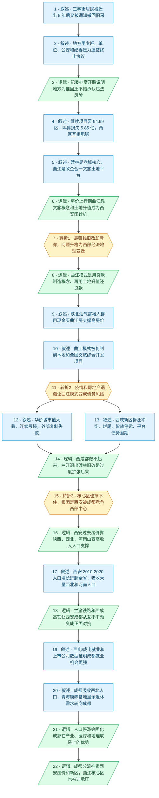

# 马督工方法论内容分析报告：【睡前消息1064】西北赛区西安赢 西部赛区成都赢

- 分析时间：2026-06-09 23:33 CST
- 发现选题数：1
- 实际分析选题：西安曲江旧改失败背后，是土地财政退潮与成都争夺西部中心共同削弱西安房地产支撑

---

## 1. 发现选题

| 编号 | 发现选题 | 中心问题 | 一句话梗概 | 独立性判断 | 置信度 |
|---:|---|---|---|---|---:|
| 1 | 西北赛区西安赢，西部赛区成都赢 | 为什么西安曲江新区连核心区旧改项目都做不下去，背后是单个项目失误、曲江债务，还是西部经济地理中心变化？ | 三学街回迁事件不是孤立的拆迁烂尾，也不只是曲江和碑林互相甩锅；曲江模式曾靠陕北富裕人口、文旅概念和土地财政变成西安的印钞机，但房地产退潮后失去隐性担保；更深层原因是铁路打通后西北和西南合并成西部赛区，成都用就业、医疗和康养优势分走西北高收入人口，拖累西安房价和曲江核心区。 | 独立成立：全篇只有一个中心问题，三学街回迁、曲江模式、华侨城、西咸新区、成都竞争和青海康养基地都服务于同一条因果链——西安土地财政支撑为何失效；每个材料从原文拆出都只能作证据，不能单独构成完整主线。 | high |

**结论：** 全文含 1 个可独立成篇的选题。表面上材料很多，包含三学街回迁、曲江债务、华侨城亏损、西咸新区烂尾、西安成都竞争、青海康养基地等多个段落，但这些段落都被同一个问题牵引：西安曲江为什么从最会炒地的城市平台，变成连核心旧改都不得不放弃的债务压力源。故直接分析该选题。

---

## 2. 带转折点的压缩总结与逻辑深度

人民日报披露西安三学街旧改把居民迁出 5 年后又劝回危房，甚至用"纪委办案开路"逼签终止协议，表面看是地方违法和两区甩锅。[T1 但是] 内城核心地块置换到远郊，本应是曲江最赚钱的项目，却变成两个区都扛不住的巨亏，问题升格为西部经济地理变化。曲江模式曾靠贷款造景区、陕北富裕人口买房和政府隐性担保，成了西安印钞机。[T2 但是] 疫情和房地产退潮切断卖地回款，1800 亿文投债务和政企拆分让曲江不再能兜底旧改。再追问核心区为什么也撑不住，[T3 然而] 西安不只缺房产税，更失去了西北中心的独占地位：兰渝铁路、西成高铁把西北和西南合并成西部赛区，成都用就业、医疗和康养优势分走西北高收入人口，稳住房价，西安新区和曲江核心区一起承压。

| 转折点 | 触发位置/内容 | 为什么是不可删除转折 | 作用 |
|---|---|---|---|
| T1 | "按常理来说是最赚钱的一种项目……但是……项目不仅赚不到钱……这就不是碑林区或者是曲江新区自己的问题了……而是整个西部的经济地理中心变迁的结果" | 表层判断被推翻：从"地方违法、项目烂尾、两区甩锅"翻转为"一个理论上最赚钱的城市核心旧改也亏穿"，问题被重新定位到西部经济地理中心变化；删掉这一折，后文的曲江模式和成都竞争都会失去入口 | 把本地新闻升格为结构问题，打开从拆迁个案到城市财政与区域竞争的主线 |
| T2 | "曲江投资的这些文旅项目……必须……把周围的土地高价卖出去才行。但是疫情改变了全国的投资逻辑……段先念留下的成熟开发模式，一瞬间就垮掉了" | 表层经验被推翻：曲江过去靠概念造景区、土地升值、政府平台扩张来还债，曾经是成功模式；这一折说明同一套模式在房地产退潮中变成债务黑洞，删掉它就解释不了曲江为何退出碑林旧改 | 把曲江从"西安最强土地开发商"反转为"失去隐性担保的文旅债务主体"，完成财政压力归因 |
| T3 | "为什么连自己的核心区都维持不住了。一方面是因为中国没有房产税……另外一方面，西安并没有成为预期中的西部中心，甚至连西北中心的地位都遇到了成都的竞争" | 问题再次反转：如果只说外部项目亏损，还解释不了核心区失守；这一折把曲江债务继续推进到人口和区域中心竞争，说明西安房地产需求端被成都分流，删掉它就无法扣回标题"西部赛区成都赢" | 把主线从曲江模式崩塌抬升到西安与成都争夺西部中心，解释西安房价和新区基础设施为何同时承压 |

- 转折点数量：3
- 逻辑深度判断：3 个转折，逻辑深但传播成本上升。三折分别完成"地方拆迁个案 → 区域经济地理问题"、"曲江成功模式 → 债务黑洞"、"曲江债务 → 西安成都人口竞争"三次升格，信息密度高于"三段叙事 + 两次转折"的标准模型；但每一折都顺着同一条因果链推进，没有拆成多个独立选题，观众可以用"三学街为什么亏穿？因为曲江模式失灵；曲江为什么失灵？因为西安被成都分流"来转述。

---

## 3. 叙事单元拆解

类型说明：叙述 = 展示事实；逻辑 = 解释因果；点缀 = 增加趣味但可删除；转折 = 打破预期、改变论证方向。

| 编号 | 类型 | 原文位置/线索 | 单句概括 | 主线作用 |
|---:|---|---|---|---|
| 1 | 叙述 | 开场，人民日报披露三学街旧改回迁 | 西安三学街居民 2020 年被征收，2025 年却被通知搬回空置 5 年、部分已成危房的旧房 | 起点：共同信息场，抛出反常旧改新闻 |
| 2 | 叙述 | "这个新闻最恐怖的地方并不是……而是劝居民搬回去的方式" | 地方成立专班和 17 个接谈组，甚至用纪委、公安和单位施压，快速逼居民签终止协议 | 放大异常：问题不只是回迁，而是动用权力压回迁 |
| 3 | 逻辑 | "纪委办案开路……有罪推定" | 作者认为"纪委办案开路"等于先设目标再找问题，说明地方为推回迁不惜承认违法风险 | 第一层解释：行政违法背后一定有更强压力 |
| 4 | 叙述 | "项目继续推进，需要再花 94.99 亿……叫停……5.85 亿" | 继续项目要再花 94.99 亿，叫停可把损失控制在 5.85 亿，曲江和碑林分别从监管与规划角度甩锅 | 财政事实：给出地方压力的直接数据 |
| 5 | 叙述 | "大多数观众可能不熟悉西安这两个行政区划的地位" | 碑林是西安老城核心，三学街靠近碑林博物馆和城墙，安置新房却在 17 公里外的渭河附近；曲江是政企合一的文旅土地开发平台 | 背景铺垫：解释为什么这个项目按常理应当赚钱 |
| 6 | 逻辑 | "在房价快速上涨的年代……变成了一台西安市自己控制的印钞机" | 曲江过去靠文旅概念、城市公园和土地升值拉高房价，成为西安自己控制的印钞机，并被不断外派操盘 | 第一层历史解释：曲江模式为什么曾经可靠 |
| 7 | 转折 | "按常理来说是最赚钱的一种项目……但是……不是……自己的问题……而是整个西部的经济地理中心变迁" | 转折1：本应最赚钱的内城置换远郊项目却亏到两个区都扛不住，问题从两区责任升格为西部经济地理中心变化 | T1：把拆迁个案翻成区域结构问题 |
| 8 | 逻辑 | "曲江新区最大的优势并不是文物古迹多……概念并不是被发现的，而是被发明的" | 段先念的曲江模式本质是用贷款制造文旅概念，再用概念抬高周边土地价值还贷款 | 解释曲江模式的机制 |
| 9 | 叙述 | "陕北人来西安买房……一次性付款……同一个小区拥有多套房产" | 曲江早期高房价由陕北油气富裕人群支撑，他们用现金在西安南郊买房保值、彰显省城资产 | 需求侧证据：曲江印钞机背后的购买力 |
| 10 | 叙述 | "曲江模式开始外扩……全国 11 个省 26 个市 55 个文旅城镇综合开发项目" | 段先念之后，曲江一边在本地继续造概念，一边把文旅综合开发模式复制到全国 | 扩张事实：说明曲江把本地成功经验当成全国打法 |
| 11 | 转折 | "但是疫情改变了全国的投资逻辑……成熟开发模式，一瞬间就垮掉了" | 转折2：曲江外扩项目靠卖地回款，房地产退潮后公共预算、卖地收入和融资平台债务同时恶化，政企合一体制被拆掉 | T2：把成功模式反转为债务风险 |
| 12 | 叙述 | "前面提到段先念……华侨城每年都在亏" | 段先念转去的华侨城在 2021 年后市值大跌、连续亏损，说明曲江模式在全国层面也进入退潮 | 并列证据：曲江模式外部复制失败 |
| 13 | 叙述 | "复制曲江模式最典型的地方还是西安的其他新区" | 西咸新区文旅拆迁出现致死冲突，498 米丝路中心烂尾，智轨停运，平台债务逾期 | 并列证据：西安内部新区复制也失败 |
| 14 | 逻辑 | "连众望所归的西咸新区都做不起来……曲江新区现在退出了碑林区的旧城改造项目" | 西咸新区都做不起来，说明曲江不能再替西安其他区域制造土地神话，退出碑林旧改是过度扩张后的必然结果 | 收束中段：把华侨城、西咸和三学街重新接回曲江旧改 |
| 15 | 转折 | "为什么连自己的核心区都维持不住了……西安并没有成为预期中的西部中心……遇到了成都的竞争" | 转折3：外部项目亏损还不够解释核心区失守，真正深层原因是西安没有成为预期西部中心，连西北中心地位也被成都竞争 | T3：从曲江债务翻到人口与区域中心竞争 |
| 16 | 逻辑 | "前面提到曲江新区抢在全国的房地产起步之前……原因是陕北的富裕人口流入" | 西安房地产过去的特殊优势，是从陕西本省、西北五省区以及河南山西吸收高收入和教育需求人口 | 解释需求端：西安房价原来靠谁支撑 |
| 17 | 叙述 | "2010 年到 2020 年……西安同期增长了将近 450 万人" | 2010 到 2020 年西安人口增长远超全省，吸收 41 万西北人口，并借教育资源吸引河南、山西人口 | 数据证据：西安曾经确实能跨区域吸人口 |
| 18 | 逻辑 | "2017 年以后，西北的交通地理出现两个变化" | 兰渝铁路和西成高铁打通后，西北人口可以更快进入西南，西安与成都从隔山互不干预变成正面对抗 | 机制变化：西北赛区与西南赛区合并为西部赛区 |
| 19 | 叙述 | "西安和成都对抗在就业方面最好的风向标是两个城市的电子科技大学" | 西电毕业生有 4% 去成都，成电去西安比例可忽略；成都 A 股上市公司数量和民企机会也明显多于西安 | 就业证据：成都对年轻人的吸引力更强 |
| 20 | 叙述 | "成都吸引的甘肃人和陕西人加起来又是 12 万……青海省成都康养基地" | 成都已吸收可观西北人口，青海唯一省外康养基地选在成都，连体制内退休人群也在转向成都 | 人口与养老证据：成都同时抢年轻劳动力和高收入退休需求 |
| 21 | 逻辑 | "这些人口流向影响了两个城市的规划目标" | 人口总量停滞会固化现有格局，而成都在新兴产业、医疗资源和联系西北/西藏的地理潜力上更有优势 | 第二层解释：为什么西安未来更难反超 |
| 22 | 逻辑 | "中国所有城市的建设规划都是在房地产上行期制定的……这是西安现在债务压力的主要来源" | 房地产下行期叠加成都分流后，西安新区基础设施过剩、二手房价崩塌，连曲江核心区也被拖累并被迫放弃政企合一 | 终点：扣回三学街旧改和西安债务压力 |

---

## 4. 叙事结构模式

因果→并列→因果，切换 2 次：开头从三学街回迁反推出曲江财政压力，再追溯曲江模式如何形成和崩塌，是一条因果线；中段用华侨城、西咸新区等并列案例补强"曲江模式外扩失败"；后段再回到西安成都竞争的因果链，用就业、上市公司、人口普查、青海康养基地等证据说明成都如何分流西北高收入人口。后段内部也有多组并列数据，但都服务于同一个因果结论，不另算主线切换。

---

## 5. 一维叙事结构图

节点形状与颜色对应单元类型：叙述 = 蓝色矩形 `[ ]`，逻辑 = 绿色平行四边形 `[/ /]`，点缀 = 灰色矩形 + 虚线边框，转折 = 琥珀色六边形 `{{ }}`。节点编号与 Section 3 单元一一对应。

---

## 6. 选题为什么成立

### 6.1 选题本质三要素

| 要素 | 文章中的体现 |
|---|---|
| 共同信息场 | 5 月底人民日报披露西安三学街旧改回迁事件，"搬回危房"和"纪委办案开路"都容易形成公共讨论；更大的共同背景是普通观众都熟悉的房地产下行、地方债、新区烂尾和西安成都城市竞争 |
| 最新变化 | 2025 年三学街项目被叫停并要求居民回迁；2026 年 4 月西安市拆掉政企合一的曲江新区，只保留文旅产业集团身份；2026 年 5 月西咸新区发展集团债务逾期被披露；这些变化让曲江模式失灵从长期趋势变成当期新闻 |
| 行动建议 | 对观众的认知建议是：不要把三学街看成单个拆迁丑闻，也不要只归咎于曲江/碑林管理问题，而要用"区域中心竞争 + 人口流向 + 房地产债务"这把尺子判断新区规划和地方债风险；对城市规划的隐含建议是，在人口停滞期不要继续按上行周期幻想自己会成为区域中心 |

### 6.2 八个选题方向匹配

| 方向 | 匹配度 | 证据 | 说明 |
|---|---|---|---|
| 挖掘历史感 | 高（主） | 从段先念 1991 下海、2002 主政曲江、2003 建大雁塔概念、2007 成为副市长、2014 去华侨城，一路追到 2021-2026 的债务和政企拆分 | 把今天的旧改失败放到 20 多年的曲江模式兴衰中看，解释同一套成功经验为什么变成失败根源 |
| 关注群体内部矛盾 | 高（主） | 曲江新区 vs 碑林区、曲江文旅企业债务 vs 市级政府公益性债务、原住户 vs 拆迁平台、西安 vs 成都、青海体制内退休人群的去向选择 | 不把"西部"、"地方政府"或"购房人群"当成铁板一块，而是拆出区县、平台公司、城市和人口流向之间的真实竞争 |
| 帮群体算账 | 中高（次） | 项目继续/叫停的成本账，曲江债务分家"谁的孩子谁抱"，西电/成电就业流向，成都 123 家上市公司 vs 西安 65 家 | 把城市叙事换算成钱、债务、人口和就业机会，让观众能判断谁在为规划失败买单 |
| 数据分析与合订本 | 中高（次） | 94.99 亿 vs 5.85 亿、2023 年曲江公共预算收入 33.38 亿且同比少近 30%、卖地收入降 50%、曲江文投近 1800 亿债务、西咸发展集团 2095.43 亿有息债务、西安/成都上市公司与人口数据 | 数据是关键证据工具，用来拼合跨年份、跨城市、跨平台趋势，但主轴仍是曲江模式兴衰和西部内部竞争 |
| 关注普通人生活 | 中 | 三学街居民被要求搬回旧房、工作人员到单位找家属、青海康养基地需要干部自己出购房经费 | 把宏观区域竞争落到住户、购房养老、子女教育和房价支撑这些普通生活场景 |
| 审查完美故事 | 中 | 审查"曲江文旅概念能永远抬地价"、"西咸新区众望所归"、"西安天然是西北中心"三个看似完美的城市故事 | 关注没有展示出来的成本：平台债务、政府隐性担保断裂、人口需求被邻城分流 |
| 调动观众参与感 | 中低 | 西安、成都、青海、甘肃、河南、山西观众都能用自己身边的人口流向和房价经验对号入座 | 参与感主要来自地域经验，不是作者主动设计互动机制 |
| 教科书加 | 低 | 只有城市化、区域中心、人口普查、铁路交通这些常识性背景 | 课本知识只是背景门槛，不构成主匹配方向 |

**主匹配方向：** 挖掘历史感 + 关注群体内部矛盾

**次匹配方向：** 帮群体算账、数据分析与合订本、关注普通人生活、审查完美故事

### 6.3 否定选题校验

| 校验项 | 结果 | 理由 |
|---|---|---|
| 自己是否愿意分享 | 通过 | "西安和成都谁是西部中心"是地域认同和房价预期都能参与的话题，三学街回迁又提供了足够具体的新闻钩子，私人聊天里容易转述 |
| 是否绕开完美故事 | 通过 | 文章没有讲曲江或成都的成功神话，而是审查曲江模式、西咸新区、西安西北中心三个完美故事背后的债务和人口成本 |
| 是否避免纯反驳 | 通过 | 虽然反驳了"曲江/碑林管理失误"和"曲江外部项目亏损而核心还能稳"的表层解释，但每次都给出正面归因：曲江模式债务结构、成都分流西北人口、房地产上行期规划落空 |
| 转折点数量是否合适 | 偏高但成立 | 3 个转折超过标准模型，传播成本较高；不过三折是连续升格，不是横向分叉：拆迁个案升到曲江模式，曲江模式升到区域竞争，区域竞争回扣西安债务压力，逻辑深度与素材规模匹配 |

---

## 7. AI 总评（供参考）

这期是一个"本地丑闻入口 + 城市平台兴衰史 + 区域中心竞争"的长链条选题。最关键的是 T1：如果只讲三学街居民被迁出又被劝回，文章会停在地方违法和拆迁伦理；马督工把它翻成"内城核心置换远郊也亏穿"，马上把个案抬到土地财政和经济地理层面。T2 再把曲江模式从印钞机反转为债务黑洞：同样是贷款造概念、文旅抬地价、卖地还债，在房地产上行期是神话，在退潮期就是 1800 亿债务和政企拆分。T3 则进一步解释为什么连核心区都不稳：西安过去靠西北和周边省份的人口、教育和退休需求支撑房价，但铁路打通后，成都不再只是西南中心，而是直接进入西部赛区，用就业、医疗、康养和民企机会分流西北高收入人口。

结构上的代价是素材密度很高。曲江模式、华侨城、西咸新区、西电/成电就业、青海康养基地每一段都能单独展开，但原文没有把它们拆成多个选题，而是让它们分别承担因果链上的证据功能：曲江解释平台债务，西咸解释新区概念失灵，成电/西电解释就业流向，青海康养解释退休购买力流向。只要抓住"西安房地产需求端被成都分流"这一句，整期材料就不会散。

### 可复用的创作公式

地方反常新闻（居民搬回危房、纪委办案开路）→ 算一笔项目账（继续 94.99 亿、叫停 5.85 亿）→ T1 把个案升格为区域经济地理问题 → 追溯一个地方平台的成功机制（曲江用概念和贷款制造土地升值）→ T2 说明同一机制在房地产退潮中反转成债务 → 用外部复制失败案例补强（华侨城、西咸新区）→ T3 追问需求端为什么不再托底 → 用交通、就业、人口、养老和医疗数据证明邻近中心城市分流需求 → 回扣原始新闻：旧改失败不是单点事故，而是上行期规划在下行期落空。

### 可改进处

1. 中段华侨城和西咸新区两个案例都很重，华侨城更多证明段先念模式在全国退潮，西咸更多证明西安内部新区做不起来；如果压缩节目，可以保留西咸、弱化华侨城，主线会更贴近西安。
2. T3 后的证据很多，西电/成电、上市公司、成都吸收西北人口、青海康养基地都有效，但普通观众可能记不住全部。可以把它们统一压成一句传播钩子："年轻人看就业去成都，退休干部看医疗康养也去成都。"
3. 结尾的行动建议偏隐含，更多是认知建议而非政策方案。若按马督工常见打法，可以再补一层明确建议：人口停滞期的城市规划要按竞争失败情景做压力测试，不能继续用上行期的区域中心假设举债建新区。
