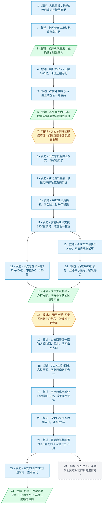

# 马督工方法论内容分析报告：【睡前消息1064】西北赛区西安赢 西部赛区成都赢

- 分析时间：2026-06-09
- 发现选题数：1（头条选题，按用户指定只分析这一条叙事链）
- 实际分析选题：西安曲江新区放弃三学街片区回迁，背后是西部赛区合并后成都对西安的正面竞争

---

## 1. 发现选题

| 编号 | 发现选题 | 中心问题 | 一句话梗概 | 独立性判断 | 置信度 |
|---:|---|---|---|---|---:|
| 1 | 西安曲江/碑林三学街片区放弃回迁，揭示西安房地产模式崩塌的真实原因 | 为什么西安最强国资开发商在最核心地块上、用最赚钱的拆迁置换模式，反而亏到要动用纪委逼居民回迁？ | 一桩"让居民搬回废楼"的人民日报新闻，被一路反推到西成高铁贯通后西部赛区合并、成都把西安压成区域第二的经济地理大势 | 独立。中心问题清晰，因果链完整：表层事件→曲江模式兴衰→西部经济地理结构变迁→西安债务压力来源 | 高 |

**结论：** 用户已指定只分析头条选题（即 frontmatter title 指向的这条主线），不再展开其他选题判断。整篇节目就是围绕这一个中心问题的单条因果链，从碑林区废楼事件一路推到成都吸走西北人口，逻辑一贯，可独立成篇。

---

## 2. 带转折点的压缩总结与逻辑深度

人民日报报出：西安曲江新区2020年从碑林区核心地段拆迁的居民，2025年被动用纪委逼着搬回已成废楼的原址，止损5.85亿好过继续投94.99亿。表面看是两区相互甩锅，且这是西安最强开发商×内城地块×远郊置换的"最赚钱组合"。[T1 但是]项目反而亏到两区都接不住，问题不在单个区或西安市，而在整个西部经济地理变迁：曲江模式当年靠陕北油气富豪和西北外溢人口撑起印钞机，疫情后失灵，西咸新区、华侨城复制也全军覆没。[T2 然而]即便能解释外扩失败，核心区为何也守不住？因为2017年兰渝铁路与西成高铁把西北、西南两个互不干预的赛区合并成一个西部赛区，成都凭民营经济、医疗、上市公司数量正面分走甘青陕外溢人口，连青海老干部康养基地都选了成都。西安在土地财政下行时撞上区域中心地位丢失，核心区房价崩塌、曲江政企合一被迫拆解，这才是西安当前债务压力的真正来源。

| 转折点 | 触发位置/内容 | 为什么是不可删除转折 | 作用 |
|---|---|---|---|
| T1 | "但是在说服原有的居民全部接受置换计划之后，项目不仅赚不到钱，还要亏一笔两个区都承担不起的巨款。这就不是碑林区或者是曲江新区自己的问题了……而是整个西部的经济地理中心变迁的结果。" | 表层判断（最强开发商×核心地块=最赚钱）被推翻；责任主体从"两区互相甩锅"被重新定位到"整个西部经济地理"；问题从个案上升为结构 | 把读者从"地方政府办事不力"的常识解释中拽出来，承诺一个更深的解释，为后半段曲江模式溯源和西部赛区分析铺路 |
| T2 | "曲江新区在外面的项目亏钱可以理解，为什么连自己的核心区都维持不住了。"随即给出答案：西安丢掉西北中心地位、被成都竞争 | 第一层解释（曲江模式靠陕北富豪+土地财政红利）只能解释外扩失败和总量下滑，但解释不了核心地段也维持不住；这里把因果从"模式失灵"再向下挖一层，转到"区域经济地理重组" | 完成从"模式失灵"到"区位失守"的升级。没有这个转折，结论会停在"曲江模式有问题"的常规财经叙事，无法落到"西部赛区合并 → 成都赢"的标题论点 |

- 转折点数量：2
- 逻辑深度判断：2 个转折，符合"三段叙事 + 两次转折"标准模型，传播性价比较高

---

## 3. 叙事单元拆解

类型说明：叙述 = 展示事实；逻辑 = 解释因果；点缀 = 增加趣味但可删除；转折 = 打破预期、改变论证方向。

| 编号 | 类型 | 原文位置/线索 | 单句概括 | 主线作用 |
|---:|---|---|---|---|
| 1 | 叙述 | 开场静静介绍话题、人民日报报道 | 西安曲江新区2020年从碑林区拆迁的居民，2025年被通知搬回已成废楼的原址 | 引入共同信息场（人民日报新闻），抛出反常事实 |
| 2 | 叙述 | 副区长董鹏自述"纪委办案开路"、追缴3400万 | 地方政府动用纪委施压居民回迁，副区长亲口承认有罪推定 | 把反常事实推到极致，激起观众"为什么要这么干"的疑问 |
| 3 | 逻辑 | "翻译一下副区长的话……更恐怖的财政问题" | 政府公开承认违法，背后只可能是更恐怖的财政压力 | 第一层解释：把事件性质从"作风问题"重定为"财政问题" |
| 4 | 叙述 | 94.99亿继续投 vs 5.85亿止损、两区互相甩锅 | 项目继续推进要再花95亿，止损只损5.85亿；曲江说碑林乱花钱，碑林说曲江规划太大 | 量化财政压力的具体数字，呈现两区第一层归因（互相甩锅） |
| 5 | 叙述 | 碑林区1955年成立、城墙内最核心地块、曲江新区2003年成立、政企合一 | 碑林区是西安老城核心，三学街相当于"北京前门"；曲江新区是政企合一的最强国资开发商 | 给非西安观众补足空间背景，让"内城拆远郊"的反常感成立 |
| 6 | 逻辑 | "按常理来说是最赚钱的一种项目……就算房地产下行期也不至于亏损" | 西安最强开发商×内城地块×远郊置换，按常理是最稳赚的组合 | 把读者预期推到顶点，准备 T1 反转 |
| 7 | 转折 | "但是在说服原有的居民全部接受置换计划之后，项目不仅赚不到钱，还要亏一笔两个区都承担不起的巨款……而是整个西部的经济地理中心变迁的结果" | 转折1：项目反而要亏到两区都接不住，问题不在两区甚至西安市，而在整个西部经济地理变迁 | T1。把责任主体从"两区"上升到"西部经济地理"，承诺更深的解释，开启后半段 |
| 8 | 叙述 | 段先念履历、2002年大慈恩寺扩建、亚洲最大喷泉广场、唐僧顶骨舍利 | 段先念发明曲江模式：用贷款造概念，再用概念抬地价还贷款 | 历史溯源，解释曲江模式的方法论 |
| 9 | 叙述 | 陕北油气富豪一次性付款买房、2002年30万/亩涨到600万/亩、"陕北话最常见" | 陕北油气回购造出一批现金富豪，撑起曲江前期高价房盘 | 解释曲江模式的需求侧来源 |
| 10 | 叙述 | 2012曲江走出去战略、太行山大峡谷、荆州纪南、海口秀英区等11省26市55项目 | 段先念之后曲江模式向全国输出，曲江文旅成为对外品牌 | 展示模式扩张的规模 |
| 11 | 叙述 | 2023年公共预算-30%、卖地收入-50%、曲江文投1800亿债务、2025年4月拆掉政企合一 | 疫情后曲江找不到新陕北富豪，1800亿债务压顶，被迫拆掉政企合一体制 | 第一层解释收束：曲江模式在总量层面失灵 |
| 12 | 叙述 | 华侨城段先念退休后4年亏400亿、市值860→150亿 | 段先念去华侨城复制曲江模式，结果央企也亏到证监局警示 | 用横向案例补强：模式本身不灵了 |
| 13 | 叙述 | 西咸新区2023年拆迁打死人案、原住户取保候审 | 西咸强拆出人命，说明政府平台2023年已严重缺资金 | 用极端个案补强：复制曲江的西咸也撑不住 |
| 14 | 叙述 | 西咸新区6家子公司28.63亿逾期、有息债务2095亿、80.67%负债率、丝路中心烂尾、智轨停运 | 西咸新区2095亿债务、第一高楼烂尾、智轨7亿投资停运 | 数据补强：复制曲江模式的西咸新区彻底失败 |
| 15 | 逻辑 | "曲江新区在外面的项目亏钱可以理解，为什么连自己的核心区都维持不住了" | 模式失灵能解释外扩失败，但解释不了核心地段为何也守不住 | T2 前的承上：暴露第一层解释的解释力天花板 |
| 16 | 转折 | "一方面是因为中国没有房产税……另外一方面，西安并没有成为预期中的西部中心，甚至连西北中心的地位都遇到了成都的竞争" | 转折2：核心区也守不住，因为西安丢掉了西北中心地位，被成都正面竞争 | T2。把因果再下挖一层，从"模式失灵"转到"区位失守"，引出标题论点 |
| 17 | 叙述 | 2010-2020陕西人口+220万，西安+450万；西安吸西北41万（甘肃30万）；河南37万、山西人也来 | 过去西安凭"西北一家独大"和省内外溢，吸光陕西、西北四省及河南山西人口 | 展示西安过去的人口优势 |
| 18 | 叙述 | 2017兰渝铁路全线、西成高铁全线、3.5小时到成都 | 2017年两条铁路贯通，西北与西南交通障碍被打通，两个赛区开始合并 | 提供结构变量的客观时间节点 |
| 19 | 叙述 | 西电毕业生4%去成都，成电去西安"忽略不计"；西安65家A股33家国企，成都123家A股仅29家国企 | 同档次电子科大对比：成电毕业生不去西安、西安上市公司一半是国企门槛高 | 用企业和就业数据证明：成都给年轻人的机会远超西安 |
| 20 | 叙述 | 成都吸河南12万（西安1/3）、甘肃陕西各12万、青海新疆等共20万西北人口 | 2020年人口普查：成都已吸20万西北人口，且通车仅3年 | 用直接人口流向数据证明竞争结果 |
| 21 | 叙述 | 青海干休所3个（西安+咸阳）vs 成都1个；2024年青海唯一省外康养基地落地成都新都 | 体制内信号：青海老干部康养基地选成都而非西安，体制外打工人去向第二是四川 | 用"摇摆省份青海"的体制内外双重信号收紧论证 |
| 22 | 叙述 | 2021年西安规划1560万/配置2000万；成都规划2350万/配置2800万；当前都停滞 | 两市规划目标对比，西安差237万、成都差197万，人口总盘见顶下停滞固化 | 把竞争结果定格为长期格局 |
| 23 | 点缀 | "莲湖公园观察过这些老人的自发娱乐活动" | 督公个人在西安老城见过这些西北体制内退休老人 | 现场感细节，删除不影响主线 |
| 24 | 逻辑 | 收束段：所有城市规划都按上行期制定；西安在土地财政上行期靠西北一家独大培育曲江，下行期撞上铁路打通后成都正面竞争；曲江核心区被拖累、政企合一被迫拆解 | 终点结论：西部赛区合并 + 土地财政下行同时发生，成都赢、西安输；曲江体制崩塌是西安当前债务压力的主要来源 | 把 T1+T2 收束成对开篇事件的最终解释，闭环 |

---

## 4. 叙事结构模式

因果，主线无切换。整篇用一条单一因果链推进：表层事件 → 财政压力 → 曲江模式失灵 → 区位失守 → 终点结论；中间穿插的西咸/华侨城/青海等多组案例都是同一节点上的并列补强，没有把主线切到"并列模式"，仍服务于同一条因果链。

---

## 5. 一维叙事结构图

节点形状与颜色对应单元类型：叙述 = 蓝色矩形 `[ ]`（typeA），逻辑 = 绿色平行四边形 `[/ /]`（typeB），点缀 = 灰色矩形 + 虚线边框（typeC），转折 = 琥珀色六边形 `{{ }}`（typeD）。节点编号与 Section 3 单元一一对应。

---

## 6. 选题为什么成立

### 6.1 选题本质三要素

| 要素 | 文章中的体现 |
|---|---|
| 共同信息场 | 三层叠加：① 人民日报当期"逼居民搬回废楼"的新闻，是当周全国性谈资；② 西安/成都作为西部两座头部城市，是几乎所有中国观众都有印象的"区域中心"模板；③ 房地产土地财政与城投平台债务，是过去三年所有城市观众都在亲身经历的共同生活背景 |
| 最新变化 | ① 2025年4月西安市政府宣布拆掉政企合一的曲江新区（"中央托底不兜底"）；② 2025年6月人民日报曝光三学街片区放弃回迁、"纪委办案开路"；③ 2024年青海唯一省外康养基地落地成都而非西安；④ 西咸新区2025年5月披露28.63亿子公司逾期、2095亿有息债务。这些都集中在最近 12 个月、过去未被打通讲过 |
| 行动建议 | 不是给个人的"该不该买西安房产"操作建议，而是给所有观众的认知建议：理解城市命运要看交通基础设施带来的区域赛区重组，而不是城市单兵的招商运营能力；理解地方债务危机要看区位竞争而不是单个班子的水平。可以用来重新审视佛山/广州、晋中/太原、抚顺/沈阳等所有"被合并的次中心"案例 |

### 6.2 八个选题方向匹配

| 方向 | 匹配度 | 证据 | 说明 |
|---|---|---|---|
| 教科书加 | 高 | "西北一家独大→西部赛区合并""核心-边缘""经济地理"等概念，是中学地理/大学经济地理的核心框架；西成高铁、兰渝铁路是地理课本式的硬基建 | 用义务教育阶段就埋下的"中心城市/区域经济"基础认知，去解释一桩当代新闻，门槛低、纵深够 |
| 关注普通人生活 | 中 | 三学街居民、被纪委找上门的女儿、莲湖公园里的西北体制内退休老人、西咸被打死的拆迁队员、河南三门峡的中考状元家长 | 不停留在数据，反复回到具体的人；督公自己提到"我过去住在西安老城……观察过"，把宏观结构落回观众能想象的场景 |
| 帮群体算账 | 高 | 94.99亿续投 vs 5.85亿止损、曲江文投1800亿+曲江政府481亿债务、华侨城4年亏400亿、西咸2095亿有息债务、西电毕业生4%去成都、青海干休所3:1、规划目标差237万vs197万 | 几乎每一节都给量化数字，把"区位竞争"这种宏大叙事换算成可比较的财务/人口数 |
| 关注群体内部矛盾 | 高 | 西安 vs 成都的人口争夺、曲江新区 vs 碑林区互相甩锅、西安市政府 vs 老百姓（动用纪委）、西部赛区内甘青陕宁居民的"用脚投票" | 不把"西部""西北人"当铁板一块，而是反复呈现内部正在分化的真实矛盾 |
| 挖掘历史感 | 高 | 段先念1991年下海→1996回国资→2002曲江主任→2014华侨城→2022退休的完整二十年轨迹；陕北油气21世纪初回购造出富豪群；2017两条铁路改写区域地理 | 这是反向挖历史：从当下一个具体地块的失败，追到段先念个人轨迹和陕北油气回购等经济条件，是"督公式历史感"的典型 |
| 调动观众参与感 | 中高 | 大部分观众都买过房、关心房价、知道土地财政、对地方债危机有切身感受；西成两市的对比能让任何西部城市观众代入"我家城市是赢家还是输家" | 北京前门类比、五环到六环类比、佛山广州/晋中太原/抚顺沈阳类比，全部都在帮观众用熟悉的生活经验直接触碰话题 |
| 数据分析与合订本 | 高 | 横向（同期对比）：西安1560万 vs 成都2350万、西电 vs 成电、A股33国企/65 vs 29国企/123、成都吸西北人口20万 vs 西安41万；纵向（合订本）：2002年地价30万/亩→2007年600万/亩、华侨城2021市值860亿→2025年150亿、西安2010-2020年+450万 | 大量横纵对比，单看任意一组都不够说服力，组合起来构成"赛区重组"的证据链 |
| 审查完美故事 | 中 | 曲江模式过去十年被反复包装成"国资创新""文旅模板""走出去战略"的完美样本，这期节目就是去翻它没展示的那一面：成本由谁出、债务谁承担、外扩项目实际亏多少 | 不是主匹配，但确实在做"完美故事"反审 |

**主匹配方向：** 帮群体算账 + 挖掘历史感 + 数据分析与合订本（三者并列同等重要）

**次匹配方向：** 教科书加、关注群体内部矛盾、调动观众参与感

### 6.3 否定选题校验

| 校验项 | 结果 | 理由 |
|---|---|---|
| 自己是否愿意分享 | 通过 | 这是西部所有大中城市居民、所有关心地方债的观众都会愿意转发给亲友的"原来如此"型选题，私人场合也能讲完整 |
| 是否绕开完美故事 | 通过 | 选题本身就是在审查"曲江模式"这一过去十年的官方完美样本；同时反复用"为什么连核心区都维持不住"这类自我反问推翻自己刚给出的解释，避免把新故事再讲成完美故事 |
| 是否避免纯反驳 | 通过 | 不是反驳人民日报或西安政府的某个说法，而是借这条新闻搭建一个正面解释框架（西部赛区合并 + 土地财政下行）；T1、T2 之后都有完整的正面论述 |
| 转折点数量是否合适 | 通过 | 2 个不可删除转折，正好命中"三段叙事 + 两次转折"标准模型，传播性价比最高；T1 把视角从地方甩锅升级到经济地理，T2 把视角从模式失灵升级到区位失守，每次升级都有充分的事实和数据撑住 |
| 叙事结构切换次数 | 通过 | 因果，主线无切换，所有并列案例（华侨城、西咸、青海康养、电子科大对比）都挂在同一条因果链上作为补强 |

---

## 7. AI 总评（供参考）

这是一条"地方新闻 → 全国结构"的教科书级深挖样本。督工拿到的不过是人民日报一条"居民被劝回废楼"的常规舆论监督，却没有停在"地方政府粗暴执法""官员腐败""国资乱投资"这些任意一个常见解释上，而这些都是其他媒体已经写过、足以收获一篇 10w+ 的舒适解释。督工的处理是把每个看似足够的解释都再问一次"为什么"，逼出更深的一层：

- 为什么要动用纪委？→ 财政压力（解释1）
- 财政为什么这么紧？→ 项目要再亏几十亿（解释2）
- 这种最赚钱组合为什么亏？→ 不是两区问题，是西部经济地理变迁（**T1**）
- 经济地理怎么变？→ 曲江模式失灵，西咸/华侨城复制都失败（解释3）
- 那为什么连曲江核心区都守不住？→ 西安丢了西北中心地位，被成都正面竞争（**T2**）
- 成都凭什么赢？→ 2017 兰渝+西成高铁打通赛区边界 + 民营经济 + 医疗 + 体制内信号

每一次"再问一次"都不是修辞，都伴随着新的数据组、新的横向案例或新的历史线索。这就是为什么这期看似在讲西安，最终能稳稳落到"中国所有城市的建设规划都是在房地产上行期制定的"这个普适结论上，因为前面每一层都铺得够实，结论不是抒情而是推理。

特别值得称道的两个手法：

1. **把"摇摆省份"作为最优证据**。论证"西部赛区合并、成都胜出"，没有用 GDP、没有用人口总数，而是用青海这个对甘肃和四川都有出口的省份做关键证据：青海老干部康养基地选成都、青海打工人去四川多过去陕西、青海干休所虽然 3:1 偏向西安但那是历史路径依赖。摇摆变量比稳定变量更能证明趋势转折，这是统计学和政治分析里都成立的方法论本能。
2. **结尾对位开篇**。从"居民搬回废楼"出发，最后落回"曲江新区被迫退出碑林区旧城改造项目，就是之前过度扩张的表现"，把开篇的反常新闻收回到一个完全合理的结构性结论。读完不会有"督公又开始讲他的西部宏论"的脱节感，而是"这事确实就该这么解释"。

唯一可挑剔的是：第二次转折后的西安-成都对比部分用了 6-7 个并列案例（高铁、电子科大、A股、人口普查、青海、规划目标），并列项偏多。但因为每个案例都很短、且都服务于同一论点，没有破坏因果主线，只能算"在性价比上限的边缘试探"。

### 可复用的创作公式

**"地方新闻 → 区域经济地理 → 全国结构"五步深挖法**

| 步骤 | 动作 | 1064 期的对应 |
|---|---|---|
| 1 | 抓住一条带反常细节的地方新闻作为入口 | 拆完5年又劝居民搬回废楼 + 副区长亲口承认"纪委办案开路" |
| 2 | 给出第一层常识解释，然后用一句数据/事实把它推翻 | 两区甩锅 → 但 95 亿亏损不是地方层面能扛的 |
| 3 | **T1：把责任主体上升一级**（个人→单位→城市→区域→全国/全球） | 不是两区问题，是整个西部经济地理变迁 |
| 4 | 用历史溯源 + 横向案例并列补强新解释（不要切回并列模式，让案例服从单一因果） | 段先念二十年轨迹 + 华侨城 + 西咸 + 丝路中心 + 智轨 |
| 5 | **T2：再问一次"那为什么这一层也守不住"**，把因果再下挖到结构变量层（地理/技术/制度） | 没有房产税 + 西成高铁打通赛区边界 → 区位失守 |
| 6 | 终点收回到开篇的具体事件，给出闭环结论 | 西部赛区合并 + 土地财政下行 = 三学街放弃回迁的真因 |

**两个证据布阵小技巧**：
- **摇摆变量优先**：要证明趋势转折，找一个"过去明确属 A、现在开始动摇"的边界变量（如青海之于西安/成都），比直接比 A、B 两边的存量更有说服力。
- **同名机构横向对比**：西安电子科大 vs 成都电子科大、佛山广州 vs 晋中太原 vs 抚顺沈阳，同名同档次的对照能让对比天然合法，免去解释"为什么挑这两个比"的成本。

### 可改进处

- **T2 之后的并列案例稍多**。高铁、电子科大、A股、人口普查、青海、规划目标六组并列堆在最后 1/3，对耐心一般的观众会显得密集。可考虑把"西电 vs 成电"和"A股国企占比"合并成"产业-就业一体化"一段，把"青海干休所"和"康养基地"合并成"青海体制内信号"一段，降到 4 组以内。
- **碑林区的"民生工程不能超出承受能力"那句官话没有展开**。这其实可以作为反讽材料用一句话点一下："碑林区在 2025 年才学会量力而行，但 2020 年拆迁时为什么没想到"，可以加强对地方决策机制的批判力度，目前这句被简单略过了。
- **结尾对"普通观众怎么办"的行动建议偏弱**。整期落在"西安恐怕很难再反超"，更像分析师结论而非自媒体结论。可以再给一条认知/行动收尾，比如"判断一座城市的命运，要看它在新形成的区域赛区里是中心还是边缘"，把方法论显式交给观众。
