# 马督工方法论内容分析报告：【睡前消息1064】西北赛区西安赢 西部赛区成都赢

- 分析时间：2026-06-09
- 发现选题数：1
- 实际分析选题：西安曲江模式兴衰与西部城市竞争

---

## 1. 发现选题

| 编号 | 发现选题 | 中心问题 | 一句话梗概 | 独立性判断 | 置信度 |
|---:|---|---|---|---|---:|
| 1 | 西安曲江模式兴衰与西部城市竞争 | 为什么西安最强的房地产项目连核心区都保不住？ | 西安曲江政企合一体制因财政危机被迫拆解，根源在于成都通过高铁网络争夺西北人口，西安失去西部中心地位 | 唯一选题，全文围绕同一因果链展开 | 9 |

**结论：** 独立选题数为 1，继续分析。

---

## 2. 带转折点的压缩总结与逻辑深度

西安碑林区三学街拆迁户被要求搬回废弃旧房，区政府动用纪委施压，项目继续推进需再投 95 亿、叫停仅亏 5.85 亿。[T1 但]这不是碑林区或曲江新区的局部问题，而是整个西安的财政结构性困境：曲江模式靠概念造城、陕北富豪接盘，疫情后收入腰斩、债务超 2200 亿，政企合一体制被拆解。[T2 而]更深层原因不是曲江模式本身失败，而是西安在区域竞争中落败——兰渝铁路和西成高铁打通后，成都正面对抗西安争夺西北人口，就业、医疗、养老全面占优，西安房价跌幅更深，连曲江核心区都被拖垮。

| 转折点 | 触发位置/内容 | 为什么是不可删除转折 | 作用 |
|---|---|---|---|
| T1 | 第9段："这就不是碑林区或者是曲江新区自己的问题了……而是整个西部的经济地理中心变迁的结果" | 删除后故事停留在地方腐败/规划失误的个案层面，无法进入结构性分析 | 把问题从个案提升到城市财政结构 |
| T2 | 第41段起："2017年以后，西北的交通地理出现两个变化……西安和成都开始正面对抗" | 删除后结论变成"曲江模式本身有缺陷"，忽略了外部竞争变量，因果链不完整 | 把问题从模式失败重新定位为区域竞争失利 |

- 转折点数量：2
- 逻辑深度判断：2（标准模型，传播性价比较高）

---

## 3. 叙事单元拆解

类型说明：叙述 = 展示事实；逻辑 = 解释因果；点缀 = 增加趣味但可删除；转折 = 打破预期、改变论证方向。

| 编号 | 类型 | 原文位置/线索 | 单句概括 | 主线作用 |
|---:|---|---|---|---|
| 1 | 叙述 | 第10段，主持人开场 | 2020年西安曲江新区征收碑林区三学街居民房屋，2025年要求搬回废弃旧房 | 起点事实：拆迁事件引出话题 |
| 2 | 叙述 | 第11段，马督工读人民日报原文 | 副区长承认"纪委办案开路"，97%签约率靠施压达成 | 展示地方政府的极端手段 |
| 3 | 逻辑 | 第12段 | "纪委办案开路"等于有罪推定，逻辑上站不住，暗示当年拆迁也用了类似手段 | 揭示权力滥用的逻辑 |
| 4 | 叙述 | 第13段 | 继续推进需94.99亿，叫停仅亏5.85亿，两区相互甩锅 | 引出财政危机的核心数据 |
| 5 | 叙述 | 第14-15段 | 碑林区说项目规划太大超出负担能力，曲江新区说花钱没有监管 | 展示两区互相推卸责任 |
| 6 | 叙述 | 第15-16段 | 碑林区是西安最老的区，三学街在碑林博物馆旁相当于北京前门；曲江新区2003年成立，是政企合一的土地开发商 | 介绍两个行政区的背景 |
| 7 | 逻辑 | 第18段 | 曲江新区靠文旅概念提高地价，前期贷款轻松还掉，变成西安市的印钞机 | 解释曲江模式的成功机制 |
| 8 | 叙述 | 第19段前半 | 碑林区三学街项目是内城地块置换到远郊区，按常理是最赚钱的项目 | 强调项目的合理预期 |
| 9 | 转折 | 第19段后半 | 项目不仅赚不到钱还要亏巨款，这不是两个区的问题，而是整个西部经济地理中心变迁的结果 | 转折1：从个案提升到结构性问题 |
| 10 | 叙述 | 第20-21段 | 段先念2002年主政曲江新区，发现"概念不是被发现的而是被发明的"，可以贷款造概念再用概念还贷款 | 追溯曲江模式的发明者和核心逻辑 |
| 11 | 点缀 | 第22-24段 | 陕北油气富豪不按揭、一次性付款、同小区买多套房，曲江地价从30万/亩涨到600万/亩 | 用陕北富豪故事具象化曲江房价暴涨 |
| 12 | 叙述 | 第24段末 | 2007年段先念升任西安副市长，2014年调任央企华侨城董事长 | 段先念个人成功标志曲江模式获得体制认可 |
| 13 | 叙述 | 第25段 | 段先念之后曲江模式向外扩张，为全国11省26市55个文旅项目提供服务 | 曲江模式全国复制 |
| 14 | 叙述 | 第26段 | 疫情后曲江新区预算收入降30%、卖地收入降50%，债务合计超2200亿，政企合一体制被拆解 | 曲江模式崩溃的直接表现 |
| 15 | 点缀 | 第29段 | 段先念退休后华侨城连亏400亿，市值从860亿降到150亿，深圳证监局两次警示 | 段先念模式在央企同样失败 |
| 16 | 点缀 | 第30-31段 | 西咸新区强拆致人死亡，住户取保候审说明法院认定责任主要在拆迁方 | 其他新区的惨烈案例佐证扩张失败 |
| 17 | 叙述 | 第32-35段 | 西咸新区发展集团6家子公司债务逾期28.63亿，有息债务超2000亿；西安不断把项目交给曲江直到吃不下 | 其他新区同样陷入债务泥潭 |
| 18 | 逻辑 | 第36-37段 | 核心区也维持不住，一方面中国没有房产税无法从存量赚钱，另一方面西安没有成为预期中的西部中心 | 提出问题核心：为什么核心区也保不住 |
| 19 | 转折 | 第41段 | 2017年兰渝铁路和西成高铁贯通，西安和成都开始正面对抗争夺西部中心 | 转折2：根本原因不是模式失败而是区域竞争 |
| 20 | 叙述 | 第38-40段 | 2010-2020年陕西增220万、西安增450万，从全省吸人口；河南37万人流入西安甚至引发中考抗议 | 西安过去靠吸全省和西北人口维持增长 |
| 21 | 叙述 | 第42-44段 | 西电4%毕业生去成都，成电几乎无人去西安；成都123家上市公司（29家国企）vs西安65家（33家国企） | 就业数据证明成都对年轻人吸引力更强 |
| 22 | 叙述 | 第45段 | 2020年成都已吸引12万河南人和20万西北人口，兰渝铁路通车仅3年 | 成都在西北人口争夺中已占上风 |
| 23 | 叙述 | 第46-48段 | 青海省老干部康养基地设在成都而非西安，青海出省打工第二名是四川第四才是陕西 | 体制内高收入人群用脚投票选择成都 |
| 24 | 逻辑 | 第49-50段 | 成都医疗资源总量和人均量都超过西安，对老龄人口有明显优势 | 补充成都吸引老龄人口的医疗优势 |
| 25 | 叙述 | 第49段 | 西安目标1560万人口（差237万）、成都目标2350万（差197万），去年各增6万多人 | 两个人口目标都可能落空，现有格局将固化 |
| 26 | 逻辑 | 第51段 | 西北赛区和西南赛区合并成一个大西部赛区，成都对西安正面竞争，分走外来人口，西安房价跌幅更深 | 最终结论：区域竞争导致西安困境 |

---

## 4. 叙事结构模式

因果→并列，切换 1 次：前半段（单元1–18）用因果链从拆迁事件逐层归因到曲江模式和财政危机；后半段（单元19–26）切换为并列结构，用就业数据、人口普查、康养基地、医疗资源等多组证据并列证明成都已取代西安的西部中心地位。

---

## 5. 一维叙事结构图

```mermaid
flowchart TD
    classDef typeA fill:#e0f2fe,stroke:#0284c7,color:#0c4a6e
    classDef typeB fill:#dcfce7,stroke:#16a34a,color:#14532d
    classDef typeC fill:#f3f4f6,stroke:#9ca3af,color:#374151,stroke-dasharray:5 5
    classDef typeD fill:#fef3c7,stroke:#d97706,color:#78350f

    1["1 · 叙述 · 西安三学街拆迁户被要求搬回废弃旧房"]:::typeA
    2["2 · 叙述 · 副区长承认纪委办案开路施压签约"]:::typeA
    3[/"3 · 逻辑 · 纪委办案开路等于有罪推定"/]:::typeB
    4["4 · 叙述 · 继续推进需95亿叫停仅亏5.85亿"]:::typeA
    5["5 · 叙述 · 两区相互甩锅推卸责任"]:::typeA
    6["6 · 叙述 · 碑林区与曲江新区背景介绍"]:::typeA
    7[/"7 · 逻辑 · 曲江模式靠概念造城变成印钞机"/]:::typeB
    8["8 · 叙述 · 三学街项目按常理应是最赚钱的"]:::typeA
    9{{"9 · 转折1 · 项目巨亏根本原因是西部经济地理变迁"}}:::typeD
    10["10 · 叙述 · 段先念发明曲江模式贷款造概念"]:::typeA
    11["11 · 点缀 · 陕北富豪一次性付款炒高曲江房价"]:::typeC
    12["12 · 叙述 · 段先念升任副市长模式获体制认可"]:::typeA
    13["13 · 叙述 · 曲江模式全国扩张服务55个项目"]:::typeA
    14["14 · 叙述 · 疫情后曲江收入腰斩债务超2200亿"]:::typeA
    15["15 · 点缀 · 段先念在华侨城连亏400亿市值暴跌"]:::typeC
    16["16 · 点缀 · 西咸新区强拆致人死亡案例"]:::typeC
    17["17 · 叙述 · 西咸新区债务逾期其他新区同样陷困"]:::typeA
    18[/"18 · 逻辑 · 核心区保不住因无房产税且西安未成为西部中心"/]:::typeB
    19{{"19 · 转折2 · 兰渝西成高铁贯通西安成都正面对抗"}}:::typeD
    20["20 · 叙述 · 西安过去靠吸全省和西北人口维持增长"]:::typeA
    21["21 · 叙述 · 就业数据证明成都对年轻人吸引力更强"]:::typeA
    22["22 · 叙述 · 成都已吸引20万西北人口占上风"]:::typeA
    23["23 · 叙述 · 青海老干部康养基地选在成都"]:::typeA
    24[/"24 · 逻辑 · 成都医疗资源超过西安吸引老龄人口"/]:::typeB
    25["25 · 叙述 · 两个人口目标都可能落空格局将固化"]:::typeA
    26[/"26 · 逻辑 · 西北西南赛区合并成都分走西安外来人口"/]:::typeB

    1 --> 2 --> 3 --> 4 --> 5 --> 6 --> 7 --> 8 --> 9
    9 --> 10 --> 11 --> 12 --> 13 --> 14 --> 15 --> 16 --> 17 --> 18
    18 --> 19 --> 20 --> 21 --> 22 --> 23 --> 24 --> 25 --> 26
```

---

## 6. 选题为什么成立

### 6.1 选题本质三要素

| 要素 | 文章中的体现 |
|---|---|
| 共同信息场 | 房地产下行是全民感知的背景；西安、成都作为西部大城市是观众熟悉的地理概念；拆迁纠纷是常见社会新闻类型 |
| 最新变化 | 西安碑林区要求拆迁户搬回废弃旧房（人民日报报道）；曲江新区政企合一体制被拆解（2026年4月西安市政府文件）；成都与西安争夺西部中心的竞争格局正在固化 |
| 行动建议 | 中国城市的建设规划都在房地产上行期制定，乐观假设自己能成为区域中心，人口收缩和邻居竞争会导致规划落空——观众应重新审视所在城市的发展预期 |

### 6.2 八个选题方向匹配

| 方向 | 匹配度 | 证据 | 说明 |
|---|---|---|---|
| 教科书加 | 中 | 西安、成都、高铁等概念是观众九年义务教育和日常新闻中的共同知识 | 提供了观众认知基础上的新增信息：西北赛区和西南赛区合并 |
| 关注普通人生活 | 高 | 拆迁户被施压搬回危房是具体个案，房价涨跌影响所有人 | 从个案出发深挖到城市竞争的结构性原因 |
| 帮群体算账 | 高 | 95亿推进 vs 5.85亿叫停的精确对比；曲江债务2200亿；成都vs西安上市公司、人口数据 | 核心就是帮观众算清这笔账 |
| 挖掘历史感 | 高 | 从段先念2002年发明曲江模式到2026年体制崩溃，24年时间线完整；追溯陕北油气资源与曲江房价的因果关系 | 正向挖掘：从基建硬新闻连接到长时段历史脉络 |
| 数据分析与合订本 | 高 | 人口普查数据、就业流向、上市公司统计、财政数据、债务数据层层叠加 | 穿透修辞用数据说话，且做了多个城市的横向对比 |
| 审查完美故事 | 中 | 曲江模式曾是"造城成功"的完美故事，文章审查了其背后的成本和不可持续性 | 符合"关注没有展示的侧面——成本" |

**主匹配方向：** 挖掘历史感——从一个拆迁事件出发，追溯到24年的城市发展史和区域竞争格局变迁。

**次匹配方向：** 帮群体算账（精确的财政数据对比）、数据分析与合订本（多维度城市竞争数据）、关注普通人生活（拆迁户个案）。

### 6.3 否定选题校验

| 校验项 | 结果 | 理由 |
|---|---|---|
| 自己是否愿意分享 | 通过 | 拆迁户搬回危房的荒诞感本身就具有传播力；"纪委办案开路"是容易引发讨论的金句 |
| 是否绕开完美故事 | 通过 | 曲江模式本身就是被审查的"完美故事"——曾经的造城神话被拆解为不可持续的债务游戏 |
| 是否避免纯反驳 | 通过 | 不只是批评西安地方政府，而是给出了完整的正面论述：区域竞争格局变化导致城市分化 |
| 转折点数量是否合适 | 通过 | 2个转折点，标准模型，传播性价比较高 |

---

## 7. AI 总评（供参考）

这是一篇结构清晰、逻辑深度适中的选题。从一个荒诞的拆迁事件入手，逐层归因到曲江模式的兴衰，最终揭示西部城市竞争格局的变迁，完成了"从个案到结构"的经典叙事跃迁。2个转折点恰好符合标准模型：第一个转折把地方新闻升级为城市财政问题，第二个转折把模式失败重新定义为区域竞争失利。数据运用充分（人口普查、就业流向、上市公司、财政债务），历史脉络完整（段先念24年曲江模式），传播性价比高。

### 可复用的创作公式

"地方荒诞新闻 → 逐层归因到制度/模式 → 揭示更大尺度的结构性变迁"：先用一个足够荒诞或反直觉的个案抓住注意力，然后沿着因果链逐层深入，最后把问题重新定位到观众此前未意识到的宏观变量上。转折点的作用是"升维"——每一次转折都把问题从更小的尺度提升到更大的尺度。

### 可改进处

1. 后半段并列证据较多（就业数据、上市公司、人口普查、康养基地、医疗资源），虽然每组都有说服力，但连续并列可能让观众疲劳。可以考虑精简到2-3组最有力的证据。
2. 段先念在华侨城亏损和西咸新区强拆致死这两个点缀单元，虽有佐证作用，但与主线"西安vs成都竞争"的关联较弱，可考虑压缩。
3. 结尾略显仓促——从成都优势直接跳到"西安房价跌幅更深"，缺少一个明确的行动建议或价值判断收束。
