# 马督工方法论内容分析报告：【睡前消息1065】网瘾学校在第三层 精神病院是第四层

- 分析时间：2026-06-12
- 发现选题数：1
- 实际分析选题：网瘾学校为什么根除不了：强制管教机构的四层生态位与社会抚养

---

## 1. 发现选题

| 编号 | 发现选题 | 中心问题 | 一句话梗概 | 独立性判断 | 置信度 |
|---:|---|---|---|---|---:|
| 1 | 网瘾学校的社会生态位与社会抚养 | 为什么网瘾学校禁而不绝 | 网瘾学校根除不了，因为父母有合法虐待权且有真实付费需求，监管在结构上无从下手；从军事化职校到精神病院构成四层虐待产业链，唯一解是国家监督家庭并提供社会化抚养 | 独立成篇 | 高 |

**结论：** 全篇一条因果链，判定为 1 个独立选题。两处易误判为第二选题的内容均不独立：精神病院段落是生态位"第四层"的证据层，作者明确把"精神病院违规收人（骗保）"搁置为未来访谈选题；美国特训学校段由内部设问"其他国家有类似的吗"引入，落点仍回到"保守意识形态与社会抚养"，是同一主线的对照延伸。

---

## 2. 带转折点的压缩总结与逻辑深度

网瘾学校年年被禁却根除不了。[T1 但是]根源不在学校而在父母：他们既有真实的管教需求，连不合格的父母都想要劣质的社会化抚养，从财政托底的专门学校一路要到精神病院；同时又握有可以转让的合法虐待权，把私人虐待权授权给机构。[T2 但是]各级政府机关都管不到这些机构：家长签了全权委托后连公安也只当家庭纠纷，机构再靠异地办学让父母看不见，还跨界转包成完整的虐待产业链，层层躲开监管。唯一解是社会化抚养：国家监督家庭并提供社会化抚养，尤其缓解中下层父母的抚养压力。拿美国做对照，中国底层父母的自发选择可能比特朗普的保守选民还保守，所以更需要国家提供进步的社会服务。

| 转折点 | 触发位置/内容 | 为什么是不可删除转折 | 作用 |
|---|---|---|---|
| T1 | "中国只有一个群体能够合法虐待未成年人，就是当事人的父母……父母才能把私人的虐待权转让给网瘾学校"；"最赞同社会抚养的……是那些不合格的父母……就不会花钱雇佣私立的网瘾学校" | 责任主体重定位：观众预期打击网瘾学校即可根除，被推翻为根源在父母：他们既有真实的管教需求（连坏父母都想要专门学校到精神病院的劣质社会抚养），又握有可以转让的合法虐待权；需求与授权是同一转折的两面，删掉则社会抚养主线没有起点 | 把批判对象从机构改写为有需求、能授权的父母，奠定全篇论证基础 |
| T2 | "核心问题是，家长把虐待权转让给学校，只要没有社会化抚养机制去监督家庭，就没有办法有效的监督网瘾学校"；配合异地办学（受害者清一色来自外地）躲避监管 | 问题从个案变成结构：条块分割看似监管漏洞，但连最该管的公安也因家长全权委托只能按家庭纠纷处理，机构再靠异地办学让父母看不见、监管够不着，失效是结构必然；删掉则监管段沦为部门清单 | 把"为什么管不住"从技术问题升级为制度问题，再次锚定社会抚养 |

三处候选转折未计入。其一是第 12 段"最赞同社会抚养的……是那些不合格的父母"，看似把"人人喊打"反转成"父母有需求"，但它和 T1"根源在父母"说的是同一件事：父母既有需求又能授权，是一个转折的两面，故并入 T1（见 Section 3 单元 5，归为逻辑）。其二是第 45 行"这四个层次之间没有特别明确的区别，经常会跨界去接业务"，"四层分级"的预期是作者前一句刚建立的呈现框架，方向改变由"所以头疼医头解决不了"承担，判为逻辑收束单元（单元 26）。其三是结尾的美国对照（第 51 行）：作者引入特朗普只是标定保守程度，主线论旨（社会抚养）在单元 27 已经成立，是程度对照而非方向反转，原文也不靠"但是"接续（单元 30）。

- 转折点数量：2
- 逻辑深度判断：2 个（标准模型，传播性价比较高）

---

## 3. 叙事单元拆解

类型说明：叙述 = 展示事实；逻辑 = 解释因果；点缀 = 增加趣味但可删除；转折 = 打破预期、改变论证方向。

| 编号 | 类型 | 原文位置/线索 | 单句概括 | 主线作用 |
|---:|---|---|---|---|
| 1 | 叙述 | 开场，静静介绍话题 | 裴女士被骗进网瘾学校、男友救人成都市传奇，政府发文打击，中心问题是网瘾学校为什么无法根除 | 用热点个案进入共同信息场，抛出中心问题 |
| 2 | 转折 | "从2019年第39期节目开始……转让给网瘾学校" | 唯一能合法虐待未成年人的是父母，他们把私人虐待权转让给机构（转折1：根源不在学校而在父母，既能授权又有需求） | 责任主体从机构重定位到父母，奠定全篇主线 |
| 3 | 逻辑 | "但是简单的抓人也不是办法……社会抚养概念的起点" | 未成年人不能自我管理，否认私人虐待权就必须有替代秩序，这是社会抚养概念的起点 | 从批判推导出本篇的解决方案框架 |
| 4 | 点缀 | "1063期节目分析地铁安检问题" | 地铁管理部门自己清楚安检没用，高峰期会主动放行 | 跨期类比，为"当事方心知肚明"的论证方式预热 |
| 5 | 逻辑 | "最赞同社会抚养的人不一定是受害的青少年，而是那些不合格的父母" | 连不合格的父母都需要劣质的社会化抚养：有最坏的公立服务（专门学校）就不会自费雇私人打孩子，不够狠才升级精神病院 | 展开转折1的需求侧，证明社会抚养有真实需求 |
| 6 | 叙述 | "年纪大的观众可能还有印象……入学名额供不应求" | 工读学校因污名和家长否决权生源枯竭关门，2012 年改名专门学校，2020 年后家送生反而供不应求 | 用机构兴衰年表证明转折2的供需反转 |
| 7 | 叙述 | 中国新闻周刊引文 | 专门学校生源分家送生与警送生，岳阳一所民办校 600 余人中家送生 500 余人 | 引文坐实家送生远超警送生 |
| 8 | 逻辑 | "父母主动送孩子进专门学校，有三个原因" | 熟人社会解体留守儿童没人管、污名顾虑消失且学籍保留、财政与师资有保障 | 解释家长需求从哪里来 |
| 9 | 逻辑 | "专门学校虽然也不是什么好地方……这就是社会抚养的基础" | 连喜欢暴力的父母都知道有监管的公立机构最靠谱，这就是社会抚养的基础 | 把专门学校案例升华为社会抚养可行性论据 |
| 10 | 叙述 | "睡前消息的大多数观众集中在B站……精神病院" | B 站知乎一边倒批评，抖音上家长问价、求上门带人、送成年子女，不满足就升级到精神病院 | 用平台舆论分层展示需求规模，引出第四层 |
| 11 | 叙述 | "在2013年之前，中国没有专门的精神病相关法律" | 2013 年前家属或单位申请即可长期收治，陈淼盛、南京分房纠纷等案例 | 铺垫精神病院收治权的历史缺口 |
| 12 | 叙述 | "当时的工读学校没改名……国务院特殊津贴" | 家长与医生达成默契把不听话的孩子送精神科，杨永信电疗中心业绩太好名利双收 | 展示精神病院承接管教需求的起点 |
| 13 | 叙述 | "这给全国的同行提供了赚钱思路"及中国新闻网引文 | 北京军区总医院、广州白云医院跟进，网瘾治疗成为 300 多家机构数十亿元的产业 | 证明这是产业而非个别医院作恶 |
| 14 | 叙述 | "2009年，卫生部出台文件……400万的收入" | 卫生部否认网瘾是精神病后官办退出，2019 年后主力换成民营机构，三门峡学校年费 3.7 万 | 交代产业形态演变，回到本次热点机构 |
| 15 | 叙述 | "网瘾学校都是民营机构……继续经营？" | 静静提问：没有政策支持的民营机构为什么能顶着官方文件继续经营 | 抛出监管之问，推进到结构分析 |
| 16 | 逻辑 | "政府文件压制不了父母的焦虑……卫生部门一般也不管" | 父母焦虑压不住，且条块分割下教育、市监、卫生部门各有理由管不着 | 列举部门视角，搭建转折2的铺垫 |
| 17 | 转折 | "网瘾学校最主要的问题是打人和非法拘禁……监督网瘾学校" | 打人非法拘禁本归公安，但家长签全权委托后只算家庭纠纷，不监督家庭就无法监督网瘾学校（转折2） | 监管失效从技术漏洞升级为结构必然 |
| 18 | 叙述 | "目前网上曝光的所有特训机构的负面新闻有一个共性" | 受害者清一色来自异地：983 期小叶案、裴女士从山西被两度转往河南 | 展示异地办学这一行业共性，为转折2的"逃避监管"补证据 |
| 19 | 逻辑 | "旧社会的作坊收学徒……事情一般闹不大" | 卖身契加异地管理是旧学徒制经验，农村选址既省钱又防父母心软、防学生逃跑 | 说明异地办学如何让父母看不见、监管够不着，强化转折2 |
| 20 | 叙述 | "最近几年……减肥训练营" | 精神病院直接下场接单，华商报莫楠案：被父母骗进精神病院 83 天，出院后又被送减肥训练营 | 用个案展示第四层服务的实际运作 |
| 21 | 叙述 | "2013年，中国出台了精神卫生法" | 精神卫生法堵住了单位，留下家属：监护人认定自害或他害倾向即可强制收治 | 说明法律修补后家庭授权缺口依旧 |
| 22 | 叙述 | 新京报引文与卫生部门调查结论 | 襄阳卧底发现正常人可住院、假出院骗保、医护打病人，官方调查结论与之对照，请观众自己判断 | 证明精神病院收治标准形同虚设 |
| 23 | 点缀 | "精神病院违规收人，那是另外一个大话题了" | 精神病院骗保问题另约业内访谈，今天集中谈父母授权民办机构虐待孩子 | 收束话题边界并预告后续节目 |
| 24 | 叙述 | "1053期节目的标题是……收治标准问题" | 同系列回顾：1053 期军事化管理的泉州职业技术大学、983 期农村父母送孩子上武校 | 调集往期素材，拼出生态位全景 |
| 25 | 逻辑 | "这四种带有强制性质的管理机构……精神病院" | 按人身控制和虐待水平分级：军事化职校、武校、网瘾学校、精神病院四层，都用保守意识形态缓解中下层父母焦虑 | 提出四层生态位模型，点题 |
| 26 | 逻辑 | "这四个层次之间没有特别明确的区别……虐待产业链" | 四层经常跨界接业务、相互转包转诊（赋苗健康案），头疼医头无解，只有国家监督家庭加社会化抚养才能消灭整条产业链 | 把四层收束为一条产业链，导出唯一解 |
| 27 | 逻辑 | "社会抚养肯定也有自己的问题……及格水平的社会抚养服务" | 20 分的社会抚养（财政支持的公立学校）也能明显缓解底层压力，要敢生孩子就要尽快提供及格服务 | 给行动建议定量化的台阶，回应可行性质疑 |
| 28 | 叙述 | "那其他国家有类似的戒网瘾学校吗"至特朗普入学经历 | 强制特训营是全球现象：特纳、希尔顿曾孙女、爱兰学校、特朗普的纽约军事学院 | 把网瘾学校普遍化，搭建国际对照 |
| 29 | 逻辑 | "在现代社会……理解了21世纪的美国蓝领选民" | 网瘾学校配套国学弟子规是保守意识形态，中下层因阶级下沉恐惧本能支持保守主义，特朗普由此理解蓝领选民 | 解释保守需求的心理与阶级根源 |
| 30 | 逻辑 | "中国媒体对于特朗普的政治号召……社会抚养的价值所在" | 拿特朗普的保守选民做对照，中国民间的自发倾向比他们更保守，反衬社会抚养的价值 | 用国际对照标定保守程度，为社会抚养主张补一层紧迫性 |

---

## 4. 叙事结构模式

因果→并列→因果，切换 2 次：主线沿"家庭虐待权、真实需求、监管结构性失效"做因果归因，第 24 到 25 单元切换为四层机构的并列分级，第 26 单元起收回因果导出社会抚养结论；美国对照段（28 到 30）表面列举案例，实际仍走"保守意识形态导致民间自发选择"的因果链，不算第三次切换。整体接近选题方法论中"主线插叙带过并列要素"的简化形态，但插叙发生在主线中后段而非末尾，结构略复杂。

---

## 5. 一维叙事结构图

节点形状与颜色对应单元类型：叙述 = 蓝色矩形 `[ ]`，逻辑 = 绿色平行四边形 `[/ /]`，点缀 = 灰色矩形 + 虚线边框，转折 = 琥珀色六边形 `{{ }}`。节点编号与 Section 3 单元一一对应。

```mermaid
flowchart TD
    classDef typeA fill:#e0f2fe,stroke:#0284c7,color:#0c4a6e
    classDef typeB fill:#dcfce7,stroke:#16a34a,color:#14532d
    classDef typeC fill:#f3f4f6,stroke:#9ca3af,color:#374151,stroke-dasharray:5 5
    classDef typeD fill:#fef3c7,stroke:#d97706,color:#78350f

    1["1 · 叙述 · 裴女士事件与中心问题：网瘾学校为何根除不了"]:::typeA
    2{{"2 · 转折1 · 根源不在学校而在父母：既能授权又有需求"}}:::typeD
    3[/"3 · 逻辑 · 否认私人虐待权就需要替代秩序：社会抚养概念起点"/]:::typeB
    4["4 · 点缀 · 1063期地铁安检类比：管理者自己知道没用"]:::typeC
    5[/"5 · 逻辑 · 连不合格父母都需要劣质社会化抚养：专门学校到精神病院"/]:::typeB
    6["6 · 叙述 · 工读学校生源枯竭到专门学校家送生供不应求"]:::typeA
    7["7 · 叙述 · 引文：岳阳民办校家送生500余人远超警送生"]:::typeA
    8[/"8 · 逻辑 · 父母主动送的三个原因：留守、去污名、财政师资"/]:::typeB
    9[/"9 · 逻辑 · 有监管的公立机构最靠谱，即社会抚养的基础"/]:::typeB
    10["10 · 叙述 · B站知乎喊打 vs 抖音问价，不满足就升级精神病院"]:::typeA
    11["11 · 叙述 · 2013年前无精神卫生法，家属单位可随意送治"]:::typeA
    12["12 · 叙述 · 家长与医生默契，杨永信电疗中心名利双收"]:::typeA
    13["13 · 叙述 · 同行跟进，网瘾治疗成数十亿元产业"]:::typeA
    14["14 · 叙述 · 2009卫生部否认网瘾是病，主力换成民营机构"]:::typeA
    15["15 · 叙述 · 提问：民营机构为何能顶着官方文件经营"]:::typeA
    16[/"16 · 逻辑 · 父母焦虑压不住，条块分割下三部门都管不着"/]:::typeB
    17{{"17 · 转折2 · 家长全权委托使公安只当家庭纠纷：不监督家庭就管不住学校"}}:::typeD
    18["18 · 叙述 · 行业共性：受害者全部来自异地"]:::typeA
    19[/"19 · 逻辑 · 旧学徒制经验：卖身契、异地管理、农村选址"/]:::typeB
    20["20 · 叙述 · 精神病院直接接单：莫楠被关83天案"]:::typeA
    21["21 · 叙述 · 精神卫生法堵住单位留下家属，监护人认定即可收治"]:::typeA
    22["22 · 叙述 · 新京报襄阳卧底与官方调查结论对照"]:::typeA
    23["23 · 点缀 · 精神病院骗保另开访谈，今天只谈父母授权虐待"]:::typeC
    24["24 · 叙述 · 同系列回顾：1053军事化职校、983武校"]:::typeA
    25[/"25 · 逻辑 · 四层生态位：职校、武校、网瘾学校、精神病院"/]:::typeB
    26[/"26 · 逻辑 · 四层跨界转包成产业链，唯一解是国家监督家庭加社会抚养"/]:::typeB
    27[/"27 · 逻辑 · 20分的社会抚养也有效，要尽快提供及格服务"/]:::typeB
    28["28 · 叙述 · 国际对照：美国特训机构同样普遍"]:::typeA
    29[/"29 · 逻辑 · 阶级下沉恐惧驱动中下层支持保守主义"/]:::typeB
    30[/"30 · 逻辑 · 中国民间自发倾向比特朗普选民更保守，反衬社会抚养价值"/]:::typeB

    1 --> 2 --> 3 --> 4 --> 5 --> 6 --> 7 --> 8 --> 9 --> 10
    10 --> 11 --> 12 --> 13 --> 14 --> 15 --> 16 --> 17 --> 18 --> 19 --> 20
    20 --> 21 --> 22 --> 23 --> 24 --> 25 --> 26 --> 27 --> 28 --> 29 --> 30
```

---

## 6. 选题为什么成立

### 6.1 选题本质三要素

| 要素 | 文章中的体现 |
|---|---|
| 共同信息场 | 杨永信、豫章书院积累的 20 年集体记忆，加上多数观众自身或身边人被"管教"的经历；入口是 5 月 27 日裴女士被骗进网瘾学校、男友救人的热搜事件 |
| 最新变化 | 4 月四川多部门发文禁止矫治机构；专门学校 2020 年后家送生供不应求的供需反转；6 月重庆赋苗健康转诊链条曝光与新京报襄阳精神病院卧底报道 |
| 行动建议 | 国家对家庭内部未成年人待遇保持常态化监督，同时尽快提供及格水平（先于完美）的社会化抚养服务 |

### 6.2 八个选题方向匹配

| 方向 | 匹配度 | 证据 | 说明 |
|---|---|---|---|
| 关注普通人生活 | 高 | 从一个热搜个案深挖到留守儿童、中下层家庭教养困境与监护制度缺位 | 把个别案例与全社会结构性矛盾相连，正是该方向的标准动作 |
| 数据分析与合订本 | 高 | 调集 39、983、1053、1057、1063 多期内容拼出四层生态位；工读学校到专门学校的纵向年表 | 往期节目互为合订本素材，纵向对比发现"家送生反超"这一真正的新变化 |
| 关注群体内部矛盾 | 中 | 父母与子女的家庭内部真实矛盾；B 站知乎与抖音受众的舆论分化 | 不把"家庭"和"网民"视为铁板一块，并追溯到经济结构原因 |
| 审查完美故事 | 中 | 开场"男友动用民间力量救人"的都市传奇只作入口，转而追问传奇背后的制度缺位 | 不消费英雄叙事，也审查了"发文打击等于问题解决"的官方完美故事 |

**主匹配方向：** 关注普通人生活

**次匹配方向：** 数据分析与合订本、关注群体内部矛盾

### 6.3 否定选题校验

| 校验项 | 结果 | 理由 |
|---|---|---|
| 自己是否愿意分享 | 通过 | "网瘾学校的客户就是父母""精神病院是第四层"都是强反直觉结论，标题本身就是可转述的梗 |
| 是否绕开完美故事 | 通过 | 没有停留在男友救人的传奇上，反而用它揭示制度缺位；对官方"发文禁止"的完美叙事也做了审查 |
| 是否避免纯反驳 | 通过 | 不止批判网瘾学校或父母，给出了正面建设方案（社会抚养及其"20 分也有用"的台阶），符合"反驳必须配正面论述" |
| 转折点数量是否合适 | 符合标准 | 2 个转折正好落在"三段叙事 + 两次转折"的标准模型上，传播性价比最高；T1 把"根源在父母"（需求加授权）一次说清，T2 收到监管结构失效，主线一句话可复述 |

---

## 7. AI 总评（供参考）

这是一期把单点热搜升级为生态位分析的"合订本"型选题。它的真正增量不是批判网瘾学校（这是全网共识，没有信息量），而是两步反直觉推进：根源不在学校而在父母，他们既有真实需求（连坏父母都想要劣质的公立社会抚养）又握有可转让的授权（家长签字使执法无从下手），再到监管失效是结构必然；最后用四类机构跨界转包的产业链收束，导出"国家监督家庭加社会抚养"的唯一解。结尾用特朗普选民做对照，标定出中国家长的自发选择比美国保守选民还保守，给"社会抚养"这一长期主张补上紧迫性。2 个转折正好落在标准模型上，主线一句话可复述；真正抬高理解成本的是 2 次结构切换和精神病院支线的证据密度（莫楠案、襄阳卧底、官方通报三段引文），节目用"另约访谈"的预告主动止损，说明作者也意识到材料溢出。

### 可复用的创作公式

热点个案进入（共同信息场）+ 责任主体重定位到父母（既有真实需求又握有可转让的授权，一个转折说清）+ 监管结构性失效（授权关系使执法落空）+ 多期合订本拼生态位（个案升级为产业链）+ 国际对照标定程度（紧迫性）= 长期政策主张的又一次具象化论证。

### 可改进处

1. 美国对照段仍偏重：它只承担"标定保守程度"的对照功能，主线在单元 27（社会抚养的可行性台阶）已经收束；对只关心网瘾学校的观众，特朗普选民分析可作为锦上添花的彩蛋而非正文，再压缩能进一步降低传播成本。
2. 精神病院支线材料过厚：莫楠案、襄阳卧底、官方通报三段引文功能重复，保留一段最有冲击力的即可，其余留给已预告的专题访谈。
3. 四层生态位是全篇最有传播力的模型（已进标题），但出现在第 25 单元才点题；若在开头预告"网瘾学校只是第三层"，可以更早建立悬念，降低长篇幅的弃看率。
