# 马督工方法论内容分析报告：【睡前消息1065】网瘾学校在第三层 精神病院是第四层

- 分析时间：2026-06-12
- 发现选题数：1
- 实际分析选题：网瘾学校屡禁不止的根本原因是社会抚养缺位，民间形成"军事化职校 → 武校 → 戒网瘾学校 → 精神病院"四层产业链

---

## 1. 发现选题

| 编号 | 发现选题 | 中心问题 | 一句话梗概 | 独立性判断 | 置信度 |
|---:|---|---|---|---|---:|
| 1 | 网瘾学校所处的社会生态位 | 为什么网瘾学校年年打击却无法根除？ | 网瘾学校无法根除的根因是社会抚养缺位，市场需求把它和军事化职校、武校、精神病院组合成一条由父母买单的四层青少年管教产业链 | 单一中心问题、单一因果链、贯穿全文的转折与行动建议 | 高 |

**结论：** 全篇围绕"网瘾学校为什么根除不了"展开，工读学校史、抖音家长画像、杨永信、襄阳精神病院、特朗普童年都是同一条论证链上的素材，不构成独立选题。用户已指定该选题，直接进入 Step 3。

---

## 2. 带转折点的压缩总结与逻辑深度

网瘾学校屡禁不止，常规解释是黑心民营机构钻空子。但 `[T1 但是]` 最赞同社会抚养的不是受害青少年，而是不合格父母自己——工读学校改名专门学校后，公立机构有财政和监管，家长反而抢着送，证明 20 分的公立托底就能挤掉私立网瘾学校。然而抖音家长的真实需求还在，民营网瘾学校利用条块分割和异地办学继续生存。`[T2 而且]` 网瘾学校并不是孤立丑闻，而是军事化职校→武校→网瘾学校→精神病院的四层产业链，机构间互相转包，单点整治必然失败。`[T3 反过来]` 这种特训机构全球普遍，希尔顿、特朗普都被送过，可以反过来解释特朗普的蓝领票仓——政府不提供进步社会抚养，民间自发选择只会比保守派更保守。

| 转折点 | 触发位置/内容 | 为什么是不可删除转折 | 作用 |
|---|---|---|---|
| T1 | 第 12–20 段："最赞同社会抚养的人不一定是受害的青少年，而是那些不合格的父母" + 工读学校→专门学校史 | 责任主体重新定位（从"恶父母 vs 善孩子"翻转为"父母也是社会抚养需求方"），并把表层判断（社会抚养是替孩子讨公道）推翻为（社会抚养反而是给父母兜底）。删掉它，全篇就退化成对网瘾学校的常规道德批判 | 把"打击网瘾学校"的诉求重新定位成"补足社会抚养"，奠定全篇行动建议 |
| T2 | 第 43–45 段：把军事化职校、武校、网瘾学校、精神病院重新组织为"按强度分级"的四层产业链，并指出"经常会跨界去接业务……相互转包" | 问题从个案变为结构。前文一直围绕"网瘾学校"单点讨论，到这里突然把四种看似无关的机构合并为同一种"保守意识形态服务"的不同强度分级，单点整治就失效了 | 把行动建议从"管好网瘾学校"升级为"国家常态化监督家庭+提供社会抚养"，封死局部解法 |
| T3 | 第 47–51 段：跳到美国特训学校（希尔顿、特朗普、爱兰学校），并反推中国如不提供进步社会服务，民间自发倾向"比特朗普支持者还要保守、还要愚昧" | 视角从"中国治理失败"扩展到"全球普遍现象"，论旨从"中国独有的丑闻"翻转为"凡是政府不提供进步社会服务，民间就会自发滑向最保守的右翼意识形态"，并把社会抚养的价值升级到政治选择层面 | 给"社会抚养"赋予正当性的最后一根支柱：它不只是治理优化，更是阻止社会向特朗普式保守滑坡的前置条件 |

- 转折点数量：3
- 逻辑深度判断：3 个及以上（逻辑深，传播成本和误差风险上升）

---

## 3. 叙事单元拆解

类型说明：叙述 = 展示事实；逻辑 = 解释因果；点缀 = 增加趣味但可删除；转折 = 打破预期、改变论证方向。

| 编号 | 类型 | 原文位置/线索 | 单句概括 | 主线作用 |
|---:|---|---|---|---|
| 1 | 叙述 | 第 9 段：5·27 北京女大学生被骗进河南三门峡网瘾学校 + 4·20 四川多部门发文禁止 | 当下热点：女大学生被骗事件叠加政府禁令，但网瘾学校仍存在 | 起点共同信息场，制造"为什么根除不了"的悬念 |
| 2 | 逻辑 | 第 10 段：回顾 2019 年第 39 期"中国只有父母能合法虐待未成年人" | 第一层解释：家庭暴力无罪 → 父母可把私人虐待权转让给网瘾学校 | 给出常规归因，为 T1 翻转铺垫 |
| 3 | 逻辑 | 第 10 段后半："不能让未成年人自己管自己……必须要有另一种秩序" | 引出"社会抚养"概念作为替代秩序 | 把行动建议的关键词亮出来 |
| 4 | 点缀 | 第 11 段：类比 1063 期地铁安检"高峰期主动放弃安检"现象 | 用地铁安检案例做修辞铺垫 | 桥段过渡，可删 |
| 5 | 转折 | 第 12 段：最赞同社会抚养的不是受害青少年，而是不合格父母自己 | 转折 1：责任主体翻转，父母从加害者变成社会抚养的真实需求方 | 不可删除转折 T1 |
| 6 | 叙述 | 第 13–14 段：工读学校历史，从少管所替代品到 2000 年代关门转民办 | 历史背景：工读学校如何从主流走向边缘 | 为 T1 提供时间维度证据 |
| 7 | 叙述 | 第 15–16 段：2012 改名专门学校，2020 后家送生超过警送生，引用中国新闻周刊 | 关键数据：公立机构反而供不应求，500 家送生 vs 100 警送生 | T1 的核心证据 |
| 8 | 逻辑 | 第 17–19 段：父母主动送孩子去专门学校的三个原因（留守儿童无人管、熟人社会解体顾虑消失、有财政+师资+心理辅导） | 解释为什么父母会选公立 | 推出"20 分公立托底也能挤掉私立"的结论 |
| 9 | 逻辑 | 第 20 段：连喜欢暴力的传统父母都知道公立机构最靠谱 | 小结：公立托底是社会抚养的现实基础 | 闭合 T1 论证 |
| 10 | 叙述 | 第 21–22 段：B 站/知乎一边倒批评网瘾学校，但抖音家长在问价格、要求上门带走孩子 | 平台对比揭示真实民意：底层父母仍在购买网瘾学校服务 | 引出"为什么民营网瘾学校仍能生存"的子问题 |
| 11 | 叙述 | 第 23–24 段：2013 年前精神病法缺位，陈淼盛 / 南京住房分配案例 + 杨永信电疗中心如何赚到副院长和国务院特殊津贴 | 历史回溯：精神病院曾是网瘾业务的"升级版" | 把网瘾学校和精神病院串成同一条产业链 |
| 12 | 叙述 | 第 25–26 段：北京军区总医院青少年网络成瘾干预中心、广州白云心理医院、2009 年中新网"300 多家机构、数十亿元规模" | 数据合订本：网瘾治疗产业曾形成数十亿规模 | 量化产业链 |
| 13 | 叙述 | 第 27 段：2009 卫生部否认网瘾是精神疾病，杨永信坚持到 2018，2019 后主力换成民营机构（三门峡 37000/年 × 100 人 = 400 万） | 政策史 + 财务结构：民营网瘾学校的利润空间 | 解释"政策打击为何不奏效" |
| 14 | 逻辑 | 第 28–32 段：条块分割管理模式——教育局/市场监管/卫生/公安互相推诿，父母签委托书让警察不立案 | 第二层解释：监管失灵的制度原因 | 解释民营机构如何在政策夹缝里活下来 |
| 15 | 逻辑 | 第 33–34 段：受害者都是异地学员，借用旧社会学徒制"卖身契+异地管理"经验 | 经营模式分析：异地办学规避家长心软和地方监管 | 揭示行业经营术 |
| 16 | 叙述 | 第 34–41 段：莫楠 83 天精神病院经历 + 襄阳康宁、襄雅、红安精神病医院调查（村民戒酒可入院、护工同时是病人） | 当代案例：精神病院主动下场接业务，监管同样失灵 | 把产业链顶层（精神病院）的丑闻摆出来 |
| 17 | 转折 | 第 43–45 段：把军事化职校（1053 期泉州）、武校（983 期）、网瘾学校、精神病院重新组织为按强度分级的四层产业链，机构互相转包 | 转折 2：把网瘾学校从"孤立丑闻"重新定义为"四层产业链中间环节" | 不可删除转折 T2 |
| 18 | 叙述 | 第 45 段：2026 年 6 月重庆赋苗健康特训机构被举报，学员被转送精神病院形成成熟转诊链条 | 当期新案例：印证产业链转包不是抽象描述 | 给 T2 配最新证据 |
| 19 | 逻辑 | 第 45 段后半 + 第 46 段：单点整治必然失败，国家须常态化监督家庭 + 提供社会抚养，20 分的公立学校就能缓解底层压力 | 行动建议：升级到"补足社会抚养"是唯一可行解 | T2 后的结论段 |
| 20 | 转折 | 第 47–48 段：跳到美国特训学校（希尔顿被绑架进爱兰学校、特朗普纽约军事学院挨打），中国武校/网瘾学校吸收了这些经验 | 转折 3：视角从"中国治理问题"扩展为"全球保守意识形态产物" | 不可删除转折 T3 |
| 21 | 逻辑 | 第 49–50 段：中国网瘾学校 9 成学国学、8 成背弟子规；底层父母凭恐惧情绪支持保守主义，特朗普军事化训练营经历帮他理解蓝领选民 | 把网瘾学校与特朗普政治基础并置，解释保守右派的底层逻辑 | 给 T3 提供机制解释 |
| 22 | 逻辑 | 第 51 段：政府不提供进步社会服务，民间自发倾向比特朗普支持者还要保守、还要愚昧——这就是社会抚养的价值所在 | 终点结论：社会抚养是阻止社会向保守滑坡的前置条件 | 全篇落点，闭合 T3 |

---

## 4. 叙事结构模式

因果→并列→因果，切换 2 次：先以"父母虐待权转让"和"社会抚养缺位"建立因果（单元 1–9），再并列展开"民营网瘾学校如何生存"的多组案例（条块分割 + 异地学徒 + 精神病院下场，单元 10–16），最后回到因果给出"四层产业链 + 全球比较"的结构性结论（单元 17–22）。结构略复杂，但每次切换都由不可删除转折触发，主线不散。

---

## 5. 一维叙事结构图

节点形状与颜色对应单元类型：叙述 = 蓝色矩形 `[ ]`，逻辑 = 绿色平行四边形 `[/ /]`，点缀 = 灰色矩形 + 虚线边框，转折 = 琥珀色六边形 `{{ }}`。节点编号与 Section 3 单元一一对应。

```mermaid
flowchart TD
    classDef typeA fill:#e0f2fe,stroke:#0284c7,color:#0c4a6e
    classDef typeB fill:#dcfce7,stroke:#16a34a,color:#14532d
    classDef typeC fill:#f3f4f6,stroke:#9ca3af,color:#374151,stroke-dasharray:5 5
    classDef typeD fill:#fef3c7,stroke:#d97706,color:#78350f

    1["1 · 叙述 · 5·27 女大学生被骗+政府禁令仍存在"]:::typeA
    2[/"2 · 逻辑 · 家庭暴力无罪→父母转让虐待权"/]:::typeB
    3[/"3 · 逻辑 · 引出社会抚养替代秩序"/]:::typeB
    4["4 · 点缀 · 类比地铁安检主动放弃"]:::typeC
    5{{"5 · 转折1 · 不合格父母才是社会抚养真实需求方"}}:::typeD
    6["6 · 叙述 · 工读学校 1980s–2000s 由盛转衰史"]:::typeA
    7["7 · 叙述 · 2020 后专门学校家送生 500 vs 警送生 100"]:::typeA
    8[/"8 · 逻辑 · 父母选公立的三个原因"/]:::typeB
    9[/"9 · 逻辑 · 20 分公立托底=社会抚养基础"/]:::typeB
    10["10 · 叙述 · 抖音家长在问价格、要求上门带走"]:::typeA
    11["11 · 叙述 · 杨永信电疗+陈淼盛等历史案例"]:::typeA
    12["12 · 叙述 · 网瘾治疗 300 家机构数十亿规模"]:::typeA
    13["13 · 叙述 · 2009 卫生部否认+三门峡 400 万/年利润"]:::typeA
    14[/"14 · 逻辑 · 条块分割让监管全部推诿"/]:::typeB
    15[/"15 · 逻辑 · 异地办学复刻旧社会学徒制"/]:::typeB
    16["16 · 叙述 · 莫楠+襄阳精神病院调查"]:::typeA
    17{{"17 · 转折2 · 四层产业链+机构互相转包"}}:::typeD
    18["18 · 叙述 · 重庆赋苗健康转诊链条新案例"]:::typeA
    19[/"19 · 逻辑 · 行动建议=常态监督家庭+提供社会抚养"/]:::typeB
    20{{"20 · 转折3 · 视角跳到美国特训学校"}}:::typeD
    21[/"21 · 逻辑 · 国学弟子规+恐惧驱动保守=特朗普蓝领票仓"/]:::typeB
    22[/"22 · 逻辑 · 不补社会抚养则民间比特朗普还保守"/]:::typeB

    1 --> 2 --> 3 --> 4 --> 5
    5 --> 6 --> 7 --> 8 --> 9
    9 --> 10 --> 11 --> 12 --> 13
    13 --> 14 --> 15 --> 16 --> 17
    17 --> 18 --> 19 --> 20
    20 --> 21 --> 22
```

---

## 6. 选题为什么成立

### 6.1 选题本质三要素

| 要素 | 文章中的体现 |
|---|---|
| 共同信息场 | 网瘾学校、杨永信、戒网瘾电疗、武校、军事化职校——这是过去 20 年中国家庭和互联网用户共有的舆论记忆，2019 年第 39 期之后睡前消息观众更熟悉 |
| 最新变化 | 5·27 北京女大学生被骗进河南三门峡网瘾学校事件 + 4·20 四川多部门联合发文禁止 + 2026 年 6 月重庆赋苗健康转诊链条曝光 + 襄阳精神病院 2 月调查 |
| 行动建议 | 国家对家庭内部未成年人待遇做常态化监督 + 提供 20 分及以上的社会化抚养服务（公立专门学校 / 工读学校的财政支持模式），同时治理产业链而非单点 |

### 6.2 八个选题方向匹配

| 方向 | 匹配度 | 证据 | 说明 |
|---|---|---|---|
| 关注普通人生活 | 高 | 5·27 女大学生事件、莫楠 83 天精神病院、抖音家长留言、湖南岳阳专门学校 600 名学生 | 把"被网瘾学校虐待"这类频繁出现的个人惨剧深挖到留守儿童+熟人社会解体+条块分割监管的系统原因 |
| 群体内部矛盾 | 高 | B 站/知乎一边倒批评 vs 抖音家长抢着买；不合格父母同时是网瘾学校客户和社会抚养最大受益者 | 拒绝把"父母"当铁板一块，把矛盾下沉到平台分层与阶层分层 |
| 挖掘历史感 | 高 | 工读学校 1980s→2000s 倒闭→2012 改名→2020 复兴；杨永信 2009→2018；旧社会学徒制；2013 精神卫生法 | 用时间纵深把"网瘾学校"放进 40 年家庭管教制度史，是马督工式合订本 |
| 数据分析与合订本 | 中 | 整合 2019 年第 39 期、983 期武校、1053 期军事化职校、1057 期特纳、1063 期地铁安检——把多期节目纵向拼成产业链分级图 | 自媒体多期合订本 |
| 帮群体算账 | 中 | 三门峡 100 学生×37000 元 ≈ 400 万/年；20 分公立 vs 高价民营的成本对比；社会抚养的财政投入估算 | 把情绪化讨论转成成本收益比较 |
| 教科书加 | 低 | 借用"爬行动物脑结构""无产阶级地位"等心理学/政治经济学概念，但没有强课本依托 | 弱匹配 |
| 调动观众参与感 | 低 | 主要靠观众自身熟悉的"网瘾学校"记忆，没有要求观众动手验证 | 弱匹配 |
| 审查完美故事 | 低 | 选题对象本身就不是完美故事，无需审查 | 不匹配 |

**主匹配方向：** 关注普通人生活 + 群体内部矛盾 + 挖掘历史感

**次匹配方向：** 数据分析与合订本 + 帮群体算账

### 6.3 否定选题校验

| 校验项 | 结果 | 理由 |
|---|---|---|
| 自己是否愿意分享 | 通过 | 5·27 男友救人案是当代都市传奇，本身具有强传播性；"网瘾学校在第三层 精神病院是第四层"的产业链分级表达，容易在私人聊天中转述 |
| 是否绕开完美故事 | 通过 | 没有完美主角；女大学生事件、莫楠案例、襄阳调查都是带瑕疵的真实故事 |
| 是否避免纯反驳 | 通过 | 不是单纯反驳"网瘾学校该不该存在"，而是建设性提出"社会抚养是替代秩序"，并给出公立专门学校已被验证的正面方案 |
| 转折点数量是否合适 | 偏高（3 个）| 超出马督工"三段叙事 + 两次转折"的标准模型。T3（美国特训学校 + 特朗普）虽然论证强，但增加了观众一句话转述的难度，传播成本上升、误差风险扩散。可拆出"特朗普童年与底层保守化"作为后续独立选题，本期收紧到 T1+T2 性价比更高 |

---

## 7. AI 总评（供参考）

这是一期典型的"高密度合订本式"选题：以一桩当代都市传奇（女大学生被男友救出）做钩子，接驳过去 20 年网瘾学校史，再借工读学校的兴衰史推出反直觉判断——"不合格父母才是社会抚养的最大需求方"，最后把军事化职校、武校、网瘾学校、精神病院串成四层产业链，并跳到美国特训学校反证"社会抚养是阻止社会保守化的前置条件"。论证密度极高，三个不可删除转折点都各自成立，但 T3 把全球视野和特朗普政治分析塞进收尾段落，明显超出"三段叙事 + 两次转折"的传播性价比模型。

整篇结构是"因果 → 并列 → 因果"两次切换，每次都对应一个转折点，逻辑闭合得很紧；但对普通观众来说，从"网瘾学校该不该存在"到"特朗普蓝领票仓"的跨度有点过大，社交场合复述时大概率会丢掉 T3。

### 可复用的创作公式

1. **历史纵深 + 当代热点**：用一桩当周热点事件做钩子（5·27 女大学生），再拉出 40 年制度史（工读学校→专门学校→网瘾学校→精神病院）做合订本，每个历史节点都配数据或文件支撑。
2. **反直觉责任主体翻转**：先按常识归因（父母虐待孩子→网瘾学校替父母施暴），再用一组与常识相反的事实（专门学校家送生反超警送生）把责任主体重新定位（父母才是社会抚养最大需求方）。
3. **平台分层揭示真实民意**：用 B 站/知乎 vs 抖音的评论生态对比，揭示"舆论一致谴责"和"市场真实需求"之间的巨大鸿沟，让群体内部矛盾自然浮现。
4. **机构合并的结构图叙事**：把看似无关的多种机构（军事化职校、武校、网瘾学校、精神病院）按"人身控制力度和虐待水平"重排成产业链层级，并用"互相转包"指出它们是同一种服务的不同强度。

### 可改进处

1. **T3 性价比偏低**：美国特训学校（希尔顿、特朗普、爱兰学校）这一节包含 4 个新人物、2 个新机构、1 套全新的政治分析框架，相当于在本期最后 1/5 篇幅里塞进了另一个完整选题。可单独拆成下一期"特训学校全球史：从特朗普童年到中国网瘾学校"。
2. **数据合订本可以再增密一档**：抖音网瘾学校广告评论可以做更系统的样本统计（如 N 条评论里有多少是问"上门带走"、多少是问"成年子女"）；专门学校全国家送生/警送生比例可以查教育部数据补一个全国合计，让 T1 的反直觉判断更扎实。
3. **行动建议的可执行路径较抽象**：文中提出"国家提供社会抚养服务"，但没有给出具体的财政估算、机构编制建议、立法切入点。可参考马督工以往帮群体算账的做法，给出一个"20 分社会抚养"的最低配置清单（每县建 N 所专门学校、人均财政投入 X 元）。
