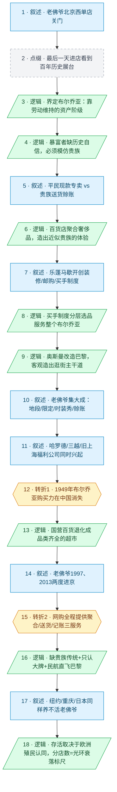

# 马督工方法论内容分析报告：【睡前消息1066】老佛爷退出北京 布尔乔亚故事过时了

- 分析时间：2026-06-14
- 发现选题数：1
- 实际分析选题：老佛爷退出北京 / 布尔乔亚的奢侈百货故事为什么过时了

---

## 1. 发现选题

| 编号 | 发现选题 | 中心问题 | 一句话梗概 | 独立性判断 | 置信度 |
|---:|---|---|---|---|---:|
| 1 | 老佛爷退出北京，布尔乔亚故事过时了 | 老佛爷这类奢侈百货为什么在中国（及北京、纽约、日本）反复关门，它的兴衰到底由什么决定？ | 奢侈百货是19世纪布尔乔亚模仿封建贵族的消费产物，当贵族传统缺席、网购补全其全部功能、欧洲文化光环退潮，它的生意就必然垮掉。 | 独立成篇：有单一中心问题、一条完整因果链（起源→机制→衰落）、不可删除的转折、明确的判断性结论 | 高 |

**结论：** 全文是一个完整选题。文中的"封建贵族消费方式""奥斯曼改造巴黎""日本三越/旧上海福利公司""网购冲击""殖民地分布"都是同一条因果链上的阶段或并列佐证，不构成独立选题。用户已指定只分析这一头条选题，按"用户已指定选题→只分析该选题"分支执行。

---

## 2. 带转折点的压缩总结与逻辑深度

老佛爷北京西单店关门，引出奢侈百货的历史：19世纪布尔乔亚发了财却没有贵族身份，于是想模仿贵族购物，零售商把奢侈品聚合成百货店、配上送货上门和赊账记账，让布尔乔亚买到"接近贵族"的体验，乐蓬马歇、老佛爷、三越、旧上海福利公司由此兴起。[T1 但是] 新中国消灭了买办和民族资本，布尔乔亚购买力消失，奢侈百货在大陆断档，国营百货退化成"品类齐全的超市"；改革后虽有中产，却不再需要模仿封建贵族，老佛爷两度进京都难活。[T2 但是] 真正击穿它的是网购——聚合选择、送货上门、记账消费这三项核心服务网购全程提供，加上中国缺贵族传统、只认大牌logo、民航让人可直飞巴黎总店，奢侈百货的全部价值被掏空。结论：凡靠近前欧洲殖民地/租界的城市老佛爷还能活，没有殖民记忆的北京、纽约、日本必关门，分店数量正好是欧洲文化光环衰落的标尺。

| 转折点 | 触发位置/内容 | 为什么是不可删除转折 | 作用 |
|---|---|---|---|
| T1 | "但是1949年，新中国成立……布尔乔亚的购买力在中国消失了"（原文第29段） | 把叙事从"奢侈百货如何成功扩张"整体扭转为"它在中国为何断裂、退化"，论证方向从兴起转向衰落，责任主体从商业模式转向社会结构（阶级被消灭）。删掉它，全文只剩一篇百货发家史，失去现实指向 | 把"完美的商业故事"接进中国的社会结构断裂，引出当代困境 |
| T2 | "这三种服务，网购居然全程提供"（原文第31段） | 表层判断（"中国没有贵族传统所以养不活奢侈百货"）被更彻底的机制推翻：不是文化不合，而是奢侈百货赖以存在的三大功能被网购整体替代。把问题从"水土不服"升级为"商业形态被技术淘汰" | 给出最终的结构性解释，把个案上升为一种零售形态的过时 |

- 转折点数量：2
- 逻辑深度判断：2 个转折，标准模型，传播性价比高

---

## 3. 叙事单元拆解

类型说明：叙述 = 展示事实；逻辑 = 解释因果；点缀 = 增加趣味但可删除；转折 = 打破预期、改变论证方向。

| 编号 | 类型 | 原文位置/线索 | 单句概括 | 主线作用 |
|---:|---|---|---|---|
| 1 | 叙述 | 第10段，"5月27日，老佛爷百货北京西单门店终止营业" | 老佛爷北京西单店关门，内地只剩上海深圳两店 | 起点热点，切入共同信息场 |
| 2 | 点缀 | 第10段，"赶着营业最后一天才进去闲逛……甩卖的店铺和简陋的人群" | 马督工最后一天进店闲逛、看到埃菲尔铁塔模型展台 | 现场感细节，自然带出"百年历史"线索 |
| 3 | 逻辑 | 第10–11段，"布尔乔亚最初的意思是不隶属于任何封建领主的自由市民……马克思的定义" | 界定"布尔乔亚"：靠劳动维持财富地位的现代资产阶级 | 定义核心客户群，为后文模仿动机铺底 |
| 4 | 逻辑 | 第12–13段，"资产阶级的财富快速上升……还没有足够的历史自信，必然要仿效贵族" | 暴富的布尔乔亚缺历史自信，第一步必须模仿旧贵族文化 | 给出奢侈百货存在的根本动机 |
| 5 | 叙述 | 第14–15段，"平民有需求再买……贵族是店铺送货上门、按季结账" | 对比平民"现款专卖店"与贵族"送货上门、赊账"两种消费模式 | 提供模仿的具体内容（选择/送货/赊账） |
| 6 | 逻辑 | 第15段，"零售商人想到把高端商品集中起来，形成新的百货店" | 百货店把分散奢侈品聚合，让布尔乔亚获得"接近贵族"的体验 | 解释百货店的商业模式如何被发明 |
| 7 | 叙述 | 第16–17段，"1852年，世界上第一家百货商店乐蓬马歇在巴黎开业……买手制度" | 乐蓬马歇开创宫殿式装修、送货邮购、买手制度 | 落实第一个样板，验证模式 |
| 8 | 逻辑 | 第18段，"布尔乔亚是复杂群体……买手制度根据用户数据分层选品" | 买手制度按上中下层分层选品，服务整个布尔乔亚群体 | 补强模式的精细运作机制 |
| 9 | 逻辑 | 第19–21段，"拿破仑三世授权奥斯曼重建巴黎……客观上提供了交通干线" | 奥斯曼改造巴黎本为压制革命，客观上造出适合逛街的主干道 | 解释奢侈百货的城市空间前提 |
| 10 | 叙述 | 第22–25段，"1893年老佛爷成为标杆……拉法耶特、奥斯曼大道、独家限定、赊账分层" | 老佛爷集大成：黄金地段、独家限定款、时装秀、分层赊账 | 主角登场，模式达到顶峰 |
| 11 | 叙述 | 第26–28段，"哈罗德、三越、旧上海福利公司……都在19世纪到20世纪初出现" | 凡有新兴资产阶级+封建贵族+现代大街的地方都长出奢侈百货 | 并列佐证，把规律推广到英日中 |
| 12 | 转折 | 第29段，"但是1949年……布尔乔亚的购买力在中国消失了" | 转折1：新中国消灭买办与民族资本，奢侈百货在大陆断档 | 从兴起转向衰落，接入中国社会结构 |
| 13 | 逻辑 | 第30段，"国营百货经营重点不再是奢侈品……生态位是超级市场" | 国营百货退化成"品类齐全"的超市，失去贵族模仿功能 | 说明断档后的形态退化 |
| 14 | 叙述 | 第30段末，"1997年王府井开店一年关门；2013年重进，西单店" | 改革后中产不需模仿贵族，老佛爷两度进京、首店即西单 | 把历史拉回当下个案 |
| 15 | 转折 | 第31段，"这三种服务，网购居然全程提供" | 转折2：网购整体替代聚合/送货/记账三大功能，掏空奢侈百货价值 | 把"水土不服"升级为"形态被技术淘汰" |
| 16 | 逻辑 | 第32–33段，"中国缺贵族传统只认大牌……民航让人可直飞巴黎总店" | 缺贵族传统、只认大牌、民航普及，进一步抽掉本地分店的存在理由 | 叠加文化与交通因素，加固转折2 |
| 17 | 叙述 | 第33段，"纽约店1991–1994、重庆2025、日本均关门" | 纽约、重庆、日本同样养不活老佛爷 | 用反例验证规律，排除"只是中国问题" |
| 18 | 逻辑 | 第33段末，"靠近前欧洲殖民地/租界的城市才活；分店数=欧洲光环衰落速度" | 结论：奢侈百货存活与否取决于欧洲殖民文化认同，可当衰落标尺 | 终点判断，把个案升华为衡量欧洲遗产的指标 |

---

## 4. 叙事结构模式

因果→并列→因果，切换 2 次：主线是"动机→模式→城市前提→顶峰→衰落"的因果链（单元1–10、12–18），中间单元11（哈罗德/三越/福利公司）和单元17（纽约/重庆/日本）各插入一组并列案例为因果链补强，随即回到因果主线。模式切换略多于"半棵树"标准，但两次并列都是短促的旁证插叙、很快收束回主线，没有破坏单一主因果链，可读性仍受控。

---

## 5. 一维叙事结构图

节点形状与颜色对应单元类型：叙述 = 蓝色矩形 `[ ]`，逻辑 = 绿色平行四边形 `[/ /]`，点缀 = 灰色矩形 + 虚线边框，转折 = 琥珀色六边形 `{{ }}`。节点编号与 Section 3 单元一一对应。

---

## 6. 选题为什么成立

### 6.1 选题本质三要素

| 要素 | 文章中的体现 |
|---|---|
| 共同信息场 | "百货商店/商场"是所有中国人共享的生活经验——王府井、上海第一百货、逛商场、奢侈品牌；老佛爷是一线城市消费者熟悉的地标。无需新闻背景，观众自带认知 |
| 最新变化 | 老佛爷北京西单店2026年5月27日终止营业，内地只剩上海深圳两店（之前重庆2025年已关，纽约1994年退出） |
| 行动建议 | 给出认知性"建议"而非操作建议：看懂奢侈百货是布尔乔亚模仿封建贵族的历史产物，理解它过时的真正原因（结构断裂+技术替代+殖民文化退潮），并提出"用老佛爷分店数量衡量欧洲文化遗产衰落速度"的观察工具 |

### 6.2 八个选题方向匹配

| 方向 | 匹配度 | 证据 | 说明 |
|---|---|---|---|
| 挖掘历史感 | 高（主） | 从"逛商场"这一日常文化现象反向追溯到19世纪布尔乔亚、奥斯曼改造巴黎、买手制度、旧上海租界百货 | 标准的"反向挖掘历史感"——日常现象→背后的经济与技术条件；并落在"正在发生的历史转折"（奢侈百货退场）上 |
| 审查完美故事 | 高（主） | "乐蓬马歇/老佛爷开创现代零售"是一个被反复传颂的完美商业传奇，本文追问它没展示的侧面：它依赖封建贵族的存在、依赖前网络时代的人流、依赖殖民文化认同 | 把光鲜的零售神话还原成一套有特定历史前提、前提消失即崩塌的脆弱模式 |
| 帮群体算账 | 中（次） | 拆解奢侈百货的三项核心价值（聚合选择/送货上门/记账消费），逐项说明被网购替代、被民航替代、被大牌直营替代 | 用"功能-成本"账本解释它为什么必然亏损关门，而非情绪化唱衰 |
| 教科书加 | 中（次） | 以中学历史课本的"资产阶级/工业革命/拿破仑三世/普法战争"为认知基准，再补充课本不讲的消费史细节 | 不重复课本，也不脱离课本建立的知识基础 |
| 关注群体内部矛盾 | 低 | 区分布尔乔亚上中下层、布尔乔亚 vs 封建贵族、买办 vs 民族资本 | 有分层视角，但服务于主因果链，未单独展开 |

**主匹配方向：** 挖掘历史感（反向）+ 审查完美故事

**次匹配方向：** 帮群体算账、教科书加

### 6.3 否定选题校验

| 校验项 | 结果 | 理由 |
|---|---|---|
| 自己是否愿意分享 | 通过 | "你天天逛的商场，原来是19世纪暴发户模仿贵族的产物，现在被淘宝干掉了"——是私人场合愿意讲的反常识故事，自带转述钩子 |
| 是否绕开完美故事 | 通过 | 不仅没把老佛爷讲成励志传奇，反而专门审查它的完美外壳，揭出隐藏前提与成本 |
| 是否避免纯反驳 | 通过 | 不是反驳某条"老佛爷败给XX"的具体说法，而是正面建构一套"奢侈百货为何兴起又为何过时"的完整解释；终点还给出可操作的观察指标 |
| 转折点数量是否合适 | 通过 | 2 个不可删除转折（社会结构断裂、网购技术替代），命中"三段叙事+两次转折"标准模型，逻辑深度与传播性价比平衡得好；结构虽有 2 次并列插叙，但均为短促旁证，未超出可控范围 |

---

## 7. AI 总评（供参考）

这是一期质量很高的"历史感+审查完美故事"选题，逻辑深度精确落在标准模型（2 个转折）上。最见功力的地方是把"老佛爷关门"这一条本地商业新闻，垂直钻到"布尔乔亚模仿封建贵族"的19世纪社会结构层，再水平铺开到英、日、旧上海、纽约的同构案例，最后用一个反常识的归纳——"分店分布严格对应前欧洲殖民地/租界"——把整个论证收口成一个可验证的判断工具。两个转折分工清晰：T1（1949年阶级被消灭）负责把商业史接进中国社会结构，T2（网购替代三大功能）负责把"水土不服"升级为"形态被淘汰"，二者缺一则论证塌陷。

唯一可商榷处是结构上有 2 次并列插叙（哈罗德/三越/福利公司、纽约/重庆/日本），略超"切换不超过一次"的半棵树标准，但两段都短促收束、服务主线，没有伤害自传播。

### 可复用的创作公式

日常消费现象（逛商场）→ 反向追溯其19世纪经济/技术/阶级前提（布尔乔亚模仿贵族）→ 用一个完美商业传奇（乐蓬马歇/老佛爷）落实模式 → 转折1：社会结构断裂让前提消失 → 转折2：新技术（网购）整体替代其核心功能 → 终点把个案升华为一个可量化的观察指标（分店数=欧洲文化光环衰落速度）。本质是"审查完美故事+反向挖掘历史感"的叠加：先承认它的辉煌，再逐层拆掉它赖以成立的隐藏前提。

### 可改进处

1. 两段并列案例（英日中、纽约重庆日本）可考虑用"主线插叙带过"的方式更轻地处理，进一步贴近半棵树结构，降低观众的记忆负担。
2. "分店分布=殖民认同"这个收尾结论很漂亮，但样本（上海/深圳/澳门/迪拜/多哈/雅加达 vs 北京/重庆/纽约/日本）存在选择性，迪拜、多哈是否纯由"殖民记忆"解释、还是更多由当下购买力解释，可补一句说明边界，避免单因解释被反例反噬。
