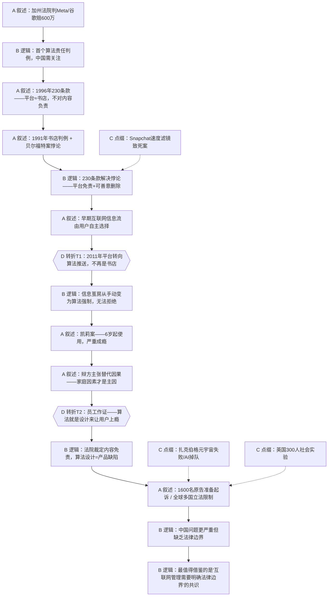

# 马督工方法论内容分析报告：【睡前消息1044】网络上瘾 让社交平台赔600万

- 分析时间：2026-04-30
- 发现选题数：1
- 实际分析选题：美国互联网判例与算法责任——从230条款到凯莉案

---

## 1. 发现选题

| 编号 | 发现选题 | 中心问题 | 一句话梗概 | 独立性判断 | 置信度 |
|---:|---|---|---|---|---:|
| 1 | 美国互联网判例与算法责任 | 社交平台的推荐算法让用户上瘾，平台要不要为此负法律责任？ | 从美国230条款的历史出发，通过凯莉诉Meta/谷歌案分析算法责任边界，最终指向中国互联网管理需要明确法律边界的核心主张 | 独立成篇：有完整的法律背景→具体案例→全球趋势→中国启示因果链 | 95% |

**结论：** 文章虽分三个章节（法律背景、案例详情、判例影响），但共享同一条因果主线和中心论点，不构成多个独立选题。章节划分是叙事层次，不是选题切割。

---

## 2. 带转折点的压缩总结与逻辑深度

美国加州法院判定Meta和谷歌需为未成年用户网络成瘾赔偿600万美元，这是美国首个认定社交平台算法应对用户心理问题负责的判例。美国互联网平台长期受1996年230条款保护，被视为类似"书店"的中性信息发布者，无需对用户内容负责。[T1 但是] 2011年前后，平台从按时间排序的用户自选信息流转向深度学习推荐算法，主动定制用户所见内容，不再是中性发布者，而是信息茧房的建造者——用户无法辨别也无法拒绝。原告凯莉从6岁起使用社交平台，严重成瘾并出现心理问题。辩方试图将责任归咎于凯莉的家庭环境。[T2 然而] 公司员工在庭审中作证，承认企业明知算法设计目的就是让用户上瘾，且儿童因缺乏自控力是最佳拉新目标。法院因此裁定平台内容本身符合230条款免责，但算法设计构成产品缺陷，必须赔偿。这一判例正在引发全球连锁反应。中国面临同样甚至更严重的问题，但缺乏明确法律边界，最需要借鉴的不是具体判决，而是"互联网管理需要明确法律边界"这一共识。

| 转折点 | 触发位置/内容 | 为什么是不可删除转折 | 作用 |
|---|---|---|---|
| T1 | 2011年前后平台从用户自选信息流转向算法推送 | 删掉这个转折，"平台=书店"的类比就一直成立，230条款的免责逻辑不会被动摇，凯莉案的法律基础不存在 | 打破"平台只是中性发布者"的认知，建立算法责任讨论的前提 |
| T2 | 公司员工作证承认算法被设计为让用户上瘾、儿童是最佳目标 | 删掉这个转折，辩方"家庭因素才是主因"的论点无法被推翻，判决缺乏核心证据支撑 | 从"平台的副作用"升级为"平台的蓄意行为"，确立企业主观故意 |

- 转折点数量：2
- 逻辑深度判断：标准模型（三段叙事 + 两次转折）
- 性价比判断：传播性价比最高的标准结构。两次转折分别完成"破除旧认知"和"确立新事实"，观众可以用一句话转述核心信息："社交平台明知算法让孩子上瘾还故意这么做，美国法院第一次判它们赔钱了。"

---

## 3. 叙事单元拆解（A/B/C/D）

类型说明：A = 叙述，展示事实；B = 逻辑，解释因果；C = 点缀，增加趣味但可删除；D = 转折，打破预期并提供核心媒体价值。

| 编号 | 类型 | 原文位置/线索 | 单句概括 | 主线作用 |
|---:|---|---|---|---|
| 1 | A | 第一段·静静引入 | 加州法院判定Meta和谷歌赔偿600万美元，新华社称对中国有借鉴意义 | 起点：从热点新闻进入共同信息场 |
| 2 | B | 督工第一段回应 | 这是美国首个算法责任判例，中国缺乏明确法律边界需要关注 | 提前亮出核心论点，告诉观众"这件事为什么跟你有关" |
| 3 | A | 法律背景·230条款 | 1934年《通讯法》经1996年修正后增加230条款，平台不被视为内容发布者 | 建立法律基座：平台为什么能长期免责 |
| 4 | B | 90年代互联网环境 | 给互联网特权是早期互联网时代遗产，论坛被类比为书店 | 解释230条款的历史逻辑——当时平台确实只是发布者 |
| 5 | A | 1991年纽约判例 | 法院认定网络平台身份类似书店，不需对内容负责 | 展示"书店类比"获得法律确认 |
| 6 | A | 贝尔福特案（华尔街之狼） | 论坛因主动管理内容（过滤脏话、聘用版主）被认定存在诽谤行为 | 引出悖论的另一半：管了反而要负责 |
| 7 | B | 两个判例的悖论 | 不管内容就免责，管了内容反而要负责——这个悖论催生了230条款 | 用悖论解释立法动因，增强观众对法律设计意图的理解 |
| 8 | A | 230条款例外情况 | 盗版、恐怖主义、主动参与传播等情况下平台仍需担责 | 补充法律框架的完整性 |
| 9 | C | Snapchat速度滤镜致死案 | 三名用户为刷速度数字飙车致死，法院认定产品设计缺陷 | 点缀：用极端案例增加趣味并预示"产品设计缺陷"概念 |
| 10 | A | 早期互联网信息流 | 天涯、知乎早期按时间排序或用户关注列表排序，平台不主动调整 | 为转折点T1做铺垫：先展示"书店模式"真实存在过 |
| 11 | D | 2011年前后的转变 | 平台发现让用户自选信息流不利于赚钱，转向深度学习推荐算法 | **T1：打破"平台=书店"的类比。** 平台从中性发布者变为内容分发的主动设计者 |
| 12 | B | 信息茧房的本质变化 | 早期信息茧房可被理性打破，算法时代的信息茧房无法辨别也无法拒绝 | 解释T1的深层后果：用户失去了选择权 |
| 13 | B | 新的法律问题 | 平台制造推荐算法且未征求用户意见，用户出了问题平台要不要负责？ | 将叙事从历史回顾引向核心法律问题 |
| 14 | A | 凯莉案案情 | 凯莉6岁看YouTube、8岁开账号、9岁注册Ins，每天沉迷到深夜，产生严重焦虑 | 用具体案例将抽象法律问题落地 |
| 15 | A | 辩方策略 | Meta和谷歌律师主打替代因果关系：凯莉家庭本身就有问题 | 展示对抗面：为T2蓄力 |
| 16 | D | 公司员工庭审作证 | 员工承认公司设计算法就是想让用户上瘾，儿童缺乏自控力是最佳拉新目标 | **T2：从"平台副作用"升级为"蓄意行为"。** 推翻辩方的替代因果论 |
| 17 | B | 法院判决逻辑 | 内容本身符合230条款免责，但算法设计（推送、通知、美颜滤镜）构成产品缺陷 | 核心结论：法律将"内容责任"和"产品设计责任"区分开来 |
| 18 | A | 判例法效应 | 美国是判例法国家，1600名原告准备起诉，赔款远不止600万 | 展示判例的连锁反应 |
| 19 | A | Meta新墨西哥案 | 儿童保护举报用AI生成低质量内容，秘密行动发现儿童账号收到性暗示信息 | 并列补充：平台在儿童保护上的系统性失职 |
| 20 | B | 第二阶段庭审 | 检方要求法院出台禁令强制Meta修改算法，5月开庭 | 指向更大的影响：从赔钱到改算法 |
| 21 | C | 扎克伯格的其他麻烦 | 元宇宙800亿美元失败即将关闭，AI掉队，收购沐瞳科技惹麻烦 | 点缀：增加信息密度和趣味，但可删除不影响主线 |
| 22 | A | 全球立法趋势 | 澳大利亚禁止16岁以下使用社交媒体（全球首个），英国、法国跟进 | 并列材料：将美国判例放入全球趋势中 |
| 23 | C | 英国社会实验 | 300名青少年分组实验，测试禁用社交媒体对睡眠、学习、家庭关系的影响 | 点缀：有趣的实验细节，增加知识增量 |
| 24 | B | 中国的情况 | 中国推荐算法更强，用户被关在无法拒绝的信息茧房里，但平台既无法律保护也无明确义务 | 将主线从美国拉回中国：同样问题更严重 |
| 25 | B | 模糊法律空间的后果 | 因为缺乏明确法律，平台和用户在模糊空间中同时成为受害者 | 揭示中国互联网的深层困境 |
| 26 | B | 终点·核心主张 | 最值得借鉴的不是判决本身，而是"互联网管理需要明确法律边界"的共识 | 落脚点：从具体判例升华为制度性建议 |

---

## 4. 二维逻辑关系与一维化叙事

### 4.1 二维逻辑关系

```
                    ┌─────────────────────────────────┐
                    │  共同信息场入口：                  │
                    │  加州法院判Meta/谷歌赔600万       │
                    └──────────────┬──────────────────┘
                                   │
                    ┌──────────────▼──────────────────┐
                    │  法律基座：230条款               │
                    │  平台 = 书店，不对内容负责        │
                    └──────────────┬──────────────────┘
                                   │
          ┌────────────────────────┼────────────────────────┐
          │                        │                        │
   ┌──────▼──────┐   ┌────────────▼────────────┐   ┌──────▼──────┐
   │ 1991年判例  │   │ 贝尔福特案：管了反而    │   │ 230条款    │
   │ 书店类比成立│   │ 要负责 → 悖论          │   │ 例外情况   │
   └─────────────┘   └────────────┬────────────┘   └─────────────┘
                                   │
                    ┌──────────────▼──────────────────┐
                    │  ★ T1：2011年算法推送取代       │
                    │  用户自选 → 平台不再是书店       │
                    └──────────────┬──────────────────┘
                                   │
                    ┌──────────────▼──────────────────┐
                    │  凯莉案：6岁起使用，严重成瘾    │
                    └──────────────┬──────────────────┘
                                   │
          ┌────────────────────────┼────────────────────────┐
          │                        │                        │
   ┌──────▼──────┐   ┌────────────▼────────────┐          │
   │ 辩方：家庭  │   │ ★ T2：员工作证——       │          │
   │ 因素才是主因│──>│ 算法就是设计来让人上瘾  │          │
   └─────────────┘   │ 儿童是最佳目标          │          │
                      └────────────┬────────────┘          │
                                   │                        │
                    ┌──────────────▼──────────────────┐     │
                    │  法院判决：内容免责，            │     │
                    │  算法设计 = 产品缺陷             │     │
                    └──────────────┬──────────────────┘     │
                                   │                        │
          ┌────────────────────────┼─────────┬──────────────┘
          │                        │         │
   ┌──────▼──────┐   ┌────────────▼───┐  ┌──▼───────────┐
   │ 1600原告    │   │ Meta新墨西哥案 │  │ 全球立法趋势 │
   │ 准备起诉    │   │ 强制改算法     │  │ 澳英法限制   │
   └──────┬──────┘   └────────┬───────┘  └──────┬───────┘
          │                    │                  │
          └────────────────────┼──────────────────┘
                               │
                    ┌──────────▼─────────────────────┐
                    │  终点：中国需要明确的           │
                    │  互联网法律边界                  │
                    └────────────────────────────────┘
```

### 4.2 一维叙事线

作者将二维逻辑图压成一条时间+因果线：

1. **入口（共同信息场）**：600万美元判决新闻 → 提前亮明核心论点
2. **法律基座**：230条款历史 → 书店类比 → 贝尔福特悖论 → 条款出台
3. **T1转折**：2011年算法推送取代用户自选 → 信息茧房不可拒绝
4. **案例落地**：凯莉案详情 → 辩方策略
5. **T2转折**：员工作证 → 蓄意上瘾设计
6. **判决结论**：内容免责 vs 产品缺陷
7. **并列扩展**：更多诉讼 + 全球立法趋势
8. **终点**：中国需要明确法律边界

作者的一维化策略是**先因果后并列**：前六步用严格的因果链完成核心论证（为什么平台要负责），第七步用并列材料展示连锁反应的广度（多少人要告、多少国家在立法），最后收回因果线落到中国。

### 4.3 结构模式与切换次数

- 结构模式：因果 → 并列 → 因果
- 结构切换次数：2次（因果→并列切换一次，并列→因果切换一次）
- 是否符合"半棵树"要求：轻微超标。理想状态是只切换一次，但本文的并列段落（全球趋势、多案例）篇幅较短且服务于主线论证，实际阅读体验并不割裂。如果要优化，可将新墨西哥案和全球立法各压缩为一两句话，让并列段更紧凑。

---

## 5. Mermaid 叙事结构图



---

## 6. 选题为什么成立

### 6.1 选题本质三要素

| 要素 | 文章中的体现 | 判断 |
|---|---|---|
| 共同信息场 | 社交媒体成瘾 + 算法推送——每个智能手机用户的日常体验 | ✅ 强。所有使用社交媒体的人都能感知信息茧房和算法推送 |
| 最新变化 | 2024年3月加州法院首次判定平台算法对未成年人网瘾负责，全球多国立法跟进 | ✅ 强。"首次判例"本身就是最有效的新闻钩子 |
| 行动建议 | 中国需要明确互联网法律边界，通过公开讨论和博弈制定适合自己的互联网法律 | ✅ 明确。从"了解美国判例"上升到"推动中国法律建设" |

### 6.2 八个选题方向匹配

| 方向 | 匹配度 | 证据 | 说明 |
|---|---|---|---|
| 教科书加 | ★★★★★ 主匹配 | 从230条款历史讲起，补充大多数人不知道的美国互联网法律知识 | 典型的"教科书加"——以九年义务教育建立的"法律常识"为基准，在此之上增加美国互联网法律的专业知识，做到了"不重复课本、不脱离基础" |
| 关注普通人生活 | ★★★★ 次匹配 | 每个人都在被算法推送影响，信息茧房是日常体验 | 将抽象的法律判例连接到每个普通用户的日常体验 |
| 帮群体算账 | ★★★ 次匹配 | 分析了明确法律边界vs模糊惯例的成本收益，指出模糊空间中"平台和用户同时是受害者" | 帮互联网用户算了一笔"法律清晰度"的账 |
| 数据分析与合订本 | ★★★ 次匹配 | 将1991年、1994年、1996年、2011年、2018年、2024年的判例/立法串成合订本 | 通过时间线上的法律演变发现趋势，符合"合订本"方法 |
| 关注群体内部矛盾 | ★★ 弱匹配 | 提到互联网平台vs用户、平台vs政府的多方博弈 | 有涉及但不是主线 |
| 挖掘历史感 | ★★ 弱匹配 | 从1934年《通讯法》到2024年判例的90年法律史 | 历史脉络清晰，但服务于法律分析而非历史叙事本身 |
| 调动观众参与感 | ★★ 弱匹配 | "每个中国用户都被养在无法拒绝的信息茧房里"——每个观众都能验证 | 有触发参与感的句子，但不是主要策略 |
| 审查完美故事 | ★ 不匹配 | 文章不是在审查某个"完美故事" | 不适用 |

**主匹配方向：** 教科书加——用美国互联网法律史补充观众知识盲区

**次匹配方向：** 关注普通人生活 + 帮群体算账 + 数据分析与合订本

### 6.3 否定选题校验

| 校验项 | 结果 | 理由 |
|---|---|---|
| 自己是否愿意分享 | ✅ 通过 | "社交平台明知算法让孩子上瘾还被判赔钱了"是朋友圈/饭桌上都愿意讲的故事 |
| 是否绕开完美故事 | ✅ 通过 | 不是完美故事，而是法律分析。凯莉案本身就包含了复杂的家庭因素和多方博弈 |
| 是否避免纯反驳 | ✅ 通过 | 文章不是反驳谁，而是正面建构"互联网需要法律边界"的论点 |
| 转折点数量是否合适 | ✅ 通过 | 2个转折点，标准模型，传播性价比最高 |
| 结构切换是否过多 | ⚠️ 轻微超标 | 因果→并列→因果共2次切换，超过理想的1次。但并列段篇幅短，实际阅读感受连贯 |

---

## 7. 总评

这是一篇高质量的"教科书加"型选题，在法律知识补充和现实关切连接之间取得了很好的平衡。文章以一个具体判例为入口，用90年的法律演变史建立知识框架，两个精准的转折点（算法取代用户自选、员工作证蓄意设计）完成了从"平台免责"到"算法有罪"的认知翻转，最终落脚到中国互联网法律建设的制度性主张。逻辑深度为标准的两次转折模型，传播性价比高——观众可以用一句话转述核心信息。

最大的优势在于**从具体到抽象的升级路径清晰**：600万美元赔偿（具体数字吸引注意力）→ 算法产品缺陷（新的法律概念）→ 中国需要法律边界（制度性主张）。每一步都有足够的事实支撑，没有跳跃。

### 可复用的创作公式

**"外国判例 → 本国启示"公式：**

1. 用一个具有冲击力的外国判例数字入题（600万美元赔偿）
2. 回溯法律/制度历史，建立"原来是这样运作的"知识基座
3. T1：展示制度基础已经被现实变化（技术演进）动摇
4. 用具体案例将抽象法律问题落地（凯莉的故事）
5. T2：揭示当事方的主观故意或隐藏事实（员工作证）
6. 展示全球趋势，建立"这不是个别事件"的说服力
7. 收回国内：同样的问题我们有吗？我们该怎么办？

这个公式适用于任何"外国先行一步"的法律、政策、制度类选题。

### 可改进处

1. **结构切换可再精简。** 第三节的新墨西哥案、扎克伯格商业困境、全球立法三段并列材料，可以合并为一段"判例引发的连锁反应"，用插叙方式带过，减少一次结构切换。
2. **中国部分可更具体。** 文章对中国互联网问题的描述停留在"更严重""信息茧房""模糊空间"等概括性判断，缺乏具体的中国案例或数据。如果能举一个中国未成年人网络成瘾的具体案例或数据，与凯莉案形成对照，说服力会更强。
3. **C类点缀可适当删减。** 扎克伯格元宇宙失败、收购沐瞳科技等内容与主线关联较弱，删除后主线更紧凑。英国社会实验细节也可压缩为一句话。
4. **行动建议可更锐利。** "公开讨论、在博弈中制定法律"作为行动建议稍显笼统。如果能具体建议"参考凯莉案将算法设计纳入产品责任法"或"要求平台公开推荐算法的设计目标"，读者的行动方向会更明确。
