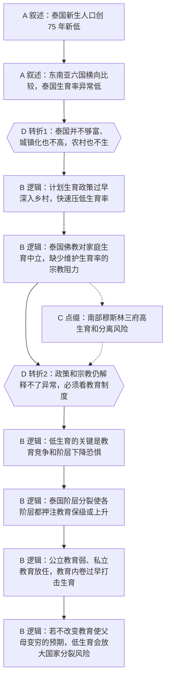

# 马督工方法论内容分析报告：特朗普拆风电 泰国人不生娃

- 分析时间：2026-04-30 16:10:40 CST
- 发现选题数：2
- 实际分析选题：泰国未富先老

---

## 1. 发现选题

| 编号 | 发现选题 | 中心问题 | 一句话梗概 | 独立性判断 | 置信度 |
|---:|---|---|---|---|---:|
| 1 | 美国能源政策 | 为什么特朗普政府主要压制风电、转向油气，而共和党选民仍然支持？ | 文章从特朗普“拆风电”的新闻进入，澄清不是拆既有风机，再解释风电的电网与储能隐性成本、太阳能和共和党选民利益的兼容性，以及油气产业给能源州带来的现实收益。 | 可独立成篇：有单独中心问题、事实材料、两次反预期转折和明确的政治经济解释。 | 0.95 |
| 2 | 泰国未富先老 | 为什么泰国在人均 GDP 和城镇化都不算高的情况下，已经严重低生育？ | 文章从泰国新生人口新低进入，比较东南亚生育率差异，再把泰国低生育归因到计划生育、宗教中立、阶层分化和教育内卷。 | 可独立成篇：有独立中心问题、区域比较、历史政策链条、制度解释和现实警告。 | 0.95 |

**结论：** 本文包含 2 个可独立成篇的选题。用户已指定“泰国”，因此本报告只分析“泰国未富先老”。

---

## 2. 带转折点的压缩总结与逻辑深度

泰国新生人口创 75 年新低，且在东南亚主要国家中生育率垫底。[T1 但是] 这不是常见的富裕化、工业化或城市化后的少生，因为泰国人均 GDP 和城镇化率都不高，农村生育缓冲带也已经失守。文章先追溯计划生育、佛教中立和周边宗教差异，[T2 然而] 这些仍解释不了泰国为什么比同类国家更低，最终机制是阶层分裂叠加低质量公立教育和放任私立教育，把所有家庭推入教育内卷，进而压低生育。

| 转折点 | 触发位置/内容 | 为什么是不可删除转折 | 作用 |
|---|---|---|---|
| T1 | 第 65-74 行：东南亚横向比较后指出泰国并不够富、城镇化也不高，农村生育率也只有 1.2。 | 删掉后，文章只能把泰国低生育归入一般东亚工业化叙事，无法说明“未富先老”的反直觉。 | 把问题从普通人口下降新闻升级为“为什么泰国异常低”的比较题。 |
| T2 | 第 98-101 行：承认计划生育和佛教影响后，指出柬埔寨、缅甸、斯里兰卡等同类参照不能解释泰国异常，转向教育政策。 | 删掉后，文章会停在历史政策和宗教差异，无法解释泰国为什么比相似国家更极端，也无法导出后文教育改革建议。 | 把原因从历史文化解释推进到阶层竞争和教育制度机制。 |

- 转折点数量：2
- 逻辑深度判断：标准模型，两次转折，传播性价比较高。
- 性价比判断：选题能被压缩成“泰国不是因为富了才少生，也不是单靠计划生育和佛教造成，而是教育内卷在阶层分裂社会中过早爆发”，适合中长视频传播。

---

## 3. 叙事单元拆解（A/B/C/D）

类型说明：A = 叙述，展示事实；B = 逻辑，解释因果；C = 点缀，增加趣味但可删除；D = 转折，打破预期并提供核心媒体价值。

| 编号 | 类型 | 原文位置/线索 | 单句概括 | 主线作用 |
|---:|---|---|---|---|
| 1 | A 叙述 | 第 62 行，泰国新生人口、死亡人口和净减少数据。 | 泰国新生人口创 75 年新低，出生人口连续低于死亡人口。 | 建立共同信息场，抛出“发展中国家为什么未富先老”的入口问题。 |
| 2 | A 叙述 | 第 65-68 行，东南亚六国生育率和马来西亚、新加坡对照。 | 泰国在东南亚主要国家中生育率最低，马来西亚和新加坡的低生育有东亚人口文化因素。 | 通过横向比较证明泰国不是区域普遍现象。 |
| 3 | D 转折 | 第 71-74 行，人均 GDP、城镇化率和农村生育率。 | 泰国并不够富、城镇化也不高，连农村生育缓冲带都失守。 | 第一处核心转折，排除“富裕化/城市化自然少生”的常见解释。 |
| 4 | B 逻辑 | 第 77-80 行，泰国 20 世纪后半叶计划生育政策。 | 泰国政府把节育宣传、避孕措施和扶贫贷款结合，快速压低生育率。 | 提供第一层历史政策解释。 |
| 5 | B 逻辑 | 第 83-92 行，菲律宾、东帝汶、马来西亚和泰国佛教对照。 | 天主教和伊斯兰传统不同程度维护生育，而泰国佛教对家庭生育保持中立。 | 用宗教比较解释泰国缺少维护生育率的文化阻力。 |
| 6 | C 点缀 | 第 95 行，南部三府穆斯林人口、分离组织和铁路袭击。 | 泰国高生育地区集中在穆斯林南部，老龄化使分离武装显得更年轻。 | 增加现实紧张感和政治后果，但不改变低生育主因。 |
| 7 | D 转折 | 第 98-101 行，同类佛教国家和政策力度反证后转向教育政策。 | 计划生育和佛教仍解释不了泰国异常，必须看教育制度。 | 第二处核心转折，把原因推进到阶层竞争和教育内卷。 |
| 8 | B 逻辑 | 第 101-110 行，社会化抚养、延长在校时间和反对发钱。 | 作者认为低生育的关键不是给钱，而是国家替家庭承担孩子时间和教育压力。 | 搭建后文解释泰国问题的理论框架。 |
| 9 | B 逻辑 | 第 113-116 行，泰国阶级分化和政治格局。 | 泰国阶层差异明显，各阶层都希望通过教育保住或提升后代地位。 | 解释教育竞争为什么会变成全民焦虑。 |
| 10 | B 逻辑 | 第 119-125 行，低质量公立教育、PISA 排名和补习监管对照。 | 泰国公立教育质量差且放学早，公共体系无法吸收家庭竞争压力。 | 说明公立教育为什么不能替家庭减压。 |
| 11 | B 逻辑 | 第 128 行，私立补习班和国际学校随便开。 | 泰国放任私立教育赚钱，使 GDP 还很低时教育产业就强烈打击生育。 | 完成核心因果闭环：阶层焦虑通过教育市场转化为少生或不生。 |
| 12 | B 逻辑 | 第 131-134 行，公共卫生部长表态和最终警告。 | 如果不改变教育使父母变穷的预期，泰国可能因低生育首先在东南亚分裂。 | 收束到现实判断和隐含行动建议。 |

---

## 4. 二维逻辑关系与一维化叙事

### 4.1 二维逻辑关系

起点是泰国官方人口数据：新生人口创 75 年新低，且出生人口连续少于死亡人口。第一层解释先做横向比较，把泰国放进东南亚人口格局中，指出它不是普通发展中国家高生育模式，也不是马来西亚、新加坡那种东亚人口文化渗入后的低生育。第一处转折是“未富先老”的异常性：泰国不够富、城镇化率也不高，农村却同样不生。第二层解释先进入历史和宗教：计划生育政策过早压低生育，泰国佛教又没有像天主教、伊斯兰那样维护生育。第二处转折是这些解释仍不够，因为相似政策或佛教国家没有低到这个程度。终点转向教育制度：泰国阶层分裂、公立教育弱、私立教育放任，导致家庭把阶层上升和保级压力全部投进教育市场，最后不敢生。

### 4.2 一维叙事线

文章先用 2023 年新生人口数据抓住注意力，再用东南亚六国比较证明泰国是异常值。随后排除“富起来才少生”和“城市化导致少生”的常见解释，把问题进一步压到农村为什么也不生。接着用计划生育政策和宗教对照给出第一轮解释，并通过南部穆斯林高生育和分离风险制造现实后果。主线随后再次纠偏：这些因素只能解释一部分，真正要看教育。文章先插入作者关于教育改革和反对发钱的通用框架，再回到泰国，依次展开阶层分裂、弱公立、强私立和不受监管的教育市场，最后得出低生育可能带来国家分裂风险的判断。

### 4.3 结构模式与切换次数

- 结构模式：因果主线，前半段用并列比较筛掉伪解释，后半段转入制度因果。
- 结构切换次数：1 次，从并列比较转为因果解释。
- 是否符合“半棵树”要求：符合。前半段多个国家和宗教对照都服务于同一个根问题，后半段收束到教育制度这一条主因链。

---

## 5. Mermaid 叙事结构图

---

## 6. 选题为什么成立

### 6.1 选题本质三要素

| 要素 | 文章中的体现 | 判断 |
|---|---|---|
| 共同信息场 | 中国观众已经熟悉低生育、教育内卷和“未富先老”焦虑，也能理解东南亚发展中国家的参照。 | 成立，入口贴近中国观众的现实经验，同时又有泰国这个外部案例的新鲜感。 |
| 最新变化 | 泰国 2023 年新生人口仅 416574 人，创 75 年新低，连续第二年少于 50 万。 | 成立，具体年度数据提供新闻钩子。 |
| 行动建议 | 不要把低生育只归因于发钱不足或城市化，而要改革教育压力分配，让国家承担更多孩子时间和公共教育责任。 | 成立，建议是分析框架和政策方向，不是简单情绪表态。 |

### 6.2 八个选题方向匹配

| 方向 | 匹配度 | 证据 | 说明 |
|---|---|---|---|
| 关注普通人生活 | 高 | 生育、教育、阶层下降恐惧、父母养育压力。 | 主匹配。文章把国家人口危机落到普通家庭是否敢生孩子的生活决策。 |
| 帮群体算账 | 高 | 发钱会流入补课、私立教育增加家庭压力、公立教育承担时间才可能降压。 | 文章把“鼓励生育”转化为家庭教育成本、政府投入和阶层竞争的账。 |
| 关注群体内部矛盾 | 高 | 曼谷中产、公务员、农民、城市平民、国王和贵族化军队生活方式不同。 | 文章不把泰国社会视为整体，而是拆出阶层差异如何共同推高教育竞争。 |
| 数据分析与合订本 | 中 | 新生人口、总和生育率、城镇化率、PISA 排名、公立学校和国际学校增减。 | 数据用于建立异常性和支撑判断，但不是纯数据专题。 |
| 挖掘历史感 | 中 | 20 世纪 60 年代高生育、70 年代计划生育、1965-1985 年生育率下降。 | 历史政策链条解释今天问题的形成背景。 |

**主匹配方向：** 关注普通人生活

**次匹配方向：** 帮群体算账、关注群体内部矛盾、数据分析与合订本、挖掘历史感

### 6.3 否定选题校验

| 校验项 | 结果 | 理由 |
|---|---|---|
| 自己是否愿意分享 | 通过 | 选题能把泰国人口危机和中国观众熟悉的教育内卷连接起来，具备私人讨论中的转述价值。 |
| 是否绕开完美故事 | 通过 | 文章没有接受“发展了就少生”或“给钱就能催生”的简单故事，而是审查教育成本和阶层压力。 |
| 是否避免纯反驳 | 通过 | 虽然多次排除富裕化、城市化、宗教和计划生育的单因解释，但主体是建立教育制度的正面解释。 |
| 转折点数量是否合适 | 通过 | 两个不可删除转折，符合“三段叙事 + 两次转折”的标准模型。 |
| 结构切换是否过多 | 通过 | 从并列比较到因果解释只切换一次，国家、宗教、教育材料都能汇入同一主线。 |

---

## 7. 总评

这个选题成立的关键，是把“泰国出生人口新低”从普通人口新闻改造成反直觉问题：泰国还没有完成高收入和高城镇化，为什么已经低生育。文章先用东南亚横向比较制造异常感，再用历史政策和宗教比较给出第一层解释，最后用教育内卷完成更深层机制。普通观众获得的新增认知是：低生育不一定等到富裕社会才爆发，只要阶层竞争激烈、公共教育不能替家庭减压、私立教育又可以无限吸走资源，低收入阶段也会提前进入少生和不生。

### 可复用的创作公式

最新异常数据 -> 区域横向比较 -> 排除常见解释 -> 追溯历史政策和文化条件 -> 用同类国家反证解释不足 -> 提出更底层机制 -> 落到普通家庭的成本收益 -> 给出制度性警告。

### 可改进处

中段关于菲律宾、东帝汶、马来西亚和泰国宗教差异的信息量较大，可以压缩成更清晰的对照表述，把篇幅让给教育机制。第 101-110 行关于中国教育改革方案是作者常用理论框架，但与泰国材料之间的转接可以更短，避免观众误以为文章临时换题。
