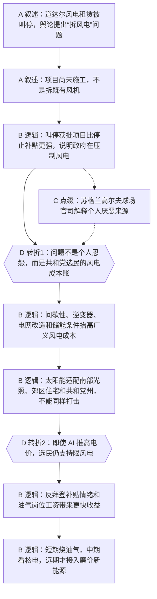

# 马督工方法论内容分析报告：特朗普拆风电 泰国人不生娃

- 分析时间：2026-04-30 15:58:05 CST
- 发现选题数：2
- 实际分析选题：美国能源政策

---

## 1. 发现选题

| 编号 | 发现选题 | 中心问题 | 一句话梗概 | 独立性判断 | 置信度 |
|---:|---|---|---|---|---:|
| 1 | 美国能源政策 | 为什么特朗普政府主要压制风电、转向油气，而共和党选民仍然支持？ | 文章从特朗普“拆风电”的新闻进入，澄清不是拆既有风机，再解释风电的电网与储能隐性成本、太阳能和共和党选民利益的兼容性，以及油气产业给能源州带来的现实收益。 | 可独立成篇：有单独中心问题、事实材料、两次反预期转折和明确的政治经济解释。 | 0.95 |
| 2 | 泰国未富先老 | 为什么泰国在人均 GDP 和城镇化都不算高的情况下，已经严重低生育？ | 文章从泰国新生人口新低进入，比较东南亚生育率差异，再把泰国低生育归因到计划生育、宗教中立、阶层分化和教育内卷。 | 可独立成篇：有独立中心问题、区域比较、因果链和政策判断。 | 0.95 |

**结论：** 本文包含 2 个可独立成篇的选题。用户已选择编号 1，因此本报告只分析“美国能源政策”。

---

## 2. 带转折点的压缩总结与逻辑深度

舆论把特朗普说成要拆既有风机，文章先澄清道达尔项目尚未施工，真正的问题是特朗普政府宁愿退款也要把投资导向油气。[T1 但是] 这不只是特朗普个人讨厌风车，风电的电网改造、储能和输电成本容易被共和党选民理解成替民主党产业买单，而太阳能反而适合南部郊区家庭。[T2 然而] 即使 AI 数据中心推高南部电价，油气投资能更快给能源州提供岗位和高工资，所以特朗普阵营会选择短期烧油气、中期看核电、远期再等廉价新能源。

| 转折点 | 触发位置/内容 | 为什么是不可删除转折 | 作用 |
|---|---|---|---|
| T1 | 第 26-41 行：从“个人恩怨/反新能源”转向“中右翼共识是反风电，太阳能反而适配共和党州”。 | 删掉后，文章只能停留在特朗普个人偏好或党派口号，无法解释为什么同属新能源的太阳能被区别对待。 | 把选题从人物态度升级为选民联盟的成本收益分析。 |
| T2 | 第 44-56 行：提出南部电价上涨的反问，再解释油气岗位、补贴怨气和能源周期。 | 删掉后，读者会继续追问“缺电为什么还限制发电”，主线无法回答 AI 用电压力与限风电政策的矛盾。 | 把技术账推进到现实利益账，完成对特朗普能源政治基础的解释。 |

- 转折点数量：2
- 逻辑深度判断：标准模型，两次转折，传播性价比较高。
- 性价比判断：选题能让普通观众用一句话复述“不是简单反新能源，而是共和党选民对风电成本、太阳能收益和油气岗位的综合算账”，逻辑深度适合中长视频。

---

## 3. 叙事单元拆解（A/B/C/D）

类型说明：A = 叙述，展示事实；B = 逻辑，解释因果；C = 点缀，增加趣味但可删除；D = 转折，打破预期并提供核心媒体价值。

| 编号 | 类型 | 原文位置/线索 | 单句概括 | 主线作用 |
|---:|---|---|---|---|
| 1 | A 叙述 | 第 14 行，道达尔租赁项目、特朗普声明和“拆风电”提问。 | 特朗普政府叫停海上风电租赁项目，并把投资方向转到石油和天然气。 | 建立共同信息场，抛出“特朗普怎么看风电”的入口问题。 |
| 2 | A 叙述 | 第 17 行，澄清没有拆已经建好的风机。 | 道达尔项目还没完成环境和场地评估，因此不存在拆既有风机。 | 修正夸张传闻，避免主线建立在错误事实上。 |
| 3 | B 逻辑 | 第 20 行，停止补贴、停止审批与叫停获批项目的区别。 | 特朗普政府不是普通收缩补贴，而是强力压制风电并重定向投资。 | 把问题从“有没有拆”推进到“为什么要强压风电”。 |
| 4 | C 点缀 | 第 23 行，苏格兰高尔夫球场与风机官司。 | 特朗普早年因球场海景和风机打过长期官司，提供个人厌恶来源。 | 增加人物故事和可听性，但不是解释政策的主线。 |
| 5 | D 转折 | 第 26-29 行，抛开个人恩怨，中右翼共识不是反新能源而是反风电。 | 文章否定“个人报复/全面反新能源”的简单解释，转向选民联盟的成本账。 | 第一处核心转折，重建解释框架。 |
| 6 | B 逻辑 | 第 29-35 行，间歇性、电网改造、抽水蓄能地形和输电成本。 | 风电的广义成本不只在风机本身，还包括电网稳定、储能条件和远距离输电。 | 为“共和党选民为什么反风电”提供技术和财政依据。 |
| 7 | B 逻辑 | 第 38-41 行，太阳能在南部州、郊区家庭和分散土地上的适配性。 | 太阳能同属新能源，却能降低南部郊区家庭生活成本，特朗普难以同样压制。 | 用反例证明文章不是泛泛反新能源，而是在区分不同能源和选民利益。 |
| 8 | D 转折 | 第 44 行，南部电价因 AI 数据中心上涨却仍支持限风电。 | 文章提出“缺电为何还限风电”的反直觉问题。 | 第二处核心转折，把技术账推进到短期现实利益。 |
| 9 | B 逻辑 | 第 47-50 行，拜登新能源补贴、路易斯安那州能源政治和“钻探等于就业”。 | 共和党选民把民主党新能源补贴理解为给对方产业送钱，转而支持油气补贴。 | 解释支持者的情绪来源和政治动员机制。 |
| 10 | B 逻辑 | 第 53 行，道达尔投资转向德州和墨西哥湾，提供岗位和高工资。 | 油气投资能给能源州带来可见工作岗位和高薪，普通居民因此支持特朗普政策。 | 把“选民为什么支持”落到收入和就业的现实账。 |
| 11 | B 逻辑 | 第 56 行，天然气增长、油价、中东冲突和 AI 能源周期。 | 从能源利益理解特朗普政治基础，可推导短期油气、中期核电、远期新能源的能源结构。 | 收束全篇，把具体项目上升为能源周期判断。 |

---

## 4. 二维逻辑关系与一维化叙事

### 4.1 二维逻辑关系

起点是共同信息场中的特朗普风电新闻：道达尔风电租赁被叫停，舆论把它概括成“拆风电”。第一层解释先做事实校准：不是拆既有风机，而是用行政手段压制尚未施工的项目。第一处转折是把原因从个人恩怨和口号式反新能源，转到共和党选民对风电隐性成本的共同感受。第二层解释把风电拆成电网稳定、逆变器、电网改造、储能地形和输电成本，再用太阳能作为对照，说明同为新能源但政治后果不同。第二处转折是面对 AI 用电压力的反问：缺电地区为什么还支持限风电。更深层机制是油气岗位和高工资比远期新能源成本更快进入选民生活。终点是能源周期判断：特朗普任内和 AI 投资早期更依赖油气，中期可能转向核电，远期才轮到廉价新能源。

### 4.2 一维叙事线

文章先从一个强刺激新闻入口进入，再迅速纠偏“拆既有风机”的误解，降低事实风险。随后用“就算没有拆，也确实在压制风电”维持问题张力，插入特朗普个人官司作为可听的背景，但立刻把它降级为点缀。主线真正展开后，先解释风电的技术和基础设施成本，再对照太阳能为什么不能被同样打击，完成第一层反预期。最后用 AI 数据中心造成电价上涨提出第二个疑问，转入拜登补贴怨气、能源州就业和油气高工资，最终收束到美国能源政治和 AI 能源周期。

### 4.3 结构模式与切换次数

- 结构模式：因果主线，局部使用并列对照作论据。
- 结构切换次数：0 次主线切换；风电/太阳能、风电/油气是支撑主线的对照材料，不改变主线结构。
- 是否符合“半棵树”要求：符合。一个根问题是“为什么特朗普压制风电仍有选民基础”，多个技术和利益分支最终都汇入同一个结论。

---

## 5. Mermaid 叙事结构图

---

## 6. 选题为什么成立

### 6.1 选题本质三要素

| 要素 | 文章中的体现 | 判断 |
|---|---|---|
| 共同信息场 | 特朗普、拜登新能源政策、风电项目、油气产业、AI 数据中心电价上涨。 | 成立，入口足够接近新闻舆论场，也能连接普通观众对电价和能源的常识。 |
| 最新变化 | 特朗普政府叫停道达尔海上风电租赁，并要求投资转向德州和墨西哥湾油气生产线。 | 成立，具体项目变化让旧话题获得新闻钩子。 |
| 行动建议 | 观众不要只用“反新能源/支持新能源”的标签理解美国能源政策，而要看谁承担成本、谁获得岗位、不同能源如何适配选民利益。 | 成立，建议不是直接政策号召，而是提供判断能源政治的分析框架。 |

### 6.2 八个选题方向匹配

| 方向 | 匹配度 | 证据 | 说明 |
|---|---|---|---|
| 帮群体算账 | 高 | 风电隐性成本、30% 税收减免、储能和输电成本、油气岗位工资。 | 主匹配。文章把情绪化的能源立场转化成选民、州政府和产业之间的成本收益账。 |
| 关注群体内部矛盾 | 高 | 共和党选民内部也区分风电、太阳能和油气；南部居民既承受电价上涨，又支持特朗普限风电。 | 文章没有把“共和党/美国选民”当成铁板一块，而是拆出能源州、南部郊区、AI 用电地区的不同利益。 |
| 审查完美故事 | 中 | 风电作为清洁能源的表层故事被放到电网、储能和补贴成本里审查。 | 文章关注“谁出钱、谁受益”，打破新能源天然正确或特朗普天然荒唐的单向叙事。 |
| 数据分析与合订本 | 中 | 德国电网投资、美国抽水蓄能电站分布、税收减免比例、油气岗位工资等数据。 | 数据服务于算账，但没有发展成完整的数据专题。 |

**主匹配方向：** 帮群体算账

**次匹配方向：** 关注群体内部矛盾、审查完美故事、数据分析与合订本

### 6.3 否定选题校验

| 校验项 | 结果 | 理由 |
|---|---|---|
| 自己是否愿意分享 | 通过 | 这个选题能解释特朗普能源政策、AI 用电和普通选民收入之间的关系，适合在私人讨论中转述。 |
| 是否绕开完美故事 | 通过 | 文章没有接受“风电环保所以应该支持”或“特朗普荒唐所以反风电”的完美故事，而是追问成本分配。 |
| 是否避免纯反驳 | 通过 | 开头反驳“拆既有风机”只是事实校准，主体是正面解释美国能源政治。 |
| 转折点数量是否合适 | 通过 | 两个不可删除转折，符合“三段叙事 + 两次转折”的标准模型。 |
| 结构切换是否过多 | 通过 | 主线保持因果结构，对照材料都服务于同一根问题，没有扩散成多篇文章。 |

---

## 7. 总评

这个选题成立的关键，是用一个容易传播的强入口“特朗普拆风电”吸引注意，再快速把它改造成更稳的分析题：特朗普为什么要把风电单独挑出来打。文章没有停留在特朗普个人审美和政治口号，而是把能源技术成本、电网条件、选民地理分布、补贴怨气和油气就业串成一条因果链。普通观众获得的新增认知是：美国能源政策不是抽象的环保争论，而是不同能源形式嵌入不同地区、阶层和产业利益之后的政治选择。

### 可复用的创作公式

热点误读入口 -> 事实纠偏 -> 承认问题仍然存在 -> 排除个人化解释 -> 拆出技术成本和利益分配 -> 用同类反例校准解释边界 -> 提出更强反问 -> 用短期收益解释选民选择 -> 上升到趋势判断。

### 可改进处

如果要进一步提高传播效率，可以压缩苏格兰高尔夫球场官司的篇幅，把它明确标成“个人情绪背景，不是政策主因”。结尾的中东、霍尔木兹海峡和 AI 能源周期信息量较大，适合保留为结论，但需要避免展开成第三个独立选题。
