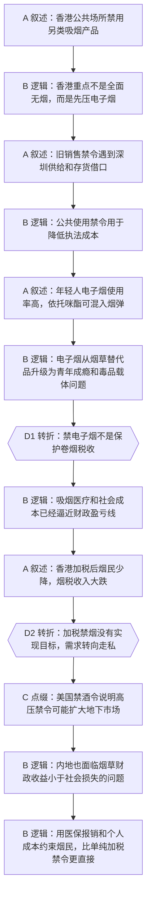

# 马督工方法论内容分析报告：【睡前消息1046】香港禁烟 亏钱又没效

- 分析时间：2026-04-30
- 发现选题数：1
- 实际分析选题：香港控烟政策为什么会同时打击电子烟、造成财政损失、又没有达到禁烟目标

---

## 1. 发现选题

| 编号 | 发现选题 | 中心问题 | 一句话梗概 | 独立性判断 | 置信度 |
|---:|---|---|---|---|---:|
| 1 | 香港禁烟政策的经济账与治理反效果 | 香港为什么严打电子烟和传统烟草，为什么加税禁烟没有实现预期，内地应不应该学习 | 文章从香港公共场所禁电子烟切入，解释电子烟的青年成瘾和毒品载体风险，再反驳“保护传统烟草税收”的说法，最后用香港烟税收入下滑、走私扩张和美国禁酒令类比，提出内地应把吸烟成本放回医保与烟民个人承担。 | 独立选题。三个小标题分别承担背景澄清、经济账、治理结论，不是三个并列选题，而是同一因果链上的递进阶段。 | 0.90 |

**结论：** 发现 1 个可独立成篇的选题，继续分析该选题。front matter 仅作为元信息，未参与转折点计数。

---

## 2. 带转折点的压缩总结与逻辑深度

香港最新控烟条例看似是在打造无烟社会，实际重点是公共场所禁用电子烟，因为电子烟既吸引年轻人，又可能成为依托咪酯等毒品载体。[T1 但是] 这不是为了保护传统卷烟税收，文章用烟草税、医学成本和香港大学数据说明，放任吸烟在财政上已经接近亏本买卖。[T2 然而] 香港继续加税和扩大禁令，并没有让烟民明显减少，反而导致税收暴跌、走私烟扩张，所以内地不宜简单复制禁令，而应在医保报销和个人成本上区分烟民。

| 转折点 | 触发位置/内容 | 为什么是不可删除转折 | 作用 |
|---|---|---|---|
| T1 | 第 26-32 行：从“禁电子烟是保护传统烟草税收吗”转向“吸烟本身已经让财政亏钱” | 如果删除这一转折，文章只能停留在电子烟治理和毒品风险，无法解释为什么传统卷烟也被纳入加税控烟。 | 把话题从公共卫生新闻推进到财政账和治理账。 |
| T2 | 第 40-52 行：从“加税能减少烟民又赚钱”转向“香港目标一个都没实现，烟民转向走私” | 如果删除这一转折，文章会默认加税禁烟是正确方案，无法导出“不应照抄香港、改从医保政策入手”的结论。 | 提供核心媒体价值：好心政策可能制造反效果，治理工具要换。 |

- 转折点数量：2
- 逻辑深度判断：标准模型，两次关键转折
- 性价比判断：传播性价比较高。选题有清晰公共议题入口，又有财政数字、走私现象和医保建议，能让观众用一句话转述为“禁烟不是光加税，香港已经证明会把烟民推向走私”。

---

## 3. 叙事单元拆解（A/B/C/D）

类型说明：A = 叙述，展示事实；B = 逻辑，解释因果；C = 点缀，增加趣味但可删除；D = 转折，打破预期并提供核心媒体价值。

| 编号 | 类型 | 原文位置/线索 | 单句概括 | 主线作用 |
|---:|---|---|---|---|
| 1 | A | 第 12 行，静静介绍香港控烟条例 | 香港新规从 4 月 30 日起禁止在公众场合使用另类吸烟产品，并放入全球禁烟趋势背景。 | 用热点新闻建立共同信息场。 |
| 2 | B | 第 14 行，督工澄清禁令对象 | 香港不是全面禁烟，而是重点打击电子烟、加热烟草等另类吸烟产品。 | 修正观众对“无烟社会”的初始理解。 |
| 3 | A | 第 14 行，2021 年电子烟进口制造销售禁令与深圳产能 | 香港此前已禁电子烟销售，但深圳产能和存货说法让电子烟持续流入。 | 说明旧政策为什么执行失败。 |
| 4 | B | 第 14 行，执法成本过高 | 政府无法逐个核实电子烟是不是历史存货，只能把公共使用也纳入禁止。 | 给新禁令补上制度动因。 |
| 5 | A | 第 18 行，青年电子烟使用数据 | 香港 11 岁到 28 岁年轻人两成以上吸过电子烟，和传统烟民年龄结构相反。 | 把治理对象从一般烟民转向青年成瘾风险。 |
| 6 | B | 第 18 行，尼古丁和劳动力负担 | 年轻人过早接触尼古丁，会形成长期成瘾并增加医疗负担、影响劳动力。 | 解释政府为什么更担心电子烟。 |
| 7 | A | 第 20 行，依托咪酯烟弹材料 | 依托咪酯能混入烟油烟粉，外观难识别，年轻成瘾者比例高。 | 引入电子烟从“烟草替代品”升级为毒品载体的材料。 |
| 8 | B | 第 20 行，新加坡和香港数据对比 | 电子烟一旦结合依托咪酯，就比传统毒品更隐蔽、更容易传播。 | 加强电子烟专项治理的必要性。 |
| 9 | D | 第 26-32 行，反驳“保护传统烟草税收” | 禁电子烟不是为了维护传统卷烟税源，因为如果只要税收，政府完全可以给电子烟加税。 | 第一次关键转折，把问题从“烟草市场保护”转向“吸烟财政亏损”。 |
| 10 | B | 第 28-32 行，烟草税与医疗支出 | 香港连续提高烟草税，是因为烟草造成的经济损失已经接近或超过税收收益。 | 建立控烟政策背后的财政逻辑。 |
| 11 | A | 第 40 行，香港 2021-2025 年烟民比例与税收 | 香港烟民比例只从 9.5% 降到 8.5%，烟税收入却从 79.2 亿附近跌到 43.2 亿。 | 提供“亏钱又没效”的核心数据。 |
| 12 | B | 第 42 行，香港财政刚性支出 | 香港医疗、教育和老龄化开支增长，税源又少，烟税虽小但仍是现实收入。 | 解释为什么烟税损失在近年财政赤字下变得敏感。 |
| 13 | D | 第 44 行，烟民转向走私烟 | 烟民没明显减少却不买合法烟，说明高税率把需求推向走私。 | 第二次关键转折，证明政策目标落空并制造灰色市场。 |
| 14 | C | 第 46 行，美国禁酒令类比 | 美国禁酒令好心办坏事，反而扩大地下酒精和黑帮。 | 用历史类比降低理解门槛，强化“禁止可能反效果”的直觉。 |
| 15 | A | 第 48-50 行，内地烟草税与产量变化 | 中国烟草税上调曾短期压低产量，但 2017 年后销量逐步恢复。 | 将香港经验迁移到内地语境。 |
| 16 | B | 第 52 行，医保政策建议 | 因吸烟造成医疗基金损失，可以提高烟民报销门槛或让吸烟相关疾病自担更多成本。 | 给出行动建议：从价格禁令转向医疗成本责任。 |

---

## 4. 二维逻辑关系与一维化叙事

### 4.1 二维逻辑关系

这篇内容的二维逻辑可以还原为三组关系：

1. 电子烟治理线：香港公共场所禁用电子烟 -> 旧销售禁令因深圳供给和存货借口失效 -> 青年使用率高、尼古丁成瘾风险大 -> 依托咪酯可借电子烟扩散 -> 电子烟需要比传统卷烟更强的治理手段。
2. 控烟财政线：外界怀疑禁电子烟是保护传统烟草税 -> 但电子烟可以被加税，没必要直接禁 -> 传统烟草也在加税 -> 吸烟医疗和社会成本接近或超过税收收益 -> 控烟不是单纯保税，而是政府算总账。
3. 政策反效果线：加税理论上应减少烟民、增加收入或降低医疗支出 -> 香港烟民比例只小幅下降，烟税收入大幅下降 -> 合法购买减少被走私替代 -> 高压禁令类似禁酒令，可能扩大地下市场 -> 内地应把治理工具转向医保和个人责任。

### 4.2 一维叙事线

文章把二维材料压成一条递进线：先用香港新规进入，澄清“不是全面禁烟，而是无电子烟”；再解释电子烟为什么特殊，尤其是青年成瘾和依托咪酯风险；随后接住观众可能提出的怀疑，反驳“保护传统烟草税收”；再把控烟放进财政盈亏线；最后用香港执行结果和美国禁酒令类比，推出内地不能只靠加税禁烟，而要让烟民承担更多医疗后果。

### 4.3 结构模式与切换次数

- 结构模式：因果 -> 并列补强 -> 因果
- 结构切换次数：1
- 是否符合“半棵树”要求：基本符合。主线从香港电子烟禁令出发，依次解释公共卫生、财政账和政策反效果，中间的依托咪酯、新加坡、美国禁酒令、内地烟税数据都是插入主线的补强材料，没有把文章拆成散乱并列清单。

---

## 5. Mermaid 叙事结构图

---

## 6. 选题为什么成立

### 6.1 选题本质三要素

| 要素 | 文章中的体现 | 判断 |
|---|---|---|
| 共同信息场 | 香港控烟条例、电子烟、传统卷烟、年轻人成瘾、烟草税，都是普通观众能理解并可能亲身接触的公共议题。 | 成立。入口不依赖专业知识，且和旅游、吸烟、税收、医保都有生活连接。 |
| 最新变化 | 香港 9 月修订控烟条例、4 月 30 日执行公共场所禁用另类吸烟产品；同时引用 2024、2025 年烟税、烟民比例、依托咪酯案件等新数据。 | 成立。不是泛泛谈禁烟，而是围绕最近政策执行和最新反效果。 |
| 行动建议 | 对游客建议去香港忍一忍；对内地控烟建议不要照抄加税禁令，而是通过医保报销门槛和吸烟相关疾病责任分担来约束烟民。 | 成立。结尾有明确治理建议和个人健康提醒。 |

### 6.2 八个选题方向匹配

| 方向 | 匹配度 | 证据 | 说明 |
|---|---|---|---|
| 帮群体算账 | 高 | 第 28-32 行计算传统卷烟税、电子烟税、吸烟经济损失和烟草税收入；第 40-44 行计算烟税收入下滑、走私烟规模。 | 文章核心不是道德劝诫，而是把控烟拆成政府财政、医疗支出、烟民成本和走私收益的账。 |
| 关注普通人生活 | 中高 | 第 12-18 行从公共场所能否使用电子烟、游客去香港怎么办、年轻人电子烟比例切入。 | 选题和烟民、家长、游客、医保缴费人都有直接关系。 |
| 数据分析与合订本 | 中高 | 第 20、32、40、42、48-50 行连续使用新加坡、香港、内地多组年份数据。 | 文章用跨地区和跨年份数据证明政策效果，而不是只评价单条新闻。 |
| 挖掘历史感 | 中 | 第 46 行用美国禁酒令解释高压禁令的反效果。 | 历史类比不是主线，但帮助观众理解“好政策目标可能带来坏治理结果”。 |
| 审查完美故事 | 中 | “提高烟税既减少烟民又赚钱”的故事在第 40-44 行被审查。 | 文章拆掉了控烟政策的完美叙事，指出现实中的走私替代。 |

**主匹配方向：** 帮群体算账

**次匹配方向：** 关注普通人生活、数据分析与合订本、审查完美故事、挖掘历史感

### 6.3 否定选题校验

| 校验项 | 结果 | 理由 |
|---|---|---|
| 自己是否愿意分享 | 通过 | 话题能被转述为“香港禁烟加税反而亏钱、走私扩张，内地不能只照抄”，有讨论价值。 |
| 是否绕开完美故事 | 通过 | 文章没有接受“禁烟一定正确”“加税一定有效”的完美故事，而是追问成本和替代后果。 |
| 是否避免纯反驳 | 通过 | 虽然反驳了“保护烟税”和“内地应照抄香港”，但反驳之后给出财政账、走私机制和医保政策建议。 |
| 转折点数量是否合适 | 通过 | 两个不可删除转折，符合“三段叙事 + 两次转折”的标准模型。 |
| 结构切换是否过多 | 基本通过 | 结构从政策因果进入，中段用并列数据补强，结尾回到因果建议，切换一次，未超过方法论上限。 |

---

## 7. 总评

这期内容的强项是把“禁烟”这种容易滑向道德表态的话题，拆成了公共卫生、财政盈亏和政策反效果三层账。电子烟部分先解释香港为什么要更强硬，避免观众误以为只是传统烟草利益保护；财政部分再把“保护税收”的直觉反过来，说明吸烟可能已经让政府亏钱；最后用香港数据证明高税率不一定带来戒烟，可能把合法市场推向走私市场。文章最后没有停在批评香港，而是把结论迁移到内地医保政策，完成从新闻评论到治理建议的闭环。

### 可复用的创作公式

从一条生活化政策新闻进入 -> 先澄清观众对政策对象的误解 -> 用年轻人、财政、医保等普通人能理解的账重构问题 -> 反驳看似合理的流行解释 -> 用执行数据证明政策反效果 -> 给出比原政策更具体的替代方案。

### 可改进处

第一段电子烟、第二段财政账、第三段禁烟反效果之间的材料量都比较大，观众可能会把“禁电子烟”和“传统卷烟加税”当成两个题。若要提高传播效率，可以在第一个分隔线后增加一句更明确的路标，例如“电子烟解释了为什么要禁，接下来要看传统卷烟为什么也不能只靠加税”。另外，结尾的医保建议力度很强，可以再补一小段执行边界，例如如何认定长期吸烟史、如何避免医疗救助完全排斥成瘾者，这样能降低政策建议被理解成单纯惩罚的风险。
