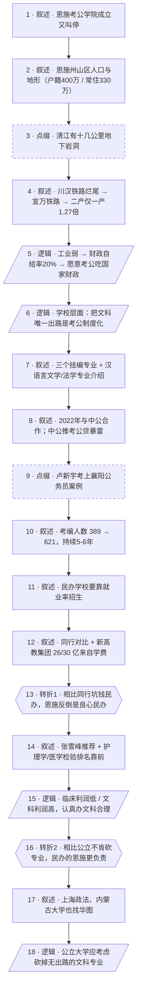

# 马督工方法论内容分析报告：【睡前消息1049】湖北考编学院 上海B站赚钱

- 分析时间：2026-05-01
- 发现选题数：2
- 实际分析选题：湖北恩施学院的考公考编路线

---

## 1. 发现选题

| 编号 | 发现选题 | 中心问题 | 一句话梗概 | 独立性判断 | 置信度 |
|---:|---|---|---|---|---:|
| 1 | 湖北恩施学院的考公考编路线 | 怎么评价恩施学院搞考公学院这件事？ | 一所地处穷山区的民办大学把文科专业整合成考公学院，比起搞副业的同行算良心，比起花纳税人钱却不肯砍专业的公立大学更像是在认真负责对待学生 | 独立选题：有独立的中心问题、独立的因果链、独立的反直觉结论、独立的现实指向 | 高 |
| 2 | B站首次实现全年盈利 | B站为什么能在视频行业普遍亏损时实现盈利？ | B站走低成本路线（少买版权、不投流量明星）+早期老用户进入消费爬坡期，让本来不需要烧钱的商业模式终于跑通 | 独立选题：有独立的中心问题、独立的因果链、独立的反直觉结论 | 高 |

**结论：** 文章包含 2 个独立选题，用户已指定分析编号 1（湖北恩施学院的考公考编路线），仅对该选题做后续分析。

---

## 2. 带转折点的压缩总结与逻辑深度

3月初湖北恩施学院和华图教育成立考公考编产业学院，几天后被叫停，但恩施学院其实从2022年就在帮文科生考编。表面看像是教育产业化的负面新闻，深层原因是恩施州山区+喀斯特地形让工业难以发展，2024年财政自给率仅20%，文科专业唯一出路就是考公，恩施学院只是把潜规则变成明规则。[T1 但是] 对比石家庄理工搞房地产、西安工商搞境外旅游推销，恩施学院母公司新高教集团不搞副业、26亿收入靠学费，反而是民办里少见的良心。[T2 然而] 进一步对比公立大学，他们花纳税人的钱却扭曲就业率不愿砍专业；现在上海政法、内蒙古大学也找华图做考公辅导，作为公立大学反而更应该思考要不要保留这些专业。

| 转折点 | 触发位置/内容 | 为什么是不可删除转折 | 作用 |
|---|---|---|---|
| T1 | "和这些同行相比，恩施学院算是有良心的，起码真的要靠上课赚钱" | 颠覆了观众对民办高校（坑学生、搞房地产、搞副业）的刻板印象，把恩施学院从"看起来在搞产业化"重新定位为"民办里少见的良心" | 把负面新闻转向价值判断重新定位 |
| T2 | "过去5年，恩施学院到处找培训机构，帮助学生考公，起码真的在乎自己学生的就业率，算算成一个良心学校了。…作为花政府资金的公立大学，他们倒是应该考虑要不要保留专业" | 颠覆了"公立优于民办"的常识预期，把批评对象从恩施学院反转到公立大学，让选题从"科普一所民办学校"升级为"批评公立大学不肯砍专业" | 把责任主体重新定位，给出建设性结论 |

- 转折点数量：2
- 逻辑深度判断：标准模型（三段叙事 + 两次转折），传播性价比较高

---

## 3. 叙事单元拆解

类型说明：叙述 = 展示事实；逻辑 = 解释因果；点缀 = 增加趣味但可删除；转折 = 打破预期并提供核心媒体价值。

| 编号 | 类型 | 原文位置/线索 | 单句概括 | 主线作用 |
|---:|---|---|---|---|
| 1 | 叙述 | 第13行 "3月初，湖北恩施学院和公考辅导机构华图教育联手成立了考公考编产业学院。没过几天…不办了" | 3月初恩施学院与华图成立考公学院，几天后被叫停 | 起点共同信息场+热点新闻 |
| 2 | 叙述 | 第15行 湖北地形图、恩施州人口数据 | 恩施州山区户籍400万，必须考虑就业问题 | 引出恩施特殊性 |
| 3 | 点缀 | 第17行 清江、地下岩洞、喀斯特 | 清江流域有十几公里地下岩洞 | 增加地理趣味，可删 |
| 4 | 叙述 | 第19行 川汉铁路、保路运动、宜万铁路、第二/第一产业GDP数据 | 历史与地形导致工业弱（396亿 vs 农业311亿，比例1.27 vs 全国5.35） | 用历史和数据夯实"工业弱"的判断 |
| 5 | 逻辑 | 第21行 财政数据 + "恩施人都愿意考公务员和本地经济脱钩却吃国家财政" | 工业弱→财政自给率仅20%→恩施人想脱钩本地经济考公吃国家财政 | 第一层解释：为什么恩施考公需求强 |
| 6 | 逻辑 | 第21行 末句 "既然某些专业唯一的出路就是考公，那不如搞一个考公学院" | 恩施学院把"文科唯一出路是考公"的现实正式制度化 | 把宏观需求落到学校层面 |
| 7 | 叙述 | 第23-25行 三个挂编专业 + 汉语言文学、法学专业介绍 | 汉语言文学、法学、体育教育三个专业明确挂编，专业介绍把考公考编写成卖点 | 落实"考公学院"的事实 |
| 8 | 叙述 | 第27行 中公教育、考公贷 | 2022年与中公合作但中公拿钱炒房推考公贷 | 历史脉络补充，说明"五六年套路" |
| 9 | 点缀 | 第29-31行 卢新宇案例 | 法学毕业生靠中公培训考上襄阳公务员 | 提供具体案例增强说服力，可删 |
| 10 | 叙述 | 第33行 2022年389人→2025年621人 | 4年考编人数从389增至621，文科考编路线持续5-6年 | 数据证明这不是新现象 |
| 11 | 叙述 | 第35行 中段 "恩施学院作为一所民办学校，没有什么背景，真的要靠就业率去吸引学生" | 恩施学院作为民办大学必须靠就业率招生 | 进入第二层解释 |
| 12 | 叙述 | 第35行 石家庄理工（986期）、西安工商（996期）、新高教集团财报 | 同行石家庄理工搞房地产、西安工商推销境外游；恩施学院母公司新高教不搞房地产，26/30亿收入来自学费 | 用合订本数据搭建对比基准 |
| 13 | **转折** | 第35行 "和这些同行相比，恩施学院算是有良心的" | 不像同行民办那样赚快钱，恩施学院反倒是良心民办 | **T1：颠覆民办坑钱印象** |
| 14 | 叙述 | 第37行 上半 张雪峰推荐、护理学医学检验排名 | 恩施学院的护理、医学检验等专业排名靠前 | 补充恩施学院真在做教育的证据 |
| 15 | 逻辑 | 第37行 中段 "临床医学和护理学虽然招生好，但是成本也高…文科专业不需要什么硬件投入，有个教师就能上课更容易赚钱" | 民办养医护成本高，认真办文科是少花钱多收学生的合理路径 | 解释为什么文科专业是恩施学院的核心 |
| 16 | **转折** | 第37行 后段 "睡前消息第1034期…公立大学的惰性强…对于交钱养活自己的纳税人，公立大学甚至连恩施的就业率数据都不愿意公布。过去5年，恩施学院…起码真的在乎自己学生的就业率，算算成一个良心学校了" | 跟公立大学比，民办的恩施学院反而更负责 | **T2：把批评对象从民办反转到公立** |
| 17 | 叙述 | 第39行 上海政法学院（2025年10月）、内蒙古大学副校长（2026年3月）找华图 | 公办院校也开始用同样办法处理文科生出路 | 用最新案例推到普遍现象 |
| 18 | 逻辑 | 第39行 末句 "作为花政府资金的公立大学，他们倒是应该考虑要不要保留专业" | 公立大学应思考是否保留无出路的文科专业 | 终点：行动建议指向公立大学 |

---

## 4. 叙事结构模式

因果→并列，切换 1 次：主线先用因果解释"恩施为什么会出现考公学院"（地形→工业弱→财政依赖→文科唯一出路是考公→学校制度化），再切换为并列对比（同行民办、公立大学）反复给恩施学院定位，最后落到对公立大学的建设性结论。符合"半棵树"结构。

---

## 5. 一维叙事结构图

节点形状对应单元类型：叙述 = 矩形 `[ ]`，逻辑 = 平行四边形 `[/ /]`，点缀 = 矩形 + 虚线边框，转折 = 六边形 `{{ }}`。节点编号 1–18 与 Section 3 单元一一对应。

---

## 6. 选题为什么成立

### 6.1 选题本质三要素

| 要素 | 文章中的体现 |
|---|---|
| 共同信息场 | 全民考公考编焦虑、对民办大学"水"和"赚快钱"的刻板印象、对公立大学惰性的普遍吐槽、文科生就业难 |
| 最新变化 | 3月初恩施学院与华图成立考公学院后被叫停、上海政法（2025年10月）和内蒙古大学（2026年3月）找华图做公考辅导 |
| 行动建议 | 作为公立大学，应该考虑要不要保留无出路的文科专业 |

### 6.2 八个选题方向匹配

| 方向 | 匹配度 | 证据 | 说明 |
|---|---|---|---|
| 审查完美故事 | 高（主匹配） | "恩施学院搞考公学院"先被包装成负面新闻被叫停，作者反过来挖出真实结构性原因 | 起点正是从"被叫停"这种看似教育商业化的故事入手，审查后翻面 |
| 帮群体算账 | 高 | 财政自给率20%、考编人数389→621、新高教集团30亿收入26亿来自学费、各民办大学盈利模式对比 | 用数据算清恩施财政、考编人数增长、民办大学三种盈利模式的代价与收益 |
| 关注群体内部矛盾 | 高 | 民办大学被拆为"坑钱型（石家庄理工/西安工商）"vs"良心型（恩施学院）"；高等教育拆为"民办 vs 公立" | 不把民办或公立视作铁板一块，穿透文化标签追溯背后的盈利模式与财政依赖 |
| 数据分析与合订本 | 中高 | 合订986期、996期、1034期同栏目历史选题，纵向对比民办大学行为与公立大学行为 | 用睡前消息自己的合订本作为对比基准，是栏目典型手法 |
| 挖掘历史感 | 中 | 川汉铁路烂尾→保路运动→清朝灭亡→宜万铁路2010年通车→2023-2025年551天断车 | 反向把"为什么这里没工业"追溯到清末以来的地形与基建史，给地理结论增加纵深 |
| 教科书加 | 中 | 喀斯特地貌、保路运动、二三产业GDP结构、财政自给率，都是教科书或公共话语里的概念 | 选题门槛被压在义务教育常识之上，普通观众能跟上 |
| 调动观众参与感 | 中 | 考公考编、文科就业难、大学产业学院都是观众有亲身经验或身边案例的话题 | 观众容易把自己的考公经历或亲戚的考编焦虑代入 |
| 关注普通人生活 | 中 | 文科生唯一出路是考公、恩施本地人脱钩本地经济吃国家财政 | 落点是普通学生与普通家庭的就业选择 |

**主匹配方向：** 审查完美故事 + 帮群体算账 + 关注群体内部矛盾

**次匹配方向：** 数据分析与合订本、挖掘历史感、教科书加、调动观众参与感

### 6.3 否定选题校验

| 校验项 | 结果 | 理由 |
|---|---|---|
| 自己是否愿意分享 | 通过 | "民办反倒比公立靠谱"这种反常识结论本身具备社交分享价值，观众会想拿这个观点和身边人争论 |
| 是否绕开完美故事 | 通过 | 起点不是"某学校考公成功故事"，而是"考公学院被叫停"的负面新闻，反而挖出真实结构 |
| 是否避免纯反驳 | 通过 | 不是单纯否定"考公学院产业化坏"，而是给出建设性论述：公立大学也应该重新审视无出路文科专业 |
| 转折点数量是否合适 | 通过 | 2个转折，符合标准模型；如果只到T1（恩施是良心民办），选题只是科普；T2把矛头转向公立大学，才升级出栏目特有的政策视角 |

---

## 7. 总评

这个选题之所以成立，关键不在于"恩施学院"这家学校本身，而在于把"考公学院被叫停"这个看似教育产业化的负面新闻，作为入口审查出三层结构：(1) 地理与财政决定恩施文科生唯一出路是考公；(2) 恩施学院在民办大学这个群体内部其实是少数良心；(3) 比起花纳税人钱却不肯砍专业的公立大学，民办的恩施学院反而更负责。两次转折分别完成"对民办的去妖魔化"和"对公立的归责"，把一个地方教育新闻升级为对中国高校制度的政策性评论。结构上是"因果→并列"的半棵树，主线清晰；素材上充分利用了节目自身的合订本（986/996/1034期），降低了观众门槛。

### 可复用的创作公式

1. **从"被叫停/被否定"的负面新闻反向开题**：负面新闻自带共同信息场，反过来挖原因比顺向报道更具反差感。
2. **地形+财政数据建立必然性**：用地理课本级别的素材（喀斯特、流域、铁路史）+ 一组财政自给率数据，把"为什么是这里"讲死。
3. **群体内部分层 → 跨群体反转**：先在群体内部分出"坑钱型 vs 良心型"完成第一次反转（T1），再把对比对象换成另一类群体（公立大学）完成第二次反转（T2），把责任主体重新定位。
4. **合订本作为对比基准**：用同栏目过往期数（986期、996期、1034期）作为已建立的认知基准，降低新选题的解释成本。
5. **建设性结论指向制度而非个体**：不停留在评价某一所学校，而是把判断推到"哪一类机构应该考虑砍专业"。

### 可改进处

1. **T1 与 T2 之间的过渡略仓促**：从"恩施是良心民办"切到"公立大学惰性"中间只用了一句"睡前消息第1034期"作为桥，对没看过1034期的观众可能跳得有点快，可以加一句过渡说明（"既然民办都能做到这一步，那公立呢？"）。
2. **行动建议的可执行性偏弱**：结论"公立大学应该考虑要不要保留专业"是方向性建议，缺少具体的判断标准（什么样的就业率/什么样的专业应该砍），可执行性弱于栏目以往的政策建议。
3. **C 类点缀（清江地下岩洞、卢新宇案例）虽然有趣但占比可以再压**：在已经有清晰因果链时，C 类细节会稀释主线节奏，可以考虑把川汉铁路那一段进一步压缩到一句话。
